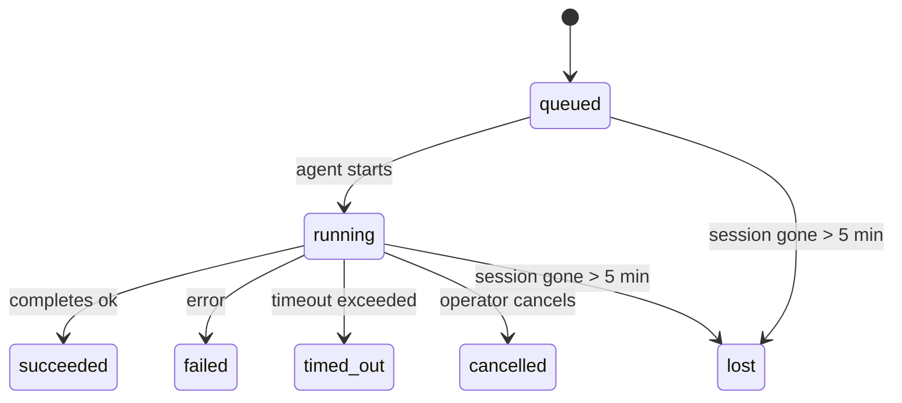

---
read_when:
    - Inspection du travail en arrière-plan en cours ou récemment terminé
    - Débogage des échecs de livraison pour les exécutions d’agents détachées
    - Comprendre comment les exécutions en arrière-plan se rapportent aux sessions, à Cron et à Heartbeat
summary: Suivi des tâches en arrière-plan pour les exécutions ACP, les sous-agents, les tâches Cron isolées et les opérations CLI
title: Tâches en arrière-plan
x-i18n:
    generated_at: "2026-04-23T06:58:38Z"
    model: gpt-5.4
    provider: openai
    source_hash: 5cd0b0db6c20cc677aa5cc50c42e09043d4354e026ca33c020d804761c331413
    source_path: automation/tasks.md
    workflow: 15
---

# Tâches en arrière-plan

> **Vous cherchez la planification ?** Consultez [Automation & Tasks](/fr/automation) pour choisir le bon mécanisme. Cette page couvre le **suivi** du travail en arrière-plan, pas sa planification.

Les tâches en arrière-plan suivent le travail qui s’exécute **en dehors de votre session de conversation principale** :
les exécutions ACP, les lancements de sous-agents, les exécutions de tâches Cron isolées et les opérations initiées par la CLI.

Les tâches ne remplacent **pas** les sessions, les tâches Cron ni les Heartbeats — elles constituent le **journal d’activité** qui enregistre quel travail détaché a eu lieu, à quel moment et s’il a réussi.

<Note>
Chaque exécution d’agent ne crée pas forcément une tâche. Les tours Heartbeat et le chat interactif normal n’en créent pas. En revanche, toutes les exécutions Cron, tous les lancements ACP, tous les lancements de sous-agents et toutes les commandes d’agent CLI en créent.
</Note>

## En bref

- Les tâches sont des **enregistrements**, pas des planificateurs — Cron et Heartbeat décident _quand_ le travail s’exécute, les tâches suivent _ce qui s’est passé_.
- ACP, les sous-agents, toutes les tâches Cron et les opérations CLI créent des tâches. Les tours Heartbeat n’en créent pas.
- Chaque tâche suit le cycle `queued → running → terminal` (`succeeded`, `failed`, `timed_out`, `cancelled` ou `lost`).
- Les tâches Cron restent actives tant que le runtime Cron possède encore la tâche ; les tâches CLI adossées au chat restent actives uniquement tant que leur contexte d’exécution propriétaire est encore actif.
- L’achèvement est piloté par notification push : le travail détaché peut notifier directement ou réveiller la session/Heartbeat demandeur lorsqu’il se termine ; les boucles de sondage d’état sont donc généralement une mauvaise approche.
- Les exécutions Cron isolées et les achèvements de sous-agents nettoient au mieux les onglets/processus de navigateur suivis pour leur session enfant avant le nettoyage final de comptabilisation.
- La livraison Cron isolée supprime les réponses intermédiaires obsolètes du parent pendant que le travail des sous-agents descendants continue de s’écouler, et elle privilégie la sortie finale descendante lorsqu’elle arrive avant la livraison.
- Les notifications d’achèvement sont livrées directement à un canal ou mises en file d’attente pour le prochain Heartbeat.
- `openclaw tasks list` affiche toutes les tâches ; `openclaw tasks audit` met en évidence les problèmes.
- Les enregistrements terminaux sont conservés pendant 7 jours, puis automatiquement supprimés.

## Démarrage rapide

```bash
# Lister toutes les tâches (de la plus récente à la plus ancienne)
openclaw tasks list

# Filtrer par runtime ou statut
openclaw tasks list --runtime acp
openclaw tasks list --status running

# Afficher les détails d’une tâche précise (par ID, ID d’exécution ou clé de session)
openclaw tasks show <lookup>

# Annuler une tâche en cours (termine la session enfant)
openclaw tasks cancel <lookup>

# Changer la politique de notification pour une tâche
openclaw tasks notify <lookup> state_changes

# Exécuter un audit d’état
openclaw tasks audit

# Prévisualiser ou appliquer la maintenance
openclaw tasks maintenance
openclaw tasks maintenance --apply

# Inspecter l’état de TaskFlow
openclaw tasks flow list
openclaw tasks flow show <lookup>
openclaw tasks flow cancel <lookup>
```

## Ce qui crée une tâche

| Source                 | Type de runtime | Moment où un enregistrement de tâche est créé         | Politique de notification par défaut |
| ---------------------- | --------------- | ----------------------------------------------------- | ------------------------------------ |
| Exécutions ACP en arrière-plan | `acp`     | Lancement d’une session ACP enfant                    | `done_only`                          |
| Orchestration de sous-agents | `subagent` | Lancement d’un sous-agent via `sessions_spawn`       | `done_only`                          |
| Tâches Cron (tous types) | `cron`        | Chaque exécution Cron (session principale et isolée)  | `silent`                             |
| Opérations CLI         | `cli`           | Commandes `openclaw agent` qui s’exécutent via le Gateway | `silent`                         |
| Tâches média d’agent   | `cli`           | Exécutions `video_generate` adossées à une session    | `silent`                             |

Les tâches Cron de session principale utilisent par défaut la politique de notification `silent` — elles créent des enregistrements pour le suivi mais ne génèrent pas de notifications. Les tâches Cron isolées utilisent également `silent` par défaut, mais sont plus visibles parce qu’elles s’exécutent dans leur propre session.

Les exécutions `video_generate` adossées à une session utilisent aussi la politique de notification `silent`. Elles créent tout de même des enregistrements de tâche, mais l’achèvement est renvoyé à la session d’agent d’origine sous la forme d’un réveil interne afin que l’agent puisse écrire le message de suivi et joindre lui-même la vidéo terminée. Si vous activez `tools.media.asyncCompletion.directSend`, les achèvements asynchrones de `music_generate` et `video_generate` tentent d’abord une livraison directe au canal avant de revenir au chemin de réveil de la session demandeuse.

Tant qu’une tâche `video_generate` adossée à une session est encore active, l’outil sert aussi de garde-fou : des appels répétés à `video_generate` dans cette même session renvoient le statut de la tâche active au lieu de lancer une seconde génération concurrente. Utilisez `action: "status"` lorsque vous voulez une consultation explicite de progression/statut du côté agent.

**Ce qui ne crée pas de tâches :**

- Les tours Heartbeat — session principale ; voir [Heartbeat](/fr/gateway/heartbeat)
- Les tours de chat interactif normaux
- Les réponses directes à `/command`

## Cycle de vie d’une tâche



| Statut      | Ce que cela signifie                                                      |
| ----------- | ------------------------------------------------------------------------- |
| `queued`    | Créée, en attente du démarrage de l’agent                                 |
| `running`   | Le tour d’agent est en cours d’exécution active                           |
| `succeeded` | Terminée avec succès                                                      |
| `failed`    | Terminée avec une erreur                                                  |
| `timed_out` | A dépassé le délai configuré                                              |
| `cancelled` | Arrêtée par l’opérateur via `openclaw tasks cancel`                       |
| `lost`      | Le runtime a perdu l’état d’appui faisant autorité après un délai de grâce de 5 minutes |

Les transitions se produisent automatiquement — lorsque l’exécution d’agent associée se termine, le statut de la tâche est mis à jour en conséquence.

`lost` est dépendant du runtime :

- Tâches ACP : les métadonnées de la session enfant ACP de support ont disparu.
- Tâches de sous-agent : la session enfant de support a disparu du stockage d’agents cible.
- Tâches Cron : le runtime Cron ne suit plus la tâche comme active.
- Tâches CLI : les tâches de session enfant isolée utilisent la session enfant ; les tâches CLI adossées au chat utilisent à la place le contexte d’exécution actif, de sorte que des lignes persistantes de session de canal/groupe/direct ne les maintiennent pas actives.

## Livraison et notifications

Lorsqu’une tâche atteint un état terminal, OpenClaw vous notifie. Il existe deux chemins de livraison :

**Livraison directe** — si la tâche a une cible de canal (le `requesterOrigin`), le message d’achèvement est envoyé directement à ce canal (Telegram, Discord, Slack, etc.). Pour les achèvements de sous-agents, OpenClaw préserve également le routage lié au fil/sujet lorsqu’il est disponible et peut compléter un `to` / compte manquant à partir de la route stockée de la session demandeuse (`lastChannel` / `lastTo` / `lastAccountId`) avant d’abandonner la livraison directe.

**Livraison mise en file dans la session** — si la livraison directe échoue ou si aucune origine n’est définie, la mise à jour est mise en file comme événement système dans la session du demandeur et apparaît au prochain Heartbeat.

<Tip>
L’achèvement d’une tâche déclenche un réveil Heartbeat immédiat afin que vous voyiez rapidement le résultat — vous n’avez pas à attendre le prochain tick Heartbeat planifié.
</Tip>

Cela signifie que le flux de travail habituel est basé sur le push : lancez une fois le travail détaché, puis laissez le runtime vous réveiller ou vous notifier à l’achèvement. Ne sondez l’état des tâches que lorsque vous avez besoin de débogage, d’intervention ou d’un audit explicite.

### Politiques de notification

Contrôlez la quantité d’informations que vous recevez pour chaque tâche :

| Politique             | Ce qui est livré                                                        |
| --------------------- | ----------------------------------------------------------------------- |
| `done_only` (par défaut) | Uniquement l’état terminal (`succeeded`, `failed`, etc.) — **c’est la valeur par défaut** |
| `state_changes`       | Chaque transition d’état et chaque mise à jour de progression           |
| `silent`              | Rien du tout                                                            |

Changez la politique pendant qu’une tâche est en cours d’exécution :

```bash
openclaw tasks notify <lookup> state_changes
```

## Référence CLI

### `tasks list`

```bash
openclaw tasks list [--runtime <acp|subagent|cron|cli>] [--status <status>] [--json]
```

Colonnes de sortie : ID de tâche, Type, Statut, Livraison, ID d’exécution, Session enfant, Résumé.

### `tasks show`

```bash
openclaw tasks show <lookup>
```

Le jeton de recherche accepte un ID de tâche, un ID d’exécution ou une clé de session. Affiche l’enregistrement complet, y compris le minutage, l’état de livraison, l’erreur et le résumé terminal.

### `tasks cancel`

```bash
openclaw tasks cancel <lookup>
```

Pour les tâches ACP et de sous-agent, cela termine la session enfant. Pour les tâches suivies par la CLI, l’annulation est enregistrée dans le registre des tâches (il n’existe pas de handle de runtime enfant distinct). Le statut passe à `cancelled` et une notification de livraison est envoyée le cas échéant.

### `tasks notify`

```bash
openclaw tasks notify <lookup> <done_only|state_changes|silent>
```

### `tasks audit`

```bash
openclaw tasks audit [--json]
```

Met en évidence les problèmes opérationnels. Les constats apparaissent aussi dans `openclaw status` lorsque des problèmes sont détectés.

| Constat                   | Sévérité | Déclencheur                                           |
| ------------------------- | -------- | ----------------------------------------------------- |
| `stale_queued`            | warn     | En file d’attente depuis plus de 10 minutes           |
| `stale_running`           | error    | En cours d’exécution depuis plus de 30 minutes        |
| `lost`                    | error    | La propriété de tâche adossée au runtime a disparu    |
| `delivery_failed`         | warn     | La livraison a échoué et la politique de notification n’est pas `silent` |
| `missing_cleanup`         | warn     | Tâche terminale sans horodatage de nettoyage          |
| `inconsistent_timestamps` | warn     | Violation de chronologie (par exemple, terminée avant d’avoir commencé) |

### `tasks maintenance`

```bash
openclaw tasks maintenance [--json]
openclaw tasks maintenance --apply [--json]
```

Utilisez cette commande pour prévisualiser ou appliquer la réconciliation, l’horodatage du nettoyage et la suppression pour les tâches et l’état de Task Flow.

La réconciliation est dépendante du runtime :

- Les tâches ACP/sous-agent vérifient leur session enfant de support.
- Les tâches Cron vérifient si le runtime Cron possède toujours la tâche.
- Les tâches CLI adossées au chat vérifient le contexte d’exécution actif propriétaire, pas seulement la ligne de session de chat.

Le nettoyage à l’achèvement est aussi dépendant du runtime :

- L’achèvement d’un sous-agent ferme au mieux les onglets/processus de navigateur suivis pour la session enfant avant que le nettoyage d’annonce ne continue.
- L’achèvement d’un Cron isolé ferme au mieux les onglets/processus de navigateur suivis pour la session Cron avant que l’exécution ne soit complètement démantelée.
- La livraison d’un Cron isolé attend, si nécessaire, la suite descendante du sous-agent et supprime le texte d’accusé de réception parent obsolète au lieu de l’annoncer.
- La livraison d’achèvement d’un sous-agent privilégie le dernier texte visible de l’assistant ; si celui-ci est vide, elle revient au dernier texte `tool`/`toolResult` assaini, et les exécutions de simple appel d’outil expirées peuvent être réduites à un court résumé de progression partielle. Les exécutions terminales en échec annoncent le statut d’échec sans rejouer le texte de réponse capturé.
- Les échecs de nettoyage ne masquent pas le résultat réel de la tâche.

### `tasks flow list|show|cancel`

```bash
openclaw tasks flow list [--status <status>] [--json]
openclaw tasks flow show <lookup> [--json]
openclaw tasks flow cancel <lookup>
```

Utilisez ces commandes lorsque c’est le Task Flow orchestrateur qui vous intéresse plutôt qu’un enregistrement individuel de tâche en arrière-plan.

## Tableau de bord des tâches en chat (`/tasks`)

Utilisez `/tasks` dans n’importe quelle session de chat pour voir les tâches en arrière-plan liées à cette session. Le tableau affiche les tâches actives et récemment terminées avec leur runtime, leur statut, leur minutage, ainsi que les détails de progression ou d’erreur.

Lorsque la session actuelle n’a aucune tâche liée visible, `/tasks` se rabat sur des comptes de tâches locaux à l’agent
afin que vous obteniez tout de même une vue d’ensemble sans divulguer de détails d’autres sessions.

Pour le journal opérateur complet, utilisez la CLI : `openclaw tasks list`.

## Intégration au statut (pression des tâches)

`openclaw status` inclut un résumé des tâches visible en un coup d’œil :

```
Tasks: 3 queued · 2 running · 1 issues
```

Le résumé rapporte :

- **active** — nombre de `queued` + `running`
- **failures** — nombre de `failed` + `timed_out` + `lost`
- **byRuntime** — ventilation par `acp`, `subagent`, `cron`, `cli`

`/status` comme l’outil `session_status` utilisent tous deux un instantané des tâches tenant compte du nettoyage : les tâches actives sont
privilégiées, les lignes terminées obsolètes sont masquées, et les échecs récents n’apparaissent que lorsqu’il ne reste
plus aucun travail actif. Cela permet à la carte de statut de rester centrée sur ce qui compte maintenant.

## Stockage et maintenance

### Emplacement des tâches

Les enregistrements de tâches sont persistés dans SQLite à l’emplacement suivant :

```
$OPENCLAW_STATE_DIR/tasks/runs.sqlite
```

Le registre est chargé en mémoire au démarrage du Gateway et synchronise les écritures vers SQLite pour assurer la durabilité après redémarrage.

### Maintenance automatique

Un processus de balayage s’exécute toutes les **60 secondes** et gère trois éléments :

1. **Réconciliation** — vérifie si les tâches actives ont encore un support de runtime faisant autorité. Les tâches ACP/sous-agent utilisent l’état de la session enfant, les tâches Cron utilisent la possession de la tâche active, et les tâches CLI adossées au chat utilisent le contexte d’exécution propriétaire. Si cet état de support a disparu depuis plus de 5 minutes, la tâche est marquée `lost`.
2. **Horodatage du nettoyage** — définit un horodatage `cleanupAfter` sur les tâches terminales (`endedAt + 7 days`).
3. **Suppression** — supprime les enregistrements au-delà de leur date `cleanupAfter`.

**Rétention** : les enregistrements de tâches terminales sont conservés pendant **7 jours**, puis automatiquement supprimés. Aucune configuration n’est nécessaire.

## Comment les tâches se rapportent aux autres systèmes

### Tâches et Task Flow

[Task Flow](/fr/automation/taskflow) est la couche d’orchestration de flux au-dessus des tâches en arrière-plan. Un seul flux peut coordonner plusieurs tâches au cours de sa durée de vie à l’aide de modes de synchronisation gérés ou miroir. Utilisez `openclaw tasks` pour inspecter des enregistrements individuels de tâches et `openclaw tasks flow` pour inspecter le flux orchestrateur.

Consultez [Task Flow](/fr/automation/taskflow) pour plus de détails.

### Tâches et Cron

Une **définition** de tâche Cron se trouve dans `~/.openclaw/cron/jobs.json` ; l’état d’exécution du runtime se trouve à côté dans `~/.openclaw/cron/jobs-state.json`. **Chaque** exécution Cron crée un enregistrement de tâche — à la fois pour la session principale et pour l’isolée. Les tâches Cron de session principale utilisent par défaut la politique de notification `silent` afin d’assurer le suivi sans générer de notifications.

Consultez [Cron Jobs](/fr/automation/cron-jobs).

### Tâches et Heartbeat

Les exécutions Heartbeat sont des tours de session principale — elles ne créent pas d’enregistrements de tâche. Lorsqu’une tâche s’achève, elle peut déclencher un réveil Heartbeat afin que vous voyiez rapidement le résultat.

Consultez [Heartbeat](/fr/gateway/heartbeat).

### Tâches et sessions

Une tâche peut référencer une `childSessionKey` (où le travail s’exécute) et une `requesterSessionKey` (qui l’a démarrée). Les sessions sont le contexte de conversation ; les tâches sont la couche de suivi d’activité qui s’y superpose.

### Tâches et exécutions d’agent

Le `runId` d’une tâche renvoie à l’exécution d’agent qui effectue le travail. Les événements du cycle de vie de l’agent (démarrage, fin, erreur) mettent automatiquement à jour le statut de la tâche — vous n’avez pas besoin de gérer ce cycle de vie manuellement.

## Voir aussi

- [Automation & Tasks](/fr/automation) — tous les mécanismes d’automatisation en un coup d’œil
- [Task Flow](/fr/automation/taskflow) — orchestration de flux au-dessus des tâches
- [Scheduled Tasks](/fr/automation/cron-jobs) — planification du travail en arrière-plan
- [Heartbeat](/fr/gateway/heartbeat) — tours périodiques de session principale
- [CLI: Tasks](/fr/cli/tasks) — référence des commandes CLI
