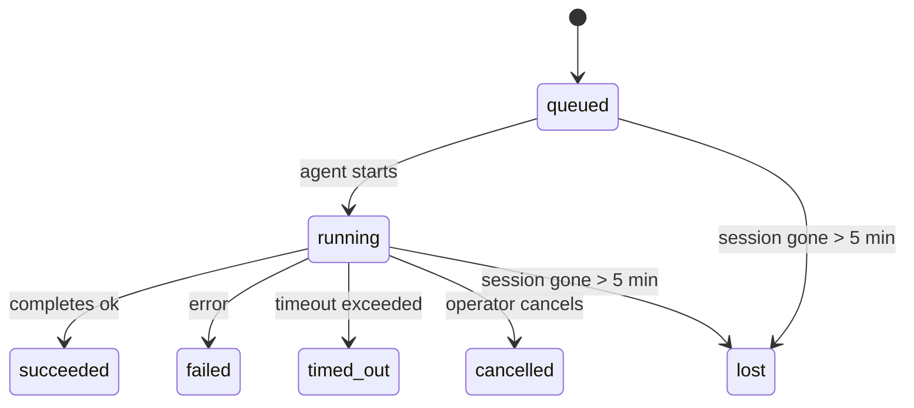

---
read_when:
    - Inspection des tâches en arrière-plan en cours ou récemment terminées
    - Débogage des échecs de livraison pour les exécutions d’agent détachées
    - Comprendre comment les exécutions en arrière-plan s’articulent avec les sessions, Cron et Heartbeat
sidebarTitle: Background tasks
summary: Suivi des tâches en arrière-plan pour les exécutions ACP, les sous-agents, les tâches Cron isolées et les opérations CLI
title: Tâches en arrière-plan
x-i18n:
    generated_at: "2026-05-05T01:44:37Z"
    model: gpt-5.5
    provider: openai
    source_hash: 60d6ea6178535b19b95d761b8e8b05a665234584ae69852fd21097988aa32991
    source_path: automation/tasks.md
    workflow: 16
---

<Note>
Vous cherchez la planification ? Consultez [Automatisation et tâches](/fr/automation) pour choisir le bon mécanisme. Cette page est le registre d'activité du travail en arrière-plan, pas le planificateur.
</Note>

Les tâches en arrière-plan suivent le travail qui s'exécute **en dehors de votre session de conversation principale** : exécutions ACP, lancements de sous-agents, exécutions de tâches Cron isolées et opérations lancées par la CLI.

Les tâches ne remplacent **pas** les sessions, les tâches Cron ni les Heartbeats — elles sont le **registre d'activité** qui consigne quel travail détaché a eu lieu, quand, et s'il a réussi.

<Note>
Toutes les exécutions d'agent ne créent pas de tâche. Les tours Heartbeat et la discussion interactive normale n'en créent pas. Toutes les exécutions Cron, les lancements ACP, les lancements de sous-agents et les commandes d'agent CLI en créent.
</Note>

## En bref

- Les tâches sont des **enregistrements**, pas des planificateurs — Cron et Heartbeat décident _quand_ le travail s'exécute, les tâches suivent _ce qui s'est passé_.
- ACP, les sous-agents, toutes les tâches Cron et les opérations CLI créent des tâches. Les tours Heartbeat n'en créent pas.
- Chaque tâche passe par `queued → running → terminal` (succeeded, failed, timed_out, cancelled ou lost).
- Les tâches Cron restent actives tant que l'environnement d'exécution Cron possède toujours la tâche ; si l'état d'exécution en mémoire a disparu, la maintenance des tâches vérifie d'abord l'historique durable des exécutions Cron avant de marquer une tâche comme perdue.
- La finalisation est pilotée par notification : le travail détaché peut notifier directement ou réveiller la session/le Heartbeat du demandeur lorsqu'il se termine ; les boucles d'interrogation de l'état sont donc généralement la mauvaise approche.
- Les exécutions Cron isolées et les finalisations de sous-agents nettoient au mieux les onglets/processus de navigateur suivis pour leur session enfant avant la comptabilité finale du nettoyage.
- La livraison Cron isolée supprime les réponses parent intermédiaires obsolètes pendant que le travail de sous-agents descendants est encore en train de se terminer, et elle privilégie la sortie finale des descendants lorsqu'elle arrive avant la livraison.
- Les notifications de finalisation sont livrées directement à un canal ou mises en file d'attente pour le prochain Heartbeat.
- `openclaw tasks list` affiche toutes les tâches ; `openclaw tasks audit` fait remonter les problèmes.
- Les enregistrements terminaux sont conservés pendant 7 jours, puis automatiquement purgés.

## Démarrage rapide

<Tabs>
  <Tab title="Lister et filtrer">
    ```bash
    # List all tasks (newest first)
    openclaw tasks list

    # Filter by runtime or status
    openclaw tasks list --runtime acp
    openclaw tasks list --status running
    ```

  </Tab>
  <Tab title="Inspecter">
    ```bash
    # Show details for a specific task (by ID, run ID, or session key)
    openclaw tasks show <lookup>
    ```
  </Tab>
  <Tab title="Annuler et notifier">
    ```bash
    # Cancel a running task (kills the child session)
    openclaw tasks cancel <lookup>

    # Change notification policy for a task
    openclaw tasks notify <lookup> state_changes
    ```

  </Tab>
  <Tab title="Audit et maintenance">
    ```bash
    # Run a health audit
    openclaw tasks audit

    # Preview or apply maintenance
    openclaw tasks maintenance
    openclaw tasks maintenance --apply
    ```

  </Tab>
  <Tab title="Flux de tâches">
    ```bash
    # Inspect TaskFlow state
    openclaw tasks flow list
    openclaw tasks flow show <lookup>
    openclaw tasks flow cancel <lookup>
    ```
  </Tab>
</Tabs>

## Ce qui crée une tâche

| Source                 | Type d'exécution | Moment où un enregistrement de tâche est créé          | Politique de notification par défaut |
| ---------------------- | ------------ | ------------------------------------------------------ | --------------------- |
| Exécutions ACP en arrière-plan | `acp`        | Lancement d'une session enfant ACP                     | `done_only`           |
| Orchestration des sous-agents | `subagent`   | Lancement d'un sous-agent via `sessions_spawn`         | `done_only`           |
| Tâches Cron (tous types) | `cron`       | Chaque exécution Cron (session principale et isolée)   | `silent`              |
| Opérations CLI         | `cli`        | Commandes `openclaw agent` qui passent par le Gateway  | `silent`              |
| Tâches média d'agent   | `cli`        | Exécutions `music_generate`/`video_generate` adossées à une session | `silent`              |

<AccordionGroup>
  <Accordion title="Valeurs de notification par défaut pour Cron et les médias">
    Les tâches Cron de session principale utilisent par défaut la politique de notification `silent` — elles créent des enregistrements pour le suivi, mais ne génèrent pas de notifications. Les tâches Cron isolées utilisent aussi `silent` par défaut, mais elles sont plus visibles parce qu'elles s'exécutent dans leur propre session.

    Les exécutions `music_generate` et `video_generate` adossées à une session utilisent aussi la politique de notification `silent`. Elles créent quand même des enregistrements de tâche, mais la finalisation est renvoyée à la session d'agent d'origine sous forme de réveil interne, afin que l'agent puisse écrire le message de suivi et joindre lui-même le média terminé. Les finalisations de groupe/canal suivent la politique normale de réponse visible ; l'agent utilise donc l'outil de message lorsque la remise d'origine l'exige.

  </Accordion>
  <Accordion title="Garde-fou de concurrence de video_generate">
    Tant qu'une tâche `video_generate` adossée à une session est encore active, l'outil agit aussi comme garde-fou : les appels `video_generate` répétés dans cette même session renvoient l'état de la tâche active au lieu de démarrer une deuxième génération concurrente. Utilisez `action: "status"` lorsque vous voulez une recherche explicite de progression/d'état depuis le côté agent.
  </Accordion>
  <Accordion title="Ce qui ne crée pas de tâches">
    - Tours Heartbeat — session principale ; voir [Heartbeat](/fr/gateway/heartbeat)
    - Tours de discussion interactive normaux
    - Réponses directes à `/command`

  </Accordion>
</AccordionGroup>

## Cycle de vie des tâches



| État        | Signification                                                              |
| ----------- | -------------------------------------------------------------------------- |
| `queued`    | Créée, en attente du démarrage de l'agent                                  |
| `running`   | Le tour d'agent est en cours d'exécution active                            |
| `succeeded` | Terminée avec succès                                                       |
| `failed`    | Terminée avec une erreur                                                   |
| `timed_out` | A dépassé le délai d'expiration configuré                                  |
| `cancelled` | Arrêtée par l'opérateur via `openclaw tasks cancel`                        |
| `lost`      | L'environnement d'exécution a perdu l'état de support faisant autorité après une période de grâce de 5 minutes |

Les transitions se produisent automatiquement — lorsque l'exécution d'agent associée se termine, l'état de la tâche est mis à jour en conséquence.

La fin de l'exécution d'agent fait autorité pour les enregistrements de tâches actifs. Une exécution détachée réussie se finalise en `succeeded`, les erreurs d'exécution ordinaires se finalisent en `failed`, et les résultats de délai expiré ou d'abandon se finalisent en `timed_out`. Si un opérateur a déjà annulé la tâche, ou si l'environnement d'exécution a déjà enregistré un état terminal plus fort comme `failed`, `timed_out` ou `lost`, un signal de réussite ultérieur ne rétrograde pas cet état terminal.

`lost` tient compte de l'environnement d'exécution :

- Tâches ACP : les métadonnées de session enfant ACP de support ont disparu.
- Tâches de sous-agent : la session enfant de support a disparu du stockage de l'agent cible.
- Tâches Cron : l'environnement d'exécution Cron ne suit plus la tâche comme active et l'historique durable des exécutions Cron n'indique pas de résultat terminal pour cette exécution. L'audit CLI hors ligne ne considère pas son propre état d'exécution Cron en processus vide comme faisant autorité.
- Tâches CLI : les tâches de session enfant isolée utilisent la session enfant ; les tâches CLI adossées au chat utilisent plutôt le contexte d'exécution actif, de sorte que les lignes de session persistantes de canal/groupe/direct ne les maintiennent pas en vie. Les exécutions `openclaw agent` adossées au Gateway se finalisent aussi à partir de leur résultat d'exécution, de sorte que les exécutions terminées ne restent pas actives jusqu'à ce que le processus de nettoyage les marque `lost`.

## Livraison et notifications

Lorsqu'une tâche atteint un état terminal, OpenClaw vous notifie. Il existe deux chemins de livraison :

**Livraison directe** — si la tâche a une cible de canal (le `requesterOrigin`), le message de finalisation va directement à ce canal (Telegram, Discord, Slack, etc.). Pour les finalisations de sous-agents, OpenClaw préserve aussi le routage de fil/sujet lié lorsqu'il est disponible et peut renseigner un `to` / compte manquant à partir de la route stockée dans la session du demandeur (`lastChannel` / `lastTo` / `lastAccountId`) avant d'abandonner la livraison directe.

**Livraison mise en file d'attente de session** — si la livraison directe échoue ou si aucune origine n'est définie, la mise à jour est mise en file d'attente comme événement système dans la session du demandeur et apparaît au prochain Heartbeat.

<Tip>
La finalisation d'une tâche déclenche un réveil Heartbeat immédiat, afin que vous voyiez rapidement le résultat — vous n'avez pas besoin d'attendre la prochaine impulsion Heartbeat planifiée.
</Tip>

Cela signifie que le flux de travail habituel repose sur les notifications : démarrez le travail détaché une fois, puis laissez l'environnement d'exécution vous réveiller ou vous notifier à la fin. Interrogez l'état des tâches uniquement lorsque vous avez besoin de débogage, d'intervention ou d'un audit explicite.

### Politiques de notification

Contrôlez la quantité d'informations que vous recevez pour chaque tâche :

| Politique             | Ce qui est livré                                                       |
| --------------------- | ----------------------------------------------------------------------- |
| `done_only` (par défaut) | Seul l'état terminal (succeeded, failed, etc.) — **c'est la valeur par défaut** |
| `state_changes`       | Chaque transition d'état et mise à jour de progression                  |
| `silent`              | Rien du tout                                                            |

Modifiez la politique pendant qu'une tâche est en cours d'exécution :

```bash
openclaw tasks notify <lookup> state_changes
```

## Référence CLI

<AccordionGroup>
  <Accordion title="tasks list">
    ```bash
    openclaw tasks list [--runtime <acp|subagent|cron|cli>] [--status <status>] [--json]
    ```

    Colonnes de sortie : ID de tâche, Type, État, Livraison, ID d'exécution, Session enfant, Résumé.

  </Accordion>
  <Accordion title="tasks show">
    ```bash
    openclaw tasks show <lookup>
    ```

    Le jeton de recherche accepte un ID de tâche, un ID d'exécution ou une clé de session. Affiche l'enregistrement complet, notamment le minutage, l'état de livraison, l'erreur et le résumé terminal.

  </Accordion>
  <Accordion title="tasks cancel">
    ```bash
    openclaw tasks cancel <lookup>
    ```

    Pour les tâches ACP et de sous-agent, cela tue la session enfant. Pour les tâches suivies par la CLI, l'annulation est enregistrée dans le registre des tâches (il n'existe pas de handle d'exécution enfant séparé). L'état passe à `cancelled` et une notification de livraison est envoyée le cas échéant.

  </Accordion>
  <Accordion title="tasks notify">
    ```bash
    openclaw tasks notify <lookup> <done_only|state_changes|silent>
    ```
  </Accordion>
  <Accordion title="tasks audit">
    ```bash
    openclaw tasks audit [--json]
    ```

    Fait remonter les problèmes opérationnels. Les constats apparaissent aussi dans `openclaw status` lorsque des problèmes sont détectés.

    | Finding                   | Severity   | Trigger                                                                                                      |
    | ------------------------- | ---------- | ------------------------------------------------------------------------------------------------------------ |
    | `stale_queued`            | warn       | En file d'attente depuis plus de 10 minutes                                                                  |
    | `stale_running`           | error      | En cours depuis plus de 30 minutes                                                                           |
    | `lost`                    | warn/error | La propriété de la tâche adossée au runtime a disparu ; les tâches perdues conservées émettent un avertissement jusqu'à `cleanupAfter`, puis deviennent des erreurs |
    | `delivery_failed`         | warn       | La livraison a échoué et la politique de notification n'est pas `silent`                                     |
    | `missing_cleanup`         | warn       | Tâche terminale sans horodatage de nettoyage                                                                 |
    | `inconsistent_timestamps` | warn       | Violation de chronologie (par exemple terminée avant d'avoir commencé)                                       |

  </Accordion>
  <Accordion title="maintenance des tâches">
    ```bash
    openclaw tasks maintenance [--json]
    openclaw tasks maintenance --apply [--json]
    ```

    Utilisez ceci pour prévisualiser ou appliquer la réconciliation, l'horodatage de nettoyage et l'élagage pour les tâches et l'état Task Flow.

    La réconciliation tient compte du runtime :

    - Les tâches ACP/subagent vérifient leur session enfant sous-jacente.
    - Les tâches de subagent dont la session enfant possède une tombe de récupération après redémarrage sont marquées comme perdues au lieu d'être traitées comme des sessions sous-jacentes récupérables.
    - Les tâches Cron vérifient si le runtime cron possède toujours la tâche, puis récupèrent l'état terminal depuis les journaux d'exécution cron persistés/l'état de tâche avant de revenir à `lost`. Seul le processus Gateway fait autorité pour l'ensemble en mémoire des tâches cron actives ; l'audit CLI hors ligne utilise l'historique durable mais ne marque pas une tâche cron comme perdue uniquement parce que ce Set local est vide.
    - Les tâches CLI adossées au chat vérifient le contexte d'exécution actif propriétaire, pas seulement la ligne de session de chat.

    Le nettoyage d'achèvement tient aussi compte du runtime :

    - L'achèvement d'un subagent ferme, au mieux, les onglets/processus de navigateur suivis pour la session enfant avant la poursuite du nettoyage d'annonce.
    - L'achèvement d'un cron isolé ferme, au mieux, les onglets/processus de navigateur suivis pour la session cron avant que l'exécution ne se termine complètement.
    - La livraison cron isolée attend le suivi des subagents descendants lorsque nécessaire et supprime le texte d'accusé de réception parent obsolète au lieu de l'annoncer.
    - La livraison d'achèvement d'un subagent préfère le dernier texte d'assistant visible ; s'il est vide, elle se rabat sur le dernier texte d'outil/toolResult assaini, et les exécutions d'appels d'outil terminées uniquement par délai d'attente peuvent être réduites à un bref résumé de progression partielle. Les exécutions terminales échouées annoncent l'état d'échec sans rejouer le texte de réponse capturé.
    - Les échecs de nettoyage ne masquent pas le résultat réel de la tâche.

  </Accordion>
  <Accordion title="tasks flow list | show | cancel">
    ```bash
    openclaw tasks flow list [--status <status>] [--json]
    openclaw tasks flow show <lookup> [--json]
    openclaw tasks flow cancel <lookup>
    ```

    Utilisez ces commandes lorsque le Task Flow orchestrateur est ce qui vous intéresse, plutôt qu'un enregistrement individuel de tâche en arrière-plan.

  </Accordion>
</AccordionGroup>

## Tableau des tâches de chat (`/tasks`)

Utilisez `/tasks` dans n'importe quelle session de chat pour voir les tâches en arrière-plan liées à cette session. Le tableau affiche les tâches actives et récemment terminées avec le runtime, l'état, les informations de durée, et les détails de progression ou d'erreur.

Lorsque la session actuelle n'a aucune tâche liée visible, `/tasks` se rabat sur les compteurs de tâches locaux à l'agent afin que vous obteniez tout de même une vue d'ensemble sans divulguer les détails d'autres sessions.

Pour le registre opérateur complet, utilisez la CLI : `openclaw tasks list`.

## Intégration de l'état (pression des tâches)

`openclaw status` inclut un résumé rapide des tâches :

```
Tasks: 3 queued · 2 running · 1 issues
```

Le résumé indique :

- **actives** — nombre de `queued` + `running`
- **échecs** — nombre de `failed` + `timed_out` + `lost`
- **byRuntime** — répartition par `acp`, `subagent`, `cron`, `cli`

`/status` et l'outil `session_status` utilisent tous deux un instantané des tâches tenant compte du nettoyage : les tâches actives sont privilégiées, les lignes terminées obsolètes sont masquées, et les échecs récents ne s'affichent que lorsqu'aucun travail actif ne reste. Cela garde la carte d'état concentrée sur ce qui compte maintenant.

## Stockage et maintenance

### Où résident les tâches

Les enregistrements de tâches persistent dans SQLite à :

```
$OPENCLAW_STATE_DIR/tasks/runs.sqlite
```

Le registre est chargé en mémoire au démarrage du Gateway et synchronise les écritures vers SQLite pour assurer la durabilité entre les redémarrages.
Le Gateway maintient le journal write-ahead log de SQLite borné en utilisant le seuil
d'autocheckpoint par défaut de SQLite ainsi que des points de contrôle `TRUNCATE` périodiques et à l'arrêt.

### Maintenance automatique

Un balayeur s'exécute toutes les **60 secondes** et gère quatre choses :

<Steps>
  <Step title="Réconciliation">
    Vérifie si les tâches actives ont toujours un support runtime faisant autorité. Les tâches ACP/subagent utilisent l'état de session enfant, les tâches cron utilisent la propriété des tâches actives, et les tâches CLI adossées au chat utilisent le contexte d'exécution propriétaire. Si cet état sous-jacent a disparu depuis plus de 5 minutes, la tâche est marquée `lost`.
  </Step>
  <Step title="Réparation de session ACP">
    Ferme les sessions ACP terminales ou orphelines à exécution unique appartenant au parent, et ferme les sessions ACP persistantes terminales ou orphelines obsolètes uniquement lorsqu'aucune liaison de conversation active ne reste.
  </Step>
  <Step title="Horodatage de nettoyage">
    Définit un horodatage `cleanupAfter` sur les tâches terminales (endedAt + 7 jours). Pendant la rétention, les tâches perdues apparaissent encore dans l'audit comme avertissements ; après l'expiration de `cleanupAfter` ou lorsque les métadonnées de nettoyage manquent, ce sont des erreurs.
  </Step>
  <Step title="Élagage">
    Supprime les enregistrements après leur date `cleanupAfter`.
  </Step>
</Steps>

<Note>
**Rétention :** les enregistrements de tâches terminales sont conservés pendant **7 jours**, puis automatiquement élagués. Aucune configuration nécessaire.
</Note>

## Relation des tâches avec les autres systèmes

<AccordionGroup>
  <Accordion title="Tâches et Task Flow">
    [Task Flow](/fr/automation/taskflow) est la couche d'orchestration de flux au-dessus des tâches en arrière-plan. Un flux unique peut coordonner plusieurs tâches au cours de sa durée de vie à l'aide de modes de synchronisation gérés ou en miroir. Utilisez `openclaw tasks` pour inspecter les enregistrements de tâches individuels et `openclaw tasks flow` pour inspecter le flux orchestrateur.

    Consultez [Task Flow](/fr/automation/taskflow) pour plus de détails.

  </Accordion>
  <Accordion title="Tâches et cron">
    Une **définition** de tâche cron réside dans `~/.openclaw/cron/jobs.json` ; l'état d'exécution runtime réside à côté, dans `~/.openclaw/cron/jobs-state.json`. **Chaque** exécution cron crée un enregistrement de tâche — à la fois pour les sessions principales et isolées. Les tâches cron de session principale utilisent par défaut la politique de notification `silent` afin d'être suivies sans générer de notifications.

    Consultez [Tâches Cron](/fr/automation/cron-jobs).

  </Accordion>
  <Accordion title="Tâches et Heartbeat">
    Les exécutions Heartbeat sont des tours de session principale — elles ne créent pas d'enregistrements de tâches. Lorsqu'une tâche se termine, elle peut déclencher un réveil Heartbeat afin que vous voyiez rapidement le résultat.

    Consultez [Heartbeat](/fr/gateway/heartbeat).

  </Accordion>
  <Accordion title="Tâches et sessions">
    Une tâche peut référencer une `childSessionKey` (où le travail s'exécute) et une `requesterSessionKey` (qui l'a démarrée). Les sessions sont le contexte de conversation ; les tâches sont le suivi d'activité par-dessus.
  </Accordion>
  <Accordion title="Tâches et exécutions d'agent">
    Le `runId` d'une tâche établit un lien vers l'exécution d'agent qui effectue le travail. Les événements du cycle de vie de l'agent (début, fin, erreur) mettent automatiquement à jour l'état de la tâche — vous n'avez pas besoin de gérer le cycle de vie manuellement.
  </Accordion>
</AccordionGroup>

## Connexe

- [Automatisation et tâches](/fr/automation) — tous les mécanismes d'automatisation en un coup d'œil
- [CLI : tâches](/fr/cli/tasks) — référence des commandes CLI
- [Heartbeat](/fr/gateway/heartbeat) — tours périodiques de session principale
- [Tâches planifiées](/fr/automation/cron-jobs) — planifier du travail en arrière-plan
- [Task Flow](/fr/automation/taskflow) — orchestration de flux au-dessus des tâches
