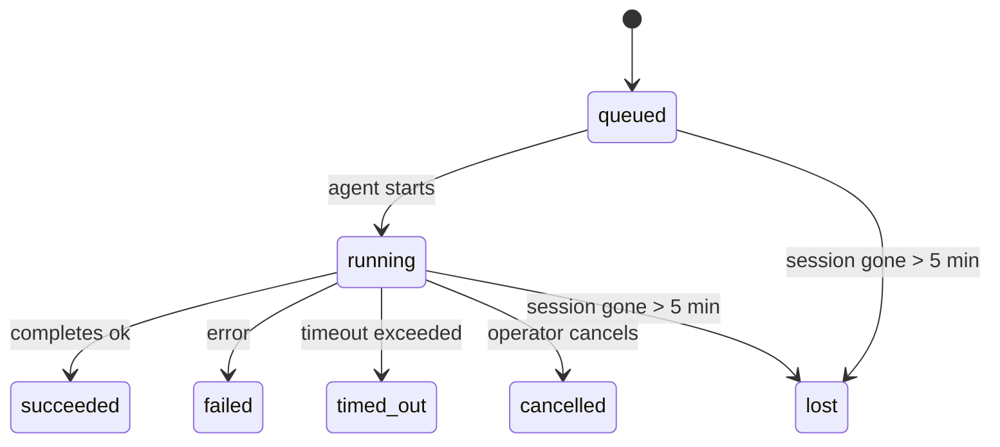

---
read_when:
    - Inspecter les tâches en arrière-plan en cours ou récemment terminées
    - Débogage des échecs de livraison pour les exécutions d’agent détachées
    - Comprendre le lien entre les exécutions en arrière-plan, les sessions, Cron et Heartbeat
sidebarTitle: Background tasks
summary: Suivi des tâches en arrière-plan pour les exécutions ACP, les sous-agents, les tâches Cron isolées et les opérations CLI
title: Tâches en arrière-plan
x-i18n:
    generated_at: "2026-04-30T07:11:32Z"
    model: gpt-5.5
    provider: openai
    source_hash: 4bbf74f3aeea532738b56b83cd2e1a0a3734bfd453da6636b8be985a28ccc027
    source_path: automation/tasks.md
    workflow: 16
---

<Note>
Vous cherchez la planification ? Consultez [Automatisation et tâches](/fr/automation) pour choisir le mécanisme approprié. Cette page est le registre d’activité du travail en arrière-plan, pas le planificateur.
</Note>

Les tâches d’arrière-plan suivent le travail qui s’exécute **en dehors de votre session de conversation principale** : exécutions ACP, lancements de sous-agents, exécutions isolées de tâches Cron et opérations lancées depuis la CLI.

Les tâches ne remplacent **pas** les sessions, les tâches Cron ni les Heartbeats — elles sont le **registre d’activité** qui consigne quel travail détaché a eu lieu, quand, et s’il a réussi.

<Note>
Toutes les exécutions d’agent ne créent pas une tâche. Les tours Heartbeat et le chat interactif normal n’en créent pas. Toutes les exécutions Cron, les lancements ACP, les lancements de sous-agents et les commandes d’agent CLI en créent.
</Note>

## TL;DR

- Les tâches sont des **enregistrements**, pas des planificateurs — Cron et Heartbeat décident _quand_ le travail s’exécute, les tâches suivent _ce qui s’est passé_.
- ACP, les sous-agents, toutes les tâches Cron et les opérations CLI créent des tâches. Les tours Heartbeat n’en créent pas.
- Chaque tâche passe par `queued → running → terminal` (succeeded, failed, timed_out, cancelled ou lost).
- Les tâches Cron restent actives tant que le runtime Cron possède encore le job ; si l’état du runtime en mémoire a disparu, la maintenance des tâches vérifie d’abord l’historique durable des exécutions Cron avant de marquer une tâche comme perdue.
- L’achèvement fonctionne par notification poussée : le travail détaché peut notifier directement ou réveiller la session/le Heartbeat demandeur lorsqu’il se termine, donc les boucles d’interrogation de statut sont généralement la mauvaise forme.
- Les exécutions Cron isolées et les achèvements de sous-agents nettoient au mieux les onglets/processus de navigateur suivis pour leur session enfant avant la comptabilité finale du nettoyage.
- La livraison Cron isolée supprime les réponses parentes intermédiaires obsolètes tant que le travail de sous-agent descendant est encore en cours d’écoulement, et elle privilégie la sortie descendante finale lorsqu’elle arrive avant la livraison.
- Les notifications d’achèvement sont livrées directement à un canal ou mises en file d’attente pour le prochain Heartbeat.
- `openclaw tasks list` affiche toutes les tâches ; `openclaw tasks audit` fait remonter les problèmes.
- Les enregistrements terminaux sont conservés pendant 7 jours, puis automatiquement élagués.

## Démarrage rapide

<Tabs>
  <Tab title="Lister et filtrer">
    ```bash
    # List all tasks (newest first)
    openclaw tasks list

    # Filter by runtime or status
    openclaw tasks list --runtime acp
    openclaw tasks list --status running
    ```

  </Tab>
  <Tab title="Inspecter">
    ```bash
    # Show details for a specific task (by ID, run ID, or session key)
    openclaw tasks show <lookup>
    ```
  </Tab>
  <Tab title="Annuler et notifier">
    ```bash
    # Cancel a running task (kills the child session)
    openclaw tasks cancel <lookup>

    # Change notification policy for a task
    openclaw tasks notify <lookup> state_changes
    ```

  </Tab>
  <Tab title="Audit et maintenance">
    ```bash
    # Run a health audit
    openclaw tasks audit

    # Preview or apply maintenance
    openclaw tasks maintenance
    openclaw tasks maintenance --apply
    ```

  </Tab>
  <Tab title="Flux de tâche">
    ```bash
    # Inspect TaskFlow state
    openclaw tasks flow list
    openclaw tasks flow show <lookup>
    openclaw tasks flow cancel <lookup>
    ```
  </Tab>
</Tabs>

## Ce qui crée une tâche

| Source                 | Type de runtime | Quand un enregistrement de tâche est créé              | Politique de notification par défaut |
| ---------------------- | --------------- | ------------------------------------------------------ | ------------------------------------ |
| Exécutions ACP en arrière-plan | `acp`        | Lancement d’une session ACP enfant                     | `done_only`                          |
| Orchestration de sous-agents | `subagent`   | Lancement d’un sous-agent via `sessions_spawn`         | `done_only`                          |
| Tâches Cron (tous types) | `cron`       | Chaque exécution Cron (session principale et isolée)   | `silent`                             |
| Opérations CLI         | `cli`           | Commandes `openclaw agent` qui passent par le Gateway  | `silent`                             |
| Jobs média d’agent     | `cli`           | Exécutions `video_generate` adossées à une session     | `silent`                             |

<AccordionGroup>
  <Accordion title="Valeurs par défaut de notification pour Cron et les médias">
    Les tâches Cron de session principale utilisent la politique de notification `silent` par défaut — elles créent des enregistrements pour le suivi, mais ne génèrent pas de notifications. Les tâches Cron isolées utilisent aussi `silent` par défaut, mais sont plus visibles parce qu’elles s’exécutent dans leur propre session.

    Les exécutions `video_generate` adossées à une session utilisent aussi la politique de notification `silent`. Elles créent tout de même des enregistrements de tâche, mais l’achèvement est renvoyé à la session d’agent d’origine sous forme de réveil interne afin que l’agent puisse écrire lui-même le message de suivi et joindre la vidéo terminée. Si vous activez `tools.media.asyncCompletion.directSend`, les achèvements asynchrones `music_generate` et `video_generate` essaient d’abord une livraison directe au canal avant de revenir au chemin de réveil de la session demandeuse.

  </Accordion>
  <Accordion title="Garde-fou video_generate concurrent">
    Tant qu’une tâche `video_generate` adossée à une session est encore active, l’outil agit aussi comme garde-fou : les appels `video_generate` répétés dans cette même session renvoient le statut de la tâche active au lieu de démarrer une deuxième génération concurrente. Utilisez `action: "status"` lorsque vous voulez une consultation explicite de progression/statut côté agent.
  </Accordion>
  <Accordion title="Ce qui ne crée pas de tâches">
    - Tours Heartbeat — session principale ; voir [Heartbeat](/fr/gateway/heartbeat)
    - Tours de chat interactif normal
    - Réponses directes `/command`

  </Accordion>
</AccordionGroup>

## Cycle de vie des tâches



| Statut      | Ce que cela signifie                                                       |
| ----------- | -------------------------------------------------------------------------- |
| `queued`    | Créée, en attente du démarrage de l’agent                                  |
| `running`   | Le tour d’agent est en cours d’exécution active                            |
| `succeeded` | Terminée avec succès                                                       |
| `failed`    | Terminée avec une erreur                                                   |
| `timed_out` | A dépassé le délai d’expiration configuré                                  |
| `cancelled` | Arrêtée par l’opérateur via `openclaw tasks cancel`                        |
| `lost`      | Le runtime a perdu son état d’appui faisant autorité après une période de grâce de 5 minutes |

Les transitions se produisent automatiquement — lorsque l’exécution d’agent associée se termine, le statut de la tâche est mis à jour pour correspondre.

L’achèvement de l’exécution d’agent fait autorité pour les enregistrements de tâche actifs. Une exécution détachée réussie est finalisée comme `succeeded`, les erreurs d’exécution ordinaires sont finalisées comme `failed`, et les résultats de délai dépassé ou d’abandon sont finalisés comme `timed_out`. Si un opérateur a déjà annulé la tâche, ou si le runtime a déjà enregistré un état terminal plus fort comme `failed`, `timed_out` ou `lost`, un signal de réussite ultérieur ne rétrograde pas ce statut terminal.

`lost` tient compte du runtime :

- Tâches ACP : les métadonnées de session ACP enfant d’appui ont disparu.
- Tâches de sous-agent : la session enfant d’appui a disparu du stockage de l’agent cible.
- Tâches Cron : le runtime Cron ne suit plus le job comme actif et l’historique durable des exécutions Cron n’affiche pas de résultat terminal pour cette exécution. L’audit CLI hors ligne ne traite pas son propre état de runtime Cron vide en cours de processus comme faisant autorité.
- Tâches CLI : les tâches de session enfant isolée utilisent la session enfant ; les tâches CLI adossées au chat utilisent plutôt le contexte d’exécution actif, donc les lignes persistantes de session de canal/groupe/direct ne les maintiennent pas en vie. Les exécutions `openclaw agent` adossées au Gateway sont aussi finalisées à partir de leur résultat d’exécution, donc les exécutions terminées ne restent pas actives jusqu’à ce que le balayeur les marque `lost`.

## Livraison et notifications

Lorsqu’une tâche atteint un état terminal, OpenClaw vous notifie. Il existe deux chemins de livraison :

**Livraison directe** — si la tâche a une cible de canal (le `requesterOrigin`), le message d’achèvement va directement à ce canal (Telegram, Discord, Slack, etc.). Pour les achèvements de sous-agent, OpenClaw préserve aussi le routage de fil/sujet lié lorsqu’il est disponible et peut compléter un `to` / compte manquant à partir de la route stockée de la session demandeuse (`lastChannel` / `lastTo` / `lastAccountId`) avant d’abandonner la livraison directe.

**Livraison mise en file de session** — si la livraison directe échoue ou qu’aucune origine n’est définie, la mise à jour est mise en file d’attente comme événement système dans la session du demandeur et apparaît au prochain Heartbeat.

<Tip>
L’achèvement d’une tâche déclenche un réveil Heartbeat immédiat afin que vous voyiez rapidement le résultat — vous n’avez pas à attendre le prochain tic Heartbeat planifié.
</Tip>

Cela signifie que le flux de travail habituel est fondé sur des notifications poussées : démarrez le travail détaché une fois, puis laissez le runtime vous réveiller ou vous notifier à l’achèvement. Interrogez l’état de la tâche uniquement lorsque vous avez besoin de débogage, d’intervention ou d’un audit explicite.

### Politiques de notification

Contrôlez le volume d’informations que vous recevez pour chaque tâche :

| Politique            | Ce qui est livré                                                        |
| -------------------- | ---------------------------------------------------------------------- |
| `done_only` (default) | Seulement l’état terminal (succeeded, failed, etc.) — **c’est la valeur par défaut** |
| `state_changes`      | Chaque transition d’état et mise à jour de progression                  |
| `silent`             | Rien du tout                                                           |

Modifiez la politique pendant qu’une tâche est en cours d’exécution :

```bash
openclaw tasks notify <lookup> state_changes
```

## Référence CLI

<AccordionGroup>
  <Accordion title="tasks list">
    ```bash
    openclaw tasks list [--runtime <acp|subagent|cron|cli>] [--status <status>] [--json]
    ```

    Colonnes de sortie : ID de tâche, Type, Statut, Livraison, ID d’exécution, Session enfant, Résumé.

  </Accordion>
  <Accordion title="tasks show">
    ```bash
    openclaw tasks show <lookup>
    ```

    Le jeton de recherche accepte un ID de tâche, un ID d’exécution ou une clé de session. Affiche l’enregistrement complet, y compris la temporisation, l’état de livraison, l’erreur et le résumé terminal.

  </Accordion>
  <Accordion title="tasks cancel">
    ```bash
    openclaw tasks cancel <lookup>
    ```

    Pour les tâches ACP et de sous-agent, cela tue la session enfant. Pour les tâches suivies par la CLI, l’annulation est enregistrée dans le registre des tâches (il n’y a pas de handle de runtime enfant séparé). Le statut passe à `cancelled` et une notification de livraison est envoyée le cas échéant.

  </Accordion>
  <Accordion title="tasks notify">
    ```bash
    openclaw tasks notify <lookup> <done_only|state_changes|silent>
    ```
  </Accordion>
  <Accordion title="tasks audit">
    ```bash
    openclaw tasks audit [--json]
    ```

    Fait remonter les problèmes opérationnels. Les constats apparaissent aussi dans `openclaw status` lorsque des problèmes sont détectés.

    | Constat                   | Gravité   | Déclencheur                                                                                                      |
    | ------------------------- | ---------- | ------------------------------------------------------------------------------------------------------------ |
    | `stale_queued`            | warn       | En file d’attente depuis plus de 10 minutes                                                                              |
    | `stale_running`           | error      | En cours d’exécution depuis plus de 30 minutes                                                                             |
    | `lost`                    | warn/error | La propriété de la tâche adossée au runtime a disparu ; les tâches perdues conservées émettent un avertissement jusqu’à `cleanupAfter`, puis deviennent des erreurs |
    | `delivery_failed`         | warn       | La remise a échoué et la stratégie de notification n’est pas `silent`                                                            |
    | `missing_cleanup`         | warn       | Tâche terminale sans horodatage de nettoyage                                                                      |
    | `inconsistent_timestamps` | warn       | Violation de chronologie (par exemple fin avant le début)                                                        |

  </Accordion>
  <Accordion title="maintenance des tâches">
    ```bash
    openclaw tasks maintenance [--json]
    openclaw tasks maintenance --apply [--json]
    ```

    Utilisez cette commande pour prévisualiser ou appliquer la réconciliation, l’horodatage de nettoyage et l’élagage des tâches et de l’état Task Flow.

    La réconciliation tient compte du runtime :

    - Les tâches ACP/sous-agent vérifient leur session enfant sous-jacente.
    - Les tâches Cron vérifient si le runtime cron possède encore le travail, puis récupèrent l’état terminal à partir des journaux d’exécution cron persistés/de l’état du travail avant de revenir à `lost`. Seul le processus Gateway fait autorité pour l’ensemble des travaux actifs cron en mémoire ; l’audit CLI hors ligne utilise l’historique durable, mais ne marque pas une tâche cron comme perdue uniquement parce que ce Set local est vide.
    - Les tâches CLI adossées au chat vérifient le contexte d’exécution actif propriétaire, pas seulement la ligne de session de chat.

    Le nettoyage de fin tient également compte du runtime :

    - La fin d’un sous-agent ferme au mieux les onglets/processus de navigateur suivis pour la session enfant avant la poursuite du nettoyage de l’annonce.
    - La fin d’un cron isolé ferme au mieux les onglets/processus de navigateur suivis pour la session cron avant le démontage complet de l’exécution.
    - La remise d’un cron isolé attend si nécessaire la suite du sous-agent descendant et supprime le texte d’accusé de réception obsolète du parent au lieu de l’annoncer.
    - La remise de fin d’un sous-agent préfère le dernier texte d’assistant visible ; s’il est vide, elle revient au dernier texte tool/toolResult assaini, et les exécutions d’appels d’outils uniquement en délai d’expiration peuvent se réduire à un court résumé de progression partielle. Les exécutions terminales échouées annoncent l’état d’échec sans rejouer le texte de réponse capturé.
    - Les échecs de nettoyage ne masquent pas le résultat réel de la tâche.

  </Accordion>
  <Accordion title="liste | affichage | annulation du flux de tâches">
    ```bash
    openclaw tasks flow list [--status <status>] [--json]
    openclaw tasks flow show <lookup> [--json]
    openclaw tasks flow cancel <lookup>
    ```

    Utilisez ces commandes lorsque le Task Flow orchestrateur est ce qui vous intéresse, plutôt qu’un enregistrement individuel de tâche en arrière-plan.

  </Accordion>
</AccordionGroup>

## Tableau des tâches de chat (`/tasks`)

Utilisez `/tasks` dans n’importe quelle session de chat pour voir les tâches en arrière-plan liées à cette session. Le tableau affiche les tâches actives et récemment terminées avec le runtime, l’état, les informations de temps, ainsi que le détail de progression ou d’erreur.

Lorsque la session actuelle n’a aucune tâche liée visible, `/tasks` revient aux décomptes de tâches locaux à l’agent afin de fournir tout de même une vue d’ensemble sans divulguer les détails d’autres sessions.

Pour le registre opérateur complet, utilisez la CLI : `openclaw tasks list`.

## Intégration d’état (pression des tâches)

`openclaw status` inclut un résumé instantané des tâches :

```
Tasks: 3 queued · 2 running · 1 issues
```

Le résumé indique :

- **actives** — nombre de `queued` + `running`
- **échecs** — nombre de `failed` + `timed_out` + `lost`
- **byRuntime** — répartition par `acp`, `subagent`, `cron`, `cli`

`/status` et l’outil `session_status` utilisent tous deux un instantané des tâches tenant compte du nettoyage : les tâches actives sont privilégiées, les lignes terminées obsolètes sont masquées, et les échecs récents ne remontent que lorsqu’aucun travail actif ne reste. Cela garde la carte d’état centrée sur ce qui importe maintenant.

## Stockage et maintenance

### Où vivent les tâches

Les enregistrements de tâches persistent dans SQLite à l’emplacement :

```
$OPENCLAW_STATE_DIR/tasks/runs.sqlite
```

Le registre est chargé en mémoire au démarrage du Gateway et synchronise les écritures vers SQLite pour assurer la durabilité entre les redémarrages.
Le Gateway limite la taille du journal d’écriture anticipée SQLite en utilisant le seuil
autocheckpoint par défaut de SQLite, ainsi que des points de contrôle périodiques et d’arrêt `TRUNCATE`.

### Maintenance automatique

Un balayeur s’exécute toutes les **60 secondes** et gère quatre éléments :

<Steps>
  <Step title="Réconciliation">
    Vérifie si les tâches actives disposent encore d’un support de runtime faisant autorité. Les tâches ACP/sous-agent utilisent l’état de session enfant, les tâches cron utilisent la propriété des travaux actifs, et les tâches CLI adossées au chat utilisent le contexte d’exécution propriétaire. Si cet état sous-jacent a disparu depuis plus de 5 minutes, la tâche est marquée `lost`.
  </Step>
  <Step title="Réparation des sessions ACP">
    Ferme les sessions ACP one-shot terminales ou orphelines appartenant au parent, et ferme les sessions ACP persistantes terminales obsolètes ou orphelines uniquement lorsqu’aucune liaison de conversation active ne subsiste.
  </Step>
  <Step title="Horodatage de nettoyage">
    Définit un horodatage `cleanupAfter` sur les tâches terminales (endedAt + 7 jours). Pendant la rétention, les tâches perdues apparaissent encore dans l’audit comme avertissements ; après l’expiration de `cleanupAfter`, ou lorsque les métadonnées de nettoyage manquent, ce sont des erreurs.
  </Step>
  <Step title="Élagage">
    Supprime les enregistrements dont la date `cleanupAfter` est dépassée.
  </Step>
</Steps>

<Note>
**Rétention :** les enregistrements de tâches terminales sont conservés pendant **7 jours**, puis automatiquement élagués. Aucune configuration requise.
</Note>

## Comment les tâches sont liées aux autres systèmes

<AccordionGroup>
  <Accordion title="Tâches et Task Flow">
    [Task Flow](/fr/automation/taskflow) est la couche d’orchestration de flux au-dessus des tâches en arrière-plan. Un même flux peut coordonner plusieurs tâches au cours de sa durée de vie en utilisant des modes de synchronisation gérés ou miroirs. Utilisez `openclaw tasks` pour inspecter les enregistrements de tâches individuels et `openclaw tasks flow` pour inspecter le flux orchestrateur.

    Consultez [Task Flow](/fr/automation/taskflow) pour plus de détails.

  </Accordion>
  <Accordion title="Tâches et cron">
    Une **définition** de tâche cron vit dans `~/.openclaw/cron/jobs.json` ; l’état d’exécution du runtime vit à côté, dans `~/.openclaw/cron/jobs-state.json`. **Chaque** exécution cron crée un enregistrement de tâche, qu’elle soit en session principale ou isolée. Les tâches cron en session principale utilisent par défaut la stratégie de notification `silent` afin d’être suivies sans générer de notifications.

    Consultez [Tâches Cron](/fr/automation/cron-jobs).

  </Accordion>
  <Accordion title="Tâches et Heartbeat">
    Les exécutions Heartbeat sont des tours de session principale : elles ne créent pas d’enregistrements de tâches. Lorsqu’une tâche se termine, elle peut déclencher un réveil Heartbeat afin que vous voyiez le résultat rapidement.

    Consultez [Heartbeat](/fr/gateway/heartbeat).

  </Accordion>
  <Accordion title="Tâches et sessions">
    Une tâche peut référencer une `childSessionKey` (où le travail s’exécute) et une `requesterSessionKey` (qui l’a démarrée). Les sessions constituent le contexte de conversation ; les tâches ajoutent le suivi d’activité par-dessus.
  </Accordion>
  <Accordion title="Tâches et exécutions d’agent">
    La `runId` d’une tâche renvoie à l’exécution d’agent qui réalise le travail. Les événements de cycle de vie de l’agent (début, fin, erreur) mettent automatiquement à jour l’état de la tâche ; vous n’avez pas besoin de gérer le cycle de vie manuellement.
  </Accordion>
</AccordionGroup>

## Connexe

- [Automatisation et tâches](/fr/automation) — tous les mécanismes d’automatisation en un coup d’œil
- [CLI : tâches](/fr/cli/tasks) — référence des commandes CLI
- [Heartbeat](/fr/gateway/heartbeat) — tours périodiques de session principale
- [Tâches planifiées](/fr/automation/cron-jobs) — planification du travail en arrière-plan
- [Task Flow](/fr/automation/taskflow) — orchestration de flux au-dessus des tâches
