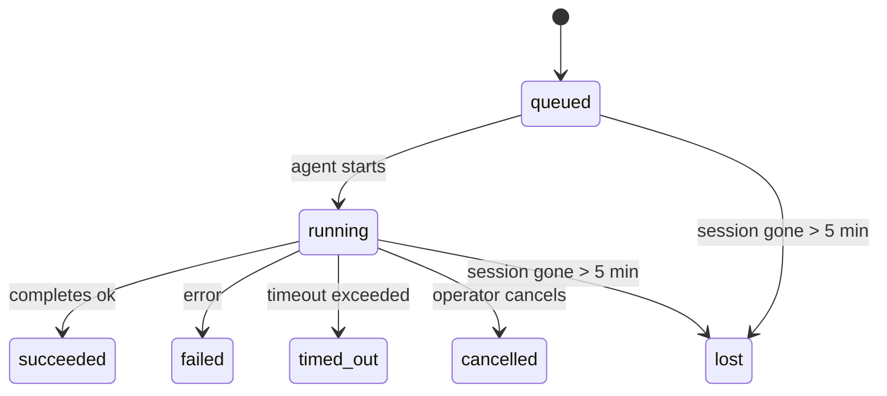

---
read_when:
    - Inspection des travaux en arrière-plan en cours ou récemment terminés
    - Débogage des échecs de livraison pour les exécutions d’agent détachées
    - Comprendre le lien entre les exécutions en arrière-plan, les sessions, Cron et Heartbeat
sidebarTitle: Background tasks
summary: Suivi des tâches d’arrière-plan pour les exécutions ACP, les sous-agents, les tâches Cron isolées et les opérations CLI
title: Tâches en arrière-plan
x-i18n:
    generated_at: "2026-05-07T13:13:27Z"
    model: gpt-5.5
    provider: openai
    source_hash: a91a04ef6142e488d2fbc459d2c663afb93816a58fe9f52e0a51420703ea2d4d
    source_path: automation/tasks.md
    workflow: 16
---

<Note>
Vous cherchez la planification ? Consultez [Automatisation et tâches](/fr/automation) pour choisir le bon mécanisme. Cette page est le registre d’activité du travail en arrière-plan, pas le planificateur.
</Note>

Les tâches en arrière-plan suivent le travail qui s’exécute **en dehors de votre session de conversation principale** : exécutions ACP, lancements de sous-agents, exécutions de tâches cron isolées et opérations lancées par la CLI.

Les tâches ne remplacent **pas** les sessions, les tâches cron ni les heartbeats : elles sont le **registre d’activité** qui enregistre quel travail détaché a eu lieu, quand, et s’il a réussi.

<Note>
Toutes les exécutions d’agent ne créent pas une tâche. Les tours Heartbeat et les discussions interactives normales n’en créent pas. Toutes les exécutions cron, les lancements ACP, les lancements de sous-agents et les commandes d’agent CLI en créent une.
</Note>

## TL;DR

- Les tâches sont des **enregistrements**, pas des planificateurs : cron et heartbeat décident _quand_ le travail s’exécute, les tâches suivent _ce qui s’est passé_.
- ACP, les sous-agents, toutes les tâches cron et les opérations CLI créent des tâches. Les tours Heartbeat n’en créent pas.
- Chaque tâche passe par `queued → running → terminal` (réussie, échouée, expirée, annulée ou perdue).
- Les tâches cron restent actives tant que le runtime cron possède encore la tâche ; si l’état du runtime en mémoire a disparu, la maintenance des tâches vérifie d’abord l’historique durable des exécutions cron avant de marquer une tâche comme perdue.
- La complétion est pilotée par notification : le travail détaché peut notifier directement ou réveiller la session demandeuse/le heartbeat lorsqu’il se termine, si bien que les boucles d’interrogation de statut sont généralement la mauvaise approche.
- Les exécutions cron isolées et les complétions de sous-agents nettoient au mieux les onglets/processus de navigateur suivis pour leur session enfant avant la comptabilité de nettoyage finale.
- La livraison cron isolée supprime les réponses parentes intermédiaires obsolètes tant que le travail des sous-agents descendants est encore en cours d’écoulement, et préfère la sortie finale du descendant lorsqu’elle arrive avant la livraison.
- Les notifications de complétion sont livrées directement à un canal ou mises en file d’attente pour le prochain heartbeat.
- `openclaw tasks list` affiche toutes les tâches ; `openclaw tasks audit` fait remonter les problèmes.
- Les enregistrements terminaux sont conservés 7 jours, puis automatiquement élagués.

## Démarrage rapide

<Tabs>
  <Tab title="Lister et filtrer">
    ```bash
    # List all tasks (newest first)
    openclaw tasks list

    # Filter by runtime or status
    openclaw tasks list --runtime acp
    openclaw tasks list --status running
    ```

  </Tab>
  <Tab title="Inspecter">
    ```bash
    # Show details for a specific task (by ID, run ID, or session key)
    openclaw tasks show <lookup>
    ```
  </Tab>
  <Tab title="Annuler et notifier">
    ```bash
    # Cancel a running task (kills the child session)
    openclaw tasks cancel <lookup>

    # Change notification policy for a task
    openclaw tasks notify <lookup> state_changes
    ```

  </Tab>
  <Tab title="Audit et maintenance">
    ```bash
    # Run a health audit
    openclaw tasks audit

    # Preview or apply maintenance
    openclaw tasks maintenance
    openclaw tasks maintenance --apply
    ```

  </Tab>
  <Tab title="Flux de tâches">
    ```bash
    # Inspect TaskFlow state
    openclaw tasks flow list
    openclaw tasks flow show <lookup>
    openclaw tasks flow cancel <lookup>
    ```
  </Tab>
</Tabs>

## Ce qui crée une tâche

| Source                 | Type de runtime | Quand un enregistrement de tâche est créé              | Politique de notification par défaut |
| ---------------------- | ------------ | ------------------------------------------------------ | --------------------- |
| Exécutions ACP en arrière-plan    | `acp`        | Lancement d’une session ACP enfant                     | `done_only`           |
| Orchestration de sous-agents | `subagent`   | Lancement d’un sous-agent via `sessions_spawn`         | `done_only`           |
| Tâches cron (tous types) | `cron`       | Chaque exécution cron (session principale et isolée)   | `silent`              |
| Opérations CLI         | `cli`        | Commandes `openclaw agent` qui passent par le gateway  | `silent`              |
| Tâches média d’agent   | `cli`        | Exécutions `music_generate`/`video_generate` adossées à une session | `silent`              |

<AccordionGroup>
  <Accordion title="Valeurs par défaut de notification pour cron et les médias">
    Les tâches cron de session principale utilisent par défaut la politique de notification `silent` : elles créent des enregistrements pour le suivi, mais ne génèrent pas de notifications. Les tâches cron isolées utilisent aussi `silent` par défaut, mais sont plus visibles parce qu’elles s’exécutent dans leur propre session.

    Les exécutions `music_generate` et `video_generate` adossées à une session utilisent aussi la politique de notification `silent`. Elles créent tout de même des enregistrements de tâche, mais la complétion est renvoyée à la session d’agent d’origine comme réveil interne afin que l’agent puisse écrire le message de suivi et joindre lui-même le média terminé. Les complétions de groupe/canal suivent la politique normale de réponse visible, si bien que l’agent utilise l’outil de message lorsque la livraison source l’exige. Si l’agent de complétion ne produit pas de preuve de livraison via l’outil de message dans une route uniquement outillée, OpenClaw envoie directement la solution de repli de complétion au canal d’origine au lieu de laisser le média privé.

  </Accordion>
  <Accordion title="Garde-fou video_generate concurrent">
    Tant qu’une tâche `video_generate` adossée à une session est encore active, l’outil agit aussi comme garde-fou : les appels répétés à `video_generate` dans cette même session renvoient le statut de la tâche active au lieu de démarrer une deuxième génération concurrente. Utilisez `action: "status"` lorsque vous souhaitez une recherche explicite de progression/statut côté agent.
  </Accordion>
  <Accordion title="Ce qui ne crée pas de tâches">
    - Tours Heartbeat : session principale ; voir [Heartbeat](/fr/gateway/heartbeat)
    - Tours de discussion interactive normale
    - Réponses directes `/command`

  </Accordion>
</AccordionGroup>

## Cycle de vie des tâches



| Statut      | Ce que cela signifie                                                      |
| ----------- | -------------------------------------------------------------------------- |
| `queued`    | Créée, en attente du démarrage de l’agent                                  |
| `running`   | Le tour de l’agent est en cours d’exécution active                         |
| `succeeded` | Terminée avec succès                                                       |
| `failed`    | Terminée avec une erreur                                                   |
| `timed_out` | A dépassé le délai configuré                                               |
| `cancelled` | Arrêtée par l’opérateur via `openclaw tasks cancel`                        |
| `lost`      | Le runtime a perdu l’état de référence faisant autorité après une période de grâce de 5 minutes |

Les transitions se produisent automatiquement : lorsque l’exécution d’agent associée se termine, le statut de la tâche est mis à jour en conséquence.

La complétion d’exécution d’agent fait autorité pour les enregistrements de tâches actifs. Une exécution détachée réussie se finalise en `succeeded`, les erreurs d’exécution ordinaires se finalisent en `failed`, et les résultats d’expiration ou d’abandon se finalisent en `timed_out`. Si un opérateur a déjà annulé la tâche, ou si le runtime a déjà enregistré un état terminal plus fort comme `failed`, `timed_out` ou `lost`, un signal de réussite ultérieur ne rétrograde pas ce statut terminal.

`lost` est conscient du runtime :

- Tâches ACP : les métadonnées de la session ACP enfant sous-jacente ont disparu.
- Tâches de sous-agent : la session enfant sous-jacente a disparu du store de l’agent cible.
- Tâches cron : le runtime cron ne suit plus la tâche comme active et l’historique durable des exécutions cron n’indique pas de résultat terminal pour cette exécution. L’audit CLI hors ligne ne traite pas son propre état de runtime cron en processus vide comme une autorité.
- Tâches CLI : les tâches avec un identifiant d’exécution/source utilisent le contexte d’exécution actif, si bien que les lignes persistantes de session enfant ou de session de discussion ne les gardent pas actives après la disparition de l’exécution possédée par le gateway. Les anciennes tâches CLI sans identité d’exécution se rabattent encore sur la session enfant. Les exécutions `openclaw agent` adossées au gateway se finalisent aussi à partir de leur résultat d’exécution, si bien que les exécutions terminées ne restent pas actives jusqu’à ce que le balayeur les marque `lost`.

## Livraison et notifications

Lorsqu’une tâche atteint un état terminal, OpenClaw vous notifie. Il existe deux chemins de livraison :

**Livraison directe** : si la tâche a une cible de canal (le `requesterOrigin`), le message de complétion va directement à ce canal (Telegram, Discord, Slack, etc.). Pour les complétions de sous-agents, OpenClaw préserve aussi le routage de fil/sujet lié lorsqu’il est disponible et peut compléter un `to` / compte manquant à partir de la route stockée de la session demandeuse (`lastChannel` / `lastTo` / `lastAccountId`) avant d’abandonner la livraison directe.

**Livraison mise en file d’attente de session** : si la livraison directe échoue ou qu’aucune origine n’est définie, la mise à jour est mise en file comme événement système dans la session du demandeur et apparaît au prochain heartbeat.

<Tip>
La complétion d’une tâche déclenche un réveil heartbeat immédiat afin que vous voyiez le résultat rapidement : vous n’avez pas à attendre le prochain tick heartbeat planifié.
</Tip>

Cela signifie que le flux de travail habituel est fondé sur les notifications : démarrez le travail détaché une fois, puis laissez le runtime vous réveiller ou vous notifier à la complétion. N’interrogez l’état des tâches que lorsque vous avez besoin de débogage, d’intervention ou d’un audit explicite.

### Politiques de notification

Contrôlez le niveau d’information que vous recevez pour chaque tâche :

| Politique                | Ce qui est livré                                                       |
| --------------------- | ----------------------------------------------------------------------- |
| `done_only` (par défaut) | Uniquement l’état terminal (réussie, échouée, etc.) : **c’est la valeur par défaut** |
| `state_changes`       | Chaque transition d’état et mise à jour de progression                  |
| `silent`              | Rien du tout                                                            |

Modifiez la politique pendant qu’une tâche est en cours d’exécution :

```bash
openclaw tasks notify <lookup> state_changes
```

## Référence CLI

<AccordionGroup>
  <Accordion title="tasks list">
    ```bash
    openclaw tasks list [--runtime <acp|subagent|cron|cli>] [--status <status>] [--json]
    ```

    Colonnes de sortie : ID de tâche, type, statut, livraison, ID d’exécution, session enfant, résumé.

  </Accordion>
  <Accordion title="tasks show">
    ```bash
    openclaw tasks show <lookup>
    ```

    Le jeton de recherche accepte un ID de tâche, un ID d’exécution ou une clé de session. Affiche l’enregistrement complet, y compris les informations de temps, l’état de livraison, l’erreur et le résumé terminal.

  </Accordion>
  <Accordion title="tasks cancel">
    ```bash
    openclaw tasks cancel <lookup>
    ```

    Pour les tâches ACP et de sous-agent, cela tue la session enfant. Pour les tâches suivies par la CLI, l’annulation est enregistrée dans le registre des tâches (il n’existe pas de handle de runtime enfant distinct). Le statut passe à `cancelled` et une notification de livraison est envoyée le cas échéant.

  </Accordion>
  <Accordion title="tasks notify">
    ```bash
    openclaw tasks notify <lookup> <done_only|state_changes|silent>
    ```
  </Accordion>
  <Accordion title="tasks audit">
    ```bash
    openclaw tasks audit [--json]
    ```

    Fait remonter les problèmes opérationnels. Les constats apparaissent aussi dans `openclaw status` lorsque des problèmes sont détectés.

    | Constat                   | Gravité   | Déclencheur                                                                                                      |
    | ------------------------- | ---------- | ------------------------------------------------------------------------------------------------------------ |
    | `stale_queued`            | warn       | En file d’attente depuis plus de 10 minutes                                                                              |
    | `stale_running`           | error      | En cours depuis plus de 30 minutes                                                                             |
    | `lost`                    | warn/error | La propriété de la tâche appuyée par le runtime a disparu ; les tâches perdues conservées génèrent des avertissements jusqu’à `cleanupAfter`, puis deviennent des erreurs |
    | `delivery_failed`         | warn       | La livraison a échoué et la politique de notification n’est pas `silent`                                                            |
    | `missing_cleanup`         | warn       | Tâche terminale sans horodatage de nettoyage                                                                      |
    | `inconsistent_timestamps` | warn       | Violation de la chronologie (par exemple, terminée avant d’avoir démarré)                                                        |

  </Accordion>
  <Accordion title="maintenance des tâches">
    ```bash
    openclaw tasks maintenance [--json]
    openclaw tasks maintenance --apply [--json]
    ```

    Utilisez cette commande pour prévisualiser ou appliquer la réconciliation, l’horodatage de nettoyage et l’élagage des tâches et de l’état Task Flow.

    La réconciliation tient compte du runtime :

    - Les tâches ACP/sous-agent vérifient leur session enfant de rattachement.
    - Les tâches de sous-agent dont la session enfant possède une pierre tombale de récupération après redémarrage sont marquées comme perdues au lieu d’être traitées comme des sessions de rattachement récupérables.
    - Les tâches Cron vérifient si le runtime cron possède toujours la tâche, puis récupèrent l’état terminal depuis les journaux d’exécution cron persistés/l’état de la tâche avant de retomber sur `lost`. Seul le processus Gateway fait autorité pour l’ensemble en mémoire des tâches cron actives ; l’audit CLI hors ligne utilise l’historique durable mais ne marque pas une tâche cron comme perdue uniquement parce que ce Set local est vide.
    - Les tâches CLI avec une identité d’exécution vérifient le contexte d’exécution actif propriétaire, pas seulement les lignes de session enfant ou de session de chat.

    Le nettoyage de fin tient aussi compte du runtime :

    - La fin d’un sous-agent ferme au mieux les onglets/processus de navigateur suivis pour la session enfant avant la poursuite du nettoyage d’annonce.
    - La fin d’un cron isolé ferme au mieux les onglets/processus de navigateur suivis pour la session cron avant que l’exécution ne se démonte complètement.
    - La livraison cron isolée attend, si nécessaire, le suivi de sous-agents descendants et supprime le texte d’accusé de réception parent obsolète au lieu de l’annoncer.
    - La livraison de fin d’un sous-agent préfère le texte d’assistant visible le plus récent ; s’il est vide, elle se rabat sur le texte d’outil/toolResult le plus récent après assainissement, et les exécutions d’appels d’outils arrêtées uniquement par délai peuvent se réduire à un bref résumé d’avancement partiel. Les exécutions terminales en échec annoncent l’état d’échec sans rejouer le texte de réponse capturé.
    - Les échecs de nettoyage ne masquent pas le véritable résultat de la tâche.

  </Accordion>
  <Accordion title="lister | afficher | annuler le flux des tâches">
    ```bash
    openclaw tasks flow list [--status <status>] [--json]
    openclaw tasks flow show <lookup> [--json]
    openclaw tasks flow cancel <lookup>
    ```

    Utilisez ces commandes lorsque le Task Flow orchestrateur est ce qui vous intéresse, plutôt qu’un enregistrement de tâche d’arrière-plan individuel.

  </Accordion>
</AccordionGroup>

## Tableau des tâches de chat (`/tasks`)

Utilisez `/tasks` dans n’importe quelle session de chat pour voir les tâches d’arrière-plan liées à cette session. Le tableau affiche les tâches actives et récemment terminées avec le runtime, l’état, le minutage et les détails de progression ou d’erreur.

Lorsque la session actuelle n’a aucune tâche liée visible, `/tasks` se rabat sur les décomptes de tâches locaux à l’agent afin que vous disposiez tout de même d’une vue d’ensemble sans divulguer les détails d’autres sessions.

Pour le journal opérateur complet, utilisez la CLI : `openclaw tasks list`.

## Intégration de l’état (pression des tâches)

`openclaw status` inclut un résumé des tâches en un coup d’œil :

```
Tasks: 3 queued · 2 running · 1 issues
```

Le résumé indique :

- **active** - nombre de `queued` + `running`
- **failures** - nombre de `failed` + `timed_out` + `lost`
- **byRuntime** - ventilation par `acp`, `subagent`, `cron`, `cli`

`/status` et l’outil `session_status` utilisent tous deux un instantané des tâches tenant compte du nettoyage : les tâches actives sont privilégiées, les lignes terminées obsolètes sont masquées, et les échecs récents ne remontent que lorsqu’il ne reste plus aucun travail actif. Cela garde la carte d’état centrée sur ce qui compte maintenant.

## Stockage et maintenance

### Où résident les tâches

Les enregistrements de tâches persistent dans SQLite à l’emplacement suivant :

```
$OPENCLAW_STATE_DIR/tasks/runs.sqlite
```

Le registre est chargé en mémoire au démarrage du gateway et synchronise les écritures vers SQLite pour assurer la durabilité entre les redémarrages.
Le Gateway maintient le journal write-ahead de SQLite borné en utilisant le seuil
d’autocheckpoint par défaut de SQLite ainsi que des points de contrôle `TRUNCATE` périodiques et à l’arrêt.

### Maintenance automatique

Un balayeur s’exécute toutes les **60 secondes** et gère quatre éléments :

<Steps>
  <Step title="Réconciliation">
    Vérifie si les tâches actives disposent encore d’un rattachement runtime faisant autorité. Les tâches ACP/sous-agent utilisent l’état de session enfant, les tâches cron utilisent la propriété de tâche active, et les tâches CLI avec identité d’exécution utilisent le contexte d’exécution propriétaire. Si cet état de rattachement a disparu depuis plus de 5 minutes, la tâche est marquée `lost`.
  </Step>
  <Step title="Réparation de session ACP">
    Ferme les sessions ACP terminales ou orphelines ponctuelles appartenant au parent, et ferme les sessions ACP persistantes terminales obsolètes ou orphelines uniquement lorsqu’il ne reste aucune liaison de conversation active.
  </Step>
  <Step title="Horodatage de nettoyage">
    Définit un horodatage `cleanupAfter` sur les tâches terminales (endedAt + 7 jours). Pendant la rétention, les tâches perdues apparaissent toujours dans l’audit comme avertissements ; après l’expiration de `cleanupAfter` ou lorsque les métadonnées de nettoyage sont manquantes, elles sont des erreurs.
  </Step>
  <Step title="Élagage">
    Supprime les enregistrements dont la date `cleanupAfter` est dépassée.
  </Step>
</Steps>

<Note>
**Rétention :** les enregistrements de tâches terminales sont conservés pendant **7 jours**, puis automatiquement élagués. Aucune configuration requise.
</Note>

## Relation des tâches avec les autres systèmes

<AccordionGroup>
  <Accordion title="Tâches et Task Flow">
    [Task Flow](/fr/automation/taskflow) est la couche d’orchestration de flux au-dessus des tâches d’arrière-plan. Un même flux peut coordonner plusieurs tâches au cours de sa durée de vie en utilisant des modes de synchronisation gérés ou en miroir. Utilisez `openclaw tasks` pour inspecter les enregistrements de tâches individuels et `openclaw tasks flow` pour inspecter le flux orchestrateur.

    Consultez [Task Flow](/fr/automation/taskflow) pour plus de détails.

  </Accordion>
  <Accordion title="Tâches et cron">
    Une **définition** de tâche cron réside dans `~/.openclaw/cron/jobs.json` ; l’état d’exécution runtime réside à côté, dans `~/.openclaw/cron/jobs-state.json`. **Chaque** exécution cron crée un enregistrement de tâche, aussi bien en session principale qu’en mode isolé. Les tâches cron de session principale utilisent par défaut la politique de notification `silent`, afin d’être suivies sans générer de notifications.

    Consultez [Tâches Cron](/fr/automation/cron-jobs).

  </Accordion>
  <Accordion title="Tâches et heartbeat">
    Les exécutions Heartbeat sont des tours de session principale ; elles ne créent pas d’enregistrements de tâches. Lorsqu’une tâche se termine, elle peut déclencher un réveil heartbeat afin que vous voyiez le résultat rapidement.

    Consultez [Heartbeat](/fr/gateway/heartbeat).

  </Accordion>
  <Accordion title="Tâches et sessions">
    Une tâche peut référencer une `childSessionKey` (où le travail s’exécute) et une `requesterSessionKey` (qui l’a lancée). Les sessions sont le contexte de conversation ; les tâches sont le suivi d’activité ajouté par-dessus.
  </Accordion>
  <Accordion title="Tâches et exécutions d’agent">
    Le `runId` d’une tâche pointe vers l’exécution d’agent qui effectue le travail. Les événements de cycle de vie de l’agent (démarrage, fin, erreur) mettent automatiquement à jour l’état de la tâche ; vous n’avez pas besoin de gérer le cycle de vie manuellement.
  </Accordion>
</AccordionGroup>

## Associé

- [Automatisation et tâches](/fr/automation) - tous les mécanismes d’automatisation en un coup d’œil
- [CLI : tâches](/fr/cli/tasks) - référence des commandes CLI
- [Heartbeat](/fr/gateway/heartbeat) - tours périodiques de session principale
- [Tâches planifiées](/fr/automation/cron-jobs) - planification du travail d’arrière-plan
- [Task Flow](/fr/automation/taskflow) - orchestration de flux au-dessus des tâches
