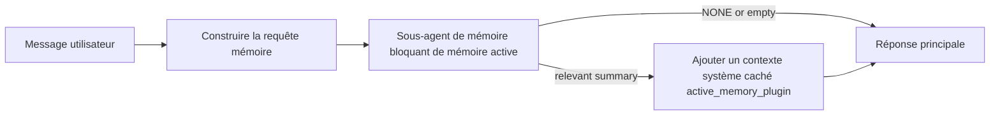

---
read_when:
    - Vous voulez comprendre à quoi sert la mémoire active
    - Vous voulez activer la mémoire active pour un agent conversationnel
    - Vous voulez ajuster le comportement de la mémoire active sans l’activer partout
summary: Un sous-agent de mémoire bloquante appartenant au plugin qui injecte la mémoire pertinente dans les sessions de chat interactives
title: Mémoire active
x-i18n:
    generated_at: "2026-04-11T06:40:23Z"
    model: gpt-5.4
    provider: openai
    source_hash: e8b0e6539e09678e9e8def68795f8bcb992f98509423da3da3123eda88ec1dd5
    source_path: concepts/active-memory.md
    workflow: 15
---

# Mémoire active

La mémoire active est un sous-agent de mémoire bloquant optionnel appartenant au plugin qui s’exécute
avant la réponse principale pour les sessions conversationnelles éligibles.

Elle existe parce que la plupart des systèmes de mémoire sont capables mais réactifs. Ils s’appuient sur
l’agent principal pour décider quand rechercher dans la mémoire, ou sur l’utilisateur pour dire des choses
comme « souviens-toi de ceci » ou « recherche dans la mémoire ». À ce stade, le moment où la mémoire aurait
rendu la réponse naturelle est déjà passé.

La mémoire active donne au système une occasion limitée de faire remonter une mémoire pertinente
avant que la réponse principale ne soit générée.

## Collez ceci dans votre agent

Collez ceci dans votre agent si vous voulez activer la mémoire active avec une
configuration autonome et sûre par défaut :

```json5
{
  plugins: {
    entries: {
      "active-memory": {
        enabled: true,
        config: {
          enabled: true,
          agents: ["main"],
          allowedChatTypes: ["direct"],
          modelFallbackPolicy: "default-remote",
          queryMode: "recent",
          promptStyle: "balanced",
          timeoutMs: 15000,
          maxSummaryChars: 220,
          persistTranscripts: false,
          logging: true,
        },
      },
    },
  },
}
```

Cela active le plugin pour l’agent `main`, le limite par défaut aux sessions
de type message direct, lui permet d’hériter d’abord du modèle de la session en cours,
et autorise toujours le fallback distant intégré si aucun modèle explicite ou hérité n’est disponible.

Après cela, redémarrez la passerelle :

```bash
openclaw gateway
```

Pour l’inspecter en direct dans une conversation :

```text
/verbose on
```

## Activer la mémoire active

La configuration la plus sûre est :

1. activer le plugin
2. cibler un agent conversationnel
3. garder la journalisation activée uniquement pendant le réglage

Commencez par ceci dans `openclaw.json` :

```json5
{
  plugins: {
    entries: {
      "active-memory": {
        enabled: true,
        config: {
          agents: ["main"],
          allowedChatTypes: ["direct"],
          modelFallbackPolicy: "default-remote",
          queryMode: "recent",
          promptStyle: "balanced",
          timeoutMs: 15000,
          maxSummaryChars: 220,
          persistTranscripts: false,
          logging: true,
        },
      },
    },
  },
}
```

Redémarrez ensuite la passerelle :

```bash
openclaw gateway
```

Ce que cela signifie :

- `plugins.entries.active-memory.enabled: true` active le plugin
- `config.agents: ["main"]` n’active la mémoire active que pour l’agent `main`
- `config.allowedChatTypes: ["direct"]` limite par défaut la mémoire active aux sessions de type message direct
- si `config.model` n’est pas défini, la mémoire active hérite d’abord du modèle de la session en cours
- `config.modelFallbackPolicy: "default-remote"` conserve le fallback distant intégré par défaut lorsqu’aucun modèle explicite ou hérité n’est disponible
- `config.promptStyle: "balanced"` utilise le style d’invite polyvalent par défaut pour le mode `recent`
- la mémoire active ne s’exécute toujours que sur les sessions de chat interactives persistantes éligibles

## Comment l’afficher

La mémoire active injecte un contexte système caché pour le modèle. Elle n’expose pas
les balises brutes `<active_memory_plugin>...</active_memory_plugin>` au client.

## Bascule de session

Utilisez la commande du plugin lorsque vous voulez mettre en pause ou reprendre la mémoire active pour la
session de chat en cours sans modifier la configuration :

```text
/active-memory status
/active-memory off
/active-memory on
```

Cette action est limitée à la session. Elle ne modifie pas
`plugins.entries.active-memory.enabled`, le ciblage des agents ni une autre
configuration globale.

Si vous voulez que la commande écrive la configuration et mette en pause ou reprenne la mémoire active pour
toutes les sessions, utilisez la forme globale explicite :

```text
/active-memory status --global
/active-memory off --global
/active-memory on --global
```

La forme globale écrit `plugins.entries.active-memory.config.enabled`. Elle laisse
`plugins.entries.active-memory.enabled` activé afin que la commande reste disponible pour
réactiver plus tard la mémoire active.

Si vous voulez voir ce que fait la mémoire active dans une session active, activez le mode verbeux
pour cette session :

```text
/verbose on
```

Avec le mode verbeux activé, OpenClaw peut afficher :

- une ligne d’état de la mémoire active telle que `Active Memory: ok 842ms recent 34 chars`
- un résumé de débogage lisible tel que `Active Memory Debug: Lemon pepper wings with blue cheese.`

Ces lignes sont dérivées du même passage de mémoire active qui alimente le contexte système
caché, mais elles sont formatées pour des humains au lieu d’exposer le balisage brut de l’invite.

Par défaut, la transcription du sous-agent de mémoire bloquant est temporaire et supprimée
une fois l’exécution terminée.

Exemple de flux :

```text
/verbose on
quelles ailes de poulet devrais-je commander ?
```

Forme attendue de la réponse visible :

```text
...réponse normale de l’assistant...

🧩 Active Memory: ok 842ms recent 34 chars
🔎 Active Memory Debug: Lemon pepper wings with blue cheese.
```

## Quand elle s’exécute

La mémoire active utilise deux mécanismes de contrôle :

1. **Activation par configuration**
   Le plugin doit être activé, et l’identifiant de l’agent en cours doit apparaître dans
   `plugins.entries.active-memory.config.agents`.
2. **Éligibilité stricte à l’exécution**
   Même lorsqu’elle est activée et ciblée, la mémoire active ne s’exécute que pour les
   sessions de chat interactives persistantes éligibles.

La règle réelle est :

```text
plugin activé
+
identifiant d’agent ciblé
+
type de chat autorisé
+
session de chat interactive persistante éligible
=
la mémoire active s’exécute
```

Si l’une de ces conditions échoue, la mémoire active ne s’exécute pas.

## Types de session

`config.allowedChatTypes` contrôle quels types de conversations peuvent exécuter la mémoire active.

La valeur par défaut est :

```json5
allowedChatTypes: ["direct"]
```

Cela signifie que la mémoire active s’exécute par défaut dans les sessions de type message direct, mais
pas dans les sessions de groupe ou de canal, sauf si vous les activez explicitement.

Exemples :

```json5
allowedChatTypes: ["direct"]
```

```json5
allowedChatTypes: ["direct", "group"]
```

```json5
allowedChatTypes: ["direct", "group", "channel"]
```

## Où elle s’exécute

La mémoire active est une fonctionnalité d’enrichissement conversationnel, pas une
fonctionnalité d’inférence à l’échelle de la plateforme.

| Surface                                                             | La mémoire active s’exécute ?                           |
| ------------------------------------------------------------------- | ------------------------------------------------------- |
| Sessions persistantes Control UI / chat web                         | Oui, si le plugin est activé et que l’agent est ciblé   |
| Autres sessions de canal interactives sur le même chemin de chat persistant | Oui, si le plugin est activé et que l’agent est ciblé |
| Exécutions sans interface en un seul appel                          | Non                                                     |
| Exécutions heartbeat/arrière-plan                                   | Non                                                     |
| Chemins internes génériques `agent-command`                         | Non                                                     |
| Exécution de sous-agent/helper interne                              | Non                                                     |

## Pourquoi l’utiliser

Utilisez la mémoire active lorsque :

- la session est persistante et destinée à l’utilisateur
- l’agent dispose d’une mémoire à long terme significative à consulter
- la continuité et la personnalisation comptent plus que le déterminisme brut de l’invite

Elle fonctionne particulièrement bien pour :

- les préférences stables
- les habitudes récurrentes
- le contexte utilisateur à long terme qui doit émerger naturellement

Elle convient mal à :

- l’automatisation
- les workers internes
- les tâches API en un seul appel
- les endroits où une personnalisation cachée serait surprenante

## Fonctionnement

La forme d’exécution est :



Le sous-agent de mémoire bloquant peut utiliser uniquement :

- `memory_search`
- `memory_get`

Si la connexion est faible, il doit renvoyer `NONE`.

## Modes de requête

`config.queryMode` contrôle la quantité de conversation que voit le sous-agent de mémoire bloquant.

## Styles d’invite

`config.promptStyle` contrôle à quel point le sous-agent de mémoire bloquant est
volontaire ou strict lorsqu’il décide de renvoyer une mémoire.

Styles disponibles :

- `balanced` : valeur par défaut polyvalente pour le mode `recent`
- `strict` : le moins volontaire ; idéal lorsque vous voulez très peu de contamination par le contexte proche
- `contextual` : le plus favorable à la continuité ; idéal lorsque l’historique de conversation doit davantage compter
- `recall-heavy` : plus disposé à faire remonter une mémoire sur des correspondances plus souples mais toujours plausibles
- `precision-heavy` : privilégie agressivement `NONE` sauf si la correspondance est évidente
- `preference-only` : optimisé pour les favoris, les habitudes, les routines, les goûts et les faits personnels récurrents

Correspondance par défaut lorsque `config.promptStyle` n’est pas défini :

```text
message -> strict
recent -> balanced
full -> contextual
```

Si vous définissez `config.promptStyle` explicitement, cette valeur de remplacement l’emporte.

Exemple :

```json5
promptStyle: "preference-only"
```

## Politique de fallback du modèle

Si `config.model` n’est pas défini, la mémoire active tente de résoudre un modèle dans cet ordre :

```text
modèle explicite du plugin
-> modèle de la session en cours
-> modèle principal de l’agent
-> fallback distant intégré optionnel
```

`config.modelFallbackPolicy` contrôle la dernière étape.

Valeur par défaut :

```json5
modelFallbackPolicy: "default-remote"
```

Autre option :

```json5
modelFallbackPolicy: "resolved-only"
```

Utilisez `resolved-only` si vous voulez que la mémoire active ignore le rappel au lieu d’utiliser
par défaut le mode distant intégré lorsqu’aucun modèle explicite ou hérité n’est
disponible.

## Échappatoires avancées

Ces options ne font volontairement pas partie de la configuration recommandée.

`config.thinking` peut remplacer le niveau de réflexion du sous-agent de mémoire bloquant :

```json5
thinking: "medium"
```

Valeur par défaut :

```json5
thinking: "off"
```

Ne l’activez pas par défaut. La mémoire active s’exécute sur le chemin de réponse, donc le temps de
réflexion supplémentaire augmente directement la latence visible par l’utilisateur.

`config.promptAppend` ajoute des instructions opérateur supplémentaires après l’invite par défaut de la mémoire active
et avant le contexte de conversation :

```json5
promptAppend: "Préférez les préférences stables à long terme aux événements ponctuels."
```

`config.promptOverride` remplace l’invite par défaut de la mémoire active. OpenClaw
ajoute toujours ensuite le contexte de conversation :

```json5
promptOverride: "You are a memory search agent. Return NONE or one compact user fact."
```

La personnalisation de l’invite n’est pas recommandée, sauf si vous testez délibérément un
contrat de rappel différent. L’invite par défaut est réglée pour renvoyer soit `NONE`,
soit un contexte compact de fait utilisateur pour le modèle principal.

### `message`

Seul le dernier message utilisateur est envoyé.

```text
Dernier message utilisateur uniquement
```

Utilisez ceci lorsque :

- vous voulez le comportement le plus rapide
- vous voulez le biais le plus fort vers le rappel de préférences stables
- les tours de suivi n’ont pas besoin de contexte conversationnel

Délai d’expiration recommandé :

- commencez autour de `3000` à `5000` ms

### `recent`

Le dernier message utilisateur ainsi qu’une petite queue de conversation récente sont envoyés.

```text
Queue de conversation récente :
user: ...
assistant: ...
user: ...

Dernier message utilisateur :
...
```

Utilisez ceci lorsque :

- vous voulez un meilleur équilibre entre vitesse et ancrage conversationnel
- les questions de suivi dépendent souvent des derniers tours

Délai d’expiration recommandé :

- commencez autour de `15000` ms

### `full`

La conversation complète est envoyée au sous-agent de mémoire bloquant.

```text
Contexte complet de la conversation :
user: ...
assistant: ...
user: ...
...
```

Utilisez ceci lorsque :

- la meilleure qualité de rappel compte davantage que la latence
- la conversation contient des éléments de préparation importants loin dans le fil

Délai d’expiration recommandé :

- augmentez-le sensiblement par rapport à `message` ou `recent`
- commencez autour de `15000` ms ou plus selon la taille du fil

En général, le délai d’expiration doit augmenter avec la taille du contexte :

```text
message < recent < full
```

## Persistance des transcriptions

Les exécutions du sous-agent de mémoire bloquant de la mémoire active créent une véritable transcription `session.jsonl`
pendant l’appel du sous-agent de mémoire bloquant.

Par défaut, cette transcription est temporaire :

- elle est écrite dans un répertoire temporaire
- elle est utilisée uniquement pour l’exécution du sous-agent de mémoire bloquant
- elle est supprimée immédiatement une fois l’exécution terminée

Si vous voulez conserver ces transcriptions du sous-agent de mémoire bloquant sur le disque pour le débogage ou
l’inspection, activez explicitement la persistance :

```json5
{
  plugins: {
    entries: {
      "active-memory": {
        enabled: true,
        config: {
          agents: ["main"],
          persistTranscripts: true,
          transcriptDir: "active-memory",
        },
      },
    },
  },
}
```

Lorsqu’elle est activée, la mémoire active stocke les transcriptions dans un répertoire distinct sous le
dossier de sessions de l’agent cible, et non dans le chemin principal de transcription de la conversation
utilisateur.

La disposition par défaut est, de manière conceptuelle :

```text
agents/<agent>/sessions/active-memory/<blocking-memory-sub-agent-session-id>.jsonl
```

Vous pouvez modifier le sous-répertoire relatif avec `config.transcriptDir`.

Utilisez cela avec précaution :

- les transcriptions du sous-agent de mémoire bloquant peuvent s’accumuler rapidement dans les sessions actives
- le mode de requête `full` peut dupliquer une grande quantité de contexte de conversation
- ces transcriptions contiennent un contexte d’invite caché et des mémoires rappelées

## Configuration

Toute la configuration de la mémoire active se trouve sous :

```text
plugins.entries.active-memory
```

Les champs les plus importants sont :

| Clé                         | Type                                                                                                 | Signification                                                                                          |
| --------------------------- | ---------------------------------------------------------------------------------------------------- | ------------------------------------------------------------------------------------------------------ |
| `enabled`                   | `boolean`                                                                                            | Active le plugin lui-même                                                                              |
| `config.agents`             | `string[]`                                                                                           | Identifiants d’agent pouvant utiliser la mémoire active                                                |
| `config.model`              | `string`                                                                                             | Référence de modèle optionnelle du sous-agent de mémoire bloquant ; si elle n’est pas définie, la mémoire active utilise le modèle de la session en cours |
| `config.queryMode`          | `"message" \| "recent" \| "full"`                                                                    | Contrôle la quantité de conversation vue par le sous-agent de mémoire bloquant                         |
| `config.promptStyle`        | `"balanced" \| "strict" \| "contextual" \| "recall-heavy" \| "precision-heavy" \| "preference-only"` | Contrôle à quel point le sous-agent de mémoire bloquant est volontaire ou strict lorsqu’il décide de renvoyer une mémoire |
| `config.thinking`           | `"off" \| "minimal" \| "low" \| "medium" \| "high" \| "xhigh" \| "adaptive"`                         | Remplacement avancé du niveau de réflexion pour le sous-agent de mémoire bloquant ; valeur par défaut `off` pour la vitesse |
| `config.promptOverride`     | `string`                                                                                             | Remplacement avancé de l’invite complète ; non recommandé pour un usage normal                         |
| `config.promptAppend`       | `string`                                                                                             | Instructions supplémentaires avancées ajoutées à l’invite par défaut ou remplacée                      |
| `config.timeoutMs`          | `number`                                                                                             | Délai d’expiration strict pour le sous-agent de mémoire bloquant                                       |
| `config.maxSummaryChars`    | `number`                                                                                             | Nombre maximal total de caractères autorisés dans le résumé active-memory                              |
| `config.logging`            | `boolean`                                                                                            | Émet des journaux de mémoire active pendant le réglage                                                 |
| `config.persistTranscripts` | `boolean`                                                                                            | Conserve les transcriptions du sous-agent de mémoire bloquant sur le disque au lieu de supprimer les fichiers temporaires |
| `config.transcriptDir`      | `string`                                                                                             | Répertoire relatif des transcriptions du sous-agent de mémoire bloquant sous le dossier de sessions de l’agent |

Champs de réglage utiles :

| Clé                           | Type     | Signification                                                |
| ----------------------------- | -------- | ------------------------------------------------------------ |
| `config.maxSummaryChars`      | `number` | Nombre maximal total de caractères autorisés dans le résumé active-memory |
| `config.recentUserTurns`      | `number` | Tours utilisateur précédents à inclure lorsque `queryMode` vaut `recent` |
| `config.recentAssistantTurns` | `number` | Tours assistant précédents à inclure lorsque `queryMode` vaut `recent` |
| `config.recentUserChars`      | `number` | Nombre maximal de caractères par tour utilisateur récent     |
| `config.recentAssistantChars` | `number` | Nombre maximal de caractères par tour assistant récent       |
| `config.cacheTtlMs`           | `number` | Réutilisation du cache pour des requêtes identiques répétées |

## Configuration recommandée

Commencez avec `recent`.

```json5
{
  plugins: {
    entries: {
      "active-memory": {
        enabled: true,
        config: {
          agents: ["main"],
          queryMode: "recent",
          promptStyle: "balanced",
          timeoutMs: 15000,
          maxSummaryChars: 220,
          logging: true,
        },
      },
    },
  },
}
```

Si vous voulez inspecter le comportement en direct pendant le réglage, utilisez `/verbose on` dans la
session au lieu de chercher une commande de débogage active-memory distincte.

Passez ensuite à :

- `message` si vous voulez une latence plus faible
- `full` si vous décidez qu’un contexte supplémentaire vaut un sous-agent de mémoire bloquant plus lent

## Débogage

Si la mémoire active n’apparaît pas là où vous l’attendez :

1. Vérifiez que le plugin est activé sous `plugins.entries.active-memory.enabled`.
2. Vérifiez que l’identifiant de l’agent en cours figure dans `config.agents`.
3. Vérifiez que vous testez via une session de chat interactive persistante.
4. Activez `config.logging: true` et surveillez les journaux de la passerelle.
5. Vérifiez que la recherche mémoire elle-même fonctionne avec `openclaw memory status --deep`.

Si les résultats mémoire sont trop bruités, resserrez :

- `maxSummaryChars`

Si la mémoire active est trop lente :

- réduisez `queryMode`
- réduisez `timeoutMs`
- réduisez le nombre de tours récents
- réduisez les limites de caractères par tour

## Pages associées

- [Recherche mémoire](/fr/concepts/memory-search)
- [Référence de configuration de la mémoire](/fr/reference/memory-config)
- [Configuration du Plugin SDK](/fr/plugins/sdk-setup)
