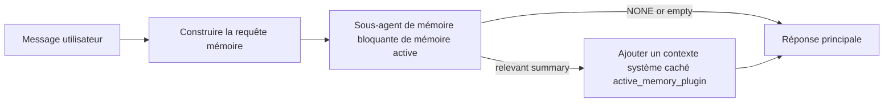

---
read_when:
    - Vous voulez comprendre à quoi sert la mémoire active
    - Vous voulez activer la mémoire active pour un agent conversationnel
    - Vous voulez ajuster le comportement de la mémoire active sans l’activer partout
summary: Un sous-agent de mémoire bloquante appartenant au plugin qui injecte la mémoire pertinente dans les sessions de chat interactives
title: Mémoire active
x-i18n:
    generated_at: "2026-04-12T06:49:37Z"
    model: gpt-5.4
    provider: openai
    source_hash: 59456805c28daaab394ba2a7f87e1104a1334a5cf32dbb961d5d232d9c471d84
    source_path: concepts/active-memory.md
    workflow: 15
---

# Mémoire active

La mémoire active est un sous-agent de mémoire bloquante optionnel appartenant au plugin qui s’exécute
avant la réponse principale pour les sessions conversationnelles éligibles.

Elle existe parce que la plupart des systèmes de mémoire sont performants, mais réactifs. Ils s’appuient sur
l’agent principal pour décider quand rechercher dans la mémoire, ou sur l’utilisateur pour dire des choses
comme « souviens-toi de ceci » ou « cherche dans la mémoire ». À ce moment-là, l’instant où la mémoire aurait
rendu la réponse naturelle est déjà passé.

La mémoire active donne au système une occasion limitée de faire remonter une mémoire pertinente
avant que la réponse principale ne soit générée.

## Collez ceci dans votre agent

Collez ceci dans votre agent si vous voulez activer la mémoire active avec une
configuration autonome et sûre par défaut :

```json5
{
  plugins: {
    entries: {
      "active-memory": {
        enabled: true,
        config: {
          enabled: true,
          agents: ["main"],
          allowedChatTypes: ["direct"],
          modelFallback: "google/gemini-3-flash",
          queryMode: "recent",
          promptStyle: "balanced",
          timeoutMs: 15000,
          maxSummaryChars: 220,
          persistTranscripts: false,
          logging: true,
        },
      },
    },
  },
}
```

Cela active le plugin pour l’agent `main`, le limite par défaut aux sessions
de type message direct, lui permet d’hériter d’abord du modèle de la session en cours, et
utilise le modèle de secours configuré uniquement si aucun modèle explicite ou hérité n’est disponible.

Ensuite, redémarrez la passerelle :

```bash
openclaw gateway
```

Pour l’inspecter en direct dans une conversation :

```text
/verbose on
```

## Activer la mémoire active

La configuration la plus sûre est la suivante :

1. activer le plugin
2. cibler un agent conversationnel
3. laisser la journalisation activée uniquement pendant le réglage

Commencez avec ceci dans `openclaw.json` :

```json5
{
  plugins: {
    entries: {
      "active-memory": {
        enabled: true,
        config: {
          agents: ["main"],
          allowedChatTypes: ["direct"],
          modelFallback: "google/gemini-3-flash",
          queryMode: "recent",
          promptStyle: "balanced",
          timeoutMs: 15000,
          maxSummaryChars: 220,
          persistTranscripts: false,
          logging: true,
        },
      },
    },
  },
}
```

Puis redémarrez la passerelle :

```bash
openclaw gateway
```

Ce que cela signifie :

- `plugins.entries.active-memory.enabled: true` active le plugin
- `config.agents: ["main"]` n’active la mémoire active que pour l’agent `main`
- `config.allowedChatTypes: ["direct"]` limite par défaut la mémoire active aux sessions de type message direct
- si `config.model` n’est pas défini, la mémoire active hérite d’abord du modèle de la session en cours
- `config.modelFallback` fournit éventuellement votre propre fournisseur/modèle de secours pour le rappel
- `config.promptStyle: "balanced"` utilise le style d’invite généraliste par défaut pour le mode `recent`
- la mémoire active ne s’exécute toujours que sur les sessions de chat persistantes interactives éligibles

## Comment la voir

La mémoire active injecte un contexte système caché pour le modèle. Elle n’expose pas
les balises brutes `<active_memory_plugin>...</active_memory_plugin>` au client.

## Bascule de session

Utilisez la commande du plugin lorsque vous voulez mettre en pause ou reprendre la mémoire active pour la
session de chat en cours sans modifier la configuration :

```text
/active-memory status
/active-memory off
/active-memory on
```

Ceci est limité à la session. Cela ne modifie pas
`plugins.entries.active-memory.enabled`, le ciblage d’agent, ni les autres
configurations globales.

Si vous voulez que la commande écrive la configuration et mette en pause ou reprenne la mémoire active pour
toutes les sessions, utilisez la forme globale explicite :

```text
/active-memory status --global
/active-memory off --global
/active-memory on --global
```

La forme globale écrit `plugins.entries.active-memory.config.enabled`. Elle laisse
`plugins.entries.active-memory.enabled` activé afin que la commande reste disponible pour
réactiver la mémoire active plus tard.

Si vous voulez voir ce que fait la mémoire active dans une session en direct, activez le mode verbeux
pour cette session :

```text
/verbose on
```

Avec le mode verbeux activé, OpenClaw peut afficher :

- une ligne d’état de mémoire active telle que `Active Memory: ok 842ms recent 34 chars`
- un résumé de débogage lisible tel que `Active Memory Debug: Lemon pepper wings with blue cheese.`

Ces lignes proviennent de la même passe de mémoire active qui alimente le contexte système
caché, mais elles sont formatées pour les humains au lieu d’exposer le balisage brut de l’invite.

Par défaut, le transcript du sous-agent de mémoire bloquante est temporaire et supprimé
une fois l’exécution terminée.

Exemple de flux :

```text
/verbose on
what wings should i order?
```

Forme attendue de la réponse visible :

```text
...normal assistant reply...

🧩 Active Memory: ok 842ms recent 34 chars
🔎 Active Memory Debug: Lemon pepper wings with blue cheese.
```

## Quand elle s’exécute

La mémoire active utilise deux contrôles :

1. **Activation explicite par la configuration**
   Le plugin doit être activé, et l’identifiant de l’agent courant doit apparaître dans
   `plugins.entries.active-memory.config.agents`.
2. **Éligibilité d’exécution stricte**
   Même lorsqu’elle est activée et ciblée, la mémoire active ne s’exécute que pour les
   sessions de chat persistantes interactives éligibles.

La règle réelle est la suivante :

```text
plugin enabled
+
agent id targeted
+
allowed chat type
+
eligible interactive persistent chat session
=
active memory runs
```

Si l’une de ces conditions échoue, la mémoire active ne s’exécute pas.

## Types de session

`config.allowedChatTypes` contrôle les types de conversations pouvant exécuter la mémoire active.

La valeur par défaut est :

```json5
allowedChatTypes: ["direct"]
```

Cela signifie que la mémoire active s’exécute par défaut dans les sessions de type message direct, mais
pas dans les sessions de groupe ou de canal, sauf si vous les activez explicitement.

Exemples :

```json5
allowedChatTypes: ["direct"]
```

```json5
allowedChatTypes: ["direct", "group"]
```

```json5
allowedChatTypes: ["direct", "group", "channel"]
```

## Où elle s’exécute

La mémoire active est une fonctionnalité d’enrichissement conversationnel, pas une
fonctionnalité d’inférence à l’échelle de la plateforme.

| Surface                                                             | La mémoire active s’exécute ?                           |
| ------------------------------------------------------------------- | ------------------------------------------------------- |
| Sessions persistantes de chat Control UI / web chat                 | Oui, si le plugin est activé et que l’agent est ciblé   |
| Autres sessions de canal interactives sur le même chemin de chat persistant | Oui, si le plugin est activé et que l’agent est ciblé   |
| Exécutions ponctuelles sans interface                               | Non                                                     |
| Exécutions de heartbeat / en arrière-plan                           | Non                                                     |
| Chemins internes génériques `agent-command`                         | Non                                                     |
| Exécution de sous-agent / d’assistant interne                       | Non                                                     |

## Pourquoi l’utiliser

Utilisez la mémoire active lorsque :

- la session est persistante et orientée utilisateur
- l’agent dispose d’une mémoire à long terme utile à interroger
- la continuité et la personnalisation comptent plus que le déterminisme brut de l’invite

Elle fonctionne particulièrement bien pour :

- les préférences stables
- les habitudes récurrentes
- le contexte utilisateur à long terme qui doit émerger naturellement

Elle convient mal à :

- l’automatisation
- les workers internes
- les tâches API ponctuelles
- les endroits où une personnalisation cachée serait surprenante

## Comment elle fonctionne

La forme d’exécution est la suivante :



Le sous-agent de mémoire bloquante ne peut utiliser que :

- `memory_search`
- `memory_get`

Si la connexion est faible, il doit renvoyer `NONE`.

## Modes de requête

`config.queryMode` contrôle la quantité de conversation que voit le sous-agent de mémoire bloquante.

## Styles d’invite

`config.promptStyle` contrôle à quel point le sous-agent de mémoire bloquante est
enclin ou strict lorsqu’il décide de renvoyer de la mémoire.

Styles disponibles :

- `balanced`: valeur par défaut généraliste pour le mode `recent`
- `strict`: le moins enclin ; idéal lorsque vous voulez très peu d’influence du contexte proche
- `contextual`: le plus favorable à la continuité ; idéal lorsque l’historique de conversation doit compter davantage
- `recall-heavy`: plus enclin à faire remonter la mémoire pour des correspondances plus souples mais toujours plausibles
- `precision-heavy`: préfère fortement `NONE` sauf si la correspondance est évidente
- `preference-only`: optimisé pour les favoris, habitudes, routines, goûts et faits personnels récurrents

Correspondance par défaut lorsque `config.promptStyle` n’est pas défini :

```text
message -> strict
recent -> balanced
full -> contextual
```

Si vous définissez `config.promptStyle` explicitement, cette valeur prioritaire s’applique.

Exemple :

```json5
promptStyle: "preference-only"
```

## Politique de modèle de secours

Si `config.model` n’est pas défini, la mémoire active essaie de résoudre un modèle dans cet ordre :

```text
explicit plugin model
-> current session model
-> agent primary model
-> optional configured fallback model
```

`config.modelFallback` contrôle l’étape de secours configurée.

Secours personnalisé optionnel :

```json5
modelFallback: "google/gemini-3-flash"
```

Si aucun modèle explicite, hérité ou de secours configuré n’est résolu, la mémoire active
ignore le rappel pour ce tour.

`config.modelFallbackPolicy` n’est conservé que comme champ de compatibilité obsolète
pour les anciennes configurations. Il ne modifie plus le comportement à l’exécution.

## Options avancées d’échappement

Ces options ne font volontairement pas partie de la configuration recommandée.

`config.thinking` peut remplacer le niveau de réflexion du sous-agent de mémoire bloquante :

```json5
thinking: "medium"
```

Valeur par défaut :

```json5
thinking: "off"
```

Ne l’activez pas par défaut. La mémoire active s’exécute dans le chemin de réponse, donc un temps
de réflexion supplémentaire augmente directement la latence visible par l’utilisateur.

`config.promptAppend` ajoute des instructions opérateur supplémentaires après l’invite
par défaut de la mémoire active et avant le contexte de conversation :

```json5
promptAppend: "Prefer stable long-term preferences over one-off events."
```

`config.promptOverride` remplace l’invite par défaut de la mémoire active. OpenClaw
ajoute toujours ensuite le contexte de conversation :

```json5
promptOverride: "You are a memory search agent. Return NONE or one compact user fact."
```

La personnalisation de l’invite n’est pas recommandée, sauf si vous testez délibérément un
contrat de rappel différent. L’invite par défaut est réglée pour renvoyer soit `NONE`,
soit un contexte compact de faits utilisateur pour le modèle principal.

### `message`

Seul le dernier message utilisateur est envoyé.

```text
Latest user message only
```

Utilisez ce mode lorsque :

- vous voulez le comportement le plus rapide
- vous voulez le biais le plus fort vers le rappel de préférences stables
- les tours de suivi n’ont pas besoin de contexte conversationnel

Délai d’expiration recommandé :

- commencez autour de `3000` à `5000` ms

### `recent`

Le dernier message utilisateur plus une petite queue récente de conversation sont envoyés.

```text
Recent conversation tail:
user: ...
assistant: ...
user: ...

Latest user message:
...
```

Utilisez ce mode lorsque :

- vous voulez un meilleur équilibre entre vitesse et ancrage conversationnel
- les questions de suivi dépendent souvent des derniers tours

Délai d’expiration recommandé :

- commencez autour de `15000` ms

### `full`

La conversation complète est envoyée au sous-agent de mémoire bloquante.

```text
Full conversation context:
user: ...
assistant: ...
user: ...
...
```

Utilisez ce mode lorsque :

- la meilleure qualité de rappel compte plus que la latence
- la conversation contient des éléments de contexte importants loin dans le fil

Délai d’expiration recommandé :

- augmentez-le nettement par rapport à `message` ou `recent`
- commencez autour de `15000` ms ou plus selon la taille du fil

En général, le délai d’expiration doit augmenter avec la taille du contexte :

```text
message < recent < full
```

## Persistance des transcripts

Les exécutions du sous-agent de mémoire bloquante de mémoire active créent un véritable
transcript `session.jsonl` pendant l’appel du sous-agent de mémoire bloquante.

Par défaut, ce transcript est temporaire :

- il est écrit dans un répertoire temporaire
- il est utilisé uniquement pour l’exécution du sous-agent de mémoire bloquante
- il est supprimé immédiatement une fois l’exécution terminée

Si vous voulez conserver ces transcripts du sous-agent de mémoire bloquante sur le disque à des fins de débogage ou
d’inspection, activez explicitement la persistance :

```json5
{
  plugins: {
    entries: {
      "active-memory": {
        enabled: true,
        config: {
          agents: ["main"],
          persistTranscripts: true,
          transcriptDir: "active-memory",
        },
      },
    },
  },
}
```

Lorsqu’elle est activée, la mémoire active stocke les transcripts dans un répertoire séparé sous le
dossier de sessions de l’agent cible, et non dans le chemin principal du transcript de la conversation
utilisateur.

La structure par défaut est conceptuellement la suivante :

```text
agents/<agent>/sessions/active-memory/<blocking-memory-sub-agent-session-id>.jsonl
```

Vous pouvez modifier le sous-répertoire relatif avec `config.transcriptDir`.

Utilisez cela avec précaution :

- les transcripts du sous-agent de mémoire bloquante peuvent s’accumuler rapidement sur les sessions chargées
- le mode de requête `full` peut dupliquer beaucoup de contexte conversationnel
- ces transcripts contiennent un contexte d’invite caché et des souvenirs rappelés

## Configuration

Toute la configuration de la mémoire active se trouve sous :

```text
plugins.entries.active-memory
```

Les champs les plus importants sont :

| Clé                         | Type                                                                                                 | Signification                                                                                          |
| --------------------------- | ---------------------------------------------------------------------------------------------------- | ------------------------------------------------------------------------------------------------------ |
| `enabled`                   | `boolean`                                                                                            | Active le plugin lui-même                                                                              |
| `config.agents`             | `string[]`                                                                                           | Identifiants d’agents pouvant utiliser la mémoire active                                               |
| `config.model`              | `string`                                                                                             | Référence de modèle optionnelle pour le sous-agent de mémoire bloquante ; si elle n’est pas définie, la mémoire active utilise le modèle de la session en cours |
| `config.queryMode`          | `"message" \| "recent" \| "full"`                                                                    | Contrôle la quantité de conversation que voit le sous-agent de mémoire bloquante                       |
| `config.promptStyle`        | `"balanced" \| "strict" \| "contextual" \| "recall-heavy" \| "precision-heavy" \| "preference-only"` | Contrôle à quel point le sous-agent de mémoire bloquante est enclin ou strict lorsqu’il décide de renvoyer de la mémoire |
| `config.thinking`           | `"off" \| "minimal" \| "low" \| "medium" \| "high" \| "xhigh" \| "adaptive"`                         | Remplacement avancé du niveau de réflexion pour le sous-agent de mémoire bloquante ; valeur par défaut `off` pour la rapidité |
| `config.promptOverride`     | `string`                                                                                             | Remplacement complet avancé de l’invite ; non recommandé pour un usage normal                          |
| `config.promptAppend`       | `string`                                                                                             | Instructions supplémentaires avancées ajoutées à l’invite par défaut ou remplacée                      |
| `config.timeoutMs`          | `number`                                                                                             | Délai d’expiration strict pour le sous-agent de mémoire bloquante                                      |
| `config.maxSummaryChars`    | `number`                                                                                             | Nombre total maximal de caractères autorisés dans le résumé de mémoire active                          |
| `config.logging`            | `boolean`                                                                                            | Émet des journaux de mémoire active pendant le réglage                                                 |
| `config.persistTranscripts` | `boolean`                                                                                            | Conserve les transcripts du sous-agent de mémoire bloquante sur le disque au lieu de supprimer les fichiers temporaires |
| `config.transcriptDir`      | `string`                                                                                             | Répertoire relatif des transcripts du sous-agent de mémoire bloquante sous le dossier de sessions de l’agent |

Champs de réglage utiles :

| Clé                           | Type     | Signification                                                |
| ----------------------------- | -------- | ------------------------------------------------------------ |
| `config.maxSummaryChars`      | `number` | Nombre total maximal de caractères autorisés dans le résumé de mémoire active |
| `config.recentUserTurns`      | `number` | Tours utilisateur précédents à inclure lorsque `queryMode` est `recent` |
| `config.recentAssistantTurns` | `number` | Tours assistant précédents à inclure lorsque `queryMode` est `recent` |
| `config.recentUserChars`      | `number` | Nombre maximal de caractères par tour utilisateur récent     |
| `config.recentAssistantChars` | `number` | Nombre maximal de caractères par tour assistant récent       |
| `config.cacheTtlMs`           | `number` | Réutilisation du cache pour les requêtes identiques répétées |

## Configuration recommandée

Commencez avec `recent`.

```json5
{
  plugins: {
    entries: {
      "active-memory": {
        enabled: true,
        config: {
          agents: ["main"],
          queryMode: "recent",
          promptStyle: "balanced",
          timeoutMs: 15000,
          maxSummaryChars: 220,
          logging: true,
        },
      },
    },
  },
}
```

Si vous voulez inspecter le comportement en direct pendant le réglage, utilisez `/verbose on` dans la
session au lieu de chercher une commande de débogage active-memory séparée.

Ensuite, passez à :

- `message` si vous voulez une latence plus faible
- `full` si vous décidez qu’un contexte supplémentaire vaut le sous-agent de mémoire bloquante plus lent

## Débogage

Si la mémoire active n’apparaît pas là où vous l’attendez :

1. Confirmez que le plugin est activé sous `plugins.entries.active-memory.enabled`.
2. Confirmez que l’identifiant de l’agent courant figure dans `config.agents`.
3. Confirmez que vous testez via une session de chat persistante interactive.
4. Activez `config.logging: true` et surveillez les journaux de la passerelle.
5. Vérifiez que la recherche mémoire elle-même fonctionne avec `openclaw memory status --deep`.

Si les correspondances mémoire sont trop bruyantes, resserrez :

- `maxSummaryChars`

Si la mémoire active est trop lente :

- réduisez `queryMode`
- réduisez `timeoutMs`
- réduisez le nombre de tours récents
- réduisez les limites de caractères par tour

## Pages associées

- [Recherche mémoire](/fr/concepts/memory-search)
- [Référence de configuration de la mémoire](/fr/reference/memory-config)
- [Configuration du SDK de plugin](/fr/plugins/sdk-setup)
