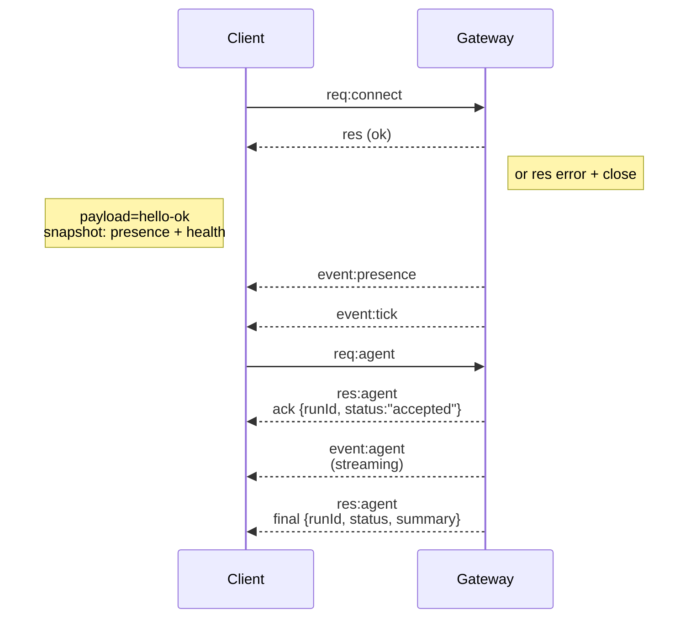

---
read_when:
    - Travailler sur le protocole Gateway, les clients ou les transports
summary: Architecture du Gateway WebSocket, composants et flux client
title: Architecture du Gateway
x-i18n:
    generated_at: "2026-05-06T07:17:41Z"
    model: gpt-5.5
    provider: openai
    source_hash: 433489081bfe07691b211f5076ec45ce0ed3fd043eb86128f73121f2cab71cd3
    source_path: concepts/architecture.md
    workflow: 16
---

## Présentation

- Un unique **Gateway** longue durée possède toutes les surfaces de messagerie (WhatsApp via
  Baileys, Telegram via grammY, Slack, Discord, Signal, iMessage, WebChat).
- Les clients du plan de contrôle (application macOS, CLI, interface utilisateur web, automatisations) se connectent au
  Gateway via **WebSocket** sur l’hôte de liaison configuré (par défaut
  `127.0.0.1:18789`).
- Les **Nodes** (macOS/iOS/Android/sans interface) se connectent aussi via **WebSocket**, mais
  déclarent `role: node` avec des capacités/commandes explicites.
- Un Gateway par hôte ; c’est le seul endroit qui ouvre une session WhatsApp.
- L’**hôte de canevas** est servi par le serveur HTTP du Gateway sous :
  - `/__openclaw__/canvas/` (HTML/CSS/JS modifiables par l’agent)
  - `/__openclaw__/a2ui/` (hôte A2UI)
    Il utilise le même port que le Gateway (par défaut `18789`).

## Composants et flux

### Gateway (démon)

- Maintient les connexions aux fournisseurs.
- Expose une API WS typée (requêtes, réponses, événements poussés par le serveur).
- Valide les trames entrantes avec un schéma JSON.
- Émet des événements comme `agent`, `chat`, `presence`, `health`, `heartbeat`, `cron`.

### Clients (application Mac / CLI / administration web)

- Une connexion WS par client.
- Envoient des requêtes (`health`, `status`, `send`, `agent`, `system-presence`).
- S’abonnent aux événements (`tick`, `agent`, `presence`, `shutdown`).

### Nodes (macOS / iOS / Android / sans interface)

- Se connectent au **même serveur WS** avec `role: node`.
- Fournissent une identité d’appareil dans `connect` ; l’appairage est **basé sur l’appareil** (rôle `node`) et
  l’approbation réside dans le stockage d’appairage des appareils.
- Exposent des commandes comme `canvas.*`, `camera.*`, `screen.record`, `location.get`.

Détails du protocole :

- [Protocole du Gateway](/fr/gateway/protocol)

### WebChat

- Interface utilisateur statique qui utilise l’API WS du Gateway pour l’historique de discussion et les envois.
- Dans les configurations distantes, se connecte via le même tunnel SSH/Tailscale que les autres
  clients.

## Cycle de vie de connexion (client unique)



## Protocole filaire (résumé)

- Transport : WebSocket, trames texte avec charges utiles JSON.
- La première trame **doit** être `connect`.
- Après la négociation :
  - Requêtes : `{type:"req", id, method, params}` → `{type:"res", id, ok, payload|error}`
  - Événements : `{type:"event", event, payload, seq?, stateVersion?}`
- `hello-ok.features.methods` / `events` sont des métadonnées de découverte, pas un
  vidage généré de toutes les routes d’assistance appelables.
- L’authentification par secret partagé utilise `connect.params.auth.token` ou
  `connect.params.auth.password`, selon le mode d’authentification du Gateway configuré.
- Les modes portant une identité comme Tailscale Serve
  (`gateway.auth.allowTailscale: true`) ou un
  `gateway.auth.mode: "trusted-proxy"` sans local loopback satisfont l’authentification à partir des en-têtes de requête
  au lieu de `connect.params.auth.*`.
- L’entrée privée `gateway.auth.mode: "none"` désactive entièrement l’authentification par secret partagé ;
  gardez ce mode désactivé sur une entrée publique/non fiable.
- Les clés d’idempotence sont requises pour les méthodes à effet de bord (`send`, `agent`) afin de
  permettre une nouvelle tentative en toute sécurité ; le serveur conserve un cache de déduplication à courte durée de vie.
- Les Nodes doivent inclure `role: "node"` ainsi que les capacités/commandes/permissions dans `connect`.

## Appairage + confiance locale

- Tous les clients WS (opérateurs + Nodes) incluent une **identité d’appareil** sur `connect`.
- Les nouveaux ID d’appareil nécessitent une approbation d’appairage ; le Gateway émet un **jeton d’appareil**
  pour les connexions suivantes.
- Les connexions directes en local loopback peuvent être approuvées automatiquement pour préserver une expérience
  fluide sur le même hôte.
- OpenClaw dispose aussi d’un chemin étroit d’auto-connexion local au backend/conteneur pour
  les flux d’assistance fiables à secret partagé.
- Les connexions tailnet et LAN, y compris les liaisons tailnet sur le même hôte, nécessitent toujours
  une approbation explicite de l’appairage.
- Toutes les connexions doivent signer le nonce `connect.challenge`.
- La charge utile de signature `v3` lie aussi `platform` + `deviceFamily` ; le gateway
  épingle les métadonnées appairées à la reconnexion et exige une réparation de l’appairage en cas de changements de métadonnées.
- Les connexions **non locales** nécessitent toujours une approbation explicite.
- L’authentification du Gateway (`gateway.auth.*`) s’applique toujours à **toutes** les connexions, locales ou
  distantes.

Détails : [Protocole du Gateway](/fr/gateway/protocol), [Appairage](/fr/channels/pairing),
[Sécurité](/fr/gateway/security).

## Typage du protocole et génération de code

- Les schémas TypeBox définissent le protocole.
- Le schéma JSON est généré à partir de ces schémas.
- Les modèles Swift sont générés à partir du schéma JSON.

## Accès distant

- Préféré : Tailscale ou VPN.
- Alternative : tunnel SSH

  ```bash
  ssh -N -L 18789:127.0.0.1:18789 user@host
  ```

- La même négociation + le même jeton d’authentification s’appliquent via le tunnel.
- TLS + l’épinglage facultatif peuvent être activés pour WS dans les configurations distantes.

## Instantané des opérations

- Démarrage : `openclaw gateway` (premier plan, journaux vers stdout).
- Santé : `health` via WS (également inclus dans `hello-ok`).
- Supervision : launchd/systemd pour le redémarrage automatique.

## Invariants

- Exactement un Gateway contrôle une seule session Baileys par hôte.
- La négociation est obligatoire ; toute première trame non JSON ou qui n’est pas `connect` entraîne une fermeture ferme.
- Les événements ne sont pas rejoués ; les clients doivent actualiser en cas d’interruptions.

## Liens connexes

- [Boucle d’agent](/fr/concepts/agent-loop) — cycle détaillé d’exécution d’agent
- [Protocole du Gateway](/fr/gateway/protocol) — contrat du protocole WebSocket
- [File d’attente](/fr/concepts/queue) — file d’attente des commandes et concurrence
- [Sécurité](/fr/gateway/security) — modèle de confiance et renforcement
