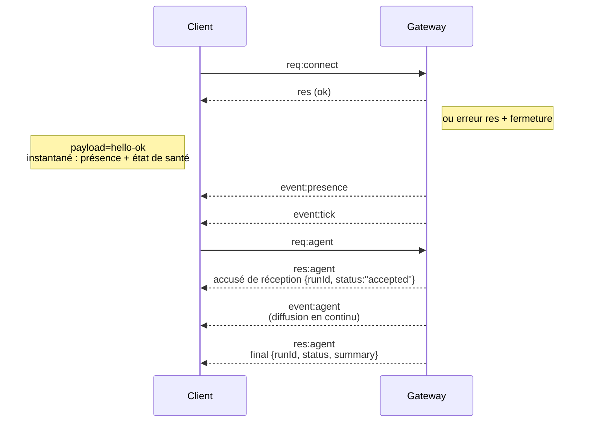

---
read_when:
    - Travail sur le protocole du Gateway, les clients ou les transports
summary: Architecture du Gateway WebSocket, composants et flux clients
title: Architecture du Gateway
x-i18n:
    generated_at: "2026-07-12T15:11:49Z"
    model: gpt-5.6
    postprocess_version: locale-links-v1
    prompt_version: 15
    provider: openai
    source_hash: f8054bd87f738b957c24f8d6965d55365de2293d44902530a9ba778afa597cc7
    source_path: concepts/architecture.md
    workflow: 16
---

## Vue d’ensemble

- Un unique **Gateway** à longue durée de vie gère toutes les interfaces de messagerie (WhatsApp via
  Baileys, Telegram via grammY, Slack, Discord, Signal, iMessage, WebChat).
- Les clients du plan de contrôle (application macOS, CLI, interface web, automatisations) se connectent au
  Gateway via **WebSocket** sur l’hôte d’écoute configuré (par défaut
  `127.0.0.1:18789`).
- Les **Nodes** (macOS/iOS/Android/sans interface graphique) se connectent également via **WebSocket**, mais
  déclarent `role: node` avec des capacités et commandes explicites.
- Un Gateway par hôte ; c’est le seul composant qui ouvre une session WhatsApp.
- L’**hôte canvas** est servi par le serveur HTTP du Gateway sous :
  - `/__openclaw__/canvas/` (HTML/CSS/JS modifiables par l’agent)
  - `/__openclaw__/a2ui/` (hôte A2UI)

  Il utilise le même port que le Gateway (par défaut `18789`).

## Composants et flux

### Gateway (démon)

- Maintient les connexions aux fournisseurs.
- Expose une API WS typée (requêtes, réponses, événements envoyés par le serveur).
- Valide les trames entrantes par rapport au schéma JSON.
- Émet des événements tels que `agent`, `chat`, `presence`, `health`, `heartbeat`, `cron`.

### Clients (application Mac / CLI / administration web)

- Une connexion WS par client.
- Envoient des requêtes (`health`, `status`, `send`, `agent`, `system-presence`).
- S’abonnent aux événements (`tick`, `agent`, `presence`, `shutdown`).

### Nodes (macOS / iOS / Android / sans interface graphique)

- Se connectent au **même serveur WS** avec `role: node`.
- Fournissent une identité d’appareil dans `connect` ; l’appairage est **basé sur l’appareil** (rôle `node`) et
  l’approbation est stockée dans le magasin d’appairage des appareils.
- Exposent des commandes telles que `canvas.*`, `camera.*`, `screen.record`, `location.get`.

Détails du protocole : [protocole du Gateway](/fr/gateway/protocol)

### WebChat

- Interface statique qui utilise l’API WS du Gateway pour l’historique des discussions et l’envoi de messages.
- Dans les configurations distantes, se connecte via le même tunnel SSH/Tailscale que les autres
  clients.

## Cycle de vie de la connexion (client unique)



## Protocole filaire (résumé)

- Transport : WebSocket, trames de texte avec charges utiles JSON.
- La première trame **doit** être `connect`.
- Après l’établissement de la connexion :
  - Requêtes : `{type:"req", id, method, params}` → `{type:"res", id, ok, payload|error}`
  - Événements : `{type:"event", event, payload, seq?, stateVersion?}`
- `hello-ok.features.methods` / `events` sont des métadonnées de découverte, et non une
  liste générée de toutes les routes d’assistance appelables.
- L’authentification par secret partagé utilise `connect.params.auth.token` ou
  `connect.params.auth.password`, selon le mode d’authentification du Gateway configuré.
- Les modes reposant sur l’identité, tels que Tailscale Serve
  (`gateway.auth.allowTailscale: true`) ou
  `gateway.auth.mode: "trusted-proxy"` hors boucle locale, effectuent l’authentification à partir des en-têtes de requête
  au lieu de `connect.params.auth.*`.
- Le mode d’entrée privée `gateway.auth.mode: "none"` désactive entièrement
  l’authentification par secret partagé ; n’utilisez pas ce mode pour une entrée publique ou non approuvée.
- Des clés d’idempotence sont requises pour les méthodes produisant des effets de bord (`send`, `agent`) afin de
  permettre des nouvelles tentatives sûres ; le serveur conserve un cache de déduplication de courte durée.
- Les Nodes doivent inclure `role: "node"` ainsi que les capacités/commandes/autorisations dans `connect`.

## Association et confiance locale

- Tous les clients WS (opérateurs et Nodes) incluent une **identité d’appareil** dans `connect`.
- Les nouveaux identifiants d’appareil nécessitent une approbation d’association ; le Gateway émet un **jeton d’appareil**
  pour les connexions suivantes.
- Les connexions directes à la boucle locale peuvent être approuvées automatiquement afin de préserver une expérience fluide
  sur le même hôte.
- OpenClaw dispose également d’un chemin restreint d’auto-connexion locale au backend/conteneur pour
  les flux d’assistance approuvés utilisant un secret partagé.
- Les connexions au tailnet et au réseau local, y compris les liaisons tailnet sur le même hôte, nécessitent toujours
  une approbation d’association explicite.
- Toutes les connexions doivent signer le nonce `connect.challenge`. La charge utile de signature `v3`
  lie également `platform` et `deviceFamily` ; le Gateway verrouille les métadonnées associées lors de la
  reconnexion et exige une nouvelle association de réparation en cas de modification des métadonnées.
- Les connexions **non locales** nécessitent toujours une approbation explicite.
- L’authentification du Gateway (`gateway.auth.*`) s’applique toujours à **toutes** les connexions, locales ou
  distantes.

Détails : [Protocole du Gateway](/fr/gateway/protocol), [Association](/fr/channels/pairing),
[Sécurité](/fr/gateway/security).

## Typage du protocole et génération de code

- Les schémas TypeBox définissent le protocole.
- Le schéma JSON est généré à partir de ces schémas.
- Les modèles Swift sont générés à partir du schéma JSON.

## Accès distant

- Recommandé : Tailscale ou VPN.
- Autre possibilité : tunnel SSH

  ```bash
  ssh -N -L 18789:127.0.0.1:18789 user@gateway-host
  ```

- La même négociation et le même jeton d’authentification s’appliquent via le tunnel.
- TLS et l’épinglage facultatif peuvent être activés pour WS dans les configurations distantes.

## Aperçu des opérations

- Démarrage : `openclaw gateway` (au premier plan, journaux sur stdout).
- État de santé : `health` via WS (également inclus dans `hello-ok`).
- Supervision : launchd/systemd pour le redémarrage automatique.

## Invariants

- Un seul Gateway contrôle exactement une session Baileys par hôte.
- La négociation est obligatoire ; toute première trame non JSON ou autre qu’une connexion entraîne une fermeture immédiate.
- Les événements ne sont pas rejoués ; les clients doivent actualiser les données en cas d’interruption.

## Voir aussi

- [Boucle de l’agent](/fr/concepts/agent-loop) — cycle détaillé d’exécution de l’agent
- [Protocole du Gateway](/fr/gateway/protocol) — contrat du protocole WebSocket
- [File d’attente](/fr/concepts/queue) — file d’attente des commandes et concurrence
- [Sécurité](/fr/gateway/security) — modèle de confiance et renforcement
