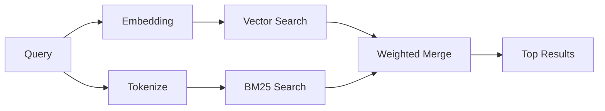

---
read_when:
    - Vous voulez comprendre le fonctionnement de memory_search
    - Vous voulez choisir un fournisseur d’embeddings
    - Vous voulez ajuster la qualité de la recherche
summary: Comment la recherche en mémoire trouve des notes pertinentes à l’aide d’embeddings et de la récupération hybride
title: Recherche dans la mémoire
x-i18n:
    generated_at: "2026-06-28T22:33:30Z"
    model: gpt-5.5
    postprocess_version: locale-links-v1
    provider: openai
    source_hash: 32ffb9d996851566eb92b7812c5425f545ecbb5387a0a445686df35a6c8ae143
    source_path: concepts/memory-search.md
    workflow: 16
---

`memory_search` trouve les notes pertinentes dans vos fichiers de mémoire, même lorsque la
formulation diffère du texte original. Il fonctionne en indexant la mémoire en petits
fragments et en les recherchant à l’aide d’embeddings, de mots-clés, ou des deux.

## Démarrage rapide

La recherche en mémoire utilise les embeddings OpenAI par défaut. Pour utiliser un autre
backend d’embedding, définissez explicitement un fournisseur :

```json5
{
  agents: {
    defaults: {
      memorySearch: {
        provider: "openai", // or "gemini", "local", "ollama", "openai-compatible", etc.
      },
    },
  },
}
```

Pour les configurations à plusieurs endpoints avec des fournisseurs propres à la mémoire, `provider` peut aussi
être une entrée personnalisée `models.providers.<id>`, comme `ollama-5080`, lorsque ce
fournisseur définit `api: "ollama"` ou un autre propriétaire d’adaptateur d’embedding de mémoire.

Pour les embeddings locaux sans clé d’API, installez
`@openclaw/llama-cpp-provider` et définissez `provider: "local"`. Les checkouts source
peuvent encore nécessiter l’approbation de la compilation native : `pnpm approve-builds` puis
`pnpm rebuild node-llama-cpp`.

Certains endpoints d’embedding compatibles OpenAI nécessitent des libellés asymétriques comme
`input_type: "query"` pour les recherches et `input_type: "document"` ou `"passage"`
pour les fragments indexés. Configurez-les avec `memorySearch.queryInputType` et
`memorySearch.documentInputType` ; consultez la [référence de configuration de la mémoire](/fr/reference/memory-config#provider-specific-config).

## Fournisseurs pris en charge

| Fournisseur       | ID                  | Clé d’API requise | Notes                                  |
| ----------------- | ------------------- | ----------------- | -------------------------------------- |
| Bedrock           | `bedrock`           | Non               | Utilise la chaîne d’identifiants AWS   |
| DeepInfra         | `deepinfra`         | Oui               | Par défaut : `BAAI/bge-m3`             |
| Gemini            | `gemini`            | Oui               | Prend en charge l’indexation image/audio |
| GitHub Copilot    | `github-copilot`    | Non               | Utilise l’abonnement Copilot           |
| Local             | `local`             | Non               | Modèle GGUF, téléchargement d’environ 0,6 Go |
| Mistral           | `mistral`           | Oui               |                                        |
| Ollama            | `ollama`            | Non               | Local/auto-hébergé                     |
| OpenAI            | `openai`            | Oui               | Par défaut                             |
| OpenAI-compatible | `openai-compatible` | Généralement      | `/v1/embeddings` générique             |
| Voyage            | `voyage`            | Oui               |                                        |

## Fonctionnement de la recherche

OpenClaw exécute deux chemins de récupération en parallèle et fusionne les résultats :



- **La recherche vectorielle** trouve les notes ayant un sens similaire ("gateway host" correspond à
  "the machine running OpenClaw").
- **La recherche par mots-clés BM25** trouve les correspondances exactes (ID, chaînes d’erreur, clés de
  configuration).

Si un seul chemin est disponible, l’autre s’exécute seul. Le mode volontairement limité à FTS
(`provider: "none"`) et la sélection automatique/par défaut du fournisseur peuvent toujours utiliser
le classement lexical lorsque les embeddings ne sont pas disponibles.

Les fournisseurs d’embeddings explicites non locaux sont différents. Si vous définissez
`memorySearch.provider` sur un fournisseur concret adossé à un service distant et que ce fournisseur
n’est pas disponible à l’exécution, `memory_search` signale la mémoire comme indisponible au lieu
d’utiliser silencieusement des résultats limités à FTS. Cela rend visible un fournisseur sémantique
configuré mais cassé. Définissez `provider: "none"` pour un rappel volontairement limité à FTS, ou corrigez
la configuration du fournisseur/de l’authentification pour restaurer le classement sémantique.

## Améliorer la qualité de la recherche

Deux fonctionnalités facultatives sont utiles lorsque vous disposez d’un historique de notes volumineux :

### Décroissance temporelle

Les anciennes notes perdent progressivement du poids dans le classement afin que les informations récentes apparaissent en premier.
Avec la demi-vie par défaut de 30 jours, une note du mois dernier obtient 50 % de
son poids original. Les fichiers permanents comme `MEMORY.md` ne subissent jamais de décroissance.

<Tip>
Activez la décroissance temporelle si votre agent dispose de plusieurs mois de notes quotidiennes et que des
informations obsolètes continuent de dépasser le contexte récent dans le classement.
</Tip>

### MMR (diversité)

Réduit les résultats redondants. Si cinq notes mentionnent toutes la même configuration de routeur, MMR
veille à ce que les meilleurs résultats couvrent des sujets différents au lieu de se répéter.

<Tip>
Activez MMR si `memory_search` renvoie sans cesse des extraits presque identiques provenant
de notes quotidiennes différentes.
</Tip>

### Activer les deux

```json5
{
  agents: {
    defaults: {
      memorySearch: {
        query: {
          hybrid: {
            mmr: { enabled: true },
            temporalDecay: { enabled: true },
          },
        },
      },
    },
  },
}
```

## Mémoire multimodale

Avec Gemini Embedding 2, vous pouvez indexer des images et des fichiers audio en plus
du Markdown. Les requêtes de recherche restent textuelles, mais elles correspondent au contenu visuel et audio.
Consultez la [référence de configuration de la mémoire](/fr/reference/memory-config) pour
la configuration.

## Recherche dans la mémoire de session

Vous pouvez éventuellement indexer les transcriptions de session afin que `memory_search` puisse rappeler
des conversations antérieures. C’est une option explicite via
`memorySearch.experimental.sessionMemory` et `sources: ["sessions"]` ; la liste de sources par défaut
se limite à la mémoire. L’indicateur expérimental active l’indexation des transcriptions de session,
tandis que `sources` contrôle si les fragments de session sont recherchés.

Les résultats de session respectent `tools.sessions.visibility` : le paramètre par défaut `tree`
n’expose que la session actuelle et les sessions qu’elle a lancées. Pour rappeler une session sans lien
répartie par le Gateway pour le même agent depuis une session de DM distincte, élargissez volontairement
la visibilité à `agent`.

Avec QMD, définissez aussi `memory.qmd.sessions.enabled: true` afin que les transcriptions soient
exportées dans une collection QMD. Consultez la
[référence de configuration](/fr/reference/memory-config) pour plus de détails.

## Dépannage

**Aucun résultat ?** Exécutez `openclaw memory status` pour vérifier l’index. S’il est vide, exécutez
`openclaw memory index --force`.

**Uniquement des correspondances par mots-clés ?** Votre fournisseur d’embeddings n’est peut-être pas configuré. Vérifiez
`openclaw memory status --deep`.

**Les embeddings locaux expirent ?** `ollama`, `lmstudio` et `local` utilisent par défaut un délai d’attente
plus long pour les lots en ligne. Si l’hôte est simplement lent, définissez
`agents.defaults.memorySearch.sync.embeddingBatchTimeoutSeconds` et relancez
`openclaw memory index --force`.

**Texte CJK introuvable ?** Reconstruisez l’index FTS avec
`openclaw memory index --force`.

## Pour aller plus loin

- [Active Memory](/fr/concepts/active-memory) -- mémoire de sous-agent pour les sessions de chat interactives
- [Mémoire](/fr/concepts/memory) -- disposition des fichiers, backends, outils
- [Référence de configuration de la mémoire](/fr/reference/memory-config) -- tous les paramètres de configuration

## Associé

- [Vue d’ensemble de la mémoire](/fr/concepts/memory)
- [Active Memory](/fr/concepts/active-memory)
- [Moteur de mémoire intégré](/fr/concepts/memory-builtin)
