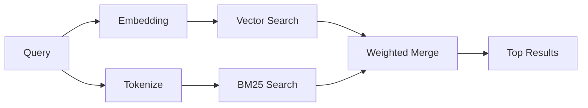

---
read_when:
    - Vous souhaitez comprendre le fonctionnement de memory_search
    - Vous souhaitez choisir un fournisseur d’embeddings
    - Vous souhaitez ajuster la qualité de recherche
summary: Comment la recherche memory trouve les notes pertinentes à l’aide des embeddings et de la récupération hybride
title: Recherche memory
x-i18n:
    generated_at: "2026-04-25T13:45:20Z"
    model: gpt-5.4
    provider: openai
    source_hash: 5cc6bbaf7b0a755bbe44d3b1b06eed7f437ebdc41a81c48cca64bd08bbc546b7
    source_path: concepts/memory-search.md
    workflow: 15
---

`memory_search` trouve les notes pertinentes à partir de vos fichiers memory, même lorsque
la formulation diffère du texte d’origine. Il fonctionne en indexant la memory en petits
segments et en les recherchant à l’aide d’embeddings, de mots-clés ou des deux.

## Démarrage rapide

Si vous avez un abonnement GitHub Copilot, ou une clé API OpenAI, Gemini, Voyage ou Mistral configurée, la recherche memory fonctionne automatiquement. Pour définir explicitement un fournisseur :

```json5
{
  agents: {
    defaults: {
      memorySearch: {
        provider: "openai", // ou "gemini", "local", "ollama", etc.
      },
    },
  },
}
```

Pour des embeddings locaux sans clé API, installez le package runtime optionnel `node-llama-cpp`
à côté d’OpenClaw et utilisez `provider: "local"`.

## Fournisseurs pris en charge

| Provider       | ID               | Needs API key | Notes                                                |
| -------------- | ---------------- | ------------- | ---------------------------------------------------- |
| Bedrock        | `bedrock`        | Non           | Détection automatique lorsque la chaîne d’identifiants AWS est résolue |
| Gemini         | `gemini`         | Oui           | Prend en charge l’indexation d’images/audio                        |
| GitHub Copilot | `github-copilot` | Non           | Détection automatique, utilise l’abonnement Copilot             |
| Local          | `local`          | Non           | Modèle GGUF, téléchargement d’environ 0,6 Go                         |
| Mistral        | `mistral`        | Oui           | Détection automatique                                        |
| Ollama         | `ollama`         | Non           | Local, doit être défini explicitement                           |
| OpenAI         | `openai`         | Oui           | Détection automatique, rapide                                  |
| Voyage         | `voyage`         | Oui           | Détection automatique                                        |

## Fonctionnement de la recherche

OpenClaw exécute deux chemins de récupération en parallèle et fusionne les résultats :



- **La recherche vectorielle** trouve les notes au sens similaire ("gateway host" correspond à
  "la machine qui exécute OpenClaw").
- **La recherche par mots-clés BM25** trouve les correspondances exactes (ID, chaînes d’erreur, clés
  de configuration).

Si un seul chemin est disponible (pas d’embeddings ou pas de FTS), l’autre s’exécute seul.

Lorsque les embeddings ne sont pas disponibles, OpenClaw utilise toujours un classement lexical sur les résultats FTS au lieu de revenir uniquement à un ordre brut de correspondance exacte. Ce mode dégradé favorise les segments présentant une meilleure couverture des termes de la requête et des chemins de fichiers pertinents, ce qui maintient un rappel utile même sans `sqlite-vec` ni fournisseur d’embeddings.

## Améliorer la qualité de recherche

Deux fonctionnalités optionnelles aident lorsque vous avez un long historique de notes :

### Décroissance temporelle

Les anciennes notes perdent progressivement du poids dans le classement afin que les informations récentes remontent en premier.
Avec la demi-vie par défaut de 30 jours, une note du mois dernier obtient un score de 50 % de
son poids d’origine. Les fichiers persistants comme `MEMORY.md` ne subissent jamais de décroissance.

<Tip>
Activez la décroissance temporelle si votre agent possède des mois de notes quotidiennes et que des
informations obsolètes dépassent constamment le contexte récent.
</Tip>

### MMR (diversité)

Réduit les résultats redondants. Si cinq notes mentionnent toutes la même configuration de routeur, MMR
garantit que les meilleurs résultats couvrent différents sujets au lieu de se répéter.

<Tip>
Activez MMR si `memory_search` renvoie sans cesse des extraits quasi dupliqués
provenant de différentes notes quotidiennes.
</Tip>

### Activer les deux

```json5
{
  agents: {
    defaults: {
      memorySearch: {
        query: {
          hybrid: {
            mmr: { enabled: true },
            temporalDecay: { enabled: true },
          },
        },
      },
    },
  },
}
```

## Memory multimodale

Avec Gemini Embedding 2, vous pouvez indexer des images et des fichiers audio en plus de
Markdown. Les requêtes de recherche restent du texte, mais elles correspondent à du contenu visuel et audio. Consultez la [Référence de configuration memory](/fr/reference/memory-config) pour la
configuration.

## Recherche memory de session

Vous pouvez facultativement indexer les transcripts de session afin que `memory_search` puisse rappeler
des conversations antérieures. Cette fonctionnalité est activable explicitement via
`memorySearch.experimental.sessionMemory`. Consultez la
[référence de configuration](/fr/reference/memory-config) pour plus de détails.

## Dépannage

**Aucun résultat ?** Exécutez `openclaw memory status` pour vérifier l’index. S’il est vide, exécutez
`openclaw memory index --force`.

**Uniquement des correspondances par mots-clés ?** Votre fournisseur d’embeddings n’est peut-être pas configuré. Vérifiez
`openclaw memory status --deep`.

**Texte CJK introuvable ?** Reconstruisez l’index FTS avec
`openclaw memory index --force`.

## Pour aller plus loin

- [Active Memory](/fr/concepts/active-memory) -- memory de sous-agent pour les sessions de chat interactives
- [Memory](/fr/concepts/memory) -- structure des fichiers, backends, outils
- [Référence de configuration memory](/fr/reference/memory-config) -- tous les paramètres de configuration

## Liens associés

- [Aperçu de memory](/fr/concepts/memory)
- [Active Memory](/fr/concepts/active-memory)
- [Moteur memory intégré](/fr/concepts/memory-builtin)
