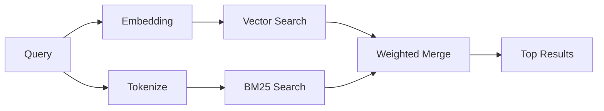

---
read_when:
    - Vous voulez comprendre le fonctionnement de memory_search
    - Vous souhaitez choisir un fournisseur d’embeddings
    - Vous voulez optimiser la qualité de la recherche
summary: Comment la recherche dans la mémoire trouve des notes pertinentes à l’aide de représentations vectorielles et de la récupération hybride
title: Recherche dans la mémoire
x-i18n:
    generated_at: "2026-05-02T07:04:18Z"
    model: gpt-5.5
    provider: openai
    source_hash: 2a71fb0809d5c70689e8046f854e4b4b4e79f45769ac2964e40a762ebb4e91a8
    source_path: concepts/memory-search.md
    workflow: 16
---

`memory_search` recherche les notes pertinentes dans vos fichiers de mémoire, même lorsque la
formulation diffère du texte d’origine. Il fonctionne en indexant la mémoire en petits
fragments et en les recherchant avec des embeddings, des mots-clés, ou les deux.

## Démarrage rapide

Si vous avez configuré un abonnement GitHub Copilot, ou une clé API OpenAI,
Gemini, Voyage ou Mistral, la recherche en mémoire fonctionne automatiquement.
Pour définir explicitement un fournisseur :

```json5
{
  agents: {
    defaults: {
      memorySearch: {
        provider: "openai", // or "gemini", "local", "ollama", etc.
      },
    },
  },
}
```

Pour les configurations à plusieurs points de terminaison, `provider` peut aussi
être une entrée personnalisée `models.providers.<id>`, telle que `ollama-5080`,
lorsque ce fournisseur définit `api: "ollama"` ou un autre propriétaire
d’adaptateur d’embedding.

Pour les embeddings locaux sans clé API, définissez `provider: "local"`. Les
checkouts source peuvent tout de même nécessiter l’approbation de compilation
native : `pnpm approve-builds` puis `pnpm rebuild node-llama-cpp`.

Certains points de terminaison d’embedding compatibles OpenAI nécessitent des
libellés asymétriques comme `input_type: "query"` pour les recherches et
`input_type: "document"` ou `"passage"` pour les fragments indexés. Configurez-les
avec `memorySearch.queryInputType` et `memorySearch.documentInputType` ; consultez
la [référence de configuration de la mémoire](/fr/reference/memory-config#provider-specific-config).

## Fournisseurs pris en charge

| Fournisseur    | ID               | Nécessite une clé API | Notes                                                            |
| -------------- | ---------------- | --------------------- | ---------------------------------------------------------------- |
| Bedrock        | `bedrock`        | Non                   | Détecté automatiquement lorsque la chaîne d’identifiants AWS aboutit |
| Gemini         | `gemini`         | Oui                   | Prend en charge l’indexation d’images et d’audio                 |
| GitHub Copilot | `github-copilot` | Non                   | Détecté automatiquement, utilise l’abonnement Copilot            |
| Local          | `local`          | Non                   | Modèle GGUF, téléchargement d’environ 0,6 Go                     |
| Mistral        | `mistral`        | Oui                   | Détecté automatiquement                                          |
| Ollama         | `ollama`         | Non                   | Local, doit être défini explicitement                            |
| OpenAI         | `openai`         | Oui                   | Détecté automatiquement, rapide                                  |
| Voyage         | `voyage`         | Oui                   | Détecté automatiquement                                          |

## Fonctionnement de la recherche

OpenClaw exécute deux chemins de récupération en parallèle et fusionne les résultats :



- **Recherche vectorielle** trouve les notes au sens similaire ("gateway host" correspond à
  "the machine running OpenClaw").
- **Recherche par mots-clés BM25** trouve les correspondances exactes (ID, chaînes d’erreur,
  clés de configuration).

Si un seul chemin est disponible (pas d’embeddings ou pas de FTS), l’autre
s’exécute seul.

Lorsque les embeddings ne sont pas disponibles, OpenClaw utilise tout de même un
classement lexical sur les résultats FTS au lieu de revenir uniquement à un ordre
brut de correspondances exactes. Ce mode dégradé favorise les fragments avec une
meilleure couverture des termes de la requête et des chemins de fichiers
pertinents, ce qui maintient un rappel utile même sans `sqlite-vec` ni
fournisseur d’embedding.

## Améliorer la qualité de recherche

Deux fonctionnalités facultatives aident lorsque vous avez un long historique de notes :

### Décroissance temporelle

Les anciennes notes perdent progressivement du poids dans le classement afin que
les informations récentes apparaissent d’abord. Avec la demi-vie par défaut de
30 jours, une note du mois dernier obtient 50 % de son poids initial. Les fichiers
pérennes comme `MEMORY.md` ne subissent jamais de décroissance.

<Tip>
Activez la décroissance temporelle si votre agent dispose de plusieurs mois de
notes quotidiennes et que les informations obsolètes continuent de dépasser le
contexte récent dans le classement.
</Tip>

### MMR (diversité)

Réduit les résultats redondants. Si cinq notes mentionnent toutes la même
configuration de routeur, MMR garantit que les meilleurs résultats couvrent des
sujets différents au lieu de se répéter.

<Tip>
Activez MMR si `memory_search` renvoie sans cesse des extraits presque
identiques provenant de différentes notes quotidiennes.
</Tip>

### Activer les deux

```json5
{
  agents: {
    defaults: {
      memorySearch: {
        query: {
          hybrid: {
            mmr: { enabled: true },
            temporalDecay: { enabled: true },
          },
        },
      },
    },
  },
}
```

## Mémoire multimodale

Avec Gemini Embedding 2, vous pouvez indexer des images et des fichiers audio
avec Markdown. Les requêtes de recherche restent textuelles, mais elles
correspondent au contenu visuel et audio. Consultez la [référence de configuration de la mémoire](/fr/reference/memory-config)
pour la configuration.

## Recherche dans la mémoire de session

Vous pouvez éventuellement indexer les transcriptions de session afin que
`memory_search` puisse retrouver des conversations antérieures. Cette option
s’active explicitement via `memorySearch.experimental.sessionMemory`. Consultez la
[référence de configuration](/fr/reference/memory-config) pour plus de détails.

## Dépannage

**Aucun résultat ?** Exécutez `openclaw memory status` pour vérifier l’index. S’il
est vide, exécutez `openclaw memory index --force`.

**Uniquement des correspondances par mots-clés ?** Votre fournisseur d’embedding
n’est peut-être pas configuré. Vérifiez avec `openclaw memory status --deep`.

**Les embeddings locaux expirent ?** `ollama`, `lmstudio` et `local` utilisent
par défaut un délai d’attente plus long pour les lots inline. Si l’hôte est
simplement lent, définissez
`agents.defaults.memorySearch.sync.embeddingBatchTimeoutSeconds` et relancez
`openclaw memory index --force`.

**Texte CJK introuvable ?** Reconstruisez l’index FTS avec
`openclaw memory index --force`.

## Pour aller plus loin

- [Active Memory](/fr/concepts/active-memory) -- mémoire de sous-agent pour les sessions de chat interactives
- [Mémoire](/fr/concepts/memory) -- organisation des fichiers, backends, outils
- [Référence de configuration de la mémoire](/fr/reference/memory-config) -- tous les réglages de configuration

## Associés

- [Vue d’ensemble de la mémoire](/fr/concepts/memory)
- [Active Memory](/fr/concepts/active-memory)
- [Moteur de mémoire intégré](/fr/concepts/memory-builtin)
