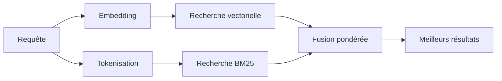

---
read_when:
    - Vous souhaitez comprendre comment fonctionne memory_search
    - Vous souhaitez choisir un fournisseur d’embeddings
    - Vous souhaitez affiner la qualité de la recherche
summary: Comment la recherche en mémoire trouve des notes pertinentes à l’aide d’embeddings et d’une recherche hybride
title: Recherche en mémoire
x-i18n:
    generated_at: "2026-07-12T15:20:13Z"
    model: gpt-5.6
    postprocess_version: locale-links-v1
    prompt_version: 15
    provider: openai
    source_hash: 2ae0830843fba28c24159d85425240051fb8caf086cd0563d3091890045dcfad
    source_path: concepts/memory-search.md
    workflow: 16
---

`memory_search` trouve les notes pertinentes dans vos fichiers de mémoire, même lorsque leur
formulation diffère du texte d’origine. Il découpe la mémoire en petits fragments et
les recherche à l’aide d’embeddings, de mots-clés ou des deux.

## Démarrage rapide

OpenClaw utilise les embeddings OpenAI par défaut. Pour utiliser un autre fournisseur, définissez-le
explicitement :

```json5
{
  agents: {
    defaults: {
      memorySearch: {
        provider: "openai", // ou "gemini", "voyage", "mistral", "bedrock", "local", "ollama", "lmstudio", "github-copilot", "openai-compatible"
      },
    },
  },
}
```

`provider` peut également référencer une entrée personnalisée `models.providers.<id>` (par
exemple `ollama-5080`), à condition que cette entrée définisse `api` sur `"ollama"` ou
sur l’identifiant d’un autre fournisseur disposant d’un adaptateur d’embeddings de mémoire.

Pour utiliser des embeddings locaux sans clé d’API, installez le Plugin fournisseur llama.cpp
officiel et définissez `provider: "local"` :

```bash
openclaw plugins install @openclaw/llama-cpp-provider
```

Les extractions du code source nécessitent toujours l’approbation de la compilation native : `pnpm approve-builds`, puis
`pnpm rebuild node-llama-cpp`.

Certains points de terminaison d’embeddings compatibles avec OpenAI nécessitent des libellés `input_type`
asymétriques, tels que `"query"` pour les recherches et `"document"`/`"passage"` pour les fragments
indexés. Définissez-les avec `queryInputType` et `documentInputType` ; consultez la
[référence de configuration de la mémoire](/fr/reference/memory-config#provider-specific-config).

## Fournisseurs pris en charge

| Fournisseur       | ID                  | Clé d’API requise | Remarques                                  |
| ----------------- | ------------------- | ----------------- | ------------------------------------------ |
| Bedrock           | `bedrock`           | Non               | Utilise la chaîne d’identifiants AWS       |
| DeepInfra         | `deepinfra`         | Oui               | Modèle par défaut `BAAI/bge-m3`            |
| Gemini            | `gemini`            | Oui               | Prend en charge l’indexation d’images et d’audio |
| GitHub Copilot    | `github-copilot`    | Non               | Utilise votre abonnement Copilot           |
| Local             | `local`             | Non               | Modèle GGUF, téléchargement automatique d’environ 0.6 GB |
| LM Studio         | `lmstudio`          | Non               | Serveur local/auto-hébergé                  |
| Mistral           | `mistral`           | Oui               |                                            |
| Ollama            | `ollama`            | Non               | Serveur local/auto-hébergé                  |
| OpenAI            | `openai`            | Oui               | Par défaut                                 |
| Compatible OpenAI | `openai-compatible` | Généralement      | Point de terminaison générique `/v1/embeddings` |
| Voyage            | `voyage`            | Oui               |                                            |

## Fonctionnement de la recherche

OpenClaw exécute deux méthodes de récupération en parallèle et fusionne les résultats :



- **La recherche vectorielle** établit des correspondances de sens similaire (« hôte du Gateway » correspond à « la
  machine exécutant OpenClaw »).
- **La recherche par mots-clés BM25** établit des correspondances avec des termes exacts (identifiants, chaînes d’erreur, clés de
  configuration).
- **La recherche par nom de fichier** indexe les chemins séparément du corps des notes. Les chemins complets exacts,
  les noms de base et les racines de noms de fichiers sont classés avant les correspondances partielles de chemins,
  tandis que les extraits et les scores des mots-clés du corps proviennent toujours du contenu des notes.

Si une seule méthode est disponible, elle s’exécute seule.

**Mode FTS uniquement.** Définissez `provider: "none"` pour désactiver volontairement les embeddings
et effectuer les recherches uniquement avec des mots-clés. Si `provider` n’est pas défini ou est défini sur `"auto"`,
le classement revient également aux mots-clés seuls si aucune authentification d’embedding n’est configurée,
sans générer d’erreur ; il en va de même pour `provider: "local"` (le fournisseur
GGUF/llama.cpp) en cas d’échec.

**Fournisseur explicite indisponible.** Si vous nommez explicitement un autre fournisseur
(par exemple `openai`, `ollama`, `gemini`) et qu’il devient indisponible au
moment de la requête (authentification incorrecte, panne réseau), `memory_search` signale la mémoire comme
indisponible au lieu de revenir silencieusement à des résultats FTS uniquement. Cela permet de rendre
visible un fournisseur configuré défaillant. Définissez `provider: "none"` pour une récupération
volontairement limitée au FTS, ou corrigez la configuration du fournisseur/de l’authentification pour rétablir le classement
sémantique.

## Amélioration de la qualité de recherche

Deux fonctionnalités facultatives sont utiles avec un historique de notes volumineux.

### Décroissance temporelle

Les anciennes notes perdent progressivement du poids dans le classement afin que les informations récentes apparaissent en premier.
Avec la demi-vie par défaut de 30 jours, une note du mois dernier obtient 50% de son
poids initial. `MEMORY.md` et les autres fichiers non datés sous `memory/` sont
pérennes et ne subissent jamais de décroissance ; seuls les fichiers datés `memory/YYYY-MM-DD.md` en subissent une.

<Tip>
Activez cette option si votre agent dispose de plusieurs mois de notes quotidiennes et que des informations obsolètes
continuent d’être mieux classées que le contexte récent.
</Tip>

### MMR (diversité)

Réduit les résultats redondants. Si cinq notes mentionnent toutes la même configuration de routeur,
MMR garantit que les meilleurs résultats couvrent différents sujets au lieu de se répéter.

<Tip>
Activez cette option si `memory_search` continue de renvoyer des extraits presque identiques provenant de
différentes notes quotidiennes.
</Tip>

### Activer les deux

```json5
{
  agents: {
    defaults: {
      memorySearch: {
        query: {
          hybrid: {
            mmr: { enabled: true },
            temporalDecay: { enabled: true },
          },
        },
      },
    },
  },
}
```

## Mémoire multimodale

Avec `gemini-embedding-2-preview`, vous pouvez indexer des images et des fichiers audio avec
Markdown. Cela s’applique uniquement aux fichiers sous `memorySearch.extraPaths` ; les racines de
mémoire par défaut (`MEMORY.md`, `memory/*.md`) restent limitées à Markdown. Les requêtes de recherche
restent textuelles, mais elles établissent des correspondances avec le contenu visuel et audio. Consultez la
[référence de configuration de la mémoire](/fr/reference/memory-config#multimodal-memory-gemini)
pour la configuration.

## Recherche dans la mémoire des sessions

Pour une récupération exacte en texte intégral dans les transcriptions de sessions, utilisez [`sessions_search`](/concepts/session-search),
puis ouvrez un résultat avec `sessions_history`. La recherche dans la mémoire des sessions reste le complément sémantique
expérimental.

Vous pouvez également indexer les transcriptions de sessions afin que `memory_search` puisse retrouver des
conversations antérieures. Cette option est facultative : définissez `experimental.sessionMemory: true` et ajoutez
`"sessions"` à `sources` (la valeur par défaut de `sources` est `["memory"]`).

Les résultats de sessions respectent `tools.sessions.visibility` : la valeur par défaut `"tree"` expose uniquement
la session actuelle et les sessions qu’elle a créées. Pour retrouver une session indépendante
du même agent depuis une autre session (par exemple une session distribuée par le Gateway
depuis un message privé), étendez la visibilité à `"agent"`.

Lorsque vous utilisez le backend QMD, définissez également `memory.qmd.sessions.enabled: true` afin que
les transcriptions soient exportées dans la collection QMD ; `experimental.sessionMemory`
et `sources` seuls n’exportent pas les transcriptions dans QMD. Consultez la
[référence de configuration](/fr/reference/memory-config#session-memory-search-experimental).

## Dépannage

**Aucun résultat ?** Exécutez `openclaw memory status` pour vérifier l’index. S’il est vide, exécutez
`openclaw memory index --force`.

**Uniquement des correspondances par mots-clés ?** Votre fournisseur d’embeddings n’est peut-être pas configuré. Vérifiez avec
`openclaw memory status --deep`.

**Expiration du délai des embeddings locaux ?** `ollama`, `lmstudio` et `local` utilisent par défaut un délai
d’expiration plus long pour les lots intégrés. Si l’hôte est simplement lent, définissez
`agents.defaults.memorySearch.sync.embeddingBatchTimeoutSeconds`, puis réexécutez
`openclaw memory index --force`.

**Texte CJK introuvable ?** Reconstruisez l’index FTS avec
`openclaw memory index --force`.

## Voir aussi

- [Présentation de la mémoire](/fr/concepts/memory)
- [Active Memory](/fr/concepts/active-memory)
- [Moteur de mémoire intégré](/fr/concepts/memory-builtin)
- [Référence de configuration de la mémoire](/fr/reference/memory-config)
