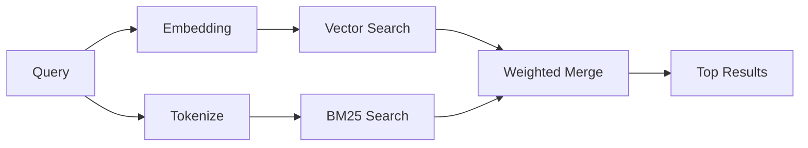

---
read_when:
    - Vous voulez comprendre comment fonctionne memory_search
    - Vous souhaitez choisir un fournisseur d’embeddings
    - Vous voulez améliorer la qualité de recherche
summary: Comment la recherche en mémoire trouve des notes pertinentes à l’aide de représentations vectorielles et de la récupération hybride
title: Recherche dans la mémoire
x-i18n:
    generated_at: "2026-06-27T17:24:36Z"
    model: gpt-5.5
    postprocess_version: locale-links-v1
    provider: openai
    source_hash: b0bcb8cf400100ba8b6ddbb46bdf8b2a89a8bc32a550ee6df47c874e7e9e0879
    source_path: concepts/memory-search.md
    workflow: 16
---

`memory_search` trouve les notes pertinentes dans vos fichiers de mémoire, même lorsque la
formulation diffère du texte original. Il fonctionne en indexant la mémoire en petits
fragments et en les recherchant à l’aide d’embeddings, de mots-clés, ou des deux.

## Démarrage rapide

La recherche mémoire utilise les embeddings OpenAI par défaut. Pour utiliser un autre
backend d’embedding, définissez explicitement un fournisseur :

```json5
{
  agents: {
    defaults: {
      memorySearch: {
        provider: "openai", // or "gemini", "local", "ollama", "openai-compatible", etc.
      },
    },
  },
}
```

Pour les configurations à plusieurs points de terminaison avec des fournisseurs propres à la mémoire, `provider` peut aussi
être une entrée personnalisée `models.providers.<id>`, comme `ollama-5080`, lorsque ce
fournisseur définit `api: "ollama"` ou un autre propriétaire d’adaptateur d’embedding mémoire.

Pour des embeddings locaux sans clé d’API, installez
`@openclaw/llama-cpp-provider` et définissez `provider: "local"`. Les checkouts source
peuvent encore nécessiter une approbation de build natif : `pnpm approve-builds` puis
`pnpm rebuild node-llama-cpp`.

Certains points de terminaison d’embedding compatibles OpenAI nécessitent des libellés asymétriques comme
`input_type: "query"` pour les recherches et `input_type: "document"` ou `"passage"`
pour les fragments indexés. Configurez-les avec `memorySearch.queryInputType` et
`memorySearch.documentInputType` ; consultez la [référence de configuration de la mémoire](/fr/reference/memory-config#provider-specific-config).

## Fournisseurs pris en charge

| Fournisseur       | ID                  | Nécessite une clé d’API | Notes                         |
| ----------------- | ------------------- | ----------------------- | ----------------------------- |
| Bedrock           | `bedrock`           | Non                     | Utilise la chaîne d’identifiants AWS |
| DeepInfra         | `deepinfra`         | Oui                     | Par défaut : `BAAI/bge-m3`    |
| Gemini            | `gemini`            | Oui                     | Prend en charge l’indexation d’images/audio |
| GitHub Copilot    | `github-copilot`    | Non                     | Utilise l’abonnement Copilot  |
| Local             | `local`             | Non                     | Modèle GGUF, téléchargement d’environ 0,6 Go |
| Mistral           | `mistral`           | Oui                     |                               |
| Ollama            | `ollama`            | Non                     | Local/auto-hébergé            |
| OpenAI            | `openai`            | Oui                     | Par défaut                    |
| OpenAI-compatible | `openai-compatible` | Généralement            | `/v1/embeddings` générique    |
| Voyage            | `voyage`            | Oui                     |                               |

## Fonctionnement de la recherche

OpenClaw exécute deux chemins de récupération en parallèle et fusionne les résultats :



- **La recherche vectorielle** trouve des notes ayant un sens similaire (« gateway host » correspond à
  « the machine running OpenClaw »).
- **La recherche par mots-clés BM25** trouve les correspondances exactes (ID, chaînes d’erreur, clés de
  configuration).

Si un seul chemin est disponible, l’autre s’exécute seul. Le mode intentionnel FTS uniquement
(`provider: "none"`) et la sélection automatique/par défaut du fournisseur peuvent toujours utiliser
le classement lexical lorsque les embeddings ne sont pas disponibles.

Les fournisseurs d’embeddings explicites non locaux sont différents. Si vous définissez
`memorySearch.provider` sur un fournisseur concret adossé à un service distant et que ce fournisseur
n’est pas disponible à l’exécution, `memory_search` signale la mémoire comme indisponible au lieu
d’utiliser silencieusement des résultats FTS uniquement. Cela garde visible un fournisseur sémantique
configuré mais défaillant. Définissez `provider: "none"` pour un rappel FTS uniquement volontaire, ou corrigez
la configuration du fournisseur/de l’authentification afin de restaurer le classement sémantique.

## Améliorer la qualité de recherche

Deux fonctionnalités facultatives aident lorsque vous avez un grand historique de notes :

### Décroissance temporelle

Les anciennes notes perdent progressivement du poids dans le classement afin que les informations récentes apparaissent en premier.
Avec la demi-vie par défaut de 30 jours, une note du mois dernier obtient 50 % de
son poids initial. Les fichiers permanents comme `MEMORY.md` ne subissent jamais de décroissance.

<Tip>
Activez la décroissance temporelle si votre agent possède des mois de notes quotidiennes et que des
informations obsolètes continuent de passer devant le contexte récent.
</Tip>

### MMR (diversité)

Réduit les résultats redondants. Si cinq notes mentionnent toutes la même configuration de routeur, MMR
garantit que les meilleurs résultats couvrent différents sujets au lieu de se répéter.

<Tip>
Activez MMR si `memory_search` renvoie sans cesse des extraits presque identiques provenant de
différentes notes quotidiennes.
</Tip>

### Activer les deux

```json5
{
  agents: {
    defaults: {
      memorySearch: {
        query: {
          hybrid: {
            mmr: { enabled: true },
            temporalDecay: { enabled: true },
          },
        },
      },
    },
  },
}
```

## Mémoire multimodale

Avec Gemini Embedding 2, vous pouvez indexer des images et des fichiers audio avec
Markdown. Les requêtes de recherche restent textuelles, mais elles correspondent au contenu visuel et audio.
Consultez la [référence de configuration de la mémoire](/fr/reference/memory-config) pour la
configuration.

## Recherche dans la mémoire de session

Vous pouvez éventuellement indexer les transcriptions de session afin que `memory_search` puisse retrouver
des conversations précédentes. Cette option est activable via
`memorySearch.experimental.sessionMemory`. Consultez la
[référence de configuration](/fr/reference/memory-config) pour plus de détails.

## Dépannage

**Aucun résultat ?** Exécutez `openclaw memory status` pour vérifier l’index. S’il est vide, exécutez
`openclaw memory index --force`.

**Seulement des correspondances par mots-clés ?** Votre fournisseur d’embeddings n’est peut-être pas configuré. Vérifiez
`openclaw memory status --deep`.

**Les embeddings locaux expirent ?** `ollama`, `lmstudio` et `local` utilisent un délai d’expiration
de lot inline plus long par défaut. Si l’hôte est simplement lent, définissez
`agents.defaults.memorySearch.sync.embeddingBatchTimeoutSeconds` et relancez
`openclaw memory index --force`.

**Texte CJK introuvable ?** Reconstruisez l’index FTS avec
`openclaw memory index --force`.

## Pour aller plus loin

- [Active Memory](/fr/concepts/active-memory) -- mémoire de sous-agent pour les sessions de chat interactives
- [Mémoire](/fr/concepts/memory) -- disposition des fichiers, backends, outils
- [Référence de configuration de la mémoire](/fr/reference/memory-config) -- tous les paramètres de configuration

## Associé

- [Vue d’ensemble de la mémoire](/fr/concepts/memory)
- [Active Memory](/fr/concepts/active-memory)
- [Moteur de mémoire intégré](/fr/concepts/memory-builtin)
