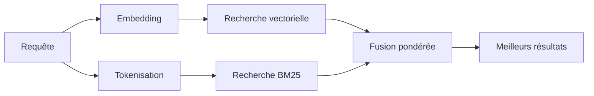

---
read_when:
    - Vous voulez comprendre comment `memory_search` fonctionne
    - Vous voulez choisir un fournisseur d’embeddings
    - Vous voulez ajuster la qualité de recherche
summary: Comment la recherche mémoire trouve des notes pertinentes à l’aide d’embeddings et d’une récupération hybride
title: Recherche mémoire
x-i18n:
    generated_at: "2026-04-26T11:27:08Z"
    model: gpt-5.4
    provider: openai
    source_hash: 95d86fb3efe79aae92f5e3590f1c15fb0d8f3bb3301f8fe9a41f891e290d7a14
    source_path: concepts/memory-search.md
    workflow: 15
---

`memory_search` trouve des notes pertinentes à partir de vos fichiers mémoire, même lorsque
la formulation diffère du texte d’origine. Il fonctionne en indexant la mémoire en petits
segments et en les recherchant à l’aide d’embeddings, de mots-clés ou des deux.

## Démarrage rapide

Si vous avez un abonnement GitHub Copilot, ou une clé API OpenAI, Gemini, Voyage ou Mistral configurée, la recherche mémoire fonctionne automatiquement. Pour définir explicitement un fournisseur :

```json5
{
  agents: {
    defaults: {
      memorySearch: {
        provider: "openai", // ou "gemini", "local", "ollama", etc.
      },
    },
  },
}
```

Pour des embeddings locaux sans clé API, installez le package runtime optionnel `node-llama-cpp`
à côté d’OpenClaw et utilisez `provider: "local"`.

## Fournisseurs pris en charge

| Fournisseur    | ID               | Nécessite une clé API | Remarques                                           |
| -------------- | ---------------- | --------------------- | --------------------------------------------------- |
| Bedrock        | `bedrock`        | Non                   | Détection automatique lorsque la chaîne d’identifiants AWS est résolue |
| Gemini         | `gemini`         | Oui                   | Prend en charge l’indexation d’images/audio         |
| GitHub Copilot | `github-copilot` | Non                   | Détection automatique, utilise l’abonnement Copilot |
| Local          | `local`          | Non                   | Modèle GGUF, téléchargement d’environ 0,6 Go        |
| Mistral        | `mistral`        | Oui                   | Détection automatique                               |
| Ollama         | `ollama`         | Non                   | Local, doit être défini explicitement               |
| OpenAI         | `openai`         | Oui                   | Détection automatique, rapide                       |
| Voyage         | `voyage`         | Oui                   | Détection automatique                               |

## Comment fonctionne la recherche

OpenClaw exécute deux chemins de récupération en parallèle et fusionne les résultats :



- **La recherche vectorielle** trouve des notes de sens similaire (« hôte gateway » correspond à
  « la machine qui exécute OpenClaw »).
- **La recherche de mots-clés BM25** trouve les correspondances exactes (ID, chaînes d’erreur, clés
  de configuration).

Si un seul chemin est disponible (pas d’embeddings ou pas de FTS), l’autre s’exécute seul.

Lorsque les embeddings ne sont pas disponibles, OpenClaw utilise quand même un classement lexical sur les résultats FTS au lieu de revenir uniquement à un tri brut par correspondance exacte. Ce mode dégradé favorise les segments avec une meilleure couverture des termes de la requête et des chemins de fichier pertinents, ce qui maintient un rappel utile même sans `sqlite-vec` ni fournisseur d’embeddings.

## Améliorer la qualité de recherche

Deux fonctionnalités facultatives aident lorsque vous avez un long historique de notes :

### Décroissance temporelle

Les anciennes notes perdent progressivement du poids dans le classement afin que les informations récentes ressortent en premier.
Avec la demi-vie par défaut de 30 jours, une note du mois dernier obtient un score de 50 % de
son poids d’origine. Les fichiers pérennes comme `MEMORY.md` ne subissent jamais de décroissance.

<Tip>
Activez la décroissance temporelle si votre agent possède des mois de notes quotidiennes et que des
informations obsolètes surpassent régulièrement le contexte récent.
</Tip>

### MMR (diversité)

Réduit les résultats redondants. Si cinq notes mentionnent toutes la même configuration de routeur, MMR
garantit que les meilleurs résultats couvrent différents sujets au lieu de se répéter.

<Tip>
Activez MMR si `memory_search` continue de renvoyer des extraits quasi dupliqués issus
de différentes notes quotidiennes.
</Tip>

### Activer les deux

```json5
{
  agents: {
    defaults: {
      memorySearch: {
        query: {
          hybrid: {
            mmr: { enabled: true },
            temporalDecay: { enabled: true },
          },
        },
      },
    },
  },
}
```

## Mémoire multimodale

Avec Gemini Embedding 2, vous pouvez indexer des images et des fichiers audio en plus du
Markdown. Les requêtes de recherche restent textuelles, mais elles correspondent au contenu visuel et audio. Voir la [référence de configuration de la mémoire](/fr/reference/memory-config) pour
la configuration.

## Recherche dans la mémoire de session

Vous pouvez éventuellement indexer les transcriptions de session afin que `memory_search` puisse rappeler
des conversations antérieures. Cette fonctionnalité est opt-in via
`memorySearch.experimental.sessionMemory`. Voir la
[référence de configuration](/fr/reference/memory-config) pour plus de détails.

## Dépannage

**Aucun résultat ?** Exécutez `openclaw memory status` pour vérifier l’index. S’il est vide, exécutez
`openclaw memory index --force`.

**Seulement des correspondances par mots-clés ?** Il se peut que votre fournisseur d’embeddings ne soit pas configuré. Vérifiez avec
`openclaw memory status --deep`.

**Les embeddings locaux expirent ?** `ollama`, `lmstudio` et `local` utilisent par défaut un délai d’attente plus long pour les lots en ligne. Si l’hôte est simplement lent, définissez
`agents.defaults.memorySearch.sync.embeddingBatchTimeoutSeconds` puis relancez
`openclaw memory index --force`.

**Le texte CJK n’est pas trouvé ?** Reconstruisez l’index FTS avec
`openclaw memory index --force`.

## Pour aller plus loin

- [Active Memory](/fr/concepts/active-memory) -- mémoire de sous-agent pour les sessions de chat interactives
- [Memory](/fr/concepts/memory) -- organisation des fichiers, backends, outils
- [Référence de configuration de la mémoire](/fr/reference/memory-config) -- tous les paramètres de configuration

## Associé

- [Vue d’ensemble de la mémoire](/fr/concepts/memory)
- [Active Memory](/fr/concepts/active-memory)
- [Moteur mémoire intégré](/fr/concepts/memory-builtin)
