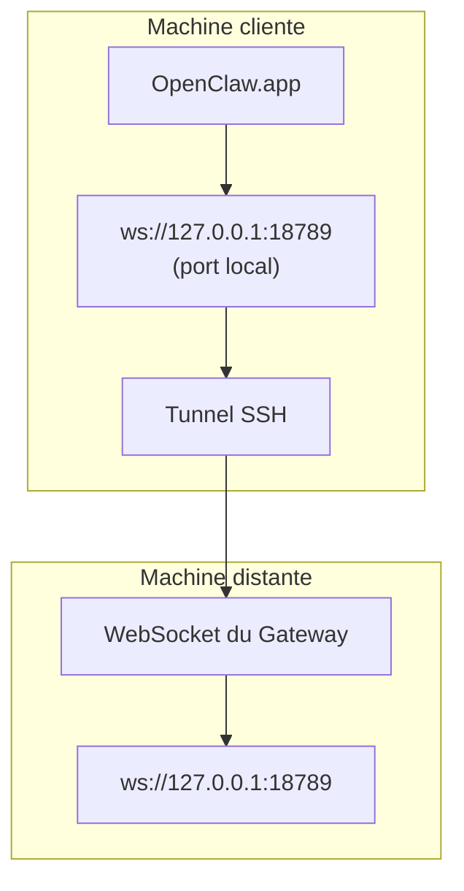

<Note>
Ce contenu se trouve désormais dans [Accès à distance](/fr/gateway/remote#macos-persistent-ssh-tunnel-via-launchagent). Consultez cette page pour obtenir le guide actuel ; cette page reste disponible comme cible de redirection.
</Note>

# Exécution d’OpenClaw.app avec un Gateway distant

OpenClaw.app accède à un Gateway distant au moyen d’un tunnel SSH : un `LocalForward` SSH associe un port local au port WebSocket du Gateway sur l’hôte distant.

## Configuration

1. Ajoutez une entrée de configuration SSH avec `LocalForward 18789 127.0.0.1:18789` (consultez [Accès à distance](/fr/gateway/remote#macos-persistent-ssh-tunnel-via-launchagent) pour voir le bloc de configuration complet).
2. Copiez votre clé SSH sur l’hôte distant avec `ssh-copy-id`.
3. Définissez `gateway.remote.token` (ou `gateway.remote.password`) avec `openclaw config set gateway.remote.token "<your-token>"`.
4. Démarrez le tunnel : `ssh -N remote-gateway &`.
5. Quittez puis rouvrez OpenClaw.app.

Pour disposer d’un tunnel qui persiste après les redémarrages et se reconnecte automatiquement, utilisez la configuration LaunchAgent indiquée sur la page [Accès à distance](/fr/gateway/remote#macos-persistent-ssh-tunnel-via-launchagent) plutôt qu’une commande manuelle `ssh -N`.

## Fonctionnement

| Composant                            | Fonction                                                              |
| ------------------------------------ | --------------------------------------------------------------------- |
| `LocalForward 18789 127.0.0.1:18789` | Transfère le port local 18789 vers le port distant 18789              |
| `ssh -N`                             | Établit une connexion SSH sans exécuter de commandes distantes (transfert de port uniquement) |
| `KeepAlive`                          | Redémarre automatiquement le tunnel en cas d’arrêt inattendu (LaunchAgent) |
| `RunAtLoad`                          | Démarre le tunnel lors du chargement du LaunchAgent (LaunchAgent)     |

OpenClaw.app se connecte à `ws://127.0.0.1:18789` sur le client. Le tunnel transfère cette connexion vers le port 18789 de l’hôte distant qui exécute le Gateway.

## Pages connexes

- [Accès à distance](/fr/gateway/remote)
- [Tailscale](/fr/gateway/tailscale)
