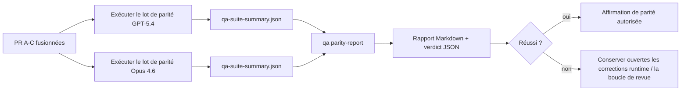

---
read_when:
    - Examen de la série de PR de parité GPT-5.4 / Codex
    - Maintenance de l’architecture agentique à six contrats derrière le programme de parité
summary: Comment examiner le programme de parité GPT-5.4 / Codex en quatre unités de fusion
title: Notes de maintenance sur la parité GPT-5.4 / Codex
x-i18n:
    generated_at: "2026-04-22T04:22:55Z"
    model: gpt-5.4
    provider: openai
    source_hash: b872d6a33b269c01b44537bfa8646329063298fdfcd3671a17d0eadbc9da5427
    source_path: help/gpt54-codex-agentic-parity-maintainers.md
    workflow: 15
---

# Notes de maintenance sur la parité GPT-5.4 / Codex

Cette note explique comment examiner le programme de parité GPT-5.4 / Codex comme quatre unités de fusion sans perdre l’architecture originale à six contrats.

## Unités de fusion

### PR A : exécution strictement agentique

Possède :

- `executionContract`
- suivi d’action dans le même tour, orienté GPT-5 en priorité
- `update_plan` comme suivi de progression non terminal
- états de blocage explicites au lieu d’arrêts silencieux limités au plan

Ne possède pas :

- classification des échecs d’authentification/runtime
- véracité des permissions
- refonte du rejeu/de la continuation
- benchmarking de parité

### PR B : véracité du runtime

Possède :

- exactitude des scopes OAuth Codex
- classification typée des échecs provider/runtime
- disponibilité véridique de `/elevated full` et raisons de blocage

Ne possède pas :

- normalisation du schéma des outils
- état de rejeu/vivacité
- barrière de benchmark

### PR C : exactitude de l’exécution

Possède :

- compatibilité des outils OpenAI/Codex détenue par le provider
- gestion stricte des schémas sans paramètres
- exposition de `replay-invalid`
- visibilité de l’état des tâches longues en pause, bloquées et abandonnées

Ne possède pas :

- continuation auto-choisie
- comportement générique du dialecte Codex hors des hooks provider
- barrière de benchmark

### PR D : harnais de parité

Possède :

- premier lot de scénarios GPT-5.4 vs Opus 4.6
- documentation de parité
- mécanique du rapport de parité et de la barrière de release

Ne possède pas :

- changements de comportement runtime hors de QA-lab
- simulation auth/proxy/DNS dans le harnais

## Correspondance avec les six contrats d’origine

| Contrat d’origine                         | Unité de fusion |
| ----------------------------------------- | --------------- |
| Exactitude du transport/provider auth     | PR B            |
| Compatibilité contrat/schéma des outils   | PR C            |
| Exécution dans le même tour               | PR A            |
| Véracité des permissions                  | PR B            |
| Exactitude rejeu/continuation/vivacité    | PR C            |
| Benchmark/barrière de release             | PR D            |

## Ordre de revue

1. PR A
2. PR B
3. PR C
4. PR D

PR D est la couche de preuve. Elle ne doit pas être la raison pour laquelle les PR de correction du runtime sont retardées.

## Points à vérifier

### PR A

- les exécutions GPT-5 agissent ou échouent de manière fermée au lieu de s’arrêter sur un commentaire
- `update_plan` ne ressemble plus à un progrès à lui seul
- le comportement reste prioritaire GPT-5 et limité au périmètre Pi intégré

### PR B

- les échecs auth/proxy/runtime ne s’effondrent plus dans une gestion générique de type « model failed »
- `/elevated full` n’est décrit comme disponible que lorsqu’il l’est réellement
- les raisons de blocage sont visibles à la fois pour le modèle et pour le runtime orienté utilisateur

### PR C

- l’enregistrement strict des outils OpenAI/Codex se comporte de manière prévisible
- les outils sans paramètres ne font pas échouer les vérifications strictes de schéma
- les résultats de rejeu et de Compaction préservent un état de vivacité véridique

### PR D

- le lot de scénarios est compréhensible et reproductible
- le lot inclut une voie mutante de sécurité de rejeu, pas seulement des flux en lecture seule
- les rapports sont lisibles par les humains et par l’automatisation
- les affirmations de parité sont étayées par des preuves, pas anecdotiques

Artefacts attendus de PR D :

- `qa-suite-report.md` / `qa-suite-summary.json` pour chaque exécution de modèle
- `qa-agentic-parity-report.md` avec comparaison agrégée et au niveau des scénarios
- `qa-agentic-parity-summary.json` avec un verdict lisible par machine

## Barrière de release

Ne revendiquez pas la parité GPT-5.4 ou une supériorité sur Opus 4.6 tant que :

- PR A, PR B et PR C ne sont pas fusionnées
- PR D n’exécute pas proprement le premier lot de parité
- les suites de régression de véracité du runtime restent vertes
- le rapport de parité ne montre aucun cas de faux succès et aucune régression dans le comportement d’arrêt

Le harnais de parité n’est pas la seule source de preuve. Gardez cette séparation explicite pendant la revue :

- PR D possède la comparaison par scénarios GPT-5.4 vs Opus 4.6
- les suites déterministes de PR B conservent la responsabilité des preuves auth/proxy/DNS et de véracité d’accès complet

## Carte objectif-vers-preuve

| Élément de barrière de finalisation       | Propriétaire principal | Artefact de revue                                                    |
| ----------------------------------------- | ---------------------- | -------------------------------------------------------------------- |
| Aucun blocage limité au plan              | PR A                   | tests runtime strictement agantiques et `approval-turn-tool-followthrough` |
| Aucun faux progrès ni fausse fin d’outil  | PR A + PR D            | compteur de faux succès de parité plus détails du rapport au niveau scénario |
| Aucun faux guidage `/elevated full`       | PR B                   | suites déterministes de véracité du runtime                          |
| Les échecs de rejeu/vivacité restent explicites | PR C + PR D       | suites lifecycle/replay plus `compaction-retry-mutating-tool`        |
| GPT-5.4 égale ou dépasse Opus 4.6         | PR D                   | `qa-agentic-parity-report.md` et `qa-agentic-parity-summary.json`    |

## Raccourci pour les relecteurs : avant vs après

| Problème visible par l’utilisateur avant                     | Signal de revue après                                                                   |
| ------------------------------------------------------------ | --------------------------------------------------------------------------------------- |
| GPT-5.4 s’arrêtait après la planification                    | PR A montre un comportement agir-ou-bloquer au lieu d’une fin limitée à des commentaires |
| L’usage des outils semblait fragile avec les schémas stricts OpenAI/Codex | PR C garde un enregistrement d’outils et une invocation sans paramètres prévisibles |
| Les indications `/elevated full` étaient parfois trompeuses  | PR B relie les indications à la capacité runtime réelle et aux raisons de blocage      |
| Les tâches longues pouvaient disparaître dans l’ambiguïté du rejeu/de la Compaction | PR C émet des états explicites : en pause, bloqué, abandonné et replay-invalid |
| Les affirmations de parité étaient anecdotiques              | PR D produit un rapport plus un verdict JSON avec la même couverture de scénarios sur les deux modèles |
