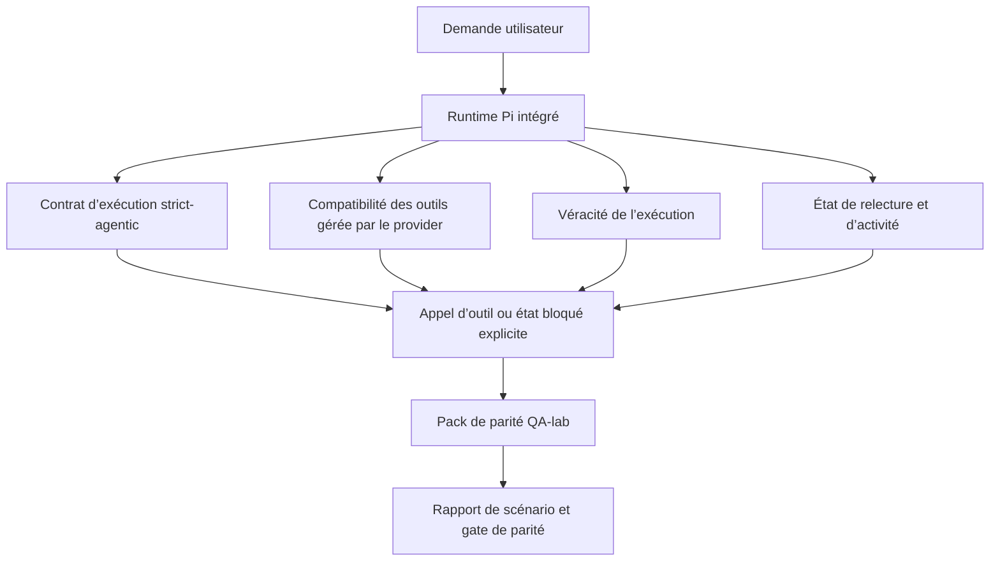
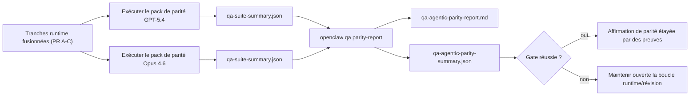

---
read_when:
    - Débogage du comportement agentique de GPT-5.4 ou de Codex
    - Comparaison du comportement agentique d’OpenClaw entre les modèles de pointe
    - Examen des correctifs strict-agentic, des schémas d’outils, de l’élévation et de la relecture
summary: Comment OpenClaw comble les lacunes d’exécution agentique pour GPT-5.4 et les modèles de type Codex
title: Parité agentique GPT-5.4 / Codex
x-i18n:
    generated_at: "2026-04-22T04:22:59Z"
    model: gpt-5.4
    provider: openai
    source_hash: 77bc9b8fab289bd35185fa246113503b3f5c94a22bd44739be07d39ae6779056
    source_path: help/gpt54-codex-agentic-parity.md
    workflow: 15
---

# Parité agentique GPT-5.4 / Codex dans OpenClaw

OpenClaw fonctionnait déjà bien avec les modèles de pointe utilisant des outils, mais GPT-5.4 et les modèles de type Codex restaient encore moins performants de quelques façons pratiques :

- ils pouvaient s’arrêter après la planification au lieu d’effectuer le travail
- ils pouvaient mal utiliser les schémas d’outils stricts OpenAI/Codex
- ils pouvaient demander `/elevated full` même lorsqu’un accès complet était impossible
- ils pouvaient perdre l’état des tâches longues pendant la relecture ou la Compaction
- les affirmations de parité avec Claude Opus 4.6 reposaient sur des anecdotes plutôt que sur des scénarios répétables

Ce programme de parité corrige ces lacunes en quatre tranches révisables.

## Ce qui a changé

### PR A : exécution strict-agentic

Cette tranche ajoute un contrat d’exécution `strict-agentic` en opt-in pour les exécutions Pi GPT-5 intégrées.

Lorsqu’il est activé, OpenClaw cesse d’accepter les tours limités à un plan comme une exécution « suffisamment bonne ». Si le modèle se contente d’indiquer ce qu’il a l’intention de faire sans réellement utiliser d’outils ni progresser, OpenClaw réessaie avec une instruction d’action immédiate puis échoue en mode fermé avec un état bloqué explicite au lieu de terminer silencieusement la tâche.

Cela améliore surtout l’expérience GPT-5.4 dans les cas suivants :

- suivis courts du type « ok fais-le »
- tâches de code où la première étape est évidente
- flux où `update_plan` doit servir au suivi de progression plutôt qu’à du texte de remplissage

### PR B : véracité de l’exécution

Cette tranche amène OpenClaw à dire la vérité sur deux points :

- pourquoi l’appel provider/runtime a échoué
- si `/elevated full` est réellement disponible

Cela signifie que GPT-5.4 reçoit de meilleurs signaux d’exécution en cas de portée manquante, d’échecs de rafraîchissement d’authentification, d’échecs d’authentification HTML 403, de problèmes de proxy, de problèmes DNS ou de délai dépassé, ainsi que de modes d’accès complet bloqués. Le modèle est moins susceptible d’halluciner la mauvaise remédiation ou de continuer à demander un mode d’autorisation que l’exécution ne peut pas fournir.

### PR C : exactitude de l’exécution

Cette tranche améliore deux types d’exactitude :

- compatibilité des schémas d’outils OpenAI/Codex gérés par le provider
- visibilité de la relecture et de l’activité des tâches longues

Le travail de compatibilité des outils réduit la friction des schémas pour l’enregistrement strict des outils OpenAI/Codex, en particulier autour des outils sans paramètres et des attentes strictes de racine objet. Le travail sur la relecture et l’activité rend les tâches longues plus observables, de sorte que les états en pause, bloqués et abandonnés sont visibles au lieu de disparaître dans un texte d’échec générique.

### PR D : harness de parité

Cette tranche ajoute le premier pack de parité QA-lab afin que GPT-5.4 et Opus 4.6 puissent être exercés à travers les mêmes scénarios et comparés avec des preuves partagées.

Le pack de parité constitue la couche de preuve. Il ne modifie pas le comportement d’exécution à lui seul.

Après avoir obtenu deux artefacts `qa-suite-summary.json`, générez la comparaison de gate de release avec :

```bash
pnpm openclaw qa parity-report \
  --repo-root . \
  --candidate-summary .artifacts/qa-e2e/gpt54/qa-suite-summary.json \
  --baseline-summary .artifacts/qa-e2e/opus46/qa-suite-summary.json \
  --output-dir .artifacts/qa-e2e/parity
```

Cette commande écrit :

- un rapport Markdown lisible par un humain
- un verdict JSON lisible par une machine
- un résultat de gate explicite `pass` / `fail`

## Pourquoi cela améliore GPT-5.4 en pratique

Avant ce travail, GPT-5.4 sur OpenClaw pouvait sembler moins agentique qu’Opus dans de vraies sessions de codage, car l’exécution tolérait des comportements particulièrement nuisibles pour les modèles de type GPT-5 :

- tours limités à des commentaires
- friction de schéma autour des outils
- retours d’autorisation vagues
- casse silencieuse de la relecture ou de la Compaction

L’objectif n’est pas de faire imiter Opus par GPT-5.4. L’objectif est de donner à GPT-5.4 un contrat d’exécution qui récompense la progression réelle, fournit une sémantique plus propre des outils et des autorisations, et transforme les modes de défaillance en états explicites lisibles par machine et par humain.

Cela fait évoluer l’expérience utilisateur de :

- « le modèle avait un bon plan mais s’est arrêté »

vers :

- « le modèle a soit agi, soit OpenClaw a affiché la raison exacte pour laquelle il ne le pouvait pas »

## Avant / après pour les utilisateurs de GPT-5.4

| Avant ce programme                                                                          | Après les PR A-D                                                                          |
| ------------------------------------------------------------------------------------------- | ----------------------------------------------------------------------------------------- |
| GPT-5.4 pouvait s’arrêter après un plan raisonnable sans effectuer l’étape d’outil suivante | La PR A transforme « plan uniquement » en « agir maintenant ou afficher un état bloqué » |
| Les schémas d’outils stricts pouvaient rejeter les outils sans paramètres ou de forme OpenAI/Codex de manière confuse | La PR C rend l’enregistrement et l’invocation des outils gérés par le provider plus prévisibles |
| Les indications `/elevated full` pouvaient être vagues ou incorrectes dans les exécutions bloquées | La PR B fournit à GPT-5.4 et à l’utilisateur des indices d’exécution et d’autorisation véridiques |
| Les échecs de relecture ou de Compaction pouvaient donner l’impression que la tâche avait silencieusement disparu | La PR C rend explicites les résultats en pause, bloqués, abandonnés et invalides à la relecture |
| « GPT-5.4 semble moins bon qu’Opus » relevait surtout de l’anecdote                         | La PR D transforme cela en même pack de scénarios, mêmes métriques et gate pass/fail stricte |

## Architecture



## Flux de release



## Pack de scénarios

Le premier pack de parité couvre actuellement cinq scénarios :

### `approval-turn-tool-followthrough`

Vérifie que le modèle ne s’arrête pas à « je vais faire ça » après une approbation courte. Il doit effectuer la première action concrète dans le même tour.

### `model-switch-tool-continuity`

Vérifie que le travail utilisant des outils reste cohérent à travers les limites de changement de modèle/runtime, au lieu de repartir sur des commentaires ou de perdre le contexte d’exécution.

### `source-docs-discovery-report`

Vérifie que le modèle peut lire le code source et la documentation, synthétiser les résultats et continuer la tâche de manière agentique plutôt que de produire un résumé superficiel puis de s’arrêter prématurément.

### `image-understanding-attachment`

Vérifie que les tâches mixtes impliquant des pièces jointes restent exploitables et ne s’effondrent pas en narration vague.

### `compaction-retry-mutating-tool`

Vérifie qu’une tâche avec une vraie écriture mutante garde le caractère non sûr pour la relecture explicite au lieu d’avoir discrètement l’air sûre pour la relecture si l’exécution subit une Compaction, réessaie ou perd l’état de réponse sous pression.

## Matrice des scénarios

| Scénario                           | Ce qu’il teste                                | Bon comportement GPT-5.4                                                        | Signal d’échec                                                                    |
| ---------------------------------- | --------------------------------------------- | ------------------------------------------------------------------------------- | --------------------------------------------------------------------------------- |
| `approval-turn-tool-followthrough` | Tours d’approbation courts après un plan      | Démarre immédiatement la première action d’outil concrète au lieu de reformuler l’intention | suivi limité au plan, aucune activité d’outil, ou tour bloqué sans véritable blocage |
| `model-switch-tool-continuity`     | Changement de runtime/modèle pendant l’usage d’outils | Préserve le contexte de tâche et continue à agir de manière cohérente           | repart sur des commentaires, perd le contexte d’outil, ou s’arrête après le changement |
| `source-docs-discovery-report`     | Lecture du code source + synthèse + action    | Trouve les sources, utilise des outils et produit un rapport utile sans bloquer | résumé superficiel, travail d’outil manquant, ou arrêt sur tour incomplet        |
| `image-understanding-attachment`   | Travail agentique piloté par pièce jointe     | Interprète la pièce jointe, la relie aux outils et poursuit la tâche            | narration vague, pièce jointe ignorée, ou aucune action concrète suivante        |
| `compaction-retry-mutating-tool`   | Travail mutant sous pression de Compaction    | Effectue une vraie écriture et maintient explicite le caractère non sûr pour la relecture après l’effet de bord | une écriture mutante a lieu mais la sûreté de relecture est implicite, absente ou contradictoire |

## Gate de release

GPT-5.4 ne peut être considéré à parité ou meilleur que lorsque le runtime fusionné réussit en même temps le pack de parité et les régressions de véracité d’exécution.

Résultats requis :

- aucun blocage sur plan uniquement lorsque l’action d’outil suivante est claire
- aucune fausse complétion sans exécution réelle
- aucune indication incorrecte de `/elevated full`
- aucun abandon silencieux de relecture ou de Compaction
- des métriques du pack de parité au moins aussi solides que la baseline Opus 4.6 convenue

Pour le premier harness, la gate compare :

- taux de complétion
- taux d’arrêt non intentionnel
- taux d’appels d’outils valides
- nombre de faux succès

Les preuves de parité sont intentionnellement réparties sur deux couches :

- la PR D prouve le comportement GPT-5.4 vs Opus 4.6 sur les mêmes scénarios avec QA-lab
- les suites déterministes de la PR B prouvent la véracité auth, proxy, DNS et `/elevated full` hors du harness

## Matrice objectif → preuves

| Élément de gate de complétion                          | PR propriétaire | Source de preuve                                                   | Signal de réussite                                                                      |
| ----------------------------------------------------- | --------------- | ------------------------------------------------------------------ | --------------------------------------------------------------------------------------- |
| GPT-5.4 ne bloque plus après la planification         | PR A            | `approval-turn-tool-followthrough` plus les suites runtime de la PR A | les tours d’approbation déclenchent un vrai travail ou un état bloqué explicite        |
| GPT-5.4 ne simule plus de progression ou de faux achèvement d’outil | PR A + PR D     | résultats des scénarios du rapport de parité et nombre de faux succès | aucun résultat de réussite suspect et aucune complétion limitée à des commentaires      |
| GPT-5.4 ne donne plus de fausses indications `/elevated full` | PR B            | suites déterministes de véracité                                   | les raisons de blocage et les indices d’accès complet restent exacts vis-à-vis du runtime |
| Les échecs de relecture/activité restent explicites   | PR C + PR D     | suites cycle de vie/relecture de la PR C plus `compaction-retry-mutating-tool` | le travail mutant garde explicitement le caractère non sûr pour la relecture au lieu de disparaître silencieusement |
| GPT-5.4 égale ou dépasse Opus 4.6 sur les métriques convenues | PR D            | `qa-agentic-parity-report.md` et `qa-agentic-parity-summary.json` | même couverture de scénarios et aucune régression sur la complétion, le comportement d’arrêt ou l’usage valide des outils |

## Comment lire le verdict de parité

Utilisez le verdict dans `qa-agentic-parity-summary.json` comme décision finale lisible par machine pour le premier pack de parité.

- `pass` signifie que GPT-5.4 a couvert les mêmes scénarios qu’Opus 4.6 et n’a pas régressé sur les métriques agrégées convenues.
- `fail` signifie qu’au moins une gate stricte a été déclenchée : complétion plus faible, arrêts non intentionnels plus nombreux, usage valide des outils plus faible, présence d’au moins un cas de faux succès, ou couverture de scénario non alignée.
- « shared/base CI issue » n’est pas en soi un résultat de parité. Si du bruit CI hors PR D bloque une exécution, le verdict doit attendre une exécution propre du runtime fusionné au lieu d’être déduit à partir de journaux d’époque de branche.
- La véracité auth, proxy, DNS et `/elevated full` provient toujours des suites déterministes de la PR B, donc l’affirmation finale de release nécessite les deux : un verdict de parité PR D réussi et une couverture de véracité PR B au vert.

## Qui doit activer `strict-agentic`

Utilisez `strict-agentic` lorsque :

- on attend de l’agent qu’il agisse immédiatement lorsqu’une étape suivante est évidente
- GPT-5.4 ou des modèles de la famille Codex constituent le runtime principal
- vous préférez des états bloqués explicites à des réponses seulement récapitulatives mais « utiles »

Conservez le contrat par défaut lorsque :

- vous souhaitez conserver le comportement plus souple existant
- vous n’utilisez pas de modèles de la famille GPT-5
- vous testez des prompts plutôt que l’application de contraintes par le runtime
