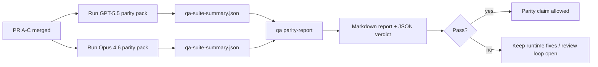

---
read_when:
    - Revue de la série de PR sur la parité GPT-5.5 / Codex
    - Maintenir l’architecture agentique à six contrats qui sous-tend le programme de parité
summary: Comment passer en revue le programme de parité GPT-5.5 / Codex sous forme de quatre unités de fusion
title: Notes de maintenance sur la parité GPT-5.5 / Codex
x-i18n:
    generated_at: "2026-05-06T07:25:48Z"
    model: gpt-5.5
    provider: openai
    source_hash: 5752b4610f8b0d70b80d880ea10df75478b5f85ca431cdb73d3b61d745b23356
    source_path: help/gpt55-codex-agentic-parity-maintainers.md
    workflow: 16
---

Cette note explique comment examiner le programme de parité GPT-5.5 / Codex sous forme de quatre unités de fusion sans perdre l’architecture d’origine à six contrats.

## Unités de fusion

### PR A : exécution agentique stricte

Possède :

- `executionContract`
- suivi au même tour, axé d’abord sur GPT-5
- `update_plan` comme suivi de progression non terminal
- états bloqués explicites au lieu d’arrêts silencieux limités au plan

Ne possède pas :

- classification des échecs d’authentification/d’exécution
- véracité des permissions
- refonte de la relecture/continuation
- évaluation comparative de la parité

### PR B : véracité de l’exécution

Possède :

- exactitude des portées OAuth de Codex
- classification typée des échecs fournisseur/exécution
- disponibilité véridique de `/elevated full` et raisons de blocage

Ne possède pas :

- normalisation du schéma d’outil
- état de relecture/vivacité
- verrouillage par évaluation comparative

### PR C : exactitude de l’exécution

Possède :

- compatibilité des outils OpenAI/Codex gérée par le fournisseur
- gestion stricte des schémas sans paramètres
- exposition des relectures invalides
- visibilité des états de longue tâche en pause, bloquée et abandonnée

Ne possède pas :

- continuation auto-sélectionnée
- comportement générique du dialecte Codex en dehors des hooks fournisseur
- verrouillage par évaluation comparative

### PR D : harnais de parité

Possède :

- premier pack de scénarios GPT-5.5 vs Opus 4.6
- documentation de parité
- rapport de parité et mécanismes de verrouillage de release

Ne possède pas :

- changements de comportement d’exécution hors QA-lab
- simulation auth/proxy/DNS dans le harnais

## Correspondance avec les six contrats d’origine

| Contrat d’origine                         | Unité de fusion |
| ----------------------------------------- | --------------- |
| Exactitude transport/auth fournisseur     | PR B            |
| Compatibilité contrat/schéma d’outil      | PR C            |
| Exécution au même tour                    | PR A            |
| Véracité des permissions                  | PR B            |
| Exactitude relecture/continuation/vivacité | PR C            |
| Verrou d’évaluation comparative/release   | PR D            |

## Ordre de revue

1. PR A
2. PR B
3. PR C
4. PR D

PR D est la couche de preuve. Elle ne doit pas retarder les PR d’exactitude de l’exécution.

## Points à vérifier

### PR A

- Les exécutions GPT-5 agissent ou échouent de manière fermée au lieu de s’arrêter aux commentaires
- `update_plan` ne ressemble plus à une progression à lui seul
- le comportement reste axé d’abord sur GPT-5 et limité au Pi embarqué

### PR B

- les échecs auth/proxy/exécution cessent d’être rabattus sur une gestion générique de type « modèle en échec »
- `/elevated full` est décrit comme disponible uniquement lorsqu’il est réellement disponible
- les raisons de blocage sont visibles à la fois pour le modèle et pour l’exécution côté utilisateur

### PR C

- l’enregistrement strict des outils OpenAI/Codex se comporte de façon prévisible
- les outils sans paramètres n’échouent pas aux vérifications strictes de schéma
- les résultats de relecture et de compaction préservent un état de vivacité véridique

### PR D

- le pack de scénarios est compréhensible et reproductible
- le pack inclut une voie de sécurité de relecture mutante, pas seulement des flux en lecture seule
- les rapports sont lisibles par les humains et l’automatisation
- les affirmations de parité sont étayées par des preuves, pas anecdotiques

Artefacts attendus de PR D :

- `qa-suite-report.md` / `qa-suite-summary.json` pour chaque exécution de modèle
- `qa-agentic-parity-report.md` avec comparaison agrégée et par scénario
- `qa-agentic-parity-summary.json` avec un verdict lisible par machine

## Verrou de release

Ne revendiquez pas la parité ou la supériorité de GPT-5.5 par rapport à Opus 4.6 tant que :

- PR A, PR B et PR C ne sont pas fusionnées
- PR D n’exécute pas proprement le premier pack de parité
- les suites de régression de véracité de l’exécution restent vertes
- le rapport de parité ne montre aucun cas de faux succès et aucune régression du comportement d’arrêt

Le harnais de parité n’est pas la seule source de preuves. Gardez cette séparation explicite pendant la revue :

- PR D possède la comparaison GPT-5.5 vs Opus 4.6 basée sur des scénarios
- les suites déterministes de PR B possèdent toujours les preuves auth/proxy/DNS et de véracité de l’accès complet

## Flux de fusion rapide pour mainteneur

Utilisez ceci lorsque vous êtes prêt à intégrer une PR de parité et souhaitez une séquence répétable à faible risque.

1. Confirmer que le niveau de preuve requis est atteint avant la fusion :
   - symptôme reproductible ou test en échec
   - cause racine vérifiée dans le code touché
   - correctif dans le chemin impliqué
   - test de régression ou note explicite de vérification manuelle
2. Trier/étiqueter avant la fusion :
   - appliquer toute étiquette de fermeture automatique `r:*` lorsque la PR ne doit pas être intégrée
   - garder les candidates à la fusion exemptes de fils bloquants non résolus
3. Valider localement sur la surface touchée :
   - `pnpm check:changed`
   - `pnpm test:changed` lorsque des tests ont changé ou que la confiance dans le correctif dépend de la couverture de tests
4. Intégrer avec le flux mainteneur standard (processus `/landpr`), puis vérifier :
   - comportement de fermeture automatique des issues liées
   - CI et état post-fusion sur `main`
5. Après l’intégration, lancer une recherche de doublons pour les PR/issues ouvertes liées et ne fermer qu’avec une référence canonique.

S’il manque un seul élément du niveau de preuve requis, demandez des changements au lieu de fusionner.

## Carte objectif-preuve

| Élément du verrou de complétion           | Propriétaire principal | Artefact de revue                                                   |
| ---------------------------------------- | ---------------------- | ------------------------------------------------------------------- |
| Aucun blocage limité au plan             | PR A                   | tests d’exécution agentique stricte et `approval-turn-tool-followthrough` |
| Aucune fausse progression ni fausse complétion d’outil | PR A + PR D            | nombre de faux succès de parité plus détails du rapport par scénario |
| Aucune indication fausse pour `/elevated full` | PR B                   | suites déterministes de véracité de l’exécution                     |
| Les échecs de relecture/vivacité restent explicites | PR C + PR D            | suites cycle de vie/relecture plus `compaction-retry-mutating-tool` |
| GPT-5.5 égale ou dépasse Opus 4.6        | PR D                   | `qa-agentic-parity-report.md` et `qa-agentic-parity-summary.json`   |

## Raccourci de revue : avant vs après

| Problème visible par l’utilisateur avant                  | Signal de revue après                                                                  |
| --------------------------------------------------------- | -------------------------------------------------------------------------------------- |
| GPT-5.5 s’arrêtait après la planification                 | PR A montre un comportement agir-ou-bloquer au lieu d’une complétion limitée aux commentaires |
| L’utilisation des outils semblait fragile avec les schémas stricts OpenAI/Codex | PR C garde l’enregistrement des outils et l’invocation sans paramètres prévisibles     |
| Les indications `/elevated full` étaient parfois trompeuses | PR B lie l’aide à la capacité d’exécution réelle et aux raisons de blocage              |
| Les longues tâches pouvaient disparaître dans l’ambiguïté relecture/compaction | PR C émet des états explicites en pause, bloqué, abandonné et relecture invalide       |
| Les affirmations de parité étaient anecdotiques           | PR D produit un rapport plus un verdict JSON avec la même couverture de scénarios sur les deux modèles |

## Associé

- [Parité agentique GPT-5.5 / Codex](/fr/help/gpt55-codex-agentic-parity)
