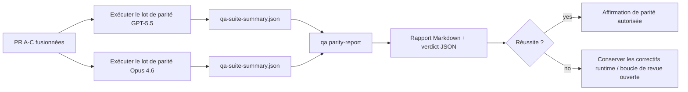

---
read_when:
    - Examen de la série de PR de parité GPT-5.5 / Codex
    - Maintenir l’architecture agentique à six contrats derrière le programme de parité
summary: Comment examiner le programme de parité GPT-5.5 / Codex en quatre unités de fusion
title: Notes de maintenance sur la parité GPT-5.5 / Codex
x-i18n:
  refreshed_at: '2026-04-28T04:45:00Z'
    generated_at: "2026-04-25T18:19:28Z"
    model: gpt-5.4
    provider: openai
    source_hash: 8de69081f5985954b88583880c36388dc47116c3351c15d135b8ab3a660058e3
    source_path: help/gpt55-codex-agentic-parity-maintainers.md
    workflow: 15
---

Cette note explique comment examiner le programme de parité GPT-5.5 / Codex en quatre unités de fusion sans perdre l’architecture originale à six contrats.

## Unités de fusion

### PR A : exécution strict-agentic

Possède :

- `executionContract`
- suivi dans le même tour orienté GPT-5 en priorité
- `update_plan` comme suivi de progression non terminal
- états bloqués explicites au lieu d’arrêts silencieux fondés uniquement sur le plan

Ne possède pas :

- classification des échecs d’authentification/runtime
- véracité des permissions
- refonte de la relecture/continuation
- benchmarking de parité

### PR B : véracité du runtime

Possède :

- exactitude des portées OAuth Codex
- classification typée des échecs de fournisseur/runtime
- disponibilité véridique de `/elevated full` et raisons de blocage

Ne possède pas :

- normalisation du schéma des outils
- état de relecture/vivacité
- gate de benchmarking

### PR C : exactitude de l’exécution

Possède :

- compatibilité des outils OpenAI/Codex détenue par le fournisseur
- gestion stricte des schémas sans paramètres
- exposition des relectures invalides
- visibilité de l’état des tâches longues en pause, bloquées et abandonnées

Ne possède pas :

- continuation autochoisie
- comportement générique du dialecte Codex en dehors des hooks du fournisseur
- gate de benchmarking

### PR D : harnais de parité

Possède :

- premier lot de scénarios GPT-5.5 vs Opus 4.6
- documentation de parité
- mécanique de rapport de parité et de gate de publication

Ne possède pas :

- changements de comportement du runtime en dehors de qa-lab
- simulation auth/proxy/DNS à l’intérieur du harnais

## Correspondance avec les six contrats d’origine

| Contrat d’origine                        | Unité de fusion |
| ---------------------------------------- | --------------- |
| Exactitude du transport/de l’authentification du fournisseur | PR B |
| Compatibilité contrat/schéma des outils  | PR C |
| Exécution dans le même tour              | PR A |
| Véracité des permissions                 | PR B |
| Exactitude relecture/continuation/vivacité | PR C |
| Benchmark/gate de publication            | PR D |

## Ordre de revue

1. PR A
2. PR B
3. PR C
4. PR D

PR D est la couche de preuve. Elle ne doit pas être la raison pour laquelle les PR d’exactitude du runtime sont retardées.

## Points à vérifier

### PR A

- les exécutions GPT-5 agissent ou échouent de manière fermée au lieu de s’arrêter sur un commentaire
- `update_plan` ne ressemble plus à une progression à lui seul
- le comportement reste prioritairement GPT-5 et limité à Pi embarqué

### PR B

- les échecs d’authentification/proxy/runtime cessent d’être ramenés à une gestion générique de type « le modèle a échoué »
- `/elevated full` n’est décrit comme disponible que lorsqu’il l’est réellement
- les raisons de blocage sont visibles à la fois pour le modèle et pour le runtime exposé à l’utilisateur

### PR C

- l’enregistrement strict des outils OpenAI/Codex se comporte de manière prévisible
- les outils sans paramètres n’échouent pas aux vérifications strictes de schéma
- les résultats de relecture et de Compaction préservent un état de vivacité véridique

### PR D

- le lot de scénarios est compréhensible et reproductible
- le lot inclut une voie mutante de sûreté de relecture, pas seulement des flux en lecture seule
- les rapports sont lisibles par les humains et par l’automatisation
- les affirmations de parité sont étayées par des preuves, pas anecdotiques

Artefacts attendus de PR D :

- `qa-suite-report.md` / `qa-suite-summary.json` pour chaque exécution de modèle
- `qa-agentic-parity-report.md` avec comparaison agrégée et par scénario
- `qa-agentic-parity-summary.json` avec un verdict lisible par machine

## Gate de publication

Ne revendiquez pas une parité ou une supériorité de GPT-5.5 sur Opus 4.6 tant que :

- PR A, PR B et PR C ne sont pas fusionnées
- PR D n’exécute pas proprement le premier lot de parité
- les suites de régression de véracité du runtime restent vertes
- le rapport de parité ne montre aucun cas de faux succès ni de régression du comportement d’arrêt

Le harnais de parité n’est pas la seule source de preuve. Gardez cette séparation explicite dans la revue :

- PR D possède la comparaison fondée sur les scénarios GPT-5.5 vs Opus 4.6
- les suites déterministes PR B conservent la responsabilité des preuves auth/proxy/DNS et de véracité de l’accès complet

## Flux rapide de fusion pour mainteneur

Utilisez ceci lorsque vous êtes prêt à intégrer une PR de parité et souhaitez une séquence répétable à faible risque.

1. Confirmez que le niveau de preuve est atteint avant la fusion :
   - symptôme reproductible ou test en échec
   - cause racine vérifiée dans le code touché
   - correctif dans le chemin impliqué
   - test de régression ou note explicite de vérification manuelle
2. Triage/étiquetage avant fusion :
   - appliquez les étiquettes d’auto-fermeture `r:*` quand la PR ne doit pas être fusionnée
   - gardez les candidates à la fusion exemptes de fils bloqueurs non résolus
3. Validez localement sur la surface touchée :
   - `pnpm check:changed`
   - `pnpm test:changed` lorsque les tests ont changé ou que la confiance dans le correctif dépend de la couverture de test
4. Fusionnez avec le flux mainteneur standard (processus `/landpr`), puis vérifiez :
   - comportement d’auto-fermeture des issues liées
   - CI et statut après fusion sur `main`
5. Après fusion, lancez une recherche de doublons pour les PR/issues ouvertes liées et ne fermez qu’avec une référence canonique.

Si un seul des éléments du niveau de preuve manque, demandez des changements au lieu de fusionner.

## Carte objectif → preuves

| Élément du gate de fin                    | Propriétaire principal | Artefact de revue |
| ---------------------------------------- | ---------------------- | ----------------- |
| Aucun blocage fondé uniquement sur le plan | PR A | tests runtime strict-agentic et `approval-turn-tool-followthrough` |
| Aucune fausse progression ni faux achèvement d’outil | PR A + PR D | nombre de faux succès de parité plus détails du rapport au niveau du scénario |
| Aucun faux conseil `/elevated full`      | PR B | suites déterministes de véracité du runtime |
| Les échecs de relecture/vivacité restent explicites | PR C + PR D | suites cycle de vie/relecture plus `compaction-retry-mutating-tool` |
| GPT-5.5 égale ou dépasse Opus 4.6        | PR D | `qa-agentic-parity-report.md` et `qa-agentic-parity-summary.json` |

## Abréviation pour relecteur : avant vs après

| Problème visible par l’utilisateur avant | Signal de revue après |
| ---------------------------------------- | --------------------- |
| GPT-5.5 s’arrêtait après la planification | PR A montre un comportement agir-ou-bloquer au lieu d’un achèvement fondé uniquement sur des commentaires |
| L’utilisation des outils semblait fragile avec les schémas stricts OpenAI/Codex | PR C maintient un enregistrement des outils et une invocation sans paramètres prévisibles |
| Les indications `/elevated full` étaient parfois trompeuses | PR B relie les indications à la capacité réelle du runtime et aux raisons de blocage |
| Les tâches longues pouvaient disparaître dans l’ambiguïté relecture/Compaction | PR C émet un état explicite en pause, bloqué, abandonné et replay-invalid |
| Les affirmations de parité étaient anecdotiques | PR D produit un rapport plus un verdict JSON avec la même couverture de scénarios sur les deux modèles |

## Lié

- [Parité agentique GPT-5.5 / Codex](/fr/help/gpt55-codex-agentic-parity)
