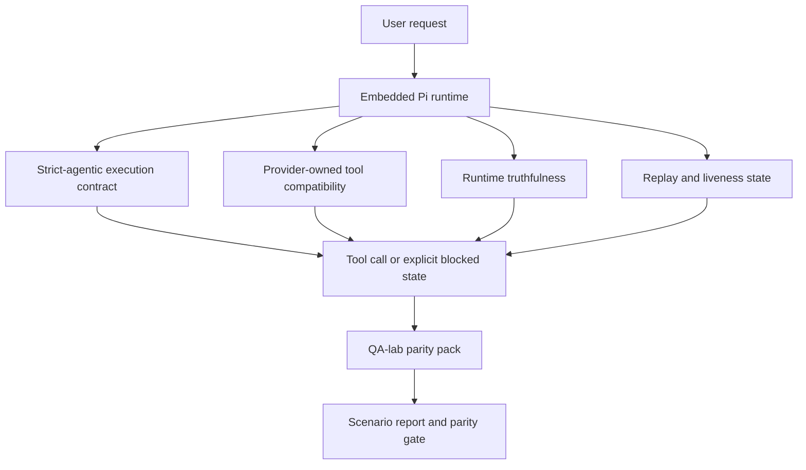
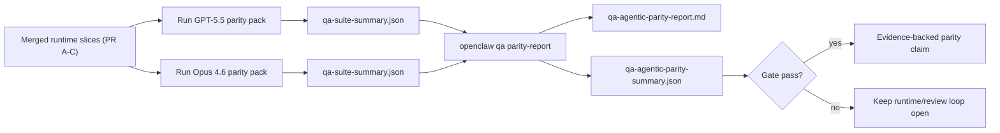

---
read_when:
    - Débogage du comportement agentique de GPT-5.5 ou Codex
    - Comparer le comportement agentique d’OpenClaw entre les modèles de pointe
    - Examen des correctifs strict-agentic, de schéma d’outils, d’élévation et de rejeu
summary: Comment OpenClaw comble les lacunes d’exécution agentique pour GPT-5.5 et les modèles de style Codex
title: Parité agentique GPT-5.5 / Codex
x-i18n:
  refreshed_at: '2026-04-28T04:45:00Z'
    generated_at: "2026-04-25T18:19:45Z"
    model: gpt-5.4
    provider: openai
    source_hash: 8a3b9375cd9e9d95855c4a1135953e00fd7a939e52fb7b75342da3bde2d83fe1
    source_path: help/gpt55-codex-agentic-parity.md
    workflow: 15
---

# Parité agentique GPT-5.5 / Codex dans OpenClaw

OpenClaw fonctionnait déjà bien avec les modèles de pointe utilisant des outils, mais GPT-5.5 et les modèles de style Codex restaient encore en retrait sur quelques points pratiques :

- ils pouvaient s’arrêter après la planification au lieu d’effectuer le travail
- ils pouvaient utiliser incorrectement les schémas d’outils stricts OpenAI/Codex
- ils pouvaient demander `/elevated full` même quand l’accès complet était impossible
- ils pouvaient perdre l’état des tâches longues pendant le rejeu ou la Compaction
- les affirmations de parité face à Claude Opus 4.6 reposaient sur des anecdotes plutôt que sur des scénarios reproductibles

Ce programme de parité corrige ces écarts en quatre tranches vérifiables.

## Ce qui a changé

### PR A : exécution strict-agentic

Cette tranche ajoute un contrat d’exécution `strict-agentic` activable pour les exécutions Pi GPT-5 intégrées.

Lorsqu’il est activé, OpenClaw n’accepte plus les tours limités à un plan comme une exécution « suffisamment bonne ». Si le modèle dit seulement ce qu’il a l’intention de faire sans réellement utiliser d’outils ni progresser, OpenClaw réessaie avec une incitation à agir immédiatement, puis échoue de manière fermée avec un état bloqué explicite au lieu de terminer silencieusement la tâche.

Cela améliore surtout l’expérience GPT-5.5 dans les cas suivants :

- courts suivis de type « ok fais-le »
- tâches de code où la première étape est évidente
- flux où `update_plan` doit servir au suivi de progression plutôt qu’à remplir avec du texte

### PR B : véracité du runtime

Cette tranche fait en sorte qu’OpenClaw dise la vérité sur deux points :

- pourquoi l’appel fournisseur/runtime a échoué
- si `/elevated full` est réellement disponible

Cela signifie que GPT-5.5 reçoit de meilleurs signaux runtime pour les portées manquantes, les échecs de rafraîchissement d’authentification, les échecs d’authentification HTML 403, les problèmes de proxy, les échecs DNS ou de délai d’attente, et les modes d’accès complet bloqués. Le modèle est moins susceptible d’halluciner la mauvaise remédiation ou de continuer à demander un mode d’autorisation que le runtime ne peut pas fournir.

### PR C : exactitude de l’exécution

Cette tranche améliore deux types d’exactitude :

- la compatibilité des schémas d’outils OpenAI/Codex gérée par le fournisseur
- la visibilité du rejeu et de la vitalité des tâches longues

Le travail de compatibilité des outils réduit les frictions de schéma pour l’enregistrement strict des outils OpenAI/Codex, surtout autour des outils sans paramètres et des attentes strictes d’objet racine. Le travail sur le rejeu/la vitalité rend les tâches longues plus observables, de sorte que les états en pause, bloqués et abandonnés restent visibles au lieu de disparaître dans un texte d’échec générique.

### PR D : harnais de parité

Cette tranche ajoute le premier pack de parité QA-lab afin que GPT-5.5 et Opus 4.6 puissent être exercés dans les mêmes scénarios et comparés à partir de preuves partagées.

Le pack de parité constitue la couche de preuve. Il ne modifie pas le comportement du runtime à lui seul.

Une fois que vous avez deux artefacts `qa-suite-summary.json`, générez la comparaison de gate de publication avec :

```bash
pnpm openclaw qa parity-report \
  --repo-root . \
  --candidate-summary .artifacts/qa-e2e/gpt55/qa-suite-summary.json \
  --baseline-summary .artifacts/qa-e2e/opus46/qa-suite-summary.json \
  --output-dir .artifacts/qa-e2e/parity
```

Cette commande écrit :

- un rapport Markdown lisible par un humain
- un verdict JSON lisible par une machine
- un résultat de gate explicite `pass` / `fail`

## Pourquoi cela améliore GPT-5.5 en pratique

Avant ce travail, GPT-5.5 sur OpenClaw pouvait sembler moins agentique qu’Opus dans de vraies sessions de code, car le runtime tolérait des comportements particulièrement nuisibles aux modèles de type GPT-5 :

- tours limités à des commentaires
- friction de schéma autour des outils
- retours flous sur les autorisations
- casse silencieuse du rejeu ou de la Compaction

L’objectif n’est pas de faire imiter Opus à GPT-5.5. L’objectif est de donner à GPT-5.5 un contrat runtime qui récompense une vraie progression, fournit des sémantiques plus propres pour les outils et les autorisations, et transforme les modes d’échec en états explicites lisibles par la machine et par l’humain.

Cela change l’expérience utilisateur de :

- « le modèle avait un bon plan mais s’est arrêté »

en :

- « le modèle a soit agi, soit OpenClaw a exposé la raison exacte pour laquelle il ne pouvait pas le faire »

## Avant vs après pour les utilisateurs de GPT-5.5

| Avant ce programme                                                                            | Après les PR A-D                                                                         |
| --------------------------------------------------------------------------------------------- | ---------------------------------------------------------------------------------------- |
| GPT-5.5 pouvait s’arrêter après un plan raisonnable sans effectuer l’étape d’outil suivante  | La PR A transforme « plan uniquement » en « agir maintenant ou exposer un état bloqué » |
| Les schémas d’outils stricts pouvaient rejeter les outils sans paramètres ou de forme OpenAI/Codex de manière déroutante | La PR C rend l’enregistrement et l’invocation des outils gérés par le fournisseur plus prévisibles |
| Les indications `/elevated full` pouvaient être vagues ou erronées dans les runtimes bloqués | La PR B fournit à GPT-5.5 et à l’utilisateur des indications runtime et d’autorisation véridiques |
| Les échecs de rejeu ou de Compaction pouvaient donner l’impression que la tâche avait silencieusement disparu | La PR C expose explicitement les résultats en pause, bloqués, abandonnés et invalides au rejeu |
| « GPT-5.5 semble pire qu’Opus » était surtout anecdotique                                    | La PR D transforme cela en même pack de scénarios, mêmes métriques et gate pass/fail stricte |

## Architecture



## Flux de publication



## Pack de scénarios

Le premier pack de parité couvre actuellement cinq scénarios :

### `approval-turn-tool-followthrough`

Vérifie que le modèle ne s’arrête pas à « je vais le faire » après une approbation courte. Il doit effectuer la première action concrète dans le même tour.

### `model-switch-tool-continuity`

Vérifie que le travail utilisant des outils reste cohérent à travers les changements de modèle/runtime au lieu de se réinitialiser en commentaires ou de perdre le contexte d’exécution.

### `source-docs-discovery-report`

Vérifie que le modèle peut lire le code source et la documentation, synthétiser les résultats et continuer la tâche de manière agentique au lieu de produire un résumé superficiel et de s’arrêter trop tôt.

### `image-understanding-attachment`

Vérifie que les tâches en mode mixte impliquant des pièces jointes restent exploitables et ne s’effondrent pas en narration vague.

### `compaction-retry-mutating-tool`

Vérifie qu’une tâche avec une vraie écriture mutante garde l’insécurité du rejeu explicite au lieu de sembler discrètement sûre pour le rejeu si l’exécution compacte, réessaie ou perd l’état de réponse sous pression.

## Matrice des scénarios

| Scénario                           | Ce qu’il teste                             | Bon comportement GPT-5.5                                                       | Signal d’échec                                                                  |
| ---------------------------------- | ------------------------------------------ | ------------------------------------------------------------------------------ | ------------------------------------------------------------------------------- |
| `approval-turn-tool-followthrough` | Tours d’approbation courts après un plan   | Démarre immédiatement la première action d’outil concrète au lieu de reformuler son intention | suivi limité au plan, aucune activité d’outil, ou tour bloqué sans vrai blocage |
| `model-switch-tool-continuity`     | Changement de runtime/modèle sous utilisation d’outils | Préserve le contexte de la tâche et continue à agir de manière cohérente       | réinitialisation en commentaires, perte du contexte des outils, ou arrêt après le changement |
| `source-docs-discovery-report`     | Lecture du code source + synthèse + action | Trouve les sources, utilise les outils et produit un rapport utile sans bloquer | résumé superficiel, travail d’outil manquant, ou arrêt de tour incomplet        |
| `image-understanding-attachment`   | Travail agentique piloté par pièce jointe  | Interprète la pièce jointe, la relie aux outils et poursuit la tâche           | narration vague, pièce jointe ignorée, ou absence d’action concrète suivante    |
| `compaction-retry-mutating-tool`   | Travail mutatif sous pression de Compaction | Effectue une vraie écriture et garde l’insécurité du rejeu explicite après l’effet de bord | écriture mutante effectuée mais sécurité de rejeu implicite, absente ou contradictoire |

## Gate de publication

GPT-5.5 ne peut être considéré à parité ou meilleur que lorsque le runtime fusionné passe le pack de parité et les régressions de véracité runtime en même temps.

Résultats requis :

- aucun blocage sur plan uniquement lorsque l’action d’outil suivante est claire
- aucune fausse fin sans exécution réelle
- aucune indication incorrecte `/elevated full`
- aucun abandon silencieux dû au rejeu ou à la Compaction
- des métriques du pack de parité au moins aussi fortes que la baseline Opus 4.6 convenue

Pour le premier harnais, la gate compare :

- taux d’achèvement
- taux d’arrêts non intentionnels
- taux d’appels d’outils valides
- nombre de faux succès

Les preuves de parité sont volontairement réparties en deux couches :

- la PR D prouve le comportement GPT-5.5 vs Opus 4.6 sur les mêmes scénarios avec QA-lab
- les suites déterministes de la PR B prouvent la véracité de l’authentification, du proxy, du DNS et de `/elevated full` en dehors du harnais

## Matrice objectif → preuve

| Élément de gate d’achèvement                            | PR responsable | Source de preuve                                                   | Signal de réussite                                                                    |
| ------------------------------------------------------- | -------------- | ------------------------------------------------------------------ | ------------------------------------------------------------------------------------- |
| GPT-5.5 ne bloque plus après la planification           | PR A           | `approval-turn-tool-followthrough` plus les suites runtime de la PR A | les tours d’approbation déclenchent un vrai travail ou un état bloqué explicite      |
| GPT-5.5 ne simule plus de progression ni de faux achèvement d’outil | PR A + PR D    | résultats des scénarios du rapport de parité et nombre de faux succès | aucun résultat de réussite suspect et aucun achèvement limité à des commentaires      |
| GPT-5.5 ne donne plus de faux conseils `/elevated full` | PR B           | suites déterministes de véracité                                    | les raisons de blocage et indications d’accès complet restent exactes côté runtime    |
| Les échecs de rejeu/vitalité restent explicites         | PR C + PR D    | suites lifecycle/replay de la PR C plus `compaction-retry-mutating-tool` | le travail mutatif garde l’insécurité du rejeu explicite au lieu de disparaître silencieusement |
| GPT-5.5 égale ou dépasse Opus 4.6 sur les métriques convenues | PR D           | `qa-agentic-parity-report.md` et `qa-agentic-parity-summary.json` | même couverture de scénarios et aucune régression sur l’achèvement, le comportement d’arrêt ou l’usage valide des outils |

## Comment lire le verdict de parité

Utilisez le verdict dans `qa-agentic-parity-summary.json` comme décision finale lisible par machine pour le premier pack de parité.

- `pass` signifie que GPT-5.5 a couvert les mêmes scénarios qu’Opus 4.6 et n’a pas régressé sur les métriques agrégées convenues.
- `fail` signifie qu’au moins une gate stricte a été déclenchée : achèvement plus faible, davantage d’arrêts non intentionnels, usage valide des outils plus faible, présence d’un faux succès, ou couverture de scénarios non correspondante.
- « problème CI partagé/de base » n’est pas en soi un résultat de parité. Si du bruit CI en dehors de la PR D bloque une exécution, le verdict doit attendre une exécution propre du runtime fusionné au lieu d’être déduit à partir de logs d’une branche antérieure.
- La véracité de l’authentification, du proxy, du DNS et de `/elevated full` provient toujours des suites déterministes de la PR B, donc l’affirmation finale de publication exige les deux : un verdict de parité PR D réussi et une couverture de véracité PR B au vert.

## Qui doit activer `strict-agentic`

Utilisez `strict-agentic` lorsque :

- on attend de l’agent qu’il agisse immédiatement quand l’étape suivante est évidente
- GPT-5.5 ou les modèles de la famille Codex constituent le runtime principal
- vous préférez des états bloqués explicites à des réponses « utiles » limitées à des récapitulatifs

Conservez le contrat par défaut lorsque :

- vous voulez le comportement existant, plus souple
- vous n’utilisez pas de modèles de la famille GPT-5
- vous testez des prompts plutôt que l’application des règles du runtime

## Liens associés

- [Notes mainteneur sur la parité GPT-5.5 / Codex](/fr/help/gpt55-codex-agentic-parity-maintainers)
