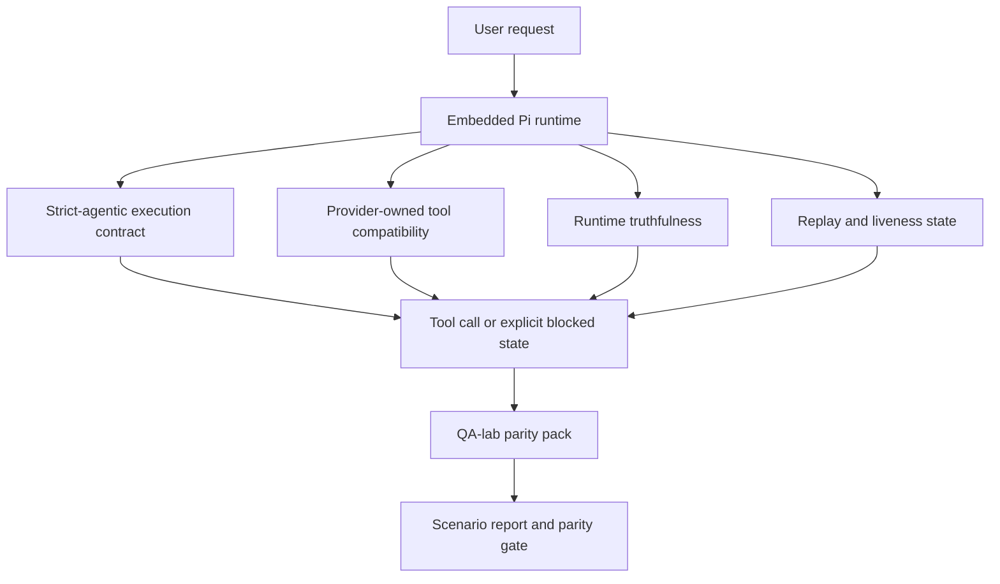
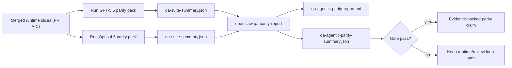

---
read_when:
    - Débogage du comportement de l’agent GPT-5.5 ou Codex
    - Comparer le comportement agentique d’OpenClaw sur différents modèles de pointe
    - Examen des correctifs strict-agentiques, de schéma d’outil, d’élévation et de rejeu
summary: Comment OpenClaw comble les lacunes de l’exécution agentique pour GPT-5.5 et les modèles de type Codex
title: Parité agentique GPT-5.5 / Codex
x-i18n:
    generated_at: "2026-05-06T07:25:56Z"
    model: gpt-5.5
    provider: openai
    source_hash: bbc32f418dfffe2786093fa6b42b19f92a2d382c9408dfc55dd0154d67959390
    source_path: help/gpt55-codex-agentic-parity.md
    workflow: 16
---

OpenClaw fonctionnait déjà bien avec les modèles de pointe utilisant des outils, mais GPT-5.5 et les modèles de style Codex restaient moins performants sur quelques points pratiques :

- ils pouvaient s’arrêter après la planification au lieu d’effectuer le travail
- ils pouvaient utiliser incorrectement les schémas d’outils OpenAI/Codex stricts
- ils pouvaient demander `/elevated full` même lorsque l’accès complet était impossible
- ils pouvaient perdre l’état des tâches de longue durée pendant la relecture ou la Compaction
- les affirmations de parité avec Claude Opus 4.6 reposaient sur des anecdotes plutôt que sur des scénarios reproductibles

Ce programme de parité corrige ces écarts en quatre volets révisables.

## Ce qui a changé

### PR A : exécution agentique stricte

Ce volet ajoute un contrat d’exécution `strict-agentic` activable pour les exécutions GPT-5 Pi intégrées.

Lorsqu’il est activé, OpenClaw cesse d’accepter les tours limités à un plan comme une fin « suffisante ». Si le modèle se contente de dire ce qu’il compte faire sans réellement utiliser d’outils ni progresser, OpenClaw réessaie avec une orientation d’action immédiate, puis échoue de façon fermée avec un état bloqué explicite au lieu de terminer silencieusement la tâche.

Cela améliore surtout l’expérience GPT-5.5 sur :

- les suivis courts du type « ok fais-le »
- les tâches de code où la première étape est évidente
- les flux où `update_plan` devrait suivre la progression plutôt que produire du texte de remplissage

### PR B : véracité du runtime

Ce volet fait en sorte qu’OpenClaw dise la vérité sur deux choses :

- pourquoi l’appel au fournisseur/runtime a échoué
- si `/elevated full` est réellement disponible

Cela signifie que GPT-5.5 reçoit de meilleurs signaux runtime pour les portées manquantes, les échecs de renouvellement d’authentification, les échecs d’authentification HTML 403, les problèmes de proxy, les échecs DNS ou de délai d’attente, et les modes d’accès complet bloqués. Le modèle est moins susceptible d’halluciner la mauvaise correction ou de continuer à demander un mode d’autorisation que le runtime ne peut pas fournir.

### PR C : exactitude de l’exécution

Ce volet améliore deux types d’exactitude :

- la compatibilité des schémas d’outils OpenAI/Codex appartenant au fournisseur
- l’exposition de la vivacité lors de la relecture et des tâches longues

Le travail sur la compatibilité des outils réduit les frictions de schéma pour l’enregistrement strict des outils OpenAI/Codex, en particulier autour des outils sans paramètres et des attentes strictes d’objet racine. Le travail sur la relecture/vivacité rend les tâches de longue durée plus observables, de sorte que les états en pause, bloqués et abandonnés sont visibles au lieu de disparaître dans un texte d’échec générique.

### PR D : harnais de parité

Ce volet ajoute le premier pack de parité QA-lab afin que GPT-5.5 et Opus 4.6 puissent être exercés à travers les mêmes scénarios et comparés avec des preuves partagées.

Le pack de parité est la couche de preuve. Il ne change pas le comportement runtime à lui seul.

Après avoir deux artefacts `qa-suite-summary.json`, générez la comparaison de porte de publication avec :

```bash
pnpm openclaw qa parity-report \
  --repo-root . \
  --candidate-summary .artifacts/qa-e2e/gpt55/qa-suite-summary.json \
  --baseline-summary .artifacts/qa-e2e/opus46/qa-suite-summary.json \
  --output-dir .artifacts/qa-e2e/parity
```

Cette commande écrit :

- un rapport Markdown lisible par un humain
- un verdict JSON lisible par machine
- un résultat de porte explicite `pass` / `fail`

## Pourquoi cela améliore GPT-5.5 en pratique

Avant ce travail, GPT-5.5 sur OpenClaw pouvait sembler moins agentique qu’Opus dans de vraies sessions de codage, car le runtime tolérait des comportements particulièrement nuisibles aux modèles de style GPT-5 :

- des tours composés uniquement de commentaires
- des frictions de schéma autour des outils
- des retours d’autorisation vagues
- des ruptures silencieuses de relecture ou de Compaction

L’objectif n’est pas de faire imiter Opus par GPT-5.5. L’objectif est de donner à GPT-5.5 un contrat runtime qui récompense la progression réelle, fournit une sémantique plus claire pour les outils et les autorisations, et transforme les modes d’échec en états explicites lisibles par machine et par humain.

Cela fait passer l’expérience utilisateur de :

- « le modèle avait un bon plan mais s’est arrêté »

à :

- « le modèle a agi, ou OpenClaw a exposé la raison exacte pour laquelle il ne pouvait pas »

## Avant/après pour les utilisateurs de GPT-5.5

| Avant ce programme                                                                            | Après les PR A-D                                                                             |
| ---------------------------------------------------------------------------------------------- | ---------------------------------------------------------------------------------------- |
| GPT-5.5 pouvait s’arrêter après un plan raisonnable sans effectuer l’étape d’outil suivante                   | La PR A transforme « plan seulement » en « agir maintenant ou exposer un état bloqué »                         |
| Les schémas d’outils stricts pouvaient rejeter des outils sans paramètres ou de forme OpenAI/Codex de manière confuse | La PR C rend l’enregistrement et l’invocation des outils appartenant au fournisseur plus prévisibles              |
| Les indications `/elevated full` pouvaient être vagues ou erronées dans les runtimes bloqués                          | La PR B donne à GPT-5.5 et à l’utilisateur des indices runtime et d’autorisation véridiques                    |
| Les échecs de relecture ou de Compaction pouvaient donner l’impression que la tâche avait disparu silencieusement                    | La PR C expose explicitement les résultats en pause, bloqués, abandonnés et invalides à la relecture         |
| « GPT-5.5 semble moins bon qu’Opus » était surtout anecdotique                                           | La PR D transforme cela en un même pack de scénarios, les mêmes métriques et une porte stricte réussite/échec |

## Architecture



## Flux de publication



## Pack de scénarios

Le premier pack de parité couvre actuellement cinq scénarios :

### `approval-turn-tool-followthrough`

Vérifie que le modèle ne s’arrête pas à « Je vais faire cela » après une courte approbation. Il doit effectuer la première action concrète dans le même tour.

### `model-switch-tool-continuity`

Vérifie que le travail utilisant des outils reste cohérent au-delà des frontières de changement de modèle/runtime, au lieu de revenir à du commentaire ou de perdre le contexte d’exécution.

### `source-docs-discovery-report`

Vérifie que le modèle peut lire la source et les docs, synthétiser les résultats et poursuivre la tâche de manière agentique plutôt que de produire un résumé superficiel et de s’arrêter trop tôt.

### `image-understanding-attachment`

Vérifie que les tâches mixtes impliquant des pièces jointes restent exploitables et ne se réduisent pas à une narration vague.

### `compaction-retry-mutating-tool`

Vérifie qu’une tâche comportant une vraie écriture mutante conserve explicitement l’insécurité de relecture au lieu de sembler discrètement sûre à relire si l’exécution est compactée, réessayée ou perd l’état de réponse sous pression.

## Matrice des scénarios

| Scénario                           | Ce qu’il teste                           | Bon comportement GPT-5.5                                                          | Signal d’échec                                                                 |
| ---------------------------------- | --------------------------------------- | ------------------------------------------------------------------------------ | ------------------------------------------------------------------------------ |
| `approval-turn-tool-followthrough` | Tours d’approbation courts après un plan       | Démarre immédiatement la première action d’outil concrète au lieu de reformuler l’intention  | suivi limité au plan, aucune activité d’outil, ou tour bloqué sans vrai bloqueur  |
| `model-switch-tool-continuity`     | Changement runtime/modèle pendant l’utilisation d’outils  | Préserve le contexte de tâche et continue à agir de manière cohérente                         | revient à du commentaire, perd le contexte d’outil, ou s’arrête après le changement              |
| `source-docs-discovery-report`     | Lecture de source + synthèse + action     | Trouve les sources, utilise les outils et produit un rapport utile sans bloquer       | résumé superficiel, travail d’outil manquant, ou arrêt de tour incomplet                       |
| `image-understanding-attachment`   | Travail agentique guidé par pièce jointe          | Interprète la pièce jointe, la relie aux outils et poursuit la tâche        | narration vague, pièce jointe ignorée, ou aucune action suivante concrète                |
| `compaction-retry-mutating-tool`   | Travail mutant sous pression de Compaction | Effectue une vraie écriture et conserve explicitement l’insécurité de relecture après l’effet de bord | l’écriture mutante se produit mais la sécurité de relecture est implicite, absente ou contradictoire |

## Porte de publication

GPT-5.5 ne peut être considéré à parité ou meilleur que lorsque le runtime fusionné réussit simultanément le pack de parité et les régressions de véracité runtime.

Résultats requis :

- aucun blocage limité au plan lorsque la prochaine action d’outil est claire
- aucune fausse complétion sans exécution réelle
- aucune indication `/elevated full` incorrecte
- aucun abandon silencieux lors de la relecture ou de la Compaction
- des métriques du pack de parité au moins aussi fortes que la référence Opus 4.6 convenue

Pour le harnais de première vague, la porte compare :

- le taux de complétion
- le taux d’arrêt involontaire
- le taux d’appels d’outils valides
- le nombre de faux succès

Les preuves de parité sont volontairement réparties sur deux couches :

- la PR D prouve le comportement GPT-5.5 vs Opus 4.6 sur les mêmes scénarios avec QA-lab
- les suites déterministes de la PR B prouvent la véracité pour l’authentification, le proxy, le DNS et `/elevated full` hors du harnais

## Matrice objectif-preuve

| Élément de porte de complétion                                     | PR propriétaire   | Source de preuve                                                    | Signal de réussite                                                                              |
| -------------------------------------------------------- | ----------- | ------------------------------------------------------------------ | ---------------------------------------------------------------------------------------- |
| GPT-5.5 ne bloque plus après la planification                  | PR A        | `approval-turn-tool-followthrough` plus les suites runtime de la PR A        | les tours d’approbation déclenchent un vrai travail ou un état bloqué explicite                            |
| GPT-5.5 ne simule plus la progression ou la complétion d’outil | PR A + PR D | résultats des scénarios du rapport de parité et nombre de faux succès             | aucun résultat de réussite suspect et aucune complétion composée uniquement de commentaires                             |
| GPT-5.5 ne donne plus de fausses indications `/elevated full`  | PR B        | suites déterministes de véracité                                  | les raisons de blocage et les indices d’accès complet restent exacts côté runtime                              |
| Les échecs de relecture/vivacité restent explicites                   | PR C + PR D | suites cycle de vie/relecture de la PR C plus `compaction-retry-mutating-tool` | le travail mutant conserve explicitement l’insécurité de relecture au lieu de disparaître silencieusement            |
| GPT-5.5 égale ou dépasse Opus 4.6 sur les métriques convenues  | PR D        | `qa-agentic-parity-report.md` et `qa-agentic-parity-summary.json` | même couverture de scénarios et aucune régression sur la complétion, le comportement d’arrêt ou l’utilisation valide des outils |

## Comment lire le verdict de parité

Utilisez le verdict dans `qa-agentic-parity-summary.json` comme décision finale lisible par machine pour le premier pack de parité.

- `pass` signifie que GPT-5.5 a couvert les mêmes scénarios qu’Opus 4.6 et n’a pas régressé sur les métriques agrégées convenues.
- `fail` signifie qu’au moins une barrière stricte a été déclenchée : achèvement plus faible, arrêts involontaires plus nombreux, utilisation valide des outils plus faible, tout cas de faux succès ou couverture de scénarios non concordante.
- « problème CI partagé/de base » n’est pas en soi un résultat de parité. Si du bruit CI en dehors de la PR D bloque une exécution, le verdict doit attendre une exécution propre du runtime fusionné au lieu d’être déduit de journaux datant de la branche.
- La véracité concernant l’authentification, le proxy, le DNS et `/elevated full` provient toujours des suites déterministes de la PR B ; l’affirmation finale de publication nécessite donc les deux : un verdict de parité PR D réussi et une couverture de véracité PR B au vert.

## Qui doit activer `strict-agentic`

Utilisez `strict-agentic` lorsque :

- l’agent est censé agir immédiatement quand une étape suivante est évidente
- GPT-5.5 ou les modèles de la famille Codex constituent le runtime principal
- vous préférez des états bloqués explicites aux réponses « utiles » qui se limitent à récapituler

Conservez le contrat par défaut lorsque :

- vous voulez le comportement existant plus souple
- vous n’utilisez pas les modèles de la famille GPT-5
- vous testez des prompts plutôt que l’application par le runtime

## Connexe

- [Notes mainteneur sur la parité GPT-5.5 / Codex](/fr/help/gpt55-codex-agentic-parity-maintainers)
