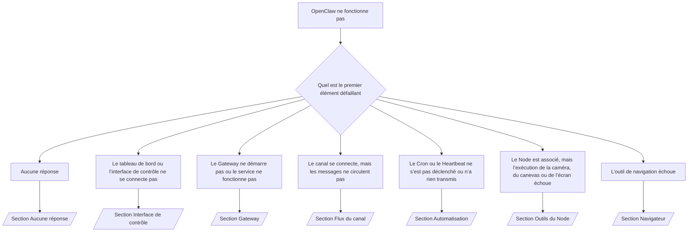

---
read_when:
    - OpenClaw ne fonctionne pas et vous devez trouver le moyen le plus rapide de résoudre le problème
    - Vous souhaitez un processus de triage avant de vous plonger dans des procédures opérationnelles détaillées.
summary: Centre de dépannage d’OpenClaw axé d’abord sur les symptômes
title: Dépannage général
x-i18n:
    generated_at: "2026-07-12T02:43:14Z"
    model: gpt-5.6
    postprocess_version: locale-links-v1
    provider: openai
    source_hash: db50e0cdf4d11f3aa6196be445358d904a2b9c40c89243f1b124c77167f6dd85
    source_path: help/troubleshooting.md
    workflow: 16
---

Porte d’entrée du triage. 2 minutes pour établir un diagnostic, puis passez à la page détaillée.

## Les 60 premières secondes

Exécutez cette séquence dans l’ordre :

```bash
openclaw status
openclaw status --all
openclaw gateway probe
openclaw gateway status
openclaw doctor
openclaw channels status --probe
openclaw logs --follow
```

Sortie correcte, une ligne pour chaque commande :

- `openclaw status` affiche les canaux configurés, sans erreur d’authentification.
- `openclaw status --all` produit un rapport complet et partageable.
- `openclaw gateway probe` affiche `Reachable: yes`. `Capability: ...` correspond au
  niveau d’authentification confirmé par la sonde ; `Read probe: limited - missing scope:
operator.read` indique un diagnostic dégradé, et non un échec de connexion.
- `openclaw gateway status` affiche `Runtime: running`, `Connectivity probe:
ok` et une valeur plausible pour `Capability: ...`. Ajoutez `--require-rpc` pour exiger
  également une validation RPC de la portée de lecture.
- `openclaw doctor` ne signale aucune erreur bloquante de configuration ou de service.
- `openclaw channels status --probe` renvoie l’état réel du transport pour chaque compte
  (`works` / `audit ok`) lorsque le Gateway est accessible ; sinon, la commande
  se rabat sur des résumés fondés uniquement sur la configuration.
- `openclaw logs --follow` affiche une activité régulière, sans erreurs fatales répétées.

## L’assistant semble limité ou certains outils sont absents

Vérifiez le profil d’outils effectif :

```bash
openclaw status
openclaw status --all
openclaw doctor
```

Causes courantes :

- `tools.profile: "minimal"` autorise uniquement `session_status`.
- `tools.profile: "messaging"` est restreint et destiné aux agents de discussion uniquement.
- `tools.profile: "coding"` est le profil par défaut des nouvelles configurations locales
  (travail sur les dépôts, les fichiers, le shell et l’environnement d’exécution).
- `tools.profile: "full"` supprime les restrictions du profil ; réservez-le aux agents
  de confiance contrôlés par un opérateur.
- La configuration `agents.list[].tools` propre à chaque agent restreint ou étend le profil
  racine pour cet agent.

Modifiez le profil, redémarrez ou rechargez le Gateway, puis vérifiez à nouveau avec
`openclaw status --all`. Tableau complet des profils et groupes : [Profils d’outils](/fr/gateway/config-tools#tool-profiles).

## Erreur 429 d’Anthropic avec un contexte long

`HTTP 429: rate_limit_error: Extra usage is required for long context requests`
→ [Utilisation supplémentaire requise pour les contextes longs lors d’une erreur 429 d’Anthropic](/fr/gateway/troubleshooting#anthropic-429-extra-usage-required-for-long-context).

## Le backend local compatible avec OpenAI fonctionne directement, mais échoue dans OpenClaw

Votre backend `/v1` local ou auto-hébergé répond aux sondes directes
`/v1/chat/completions`, mais échoue avec `openclaw infer model run` ou pendant
les interactions normales d’un agent :

1. Si l’erreur indique que `messages[].content` doit être une chaîne, définissez
   `models.providers.<provider>.models[].compat.requiresStringContent: true`.
2. Si l’échec persiste uniquement pendant les interactions des agents OpenClaw, définissez
   `models.providers.<provider>.models[].compat.supportsTools: false`, puis réessayez.
3. Si les petits appels directs fonctionnent, mais que les requêtes OpenClaw plus volumineuses
   font planter le backend, il s’agit d’une limite du modèle ou du serveur en amont, et non
   d’un bogue d’OpenClaw. Poursuivez avec
   [Le backend local compatible avec OpenAI réussit les sondes directes, mais les exécutions d’agents échouent](/fr/gateway/troubleshooting#local-openai-compatible-backend-passes-direct-probes-but-agent-runs-fail).

## L’installation du Plugin échoue en raison de l’absence d’extensions OpenClaw

`package.json missing openclaw.extensions` signifie que le paquet du Plugin utilise une
structure qu’OpenClaw n’accepte plus.

Correctif dans le paquet du Plugin :

1. Ajoutez `openclaw.extensions` à `package.json` en le faisant pointer vers les fichiers
   compilés de l’environnement d’exécution (généralement `./dist/index.js`).
2. Republiez le paquet, puis exécutez à nouveau `openclaw plugins install <package>`.

```json
{
  "name": "@openclaw/my-plugin",
  "version": "1.2.3",
  "openclaw": {
    "extensions": ["./dist/index.js"]
  }
}
```

Référence : [Architecture des Plugins](/fr/plugins/architecture)

## La politique d’installation bloque l’installation ou la mise à jour des Plugins

La mise à jour se termine, mais les Plugins sont obsolètes, désactivés ou affichent
`blocked by install policy`, `install policy failed closed` ou
`Disabled "<plugin>" after plugin update failure` : vérifiez `security.installPolicy`.

La politique d’installation s’applique aux installations et mises à jour des Plugins.
Les versions des Plugins `@openclaw/*` évoluent normalement avec la version d’OpenClaw ;
une mise à jour d’OpenClaw peut donc nécessiter une mise à jour correspondante des Plugins
pendant la synchronisation qui suit la mise à jour.

Évitez les formes de politique suivantes, sauf si vous maintenez également la règle
de mise à niveau correspondante :

- Verrouiller les Plugins appartenant à OpenClaw sur une seule ancienne version exacte
  (par exemple uniquement `@openclaw/*@2026.5.3`).
- Bloquer uniquement selon le type de source (toutes les requêtes npm, réseau ou
  `request.mode: "update"`).
- Considérer la commande de politique comme facultative : lorsque `security.installPolicy`
  est activé, l’absence, la lenteur, l’illisibilité ou le blocage par les permissions
  de l’exécutable de politique provoque un échec par défaut.
- Approuver des versions sans comparer la valeur `openclawVersion` de la requête
  aux métadonnées du Plugin candidat.

Préférez des règles qui autorisent les mises à jour fiables de `@openclaw/*` compatibles
avec l’hôte actuel plutôt que de verrouiller indéfiniment une version. Si vous bloquez npm
par défaut, ajoutez une exception restreinte pour les identifiants des Plugins que vous
utilisez et appliquez à `request.mode: "update"` la même règle de confiance qu’aux
installations.

Récupération :

```bash
openclaw doctor --deep
openclaw plugins update --all
openclaw status --all
```

Si la politique est volontairement stricte, assouplissez-la pendant la période de mise
à niveau fiable, réexécutez `openclaw plugins update --all`, puis rétablissez la règle
plus stricte. Si l’échec de la mise à jour a désactivé un Plugin, inspectez-le avant
de le réactiver :

```bash
openclaw plugins inspect <plugin-id> --runtime --json
openclaw plugins enable <plugin-id>
```

Référence : [Politique d’installation de l’opérateur](/fr/tools/skills-config#operator-install-policy-securityinstallpolicy)

## Le Plugin est présent, mais bloqué en raison d’un propriétaire suspect

`openclaw doctor`, la configuration ou les avertissements de démarrage affichent :

```text
blocked plugin candidate: suspicious ownership (... uid=1000, expected uid=0 or root)
plugin present but blocked
```

Les fichiers du Plugin appartiennent à un utilisateur Unix différent de celui du processus
qui les charge. Ne supprimez pas la configuration du Plugin ; corrigez le propriétaire
des fichiers ou exécutez OpenClaw avec l’utilisateur propriétaire du répertoire d’état.

Les installations Docker s’exécutent avec l’utilisateur `node` (uid `1000`). Corrigez
les montages liés de l’hôte :

```bash
sudo chown -R 1000:1000 /path/to/openclaw-config /path/to/openclaw-workspace
openclaw doctor --fix
```

Si vous exécutez volontairement OpenClaw en tant que superutilisateur, corrigez plutôt
la racine gérée des Plugins :

```bash
sudo chown -R root:root /path/to/openclaw-config/npm
openclaw doctor --fix
```

Documentation détaillée : [Propriétaire bloquant du chemin d’un Plugin](/fr/tools/plugin#blocked-plugin-path-ownership), [Docker : permissions et EACCES](/fr/install/docker#shell-helpers-optional)

## Arbre de décision



<AccordionGroup>
  <Accordion title="Aucune réponse">
    ```bash
    openclaw status
    openclaw gateway status
    openclaw channels status --probe
    openclaw pairing list --channel <channel> [--account <id>]
    openclaw logs --follow
    ```

    Sortie correcte :

    - `Runtime: running`
    - `Connectivity probe: ok`
    - `Capability: read-only`, `write-capable` ou `admin-capable`
    - Le canal indique que le transport est connecté et, lorsque cette fonction est prise
      en charge, affiche `works` ou `audit ok` dans `channels status --probe`
    - L’expéditeur est approuvé (ou la politique des messages privés est ouverte ou utilise
      une liste d’autorisation)

    Signatures dans les journaux :

    - `drop guild message (mention required` → le filtrage des mentions de Discord a bloqué le message.
    - `pairing request` → l’expéditeur n’est pas approuvé et attend l’approbation de l’association par message privé.
    - `blocked` / `allowlist` dans les journaux du canal → l’expéditeur, le salon ou le groupe a été filtré.

    Pages détaillées : [Aucune réponse](/fr/gateway/troubleshooting#no-replies), [Dépannage des canaux](/fr/channels/troubleshooting), [Association](/fr/channels/pairing)

  </Accordion>

  <Accordion title="Le tableau de bord ou l’interface de contrôle ne se connecte pas">
    ```bash
    openclaw status
    openclaw gateway status
    openclaw logs --follow
    openclaw doctor
    openclaw channels status --probe
    ```

    Sortie correcte :

    - `Dashboard: http://...` apparaît dans `openclaw gateway status`
    - `Connectivity probe: ok`
    - `Capability: read-only`, `write-capable` ou `admin-capable`
    - Aucune boucle d’authentification dans les journaux

    Signatures dans les journaux :

    - `device identity required` → un contexte HTTP ou non sécurisé ne peut pas terminer l’authentification de l’appareil.
    - `origin not allowed` → l’`Origin` du navigateur n’est pas autorisée pour la cible Gateway de l’interface de contrôle.
    - `AUTH_TOKEN_MISMATCH` avec `canRetryWithDeviceToken=true` → une nouvelle tentative avec le jeton d’un appareil fiable peut avoir lieu automatiquement en réutilisant les portées mises en cache du jeton associé.
    - Des erreurs `unauthorized` répétées après cette nouvelle tentative → jeton ou mot de passe incorrect, incohérence du mode d’authentification ou jeton obsolète de l’appareil associé.
    - `too many failed authentication attempts (retry later)` → les échecs répétés provenant de cette `Origin` du navigateur sont temporairement bloqués ; les autres origines localhost utilisent des compartiments distincts. Consultez [Connectivité du tableau de bord et de l’interface de contrôle](/fr/gateway/troubleshooting#dashboard-control-ui-connectivity) pour la particularité des nouvelles tentatives simultanées avec Tailscale Serve.
    - `gateway connect failed:` → l’interface cible une URL ou un port incorrect, ou le Gateway est inaccessible.

    Pages détaillées : [Connectivité du tableau de bord et de l’interface de contrôle](/fr/gateway/troubleshooting#dashboard-control-ui-connectivity), [Interface de contrôle](/fr/web/control-ui), [Authentification](/fr/gateway/authentication)

  </Accordion>

  <Accordion title="Le Gateway ne démarre pas ou le service est installé, mais ne fonctionne pas">
    ```bash
    openclaw status
    openclaw gateway status
    openclaw logs --follow
    openclaw doctor
    openclaw channels status --probe
    ```

    Sortie correcte :

    - `Service: ... (loaded)`
    - `Runtime: running`
    - `Connectivity probe: ok`
    - `Capability: read-only`, `write-capable` ou `admin-capable`

    Signatures dans les journaux :

    - `Gateway start blocked: set gateway.mode=local` ou `existing config is missing gateway.mode` → le mode du Gateway est distant, ou la configuration ne contient pas l’indicateur du mode local et doit être réparée.
    - `refusing to bind gateway ... without auth` → liaison à une adresse autre que local loopback sans méthode d’authentification valide (jeton ou mot de passe, ou proxy de confiance lorsqu’il est configuré).
    - `another gateway instance is already listening` ou `EADDRINUSE` → le port est déjà utilisé.

    Pages détaillées : [Le service Gateway ne fonctionne pas](/fr/gateway/troubleshooting#gateway-service-not-running), [Processus en arrière-plan](/fr/gateway/background-process), [Configuration](/fr/gateway/configuration)

  </Accordion>

  <Accordion title="Le canal se connecte, mais les messages ne circulent pas">
    ```bash
    openclaw status
    openclaw gateway status
    openclaw logs --follow
    openclaw doctor
    openclaw channels status --probe
    ```

    Sortie correcte :

    - Le transport du canal est connecté.
    - Les vérifications d’association et de liste d’autorisation réussissent.
    - Les mentions sont détectées lorsqu’elles sont requises.

    Signatures dans les journaux :

    - `mention required` → le filtrage des mentions de groupe a bloqué le traitement.
    - `pairing` / `pending` → l’expéditeur du message privé n’est pas encore approuvé.
    - `not_in_channel`, `missing_scope`, `Forbidden`, `401/403` → problème de jeton d’autorisation du canal.

    Pages détaillées : [Canal connecté, mais les messages ne circulent pas](/fr/gateway/troubleshooting#channel-connected-messages-not-flowing), [Dépannage des canaux](/fr/channels/troubleshooting)

  </Accordion>

  <Accordion title="Le Cron ou le Heartbeat ne s’est pas déclenché ou n’a rien transmis">
    ```bash
    openclaw status
    openclaw gateway status
    openclaw cron status
    openclaw cron list
    openclaw cron runs --id <jobId> --limit 20
    openclaw logs --follow
    ```

    Sortie correcte :

    - `cron status` indique que le planificateur est activé et affiche son prochain réveil.
    - `cron runs` affiche des entrées `ok` récentes.
    - Le Heartbeat est activé et se trouve dans la plage des heures actives.

    Signatures dans les journaux :

    - `cron: scheduler disabled; jobs will not run automatically` → Cron est désactivé.
    - `heartbeat skipped` avec la raison `quiet-hours` → en dehors des heures d’activité configurées.
    - `heartbeat skipped` avec la raison `empty-heartbeat-file` → `HEARTBEAT.md` existe, mais ne contient que des éléments de structure vides : lignes blanches, commentaires, en-têtes, délimiteurs de blocs de code ou listes de contrôle vides.
    - `heartbeat skipped` avec la raison `no-tasks-due` → le mode tâche est actif, mais l’intervalle d’aucune tâche n’est encore arrivé à échéance.
    - `heartbeat skipped` avec la raison `alerts-disabled` → `showOk`, `showAlerts` et `useIndicator` sont tous désactivés.
    - `requests-in-flight` → voie principale occupée ; réveil du Heartbeat différé.
    - `unknown accountId` → le compte cible de la livraison du Heartbeat n’existe pas.

    Pages détaillées : [Livraison des tâches Cron et du Heartbeat](/fr/gateway/troubleshooting#cron-and-heartbeat-delivery), [Tâches planifiées : dépannage](/fr/automation/cron-jobs#troubleshooting), [Heartbeat](/fr/gateway/heartbeat)

  </Accordion>

  <Accordion title="Le Node est appairé, mais l’outil échoue pour la caméra, le canevas, l’écran ou l’exécution">
    ```bash
    openclaw status
    openclaw gateway status
    openclaw nodes status
    openclaw nodes describe --node <idOrNameOrIp>
    openclaw logs --follow
    ```

    Sortie attendue :

    - Le Node est indiqué comme connecté et appairé pour le rôle `node`.
    - La fonctionnalité requise par la commande invoquée existe.
    - L’autorisation de l’outil est accordée.

    Signatures de journal :

    - `NODE_BACKGROUND_UNAVAILABLE` → ramenez l’application du Node au premier plan.
    - `*_PERMISSION_REQUIRED` → autorisation du système d’exploitation refusée ou manquante.
    - `SYSTEM_RUN_DENIED: approval required` → l’approbation de l’exécution est en attente.
    - `SYSTEM_RUN_DENIED: allowlist miss` → la commande ne figure pas dans la liste d’autorisation d’exécution.

    Pages détaillées : [Node appairé, échec de l’outil](/fr/gateway/troubleshooting#node-paired-tool-fails), [Dépannage des Nodes](/fr/nodes/troubleshooting), [Approbations d’exécution](/fr/tools/exec-approvals)

  </Accordion>

  <Accordion title="L’exécution demande soudainement une approbation">
    ```bash
    openclaw config get tools.exec.host
    openclaw config get tools.exec.security
    openclaw config get tools.exec.ask
    openclaw gateway restart
    ```

    Ce qui a changé :

    - Si `tools.exec.host` n’est pas défini, sa valeur par défaut est `auto`, qui se résout en `sandbox`
      lorsqu’un environnement d’exécution isolé est actif, et en `gateway` dans le cas contraire.
    - `host=auto` détermine uniquement le routage ; l’absence de demande de confirmation provient de
      `security=full` associé à `ask=off` sur le Gateway ou le Node.
    - Si `tools.exec.security` n’est pas défini, sa valeur par défaut est `full` sur `gateway`/`node`.
    - Si `tools.exec.ask` n’est pas défini, sa valeur par défaut est `off`.
    - Si des approbations vous sont demandées, une politique locale à l’hôte ou propre à la session
      a renforcé les restrictions d’exécution par rapport à ces valeurs par défaut.

    Rétablissez les valeurs par défaut actuelles sans approbation :

    ```bash
    openclaw config set tools.exec.host gateway
    openclaw config set tools.exec.security full
    openclaw config set tools.exec.ask off
    openclaw gateway restart
    ```

    Solutions plus sûres :

    - Définissez uniquement `tools.exec.host=gateway` pour assurer un routage stable vers l’hôte.
    - Utilisez `security=allowlist` avec `ask=on-miss` pour exécuter sur l’hôte avec vérification
      lorsque la commande ne figure pas dans la liste d’autorisation.
    - Activez le mode isolé afin que `host=auto` se résolve de nouveau en `sandbox`.

    Signatures de journal :

    - `Approval required.` → la commande attend une instruction `/approve ...`.
    - `SYSTEM_RUN_DENIED: approval required` → l’approbation de l’exécution sur l’hôte Node est en attente.
    - `exec host=sandbox requires a sandbox runtime for this session` → sélection implicite ou explicite de l’environnement isolé alors que le mode isolé est désactivé.

    Pages détaillées : [Exécution](/fr/tools/exec), [Approbations d’exécution](/fr/tools/exec-approvals), [Sécurité : éléments vérifiés par l’audit](/fr/gateway/security#what-the-audit-checks-high-level)

  </Accordion>

  <Accordion title="Échec de l’outil de navigation">
    ```bash
    openclaw status
    openclaw gateway status
    openclaw browser status
    openclaw logs --follow
    openclaw doctor
    ```

    Sortie attendue :

    - L’état du navigateur affiche `running: true` ainsi qu’un navigateur et un profil sélectionnés.
    - Le profil `openclaw` démarre, ou le profil `user` détecte les onglets Chrome locaux.

    Signatures de journal :

    - `unknown command "browser"` → `plugins.allow` est défini et exclut `browser`.
    - `Failed to start Chrome CDP on port` → échec du lancement du navigateur local.
    - `browser.executablePath not found` → le chemin configuré vers le fichier exécutable est incorrect.
    - `browser.cdpUrl must be http(s) or ws(s)` → l’URL CDP configurée utilise un schéma non pris en charge.
    - `browser.cdpUrl has invalid port` → le port de l’URL CDP configurée est incorrect ou hors plage.
    - `No Chrome tabs found for profile="user"` → le profil de connexion Chrome MCP ne dispose d’aucun onglet Chrome local ouvert.
    - `Remote CDP for profile "<name>" is not reachable` → le point de terminaison CDP distant configuré n’est pas accessible depuis cet hôte.
    - `Browser attachOnly is enabled ... not reachable` → le profil en connexion seule ne dispose d’aucune cible CDP active.
    - Remplacements obsolètes de la fenêtre d’affichage, du mode sombre, des paramètres régionaux ou du mode hors ligne sur les profils en connexion seule ou CDP distants → exécutez `openclaw browser stop --browser-profile <name>` pour fermer la session de contrôle et libérer l’état d’émulation sans redémarrer le Gateway.

    Pages détaillées : [Échec de l’outil de navigation](/fr/gateway/troubleshooting#browser-tool-fails), [Commande ou outil de navigation manquant](/fr/tools/browser#missing-browser-command-or-tool), [Navigateur : dépannage sous Linux](/fr/tools/browser-linux-troubleshooting), [Navigateur : dépannage du CDP distant sous WSL2/Windows](/fr/tools/browser-wsl2-windows-remote-cdp-troubleshooting)

  </Accordion>

</AccordionGroup>

## Pages connexes

- [FAQ](/fr/help/faq) — questions fréquentes
- [Dépannage du Gateway](/fr/gateway/troubleshooting) — problèmes propres au Gateway
- [Doctor](/fr/gateway/doctor) — contrôles d’intégrité et réparations automatisés
- [Dépannage des canaux](/fr/channels/troubleshooting) — problèmes de connectivité des canaux
- [Tâches planifiées : dépannage](/fr/automation/cron-jobs#troubleshooting) — problèmes liés aux tâches Cron et au Heartbeat
