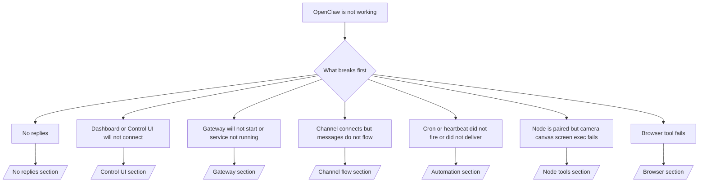

---
read_when:
    - OpenClaw ne fonctionne pas et vous avez besoin du moyen le plus rapide de résoudre le problème
    - Vous souhaitez un processus de triage avant de vous plonger dans des procédures d’exploitation détaillées
summary: Centre de dépannage d’OpenClaw axé d’abord sur les symptômes
title: Dépannage général
x-i18n:
    generated_at: "2026-05-06T07:26:55Z"
    model: gpt-5.5
    provider: openai
    source_hash: 624fa34cda3b440fa9cc636beb3fe6e3608a77a332933fa593097ebc556ac745
    source_path: help/troubleshooting.md
    workflow: 16
---

Si vous n’avez que 2 minutes, utilisez cette page comme point d’entrée de triage.

## 60 premières secondes

Exécutez cette échelle exacte dans l’ordre :

```bash
openclaw status
openclaw status --all
openclaw gateway probe
openclaw gateway status
openclaw doctor
openclaw channels status --probe
openclaw logs --follow
```

Sortie correcte en une ligne :

- `openclaw status` → affiche les canaux configurés et aucune erreur d’authentification évidente.
- `openclaw status --all` → le rapport complet est présent et partageable.
- `openclaw gateway probe` → la cible Gateway attendue est joignable (`Reachable: yes`). `Capability: ...` vous indique le niveau d’authentification que la sonde a pu prouver, et `Read probe: limited - missing scope: operator.read` correspond à des diagnostics dégradés, pas à un échec de connexion.
- `openclaw gateway status` → `Runtime: running`, `Connectivity probe: ok`, et une ligne `Capability: ...` plausible. Utilisez `--require-rpc` si vous avez aussi besoin d’une preuve RPC avec périmètre de lecture.
- `openclaw doctor` → aucune erreur bloquante de configuration ou de service.
- `openclaw channels status --probe` → un Gateway joignable renvoie l’état de transport en direct par compte, ainsi que les résultats de sonde/audit tels que `works` ou `audit ok` ; si le Gateway est injoignable, la commande revient à des résumés basés uniquement sur la configuration.
- `openclaw logs --follow` → activité stable, aucune erreur fatale répétée.

## 429 Anthropic en contexte long

Si vous voyez :
`HTTP 429: rate_limit_error: Extra usage is required for long context requests`,
allez à [/gateway/troubleshooting#anthropic-429-extra-usage-required-for-long-context](/fr/gateway/troubleshooting#anthropic-429-extra-usage-required-for-long-context).

## Le backend local compatible OpenAI fonctionne directement mais échoue dans OpenClaw

Si votre backend local ou auto-hébergé `/v1` répond aux petites sondes directes
`/v1/chat/completions` mais échoue sur `openclaw infer model run` ou lors des tours
normaux de l’agent :

1. Si l’erreur mentionne `messages[].content` attendant une chaîne, définissez
   `models.providers.<provider>.models[].compat.requiresStringContent: true`.
2. Si le backend échoue encore uniquement lors des tours d’agent OpenClaw, définissez
   `models.providers.<provider>.models[].compat.supportsTools: false` et réessayez.
3. Si les très petits appels directs fonctionnent encore mais que les prompts OpenClaw
   plus volumineux font planter le backend, traitez le problème restant comme une
   limitation du modèle/serveur amont et poursuivez dans le runbook approfondi :
   [/gateway/troubleshooting#local-openai-compatible-backend-passes-direct-probes-but-agent-runs-fail](/fr/gateway/troubleshooting#local-openai-compatible-backend-passes-direct-probes-but-agent-runs-fail)

## L’installation du Plugin échoue avec des extensions openclaw manquantes

Si l’installation échoue avec `package.json missing openclaw.extensions`, le package Plugin
utilise une ancienne forme qu’OpenClaw n’accepte plus.

Corrigez dans le package Plugin :

1. Ajoutez `openclaw.extensions` à `package.json`.
2. Faites pointer les entrées vers les fichiers runtime compilés (généralement `./dist/index.js`).
3. Republiez le Plugin et relancez `openclaw plugins install <package>`.

Exemple :

```json
{
  "name": "@openclaw/my-plugin",
  "version": "1.2.3",
  "openclaw": {
    "extensions": ["./dist/index.js"]
  }
}
```

Référence : [Architecture des Plugin](/fr/plugins/architecture)

## Plugin présent mais bloqué par une propriété suspecte

Si `openclaw doctor`, la configuration initiale ou les avertissements de démarrage affichent :

```text
blocked plugin candidate: suspicious ownership (... uid=1000, expected uid=0 or root)
plugin present but blocked
```

les fichiers du Plugin appartiennent à un utilisateur Unix différent de celui du processus qui les charge. Ne supprimez pas la configuration du Plugin. Corrigez la propriété des fichiers ou exécutez OpenClaw avec le même utilisateur que celui qui possède le répertoire d’état.

Les installations Docker s’exécutent normalement en tant que `node` (uid `1000`). Pour la configuration Docker par défaut, réparez les montages liés de l’hôte :

```bash
sudo chown -R 1000:1000 /path/to/openclaw-config /path/to/openclaw-workspace
openclaw doctor --fix
```

Si vous exécutez intentionnellement OpenClaw en tant que root, réparez plutôt la racine Plugin gérée pour qu’elle appartienne à root :

```bash
sudo chown -R root:root /path/to/openclaw-config/npm
openclaw doctor --fix
```

Documentation approfondie :

- [Propriété du chemin Plugin](/fr/tools/plugin#blocked-plugin-path-ownership)
- [Autorisations Docker](/fr/install/docker#permissions-and-eacces)

## Arbre de décision



<AccordionGroup>
  <Accordion title="Aucune réponse">
    ```bash
    openclaw status
    openclaw gateway status
    openclaw channels status --probe
    openclaw pairing list --channel <channel> [--account <id>]
    openclaw logs --follow
    ```

    La bonne sortie ressemble à :

    - `Runtime: running`
    - `Connectivity probe: ok`
    - `Capability: read-only`, `write-capable`, ou `admin-capable`
    - Votre canal affiche un transport connecté et, lorsque c’est pris en charge, `works` ou `audit ok` dans `channels status --probe`
    - L’expéditeur apparaît comme approuvé (ou la politique de DM est ouverte/en liste d’autorisation)

    Signatures courantes dans les journaux :

    - `drop guild message (mention required` → le filtrage par mention a bloqué le message dans Discord.
    - `pairing request` → l’expéditeur n’est pas approuvé et attend l’approbation de jumelage en DM.
    - `blocked` / `allowlist` dans les journaux de canal → l’expéditeur, le salon ou le groupe est filtré.

    Pages approfondies :

    - [/gateway/troubleshooting#no-replies](/fr/gateway/troubleshooting#no-replies)
    - [/channels/troubleshooting](/fr/channels/troubleshooting)
    - [/channels/pairing](/fr/channels/pairing)

  </Accordion>

  <Accordion title="Le tableau de bord ou la Control UI ne se connecte pas">
    ```bash
    openclaw status
    openclaw gateway status
    openclaw logs --follow
    openclaw doctor
    openclaw channels status --probe
    ```

    La bonne sortie ressemble à :

    - `Dashboard: http://...` est affiché dans `openclaw gateway status`
    - `Connectivity probe: ok`
    - `Capability: read-only`, `write-capable`, ou `admin-capable`
    - Aucune boucle d’authentification dans les journaux

    Signatures courantes dans les journaux :

    - `device identity required` → le contexte HTTP/non sécurisé ne peut pas terminer l’authentification de l’appareil.
    - `origin not allowed` → l’`Origin` du navigateur n’est pas autorisée pour la cible Gateway de la Control UI.
    - `AUTH_TOKEN_MISMATCH` avec des indications de nouvelle tentative (`canRetryWithDeviceToken=true`) → une nouvelle tentative avec jeton d’appareil approuvé peut se produire automatiquement.
    - Cette nouvelle tentative avec jeton mis en cache réutilise l’ensemble des périmètres mis en cache avec le jeton d’appareil jumelé. Les appelants avec `deviceToken` explicite / `scopes` explicites conservent plutôt l’ensemble de périmètres demandé.
    - Sur le chemin asynchrone Tailscale Serve de la Control UI, les tentatives échouées pour le même `{scope, ip}` sont sérialisées avant que le limiteur n’enregistre l’échec, donc une deuxième mauvaise tentative concurrente peut déjà afficher `retry later`.
    - `too many failed authentication attempts (retry later)` depuis une origine navigateur localhost → les échecs répétés depuis cette même `Origin` sont temporairement verrouillés ; une autre origine localhost utilise un compartiment distinct.
    - `unauthorized` répété après cette nouvelle tentative → mauvais jeton/mot de passe, mode d’authentification incohérent ou jeton d’appareil jumelé obsolète.
    - `gateway connect failed:` → l’UI cible la mauvaise URL/le mauvais port ou un Gateway injoignable.

    Pages approfondies :

    - [/gateway/troubleshooting#dashboard-control-ui-connectivity](/fr/gateway/troubleshooting#dashboard-control-ui-connectivity)
    - [/web/control-ui](/fr/web/control-ui)
    - [/gateway/authentication](/fr/gateway/authentication)

  </Accordion>

  <Accordion title="Le Gateway ne démarre pas ou le service est installé mais ne tourne pas">
    ```bash
    openclaw status
    openclaw gateway status
    openclaw logs --follow
    openclaw doctor
    openclaw channels status --probe
    ```

    La bonne sortie ressemble à :

    - `Service: ... (loaded)`
    - `Runtime: running`
    - `Connectivity probe: ok`
    - `Capability: read-only`, `write-capable`, ou `admin-capable`

    Signatures courantes dans les journaux :

    - `Gateway start blocked: set gateway.mode=local` ou `existing config is missing gateway.mode` → le mode Gateway est distant, ou le fichier de configuration ne contient pas l’empreinte de mode local et doit être réparé.
    - `refusing to bind gateway ... without auth` → liaison hors loopback sans chemin d’authentification Gateway valide (jeton/mot de passe, ou proxy de confiance lorsque configuré).
    - `another gateway instance is already listening` ou `EADDRINUSE` → port déjà utilisé.

    Pages approfondies :

    - [/gateway/troubleshooting#gateway-service-not-running](/fr/gateway/troubleshooting#gateway-service-not-running)
    - [/gateway/background-process](/fr/gateway/background-process)
    - [/gateway/configuration](/fr/gateway/configuration)

  </Accordion>

  <Accordion title="Le canal se connecte mais les messages ne circulent pas">
    ```bash
    openclaw status
    openclaw gateway status
    openclaw logs --follow
    openclaw doctor
    openclaw channels status --probe
    ```

    La bonne sortie ressemble à :

    - Le transport du canal est connecté.
    - Les contrôles de jumelage/liste d’autorisation réussissent.
    - Les mentions sont détectées lorsqu’elles sont requises.

    Signatures courantes dans les journaux :

    - `mention required` → le filtrage par mention de groupe a bloqué le traitement.
    - `pairing` / `pending` → l’expéditeur DM n’est pas encore approuvé.
    - `not_in_channel`, `missing_scope`, `Forbidden`, `401/403` → problème de jeton d’autorisation du canal.

    Pages approfondies :

    - [/gateway/troubleshooting#channel-connected-messages-not-flowing](/fr/gateway/troubleshooting#channel-connected-messages-not-flowing)
    - [/channels/troubleshooting](/fr/channels/troubleshooting)

  </Accordion>

  <Accordion title="Cron ou Heartbeat ne s’est pas déclenché ou n’a pas été livré">
    ```bash
    openclaw status
    openclaw gateway status
    openclaw cron status
    openclaw cron list
    openclaw cron runs --id <jobId> --limit 20
    openclaw logs --follow
    ```

    La bonne sortie ressemble à :

    - `cron.status` affiche activé avec un prochain réveil.
    - `cron runs` affiche des entrées `ok` récentes.
    - Heartbeat est activé et n’est pas hors heures actives.

    Signatures courantes dans les journaux :

    - `cron: scheduler disabled; jobs will not run automatically` → Cron est désactivé.
    - `heartbeat skipped` avec `reason=quiet-hours` → hors heures actives configurées.
    - `heartbeat skipped` avec `reason=empty-heartbeat-file` → `HEARTBEAT.md` existe mais ne contient qu’un échafaudage vide ou seulement des en-têtes.
    - `heartbeat skipped` avec `reason=no-tasks-due` → le mode tâche de `HEARTBEAT.md` est actif mais aucun intervalle de tâche n’est encore arrivé à échéance.
    - `heartbeat skipped` avec `reason=alerts-disabled` → toute la visibilité Heartbeat est désactivée (`showOk`, `showAlerts` et `useIndicator` sont tous désactivés).
    - `requests-in-flight` → voie principale occupée ; le réveil Heartbeat a été différé.
    - `unknown accountId` → le compte cible de livraison Heartbeat n’existe pas.

    Pages approfondies :

    - [/gateway/troubleshooting#cron-and-heartbeat-delivery](/fr/gateway/troubleshooting#cron-and-heartbeat-delivery)
    - [/automation/cron-jobs#troubleshooting](/fr/automation/cron-jobs#troubleshooting)
    - [/gateway/heartbeat](/fr/gateway/heartbeat)

  </Accordion>

  <Accordion title="Node est jumelé mais l’outil échoue camera canvas screen exec">
    ```bash
    openclaw status
    openclaw gateway status
    openclaw nodes status
    openclaw nodes describe --node <idOrNameOrIp>
    openclaw logs --follow
    ```

    La bonne sortie ressemble à :

    - Node est listé comme connecté et jumelé pour le rôle `node`.
    - La capacité existe pour la commande que vous invoquez.
    - L’état d’autorisation est accordé pour l’outil.

    Signatures courantes dans les journaux :

    - `NODE_BACKGROUND_UNAVAILABLE` → mettez l’application Node au premier plan.
    - `*_PERMISSION_REQUIRED` → l’autorisation du système d’exploitation a été refusée/manquante.
    - `SYSTEM_RUN_DENIED: approval required` → l’approbation d’exécution est en attente.
    - `SYSTEM_RUN_DENIED: allowlist miss` → la commande ne figure pas dans la liste d’autorisation d’exécution.

    Pages détaillées :

    - [/gateway/troubleshooting#node-paired-tool-fails](/fr/gateway/troubleshooting#node-paired-tool-fails)
    - [/nodes/troubleshooting](/fr/nodes/troubleshooting)
    - [/tools/exec-approvals](/fr/tools/exec-approvals)

  </Accordion>

  <Accordion title="Exec demande soudainement une approbation">
    ```bash
    openclaw config get tools.exec.host
    openclaw config get tools.exec.security
    openclaw config get tools.exec.ask
    openclaw gateway restart
    ```

    Ce qui a changé :

    - Si `tools.exec.host` n’est pas défini, la valeur par défaut est `auto`.
    - `host=auto` se résout en `sandbox` lorsqu’un runtime sandbox est actif, sinon en `gateway`.
    - `host=auto` concerne uniquement le routage ; le comportement « YOLO » sans invite vient de `security=full` plus `ask=off` sur le gateway/node.
    - Sur `gateway` et `node`, `tools.exec.security` non défini vaut par défaut `full`.
    - `tools.exec.ask` non défini vaut par défaut `off`.
    - Résultat : si vous voyez des approbations, une stratégie locale à l’hôte ou propre à la session a restreint exec par rapport aux valeurs par défaut actuelles.

    Restaurer le comportement actuel par défaut sans approbation :

    ```bash
    openclaw config set tools.exec.host gateway
    openclaw config set tools.exec.security full
    openclaw config set tools.exec.ask off
    openclaw gateway restart
    ```

    Alternatives plus sûres :

    - Définissez seulement `tools.exec.host=gateway` si vous voulez simplement un routage d’hôte stable.
    - Utilisez `security=allowlist` avec `ask=on-miss` si vous voulez l’exécution sur l’hôte tout en conservant une revue en cas d’absence dans la liste d’autorisation.
    - Activez le mode sandbox si vous voulez que `host=auto` se résolve à nouveau en `sandbox`.

    Signatures de journaux courantes :

    - `Approval required.` → la commande attend `/approve ...`.
    - `SYSTEM_RUN_DENIED: approval required` → l’approbation d’exécution sur l’hôte node est en attente.
    - `exec host=sandbox requires a sandbox runtime for this session` → sélection implicite/explicite du sandbox, mais le mode sandbox est désactivé.

    Pages détaillées :

    - [/tools/exec](/fr/tools/exec)
    - [/tools/exec-approvals](/fr/tools/exec-approvals)
    - [/gateway/security#what-the-audit-checks-high-level](/fr/gateway/security#what-the-audit-checks-high-level)

  </Accordion>

  <Accordion title="L’outil de navigateur échoue">
    ```bash
    openclaw status
    openclaw gateway status
    openclaw browser status
    openclaw logs --follow
    openclaw doctor
    ```

    Une bonne sortie ressemble à ceci :

    - L’état du navigateur affiche `running: true` et un navigateur/profil choisi.
    - `openclaw` démarre, ou `user` peut voir les onglets Chrome locaux.

    Signatures de journaux courantes :

    - `unknown command "browser"` ou `unknown command 'browser'` → `plugins.allow` est défini et n’inclut pas `browser`.
    - `Failed to start Chrome CDP on port` → le lancement du navigateur local a échoué.
    - `browser.executablePath not found` → le chemin du binaire configuré est incorrect.
    - `browser.cdpUrl must be http(s) or ws(s)` → l’URL CDP configurée utilise un schéma non pris en charge.
    - `browser.cdpUrl has invalid port` → l’URL CDP configurée comporte un port incorrect ou hors plage.
    - `No Chrome tabs found for profile="user"` → le profil d’attachement Chrome MCP n’a aucun onglet Chrome local ouvert.
    - `Remote CDP for profile "<name>" is not reachable` → le point de terminaison CDP distant configuré n’est pas joignable depuis cet hôte.
    - `Browser attachOnly is enabled ... not reachable` ou `Browser attachOnly is enabled and CDP websocket ... is not reachable` → le profil attach-only n’a aucune cible CDP active.
    - remplacements obsolètes de viewport / mode sombre / paramètres régionaux / mode hors ligne sur les profils attach-only ou CDP distants → exécutez `openclaw browser stop --browser-profile <name>` pour fermer la session de contrôle active et libérer l’état d’émulation sans redémarrer le Gateway.

    Pages détaillées :

    - [/gateway/troubleshooting#browser-tool-fails](/fr/gateway/troubleshooting#browser-tool-fails)
    - [/tools/browser#missing-browser-command-or-tool](/fr/tools/browser#missing-browser-command-or-tool)
    - [/tools/browser-linux-troubleshooting](/fr/tools/browser-linux-troubleshooting)
    - [/tools/browser-wsl2-windows-remote-cdp-troubleshooting](/fr/tools/browser-wsl2-windows-remote-cdp-troubleshooting)

  </Accordion>

</AccordionGroup>

## Connexe

- [FAQ](/fr/help/faq) — questions fréquentes
- [Dépannage du Gateway](/fr/gateway/troubleshooting) — problèmes propres au Gateway
- [Doctor](/fr/gateway/doctor) — contrôles d’intégrité et réparations automatisés
- [Dépannage des canaux](/fr/channels/troubleshooting) — problèmes de connectivité des canaux
- [Dépannage de l’automatisation](/fr/automation/cron-jobs#troubleshooting) — problèmes de Cron et de Heartbeat
