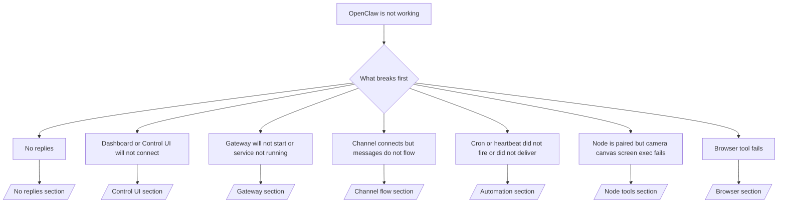

---
read_when:
    - OpenClaw ne fonctionne pas et vous avez besoin du chemin le plus rapide vers un correctif
    - Vous voulez un flux de triage avant de vous plonger dans des runbooks détaillés
summary: Centre de dépannage d’OpenClaw axé d’abord sur les symptômes
title: Dépannage général
x-i18n:
    generated_at: "2026-06-27T17:37:20Z"
    model: gpt-5.5
    postprocess_version: locale-links-v1
    provider: openai
    source_hash: ae1236c73e3a5c9237bd81d603e8dca18c595a8bcbb71f5931bfbf2389b342cd
    source_path: help/troubleshooting.md
    workflow: 16
---

Si vous n’avez que 2 minutes, utilisez cette page comme porte d’entrée de triage.

## 60 premières secondes

Exécutez exactement cette échelle dans l’ordre :

```bash
openclaw status
openclaw status --all
openclaw gateway probe
openclaw gateway status
openclaw doctor
openclaw channels status --probe
openclaw logs --follow
```

Sortie correcte en une ligne :

- `openclaw status` → affiche les canaux configurés et aucune erreur d’authentification évidente.
- `openclaw status --all` → le rapport complet est présent et partageable.
- `openclaw gateway probe` → la cible Gateway attendue est joignable (`Reachable: yes`). `Capability: ...` indique le niveau d’authentification que la sonde a pu prouver, et `Read probe: limited - missing scope: operator.read` correspond à des diagnostics dégradés, pas à un échec de connexion.
- `openclaw gateway status` → `Runtime: running`, `Connectivity probe: ok`, et une ligne `Capability: ...` plausible. Utilisez `--require-rpc` si vous avez aussi besoin d’une preuve RPC avec portée de lecture.
- `openclaw doctor` → aucune erreur bloquante de configuration ou de service.
- `openclaw channels status --probe` → un Gateway joignable renvoie l’état de transport
  en direct par compte, ainsi que des résultats de sonde/audit comme `works` ou `audit ok` ;
  si le Gateway est injoignable, la commande se replie sur des résumés de configuration uniquement.
- `openclaw logs --follow` → activité stable, aucune erreur fatale répétée.

## L’assistant semble limité ou des outils manquent

Si l’assistant ne peut pas inspecter les fichiers, exécuter des commandes, utiliser l’automatisation du navigateur ou
voir les outils attendus, vérifiez d’abord le profil d’outils effectif :

```bash
openclaw status
openclaw status --all
openclaw doctor
```

Causes courantes :

- `tools.profile: "messaging"` est volontairement étroit pour les agents limités au chat.
- `tools.profile: "coding"` est le profil habituel pour les workflows de dépôt, fichiers, shell
  et runtime.
- `tools.profile: "full"` expose l’ensemble d’outils le plus large et doit être limité
  aux agents de confiance contrôlés par l’opérateur.
- Les remplacements par agent `agents.list[].tools` peuvent restreindre ou étendre le profil
  racine pour un agent.

Modifiez le profil d’outils racine ou par agent, puis redémarrez ou rechargez le Gateway
et relancez `openclaw status --all`. Consultez [Outils](/fr/tools) pour le modèle de profil
et les remplacements d’autorisation/refus.

## Contexte long Anthropic 429

Si vous voyez :
`HTTP 429: rate_limit_error: Extra usage is required for long context requests`,
allez à [/gateway/troubleshooting#anthropic-429-extra-usage-required-for-long-context](/fr/gateway/troubleshooting#anthropic-429-extra-usage-required-for-long-context).

## Le backend local compatible OpenAI fonctionne directement mais échoue dans OpenClaw

Si votre backend `/v1` local ou auto-hébergé répond aux petites sondes directes
`/v1/chat/completions`, mais échoue avec `openclaw infer model run` ou lors de tours
d’agent normaux :

1. Si l’erreur indique que `messages[].content` attend une chaîne, définissez
   `models.providers.<provider>.models[].compat.requiresStringContent: true`.
2. Si le backend échoue encore uniquement lors des tours d’agent OpenClaw, définissez
   `models.providers.<provider>.models[].compat.supportsTools: false` et réessayez.
3. Si de minuscules appels directs fonctionnent encore, mais que des prompts OpenClaw plus volumineux font planter le
   backend, traitez le problème restant comme une limitation du modèle/serveur amont et
   poursuivez dans le runbook approfondi :
   [/gateway/troubleshooting#local-openai-compatible-backend-passes-direct-probes-but-agent-runs-fail](/fr/gateway/troubleshooting#local-openai-compatible-backend-passes-direct-probes-but-agent-runs-fail)

## Échec de l’installation d’un Plugin avec des extensions openclaw manquantes

Si l’installation échoue avec `package.json missing openclaw.extensions`, le paquet Plugin
utilise une ancienne forme qu’OpenClaw n’accepte plus.

Correction dans le paquet Plugin :

1. Ajoutez `openclaw.extensions` à `package.json`.
2. Faites pointer les entrées vers les fichiers runtime construits (généralement `./dist/index.js`).
3. Republiez le Plugin et relancez `openclaw plugins install <package>`.

Exemple :

```json
{
  "name": "@openclaw/my-plugin",
  "version": "1.2.3",
  "openclaw": {
    "extensions": ["./dist/index.js"]
  }
}
```

Référence : [Architecture des Plugins](/fr/plugins/architecture)

## La politique d’installation bloque les installations ou mises à jour de Plugins

Si une mise à jour se termine mais que les Plugins sont obsolètes, désactivés, ou affichent des messages comme
`blocked by install policy`, `install policy failed closed`, ou
`Disabled "<plugin>" after plugin update failure`, vérifiez
`security.installPolicy`.

La politique d’installation s’exécute lors des installations et mises à jour de Plugins. Les versions des Plugins
appartenant à OpenClaw évoluent normalement avec la version OpenClaw, donc une mise à jour d’OpenClaw peut
aussi nécessiter des mises à jour correspondantes des Plugins `@openclaw/*` pendant la synchronisation post-mise à jour.

Évitez ces formes de politique trop larges, sauf si vous maintenez aussi la règle de mise à niveau correspondante :

- Geler les Plugins appartenant à OpenClaw sur une seule ancienne version exacte, par exemple en autorisant
  uniquement `@openclaw/*@2026.5.3`.
- Bloquer seulement par type de source, par exemple chaque requête de Plugin npm, réseau ou
  `request.mode: "update"`.
- Traiter la commande de politique comme facultative. Lorsque `security.installPolicy` est
  activé, un exécutable de politique manquant, lent, illisible ou bloqué par les permissions
  échoue en fermeture sécurisée.
- Approuver des versions de Plugins sans tenir compte de
  `openclawVersion` de la requête de politique ni des métadonnées du candidat Plugin.

Des règles de politique plus sûres autorisent les mises à jour de Plugins de confiance appartenant à OpenClaw lorsque le
candidat est compatible avec l’hôte OpenClaw actuel, au lieu d’épingler une
seule version pour toujours. Si vous bloquez npm par défaut, créez une exception étroite
pour les paquets Plugin `@openclaw/*` de confiance ou les ids de Plugins que vous utilisez. Si vous
différenciez les requêtes d’installation et de mise à jour, appliquez la même règle de confiance à
`request.mode: "update"`.

Récupération :

```bash
openclaw doctor --deep
openclaw plugins update --all
openclaw status --all
```

Si la politique est volontairement stricte, assouplissez-la pour la fenêtre de mise à niveau OpenClaw
de confiance, relancez `openclaw plugins update --all`, puis restaurez la règle plus stricte.
Si un Plugin a été désactivé après un échec de mise à jour, inspectez-le et ne le réactivez
qu’après la réussite de la mise à jour :

```bash
openclaw plugins inspect <plugin-id> --runtime --json
openclaw plugins enable <plugin-id>
```

Référence : [Politique d’installation opérateur](/fr/tools/skills-config#operator-install-policy-securityinstallpolicy)

## Plugin présent mais bloqué par une propriété suspecte

Si `openclaw doctor`, la configuration initiale ou les avertissements au démarrage affichent :

```text
blocked plugin candidate: suspicious ownership (... uid=1000, expected uid=0 or root)
plugin present but blocked
```

les fichiers du Plugin appartiennent à un autre utilisateur Unix que le processus qui les charge.
Ne supprimez pas la configuration du Plugin. Corrigez la propriété des fichiers ou exécutez OpenClaw avec
le même utilisateur que celui qui possède le répertoire d’état.

Les installations Docker s’exécutent normalement en tant que `node` (uid `1000`). Pour la configuration Docker
par défaut, réparez les montages liés de l’hôte :

```bash
sudo chown -R 1000:1000 /path/to/openclaw-config /path/to/openclaw-workspace
openclaw doctor --fix
```

Si vous exécutez volontairement OpenClaw en tant que root, réparez plutôt la racine de Plugin gérée pour
qu’elle appartienne à root :

```bash
sudo chown -R root:root /path/to/openclaw-config/npm
openclaw doctor --fix
```

Documentation approfondie :

- [Propriété du chemin de Plugin](/fr/tools/plugin#blocked-plugin-path-ownership)
- [Permissions Docker](/fr/install/docker#permissions-and-eacces)

## Arbre de décision



<AccordionGroup>
  <Accordion title="Aucune réponse">
    ```bash
    openclaw status
    openclaw gateway status
    openclaw channels status --probe
    openclaw pairing list --channel <channel> [--account <id>]
    openclaw logs --follow
    ```

    Une sortie correcte ressemble à :

    - `Runtime: running`
    - `Connectivity probe: ok`
    - `Capability: read-only`, `write-capable`, ou `admin-capable`
    - Votre canal affiche un transport connecté et, lorsque c’est pris en charge, `works` ou `audit ok` dans `channels status --probe`
    - L’expéditeur apparaît comme approuvé (ou la politique DM est ouverte/en liste d’autorisation)

    Signatures de journal courantes :

    - `drop guild message (mention required` → le filtrage par mention a bloqué le message dans Discord.
    - `pairing request` → l’expéditeur n’est pas approuvé et attend l’approbation d’appairage en DM.
    - `blocked` / `allowlist` dans les journaux de canal → l’expéditeur, le salon ou le groupe est filtré.

    Pages approfondies :

    - [/gateway/troubleshooting#no-replies](/fr/gateway/troubleshooting#no-replies)
    - [/channels/troubleshooting](/fr/channels/troubleshooting)
    - [/channels/pairing](/fr/channels/pairing)

  </Accordion>

  <Accordion title="Le tableau de bord ou l’interface utilisateur de contrôle ne se connecte pas">
    ```bash
    openclaw status
    openclaw gateway status
    openclaw logs --follow
    openclaw doctor
    openclaw channels status --probe
    ```

    Une sortie correcte ressemble à :

    - `Dashboard: http://...` est affiché dans `openclaw gateway status`
    - `Connectivity probe: ok`
    - `Capability: read-only`, `write-capable`, ou `admin-capable`
    - Aucune boucle d’authentification dans les journaux

    Signatures de journal courantes :

    - `device identity required` → le contexte HTTP/non sécurisé ne peut pas terminer l’authentification de l’appareil.
    - `origin not allowed` → l’`Origin` du navigateur n’est pas autorisée pour la cible Gateway de l’interface utilisateur de contrôle.
    - `AUTH_TOKEN_MISMATCH` avec des indications de nouvelle tentative (`canRetryWithDeviceToken=true`) → une nouvelle tentative avec jeton d’appareil de confiance peut se produire automatiquement.
    - Cette nouvelle tentative avec jeton mis en cache réutilise l’ensemble de portées mis en cache stocké avec le
      jeton d’appareil appairé. Les appelants avec `deviceToken` explicite / `scopes` explicites conservent
      plutôt leur ensemble de portées demandé.
    - Sur le chemin asynchrone de l’interface utilisateur de contrôle Tailscale Serve, les tentatives échouées pour le même
      `{scope, ip}` sont sérialisées avant que le limiteur n’enregistre l’échec, donc une
      deuxième mauvaise nouvelle tentative simultanée peut déjà afficher `retry later`.
    - `too many failed authentication attempts (retry later)` depuis une origine de navigateur localhost → des échecs répétés depuis cette même `Origin` sont temporairement
      verrouillés ; une autre origine localhost utilise un compartiment séparé.
    - `unauthorized` répété après cette nouvelle tentative → mauvais jeton/mot de passe, incohérence du mode d’authentification ou jeton d’appareil appairé obsolète.
    - `gateway connect failed:` → l’interface utilisateur cible la mauvaise URL/le mauvais port ou un Gateway injoignable.

    Pages approfondies :

    - [/gateway/troubleshooting#dashboard-control-ui-connectivity](/fr/gateway/troubleshooting#dashboard-control-ui-connectivity)
    - [/web/control-ui](/fr/web/control-ui)
    - [/gateway/authentication](/fr/gateway/authentication)

  </Accordion>

  <Accordion title="Le Gateway ne démarre pas ou le service est installé mais ne s’exécute pas">
    ```bash
    openclaw status
    openclaw gateway status
    openclaw logs --follow
    openclaw doctor
    openclaw channels status --probe
    ```

    Une sortie correcte ressemble à :

    - `Service: ... (loaded)`
    - `Runtime: running`
    - `Connectivity probe: ok`
    - `Capability: read-only`, `write-capable`, ou `admin-capable`

    Signatures de journal courantes :

    - `Gateway start blocked: set gateway.mode=local` ou `existing config is missing gateway.mode` → le mode Gateway est distant, ou le fichier de configuration ne contient pas l’empreinte du mode local et doit être réparé.
    - `refusing to bind gateway ... without auth` → liaison non local loopback sans chemin d’authentification Gateway valide (jeton/mot de passe, ou proxy de confiance lorsque configuré).
    - `another gateway instance is already listening` ou `EADDRINUSE` → le port est déjà utilisé.

    Pages approfondies :

    - [/gateway/troubleshooting#gateway-service-not-running](/fr/gateway/troubleshooting#gateway-service-not-running)
    - [/gateway/background-process](/fr/gateway/background-process)
    - [/gateway/configuration](/fr/gateway/configuration)

  </Accordion>

  <Accordion title="Le canal se connecte, mais les messages ne circulent pas">
    ```bash
    openclaw status
    openclaw gateway status
    openclaw logs --follow
    openclaw doctor
    openclaw channels status --probe
    ```

    Une sortie correcte ressemble à ceci :

    - Le transport du canal est connecté.
    - Les vérifications d’appairage/de liste d’autorisation réussissent.
    - Les mentions sont détectées là où elles sont requises.

    Signatures de journal courantes :

    - `mention required` → le filtrage par mention de groupe a bloqué le traitement.
    - `pairing` / `pending` → l’expéditeur du DM n’est pas encore approuvé.
    - `not_in_channel`, `missing_scope`, `Forbidden`, `401/403` → problème de jeton d’autorisation du canal.

    Pages détaillées :

    - [/gateway/troubleshooting#channel-connected-messages-not-flowing](/fr/gateway/troubleshooting#channel-connected-messages-not-flowing)
    - [/channels/troubleshooting](/fr/channels/troubleshooting)

  </Accordion>

  <Accordion title="Cron ou Heartbeat ne s’est pas déclenché ou n’a pas livré">
    ```bash
    openclaw status
    openclaw gateway status
    openclaw cron status
    openclaw cron list
    openclaw cron runs --id <jobId> --limit 20
    openclaw logs --follow
    ```

    Une sortie correcte ressemble à ceci :

    - `cron.status` indique qu’il est activé avec un prochain réveil.
    - `cron runs` affiche des entrées `ok` récentes.
    - Heartbeat est activé et n’est pas en dehors des heures actives.

    Signatures de journal courantes :

    - `cron: scheduler disabled; jobs will not run automatically` → Cron est désactivé.
    - `heartbeat skipped` avec `reason=quiet-hours` → en dehors des heures actives configurées.
    - `heartbeat skipped` avec `reason=empty-heartbeat-file` → `HEARTBEAT.md` existe, mais ne contient que du blanc, un commentaire, un en-tête, une clôture, ou une structure de checklist vide.
    - `heartbeat skipped` avec `reason=no-tasks-due` → le mode tâche de `HEARTBEAT.md` est actif, mais aucun intervalle de tâche n’est encore arrivé à échéance.
    - `heartbeat skipped` avec `reason=alerts-disabled` → toute la visibilité de Heartbeat est désactivée (`showOk`, `showAlerts` et `useIndicator` sont tous désactivés).
    - `requests-in-flight` → voie principale occupée ; le réveil Heartbeat a été différé.
    - `unknown accountId` → le compte cible de livraison Heartbeat n’existe pas.

    Pages détaillées :

    - [/gateway/troubleshooting#cron-and-heartbeat-delivery](/fr/gateway/troubleshooting#cron-and-heartbeat-delivery)
    - [/automation/cron-jobs#troubleshooting](/fr/automation/cron-jobs#troubleshooting)
    - [/gateway/heartbeat](/fr/gateway/heartbeat)

  </Accordion>

  <Accordion title="Node est appairé, mais l’outil échoue pour camera canvas screen exec">
    ```bash
    openclaw status
    openclaw gateway status
    openclaw nodes status
    openclaw nodes describe --node <idOrNameOrIp>
    openclaw logs --follow
    ```

    Une sortie correcte ressemble à ceci :

    - Node est répertorié comme connecté et appairé pour le rôle `node`.
    - La capacité existe pour la commande que vous invoquez.
    - L’état de l’autorisation est accordé pour l’outil.

    Signatures de journal courantes :

    - `NODE_BACKGROUND_UNAVAILABLE` → ramenez l’application node au premier plan.
    - `*_PERMISSION_REQUIRED` → l’autorisation du système d’exploitation a été refusée/manque.
    - `SYSTEM_RUN_DENIED: approval required` → l’approbation exec est en attente.
    - `SYSTEM_RUN_DENIED: allowlist miss` → la commande ne figure pas dans la liste d’autorisation exec.

    Pages détaillées :

    - [/gateway/troubleshooting#node-paired-tool-fails](/fr/gateway/troubleshooting#node-paired-tool-fails)
    - [/nodes/troubleshooting](/fr/nodes/troubleshooting)
    - [/tools/exec-approvals](/fr/tools/exec-approvals)

  </Accordion>

  <Accordion title="Exec demande soudainement une approbation">
    ```bash
    openclaw config get tools.exec.host
    openclaw config get tools.exec.security
    openclaw config get tools.exec.ask
    openclaw gateway restart
    ```

    Ce qui a changé :

    - Si `tools.exec.host` n’est pas défini, la valeur par défaut est `auto`.
    - `host=auto` se résout en `sandbox` lorsqu’un runtime sandbox est actif, sinon en `gateway`.
    - `host=auto` ne fait que le routage ; le comportement sans invite « YOLO » vient de `security=full` avec `ask=off` sur gateway/node.
    - Sur `gateway` et `node`, `tools.exec.security` non défini vaut `full` par défaut.
    - `tools.exec.ask` non défini vaut `off` par défaut.
    - Résultat : si vous voyez des approbations, une politique locale à l’hôte ou par session a rendu exec plus strict que les valeurs par défaut actuelles.

    Restaurer le comportement actuel par défaut sans approbation :

    ```bash
    openclaw config set tools.exec.host gateway
    openclaw config set tools.exec.security full
    openclaw config set tools.exec.ask off
    openclaw gateway restart
    ```

    Alternatives plus sûres :

    - Définissez uniquement `tools.exec.host=gateway` si vous voulez seulement un routage d’hôte stable.
    - Utilisez `security=allowlist` avec `ask=on-miss` si vous voulez l’exec sur l’hôte tout en conservant une revue en cas d’absence dans la liste d’autorisation.
    - Activez le mode sandbox si vous voulez que `host=auto` se résolve de nouveau en `sandbox`.

    Signatures de journal courantes :

    - `Approval required.` → la commande attend `/approve ...`.
    - `SYSTEM_RUN_DENIED: approval required` → l’approbation exec sur l’hôte node est en attente.
    - `exec host=sandbox requires a sandbox runtime for this session` → sélection sandbox implicite/explicite, mais le mode sandbox est désactivé.

    Pages détaillées :

    - [/tools/exec](/fr/tools/exec)
    - [/tools/exec-approvals](/fr/tools/exec-approvals)
    - [/gateway/security#what-the-audit-checks-high-level](/fr/gateway/security#what-the-audit-checks-high-level)

  </Accordion>

  <Accordion title="L’outil de navigateur échoue">
    ```bash
    openclaw status
    openclaw gateway status
    openclaw browser status
    openclaw logs --follow
    openclaw doctor
    ```

    Une sortie correcte ressemble à ceci :

    - L’état du navigateur indique `running: true` et un navigateur/profil choisi.
    - `openclaw` démarre, ou `user` peut voir les onglets Chrome locaux.

    Signatures de journal courantes :

    - `unknown command "browser"` ou `unknown command 'browser'` → `plugins.allow` est défini et n’inclut pas `browser`.
    - `Failed to start Chrome CDP on port` → le lancement du navigateur local a échoué.
    - `browser.executablePath not found` → le chemin du binaire configuré est incorrect.
    - `browser.cdpUrl must be http(s) or ws(s)` → l’URL CDP configurée utilise un schéma non pris en charge.
    - `browser.cdpUrl has invalid port` → l’URL CDP configurée contient un port invalide ou hors limites.
    - `No Chrome tabs found for profile="user"` → le profil d’attache Chrome MCP n’a aucun onglet Chrome local ouvert.
    - `Remote CDP for profile "<name>" is not reachable` → le point de terminaison CDP distant configuré n’est pas joignable depuis cet hôte.
    - `Browser attachOnly is enabled ... not reachable` ou `Browser attachOnly is enabled and CDP websocket ... is not reachable` → le profil en attache seule n’a aucune cible CDP active.
    - remplacements obsolètes de viewport / mode sombre / locale / hors ligne sur des profils en attache seule ou CDP distants → exécutez `openclaw browser stop --browser-profile <name>` pour fermer la session de contrôle active et libérer l’état d’émulation sans redémarrer le Gateway.

    Pages détaillées :

    - [/gateway/troubleshooting#browser-tool-fails](/fr/gateway/troubleshooting#browser-tool-fails)
    - [/tools/browser#missing-browser-command-or-tool](/fr/tools/browser#missing-browser-command-or-tool)
    - [/tools/browser-linux-troubleshooting](/fr/tools/browser-linux-troubleshooting)
    - [/tools/browser-wsl2-windows-remote-cdp-troubleshooting](/fr/tools/browser-wsl2-windows-remote-cdp-troubleshooting)

  </Accordion>

</AccordionGroup>

## Associé

- [FAQ](/fr/help/faq) — questions fréquentes
- [Dépannage du Gateway](/fr/gateway/troubleshooting) — problèmes spécifiques au Gateway
- [Doctor](/fr/gateway/doctor) — vérifications d’état et réparations automatisées
- [Dépannage des canaux](/fr/channels/troubleshooting) — problèmes de connectivité des canaux
- [Dépannage de l’automatisation](/fr/automation/cron-jobs#troubleshooting) — problèmes de Cron et de Heartbeat
