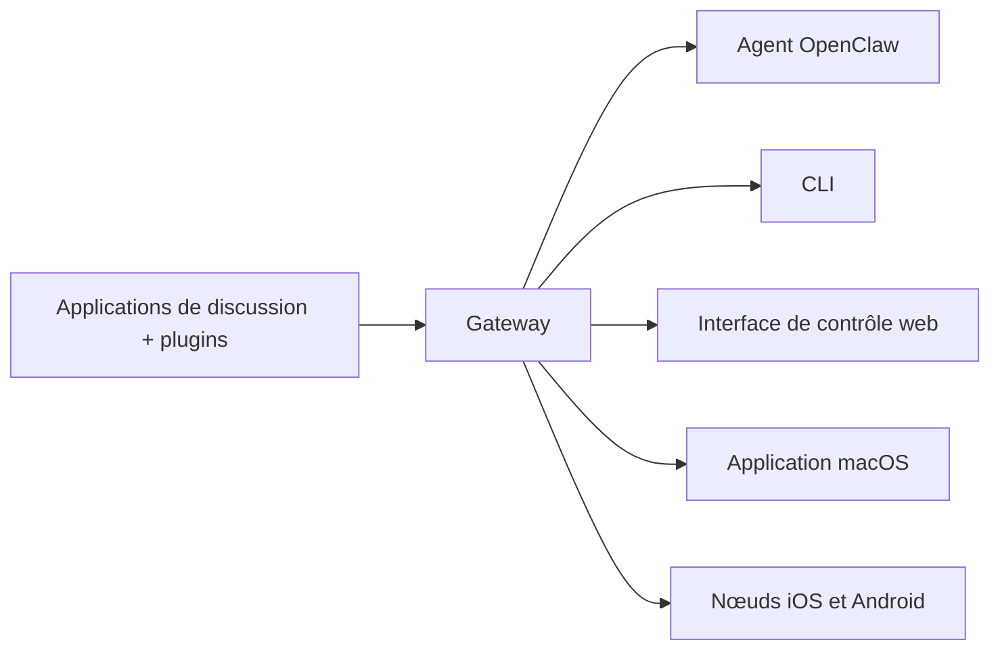

---
read_when:
    - Présentation d’OpenClaw aux nouveaux utilisateurs
summary: OpenClaw est un Gateway multicanal pour agents d’IA qui fonctionne sur tous les systèmes d’exploitation.
title: OpenClaw
x-i18n:
    generated_at: "2026-07-16T13:26:20Z"
    model: gpt-5.6
    postprocess_version: locale-links-v1
    prompt_version: 32
    provider: openai
    source_hash: fe97e7299be4855fd9af21838e0626b5a5c8aafe46d982859e9033f0efec2443
    source_path: index.md
    workflow: 16
---

# OpenClaw 🦞

<p align="center">
    
    
</p>

> _« EXFOLIEZ ! EXFOLIEZ ! »_ — Un homard de l’espace, probablement

<p align="center">
  <strong>Gateway compatible avec tous les systèmes d’exploitation pour les agents d’IA sur Discord, Google Chat, iMessage, Matrix, Microsoft Teams, Signal, Slack, Telegram, WhatsApp, Zalo et bien plus encore.</strong><br />
  Envoyez un message et recevez la réponse d’un agent directement dans votre poche. Exécutez un seul Gateway pour les plugins de canaux, WebChat et les nœuds mobiles.
</p>

<Columns>
  <Card title="Bien démarrer" href="/fr/start/getting-started" icon="rocket">
    Installez OpenClaw et lancez le Gateway en quelques minutes.
  </Card>
  <Card title="Exécuter la configuration initiale" href="/fr/start/wizard" icon="list-checks">
    Configuration guidée avec `openclaw onboard` et parcours d’appairage.
  </Card>
  <Card title="Connecter un canal" href="/fr/channels" icon="message-circle">
    Reliez Discord, Signal, Telegram, WhatsApp et bien d’autres pour discuter où que vous soyez.
  </Card>
  <Card title="Ouvrir l’interface de contrôle" href="/fr/web/control-ui" icon="layout-dashboard">
    Lancez le tableau de bord dans le navigateur pour les conversations, la configuration et les sessions.
  </Card>
</Columns>

## Parcourir la documentation

Les navigateurs mobiles peuvent afficher le menu des sections sans la barre d’onglets complète de la version pour ordinateur. Utilisez
ces liens vers les rubriques principales pour accéder depuis le corps de la page aux mêmes sections de premier niveau de la documentation.

<Columns>
  <Card title="Bien démarrer" href="/fr" icon="rocket">
    Présentation, démonstration, premières étapes et guides de configuration.
  </Card>
  <Card title="Installer" href="/fr/install" icon="download">
    Méthodes d’installation, mises à jour, conteneurs, hébergement et configuration avancée.
  </Card>
  <Card title="Canaux" href="/fr/channels" icon="messages-square">
    Canaux de messagerie, appairage, routage, groupes d’accès et assurance qualité des canaux.
  </Card>
  <Card title="Agents" href="/fr/concepts/architecture" icon="bot">
    Architecture, sessions, contexte, mémoire et routage multi-agent.
  </Card>
  <Card title="Fonctionnalités" href="/fr/tools" icon="wand-sparkles">
    Outils, compétences, tâches Cron, Webhooks et fonctionnalités d’automatisation.
  </Card>
  <Card title="ClawHub" href="/clawhub" icon="store">
    Place de marché des plugins, publication, sélection et recommandations sur la confiance.
  </Card>
  <Card title="Modèles" href="/fr/providers" icon="brain">
    Fournisseurs, configuration des modèles, basculement et services de modèles locaux.
  </Card>
  <Card title="Plateformes" href="/fr/platforms" icon="monitor-smartphone">
    macOS, Windows, iOS, Android, nœuds et interfaces web.
  </Card>
  <Card title="Gateway et opérations" href="/fr/gateway" icon="server">
    Configuration, sécurité, diagnostics et exploitation du Gateway.
  </Card>
  <Card title="Référence" href="/fr/cli" icon="terminal">
    Référence de la CLI, schémas, RPC, notes de version et modèles.
  </Card>
  <Card title="Aide" href="/fr/help" icon="life-buoy">
    Dépannage, FAQ, tests, diagnostics et vérifications de l’environnement.
  </Card>
</Columns>

## Qu’est-ce qu’OpenClaw ?

OpenClaw est un **Gateway auto-hébergé** qui connecte vos applications de discussion préférées — Discord, Google Chat, iMessage, Matrix, Microsoft Teams, Signal, Slack, Telegram, WhatsApp, Zalo et bien d’autres par l’intermédiaire de plugins de canaux — à des agents d’IA spécialisés dans la programmation. Vous exécutez un seul processus Gateway sur votre propre machine (ou sur un serveur), qui sert alors de passerelle entre vos applications de messagerie et un assistant d’IA toujours disponible.

**À qui s’adresse-t-il ?** Aux développeurs et aux utilisateurs expérimentés qui souhaitent disposer d’un assistant d’IA personnel auquel ils peuvent envoyer des messages où qu’ils soient, sans renoncer au contrôle de leurs données ni dépendre d’un service hébergé.

**Qu’est-ce qui le distingue ?**

- **Auto-hébergé** : fonctionne sur votre matériel, selon vos règles
- **Multicanal** : un seul Gateway dessert simultanément tous les plugins de canaux configurés
- **Conçu pour les agents** : destiné aux agents de programmation avec utilisation d’outils, sessions, mémoire et routage multi-agent
- **Open source** : sous licence MIT et développé par la communauté

**De quoi avez-vous besoin ?** De Node 24.15+ (recommandé), de Node 22 LTS (`22.22.3+`) pour la compatibilité, ou de Node 25.9+, d’une clé d’API fournie par le fournisseur de votre choix et de 5 minutes. Pour bénéficier d’une qualité et d’une sécurité optimales, utilisez le modèle de dernière génération le plus performant disponible.

## Fonctionnement



Le Gateway constitue la source unique de vérité pour les sessions, le routage et les connexions aux canaux.

## Fonctionnalités principales

<Columns>
  <Card title="Gateway multicanal" icon="network" href="/fr/channels">
    Discord, iMessage, Signal, Slack, Telegram, WhatsApp, WebChat et bien plus encore avec un seul processus Gateway.
  </Card>
  <Card title="Canaux fournis par des plugins" icon="plug" href="/fr/tools/plugin">
    Les plugins de canaux ajoutent Matrix, Nostr, Twitch, Zalo et bien d’autres ; les plugins officiels s’installent à la demande.
  </Card>
  <Card title="Routage multi-agent" icon="route" href="/fr/concepts/multi-agent">
    Sessions isolées par agent, espace de travail ou expéditeur.
  </Card>
  <Card title="Prise en charge des médias" icon="image" href="/fr/nodes/images">
    Envoyez et recevez des images, des fichiers audio et des documents.
  </Card>
  <Card title="Interface de contrôle web" icon="monitor" href="/fr/web/control-ui">
    Tableau de bord dans le navigateur pour les conversations, la configuration, les sessions et les nœuds.
  </Card>
  <Card title="Nœuds mobiles" icon="smartphone" href="/fr/nodes">
    Appairez des nœuds iOS et Android pour les workflows compatibles avec Canvas, l’appareil photo et la voix.
  </Card>
</Columns>

## Démarrage rapide

<Steps>
  <Step title="Installer OpenClaw">
    ```bash
    npm install -g openclaw@latest
    ```
  </Step>
  <Step title="Effectuer la configuration initiale et installer le service">
    ```bash
    openclaw onboard --install-daemon
    ```
  </Step>
  <Step title="Discuter">
    Ouvrez l’interface de contrôle dans votre navigateur et envoyez un message :

    ```bash
    openclaw dashboard
    ```

    Vous pouvez aussi connecter un canal ([Telegram](/fr/channels/telegram) est le plus rapide) et discuter depuis votre téléphone.

  </Step>
</Steps>

Vous avez besoin des instructions complètes d’installation et de configuration pour le développement ? Consultez [Bien démarrer](/fr/start/getting-started).

## Tableau de bord

Ouvrez l’interface de contrôle dans le navigateur après le démarrage du Gateway.

- Adresse locale par défaut : [http://127.0.0.1:18789/](http://127.0.0.1:18789/)
- Accès à distance : [Interfaces web](/fr/web) et [Tailscale](/fr/gateway/tailscale)

<p align="center">
  
</p>

## Configuration (facultative)

La configuration se trouve dans `~/.openclaw/openclaw.json`.

- Si vous **ne faites rien**, OpenClaw utilise l’environnement d’exécution d’agent OpenClaw fourni ; les messages privés partagent la session principale de l’agent et chaque discussion de groupe dispose de sa propre session.
- Si vous souhaitez en restreindre l’accès, commencez par `channels.whatsapp.allowFrom` et, pour les groupes, par les règles de mention.

Exemple :

```json5
{
  channels: {
    whatsapp: {
      allowFrom: ["+15555550123"],
      groups: { "*": { requireMention: true } },
    },
  },
  messages: { groupChat: { mentionPatterns: ["@openclaw"] } },
}
```

## Commencer ici

<Columns>
  <Card title="Rubriques de documentation" href="/fr/start/hubs" icon="book-open">
    Toute la documentation et tous les guides, organisés par cas d’utilisation.
  </Card>
  <Card title="Configuration" href="/fr/gateway/configuration" icon="settings">
    Paramètres principaux du Gateway, jetons et configuration des fournisseurs.
  </Card>
  <Card title="Accès à distance" href="/fr/gateway/remote" icon="globe">
    Modèles d’accès par SSH et tailnet.
  </Card>
  <Card title="Canaux" href="/fr/channels/telegram" icon="message-square">
    Configuration propre à chaque canal pour Discord, Feishu, Microsoft Teams, Telegram, WhatsApp et bien d’autres.
  </Card>
  <Card title="Nœuds" href="/fr/nodes" icon="smartphone">
    Nœuds iOS et Android avec appairage, Canvas, appareil photo et actions sur l’appareil.
  </Card>
  <Card title="Aide" href="/fr/help" icon="life-buoy">
    Point d’entrée pour les correctifs courants et le dépannage.
  </Card>
</Columns>

## En savoir plus

<Columns>
  <Card title="Liste complète des fonctionnalités" href="/fr/concepts/features" icon="list">
    Fonctionnalités complètes relatives aux canaux, au routage et aux médias.
  </Card>
  <Card title="Routage multi-agent" href="/fr/concepts/multi-agent" icon="route">
    Isolation des espaces de travail et sessions propres à chaque agent.
  </Card>
  <Card title="Sécurité" href="/fr/gateway/security" icon="shield">
    Jetons, listes d’autorisation et contrôles de sécurité.
  </Card>
  <Card title="Dépannage" href="/fr/gateway/troubleshooting" icon="wrench">
    Diagnostics du Gateway et erreurs courantes.
  </Card>
  <Card title="À propos et crédits" href="/fr/reference/credits" icon="info">
    Origines du projet, contributeurs et licence.
  </Card>
</Columns>
