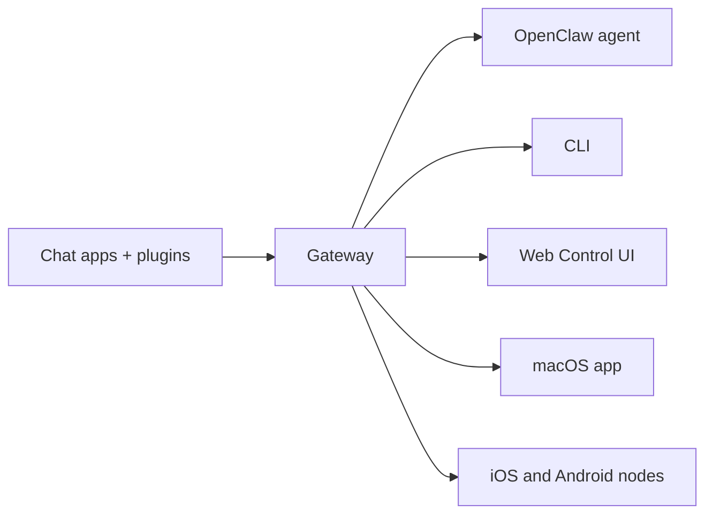

---
read_when:
    - Présenter OpenClaw aux nouveaux venus
summary: OpenClaw est un Gateway multicanal pour agents IA qui fonctionne sur n’importe quel OS.
title: OpenClaw
x-i18n:
    generated_at: "2026-06-27T17:37:26Z"
    model: gpt-5.5
    postprocess_version: locale-links-v1
    provider: openai
    source_hash: fcaa54a0a6d7aa62193fd9f03428bbcbfdcb2c00a184bcd6f49e4e093fefc473
    source_path: index.md
    workflow: 16
---

# OpenClaw 🦞

<p align="center">
    
    
</p>

> _"EXFOLIEZ ! EXFOLIEZ !"_ — Un homard de l’espace, probablement

<p align="center">
  <strong>Gateway pour agents IA sur n’importe quel OS, compatible avec Discord, Google Chat, iMessage, Matrix, Microsoft Teams, Signal, Slack, Telegram, WhatsApp, Zalo, et plus encore.</strong><br />
  Envoyez un message, recevez une réponse d’agent depuis votre poche. Exécutez un seul Gateway sur des canaux intégrés, des plugins de canal groupés, WebChat et des nœuds mobiles.
</p>

<Columns>
  <Card title="Commencer" href="/fr/start/getting-started" icon="rocket">
    Installez OpenClaw et lancez le Gateway en quelques minutes.
  </Card>
  <Card title="Exécuter l’intégration" href="/fr/start/wizard" icon="sparkles">
    Configuration guidée avec `openclaw onboard` et des flux d’appairage.
  </Card>
  <Card title="Ouvrir l’UI de contrôle" href="/fr/web/control-ui" icon="layout-dashboard">
    Lancez le tableau de bord dans le navigateur pour le chat, la configuration et les sessions.
  </Card>
</Columns>

## Qu’est-ce qu’OpenClaw ?

OpenClaw est un **gateway auto-hébergé** qui connecte vos applications de chat et surfaces de canal préférées — canaux intégrés plus plugins de canal groupés ou externes comme Discord, Google Chat, iMessage, Matrix, Microsoft Teams, Signal, Slack, Telegram, WhatsApp, Zalo, et plus encore — à des agents IA de codage. Vous exécutez un seul processus Gateway sur votre propre machine (ou un serveur), et il devient le pont entre vos applications de messagerie et un assistant IA toujours disponible.

**À qui cela s’adresse-t-il ?** Aux développeurs et utilisateurs avancés qui veulent un assistant IA personnel auquel ils peuvent envoyer des messages depuis n’importe où — sans abandonner le contrôle de leurs données ni dépendre d’un service hébergé.

**Qu’est-ce qui le rend différent ?**

- **Auto-hébergé** : s’exécute sur votre matériel, selon vos règles
- **Multicanal** : un seul Gateway sert simultanément les canaux intégrés et les plugins de canal groupés ou externes
- **Natif agent** : conçu pour les agents de codage avec utilisation d’outils, sessions, mémoire et routage multi-agent
- **Open source** : sous licence MIT, piloté par la communauté

**De quoi avez-vous besoin ?** Node 24 (recommandé), ou Node 22 LTS (`22.19+`) pour la compatibilité, une clé API de votre fournisseur choisi et 5 minutes. Pour une qualité et une sécurité optimales, utilisez le modèle de dernière génération le plus puissant disponible.

## Fonctionnement



Le Gateway est la source de vérité unique pour les sessions, le routage et les connexions de canal.

## Capacités clés

<Columns>
  <Card title="Gateway multicanal" icon="network" href="/fr/channels">
    Discord, iMessage, Signal, Slack, Telegram, WhatsApp, WebChat, et plus encore avec un seul processus Gateway.
  </Card>
  <Card title="Canaux Plugin" icon="plug" href="/fr/tools/plugin">
    Les plugins groupés ajoutent Matrix, Nostr, Twitch, Zalo, et plus encore dans les versions actuelles normales.
  </Card>
  <Card title="Routage multi-agent" icon="route" href="/fr/concepts/multi-agent">
    Sessions isolées par agent, espace de travail ou expéditeur.
  </Card>
  <Card title="Prise en charge des médias" icon="image" href="/fr/nodes/images">
    Envoyez et recevez des images, de l’audio et des documents.
  </Card>
  <Card title="UI de contrôle Web" icon="monitor" href="/fr/web/control-ui">
    Tableau de bord dans le navigateur pour le chat, la configuration, les sessions et les nœuds.
  </Card>
  <Card title="Nœuds mobiles" icon="smartphone" href="/fr/nodes">
    Appairez des nœuds iOS et Android pour Canvas, la caméra et les workflows avec voix.
  </Card>
</Columns>

## Démarrage rapide

<Steps>
  <Step title="Installer OpenClaw">
    ```bash
    npm install -g openclaw@latest
    ```
  </Step>
  <Step title="Effectuer l’intégration et installer le service">
    ```bash
    openclaw onboard --install-daemon
    ```
  </Step>
  <Step title="Discuter">
    Ouvrez l’UI de contrôle dans votre navigateur et envoyez un message :

    ```bash
    openclaw dashboard
    ```

    Ou connectez un canal ([Telegram](/fr/channels/telegram) est le plus rapide) et discutez depuis votre téléphone.

  </Step>
</Steps>

Besoin de l’installation complète et de la configuration de développement ? Consultez [Bien démarrer](/fr/start/getting-started).

## Tableau de bord

Ouvrez l’UI de contrôle dans le navigateur après le démarrage du Gateway.

- Par défaut localement : [http://127.0.0.1:18789/](http://127.0.0.1:18789/)
- Accès distant : [Surfaces Web](/fr/web) et [Tailscale](/fr/gateway/tailscale)

<p align="center">
  
</p>

## Configuration (facultatif)

La configuration se trouve dans `~/.openclaw/openclaw.json`.

- Si vous **ne faites rien**, OpenClaw utilise le runtime d’agent OpenClaw groupé avec des sessions par expéditeur.
- Si vous voulez le verrouiller, commencez par `channels.whatsapp.allowFrom` et (pour les groupes) les règles de mention.

Exemple :

```json5
{
  channels: {
    whatsapp: {
      allowFrom: ["+15555550123"],
      groups: { "*": { requireMention: true } },
    },
  },
  messages: { groupChat: { mentionPatterns: ["@openclaw"] } },
}
```

## Commencez ici

<Columns>
  <Card title="Pôles de documentation" href="/fr/start/hubs" icon="book-open">
    Toute la documentation et tous les guides, organisés par cas d’utilisation.
  </Card>
  <Card title="Configuration" href="/fr/gateway/configuration" icon="settings">
    Paramètres du Gateway principal, jetons et configuration du fournisseur.
  </Card>
  <Card title="Accès distant" href="/fr/gateway/remote" icon="globe">
    Modèles d’accès SSH et tailnet.
  </Card>
  <Card title="Canaux" href="/fr/channels/telegram" icon="message-square">
    Configuration propre à chaque canal pour Feishu, Microsoft Teams, WhatsApp, Telegram, Discord, et plus encore.
  </Card>
  <Card title="Nœuds" href="/fr/nodes" icon="smartphone">
    Nœuds iOS et Android avec appairage, Canvas, caméra et actions d’appareil.
  </Card>
  <Card title="Aide" href="/fr/help" icon="life-buoy">
    Corrections courantes et point d’entrée de dépannage.
  </Card>
</Columns>

## En savoir plus

<Columns>
  <Card title="Liste complète des fonctionnalités" href="/fr/concepts/features" icon="list">
    Capacités complètes de canal, de routage et de médias.
  </Card>
  <Card title="Routage multi-agent" href="/fr/concepts/multi-agent" icon="route">
    Isolation des espaces de travail et sessions par agent.
  </Card>
  <Card title="Sécurité" href="/fr/gateway/security" icon="shield">
    Jetons, listes d’autorisation et contrôles de sécurité.
  </Card>
  <Card title="Dépannage" href="/fr/gateway/troubleshooting" icon="wrench">
    Diagnostics du Gateway et erreurs courantes.
  </Card>
  <Card title="À propos et crédits" href="/fr/reference/credits" icon="info">
    Origines du projet, contributeurs et licence.
  </Card>
</Columns>
