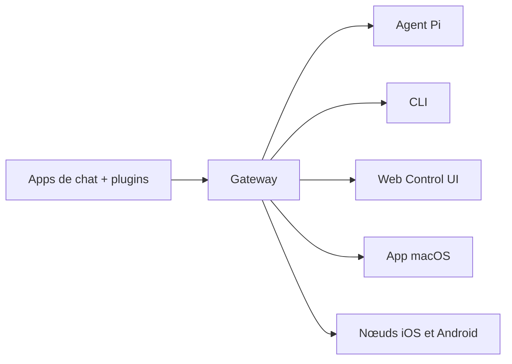

---
read_when:
    - Présentation d’OpenClaw aux nouveaux venus
summary: OpenClaw est une Gateway multi-canal pour agents IA qui fonctionne sur n’importe quel OS.
title: OpenClaw
x-i18n:
    generated_at: "2026-04-22T04:23:23Z"
    model: gpt-5.4
    provider: openai
    source_hash: 923d34fa604051d502e4bc902802d6921a4b89a9447f76123aa8d2ff085f0b99
    source_path: index.md
    workflow: 15
---

# OpenClaw 🦞

<p align="center">
    
    
</p>

> _"EXFOLIATE! EXFOLIATE!"_ — Un homard de l’espace, probablement

<p align="center">
  <strong>Gateway multi-OS pour agents IA sur Discord, Google Chat, iMessage, Matrix, Microsoft Teams, Signal, Slack, Telegram, WhatsApp, Zalo, et plus encore.</strong><br />
  Envoyez un message, obtenez une réponse d’agent depuis votre poche. Exécutez une seule Gateway sur les canaux intégrés, les plugins de canal inclus, WebChat et les nœuds mobiles.
</p>

<Columns>
  <Card title="Commencer" href="/fr/start/getting-started" icon="rocket">
    Installez OpenClaw et mettez la Gateway en service en quelques minutes.
  </Card>
  <Card title="Lancer l’intégration initiale" href="/fr/start/wizard" icon="sparkles">
    Configuration guidée avec `openclaw onboard` et les flux d’appairage.
  </Card>
  <Card title="Ouvrir la Control UI" href="/web/control-ui" icon="layout-dashboard">
    Lancez le tableau de bord dans le navigateur pour le chat, la config et les sessions.
  </Card>
</Columns>

## Qu’est-ce qu’OpenClaw ?

OpenClaw est une **Gateway auto-hébergée** qui connecte vos apps de chat et surfaces de canal préférées — canaux intégrés ainsi que plugins de canal inclus ou externes comme Discord, Google Chat, iMessage, Matrix, Microsoft Teams, Signal, Slack, Telegram, WhatsApp, Zalo, et plus encore — à des agents IA de code comme Pi. Vous exécutez un seul processus Gateway sur votre propre machine (ou un serveur), et il devient le pont entre vos apps de messagerie et un assistant IA toujours disponible.

**À qui cela s’adresse-t-il ?** Aux développeurs et utilisateurs avancés qui veulent un assistant IA personnel auquel ils peuvent envoyer des messages depuis n’importe où — sans renoncer au contrôle de leurs données ni dépendre d’un service hébergé.

**Qu’est-ce qui le différencie ?**

- **Auto-hébergé** : fonctionne sur votre matériel, selon vos règles
- **Multi-canal** : une seule Gateway sert simultanément les canaux intégrés ainsi que les plugins de canal inclus ou externes
- **Natif pour les agents** : conçu pour les agents de code avec usage d’outils, sessions, mémoire et routage multi-agent
- **Open source** : sous licence MIT, porté par la communauté

**De quoi avez-vous besoin ?** Node 24 (recommandé), ou Node 22 LTS (`22.14+`) pour la compatibilité, une clé API de votre provider choisi, et 5 minutes. Pour la meilleure qualité et la meilleure sécurité, utilisez le modèle de dernière génération le plus puissant auquel vous avez accès.

## Fonctionnement



La Gateway est la source unique de vérité pour les sessions, le routage et les connexions de canal.

## Capacités clés

<Columns>
  <Card title="Gateway multi-canal" icon="network" href="/fr/channels">
    Discord, iMessage, Signal, Slack, Telegram, WhatsApp, WebChat, et plus encore avec un seul processus Gateway.
  </Card>
  <Card title="Canaux de Plugin" icon="plug" href="/fr/tools/plugin">
    Les plugins inclus ajoutent Matrix, Nostr, Twitch, Zalo, et plus encore dans les versions actuelles normales.
  </Card>
  <Card title="Routage multi-agent" icon="route" href="/fr/concepts/multi-agent">
    Sessions isolées par agent, espace de travail ou expéditeur.
  </Card>
  <Card title="Prise en charge des médias" icon="image" href="/fr/nodes/images">
    Envoyez et recevez des images, de l’audio et des documents.
  </Card>
  <Card title="Web Control UI" icon="monitor" href="/web/control-ui">
    Tableau de bord navigateur pour le chat, la config, les sessions et les nœuds.
  </Card>
  <Card title="Nœuds mobiles" icon="smartphone" href="/fr/nodes">
    Appairez des nœuds iOS et Android pour des workflows avec Canvas, caméra et voix.
  </Card>
</Columns>

## Démarrage rapide

<Steps>
  <Step title="Installer OpenClaw">
    ```bash
    npm install -g openclaw@latest
    ```
  </Step>
  <Step title="Lancer l’intégration initiale et installer le service">
    ```bash
    openclaw onboard --install-daemon
    ```
  </Step>
  <Step title="Discuter">
    Ouvrez la Control UI dans votre navigateur et envoyez un message :

    ```bash
    openclaw dashboard
    ```

    Ou connectez un canal ([Telegram](/fr/channels/telegram) est le plus rapide) et discutez depuis votre téléphone.

  </Step>
</Steps>

Besoin de la configuration complète d’installation et de développement ? Consultez [Getting Started](/fr/start/getting-started).

## Tableau de bord

Ouvrez la Control UI du navigateur après le démarrage de la Gateway.

- Valeur locale par défaut : [http://127.0.0.1:18789/](http://127.0.0.1:18789/)
- Accès distant : [Surfaces Web](/web) et [Tailscale](/fr/gateway/tailscale)

<p align="center">
  
</p>

## Configuration (facultative)

La config se trouve dans `~/.openclaw/openclaw.json`.

- Si vous **ne faites rien**, OpenClaw utilise le binaire Pi inclus en mode RPC avec des sessions par expéditeur.
- Si vous voulez le verrouiller, commencez par `channels.whatsapp.allowFrom` et (pour les groupes) les règles de mention.

Exemple :

```json5
{
  channels: {
    whatsapp: {
      allowFrom: ["+15555550123"],
      groups: { "*": { requireMention: true } },
    },
  },
  messages: { groupChat: { mentionPatterns: ["@openclaw"] } },
}
```

## Commencez ici

<Columns>
  <Card title="Hubs de documentation" href="/fr/start/hubs" icon="book-open">
    Toute la documentation et tous les guides, organisés par cas d’usage.
  </Card>
  <Card title="Configuration" href="/fr/gateway/configuration" icon="settings">
    Paramètres principaux de la Gateway, jetons et config des providers.
  </Card>
  <Card title="Accès distant" href="/fr/gateway/remote" icon="globe">
    Modèles d’accès SSH et tailnet.
  </Card>
  <Card title="Canaux" href="/fr/channels/telegram" icon="message-square">
    Configuration spécifique aux canaux pour Feishu, Microsoft Teams, WhatsApp, Telegram, Discord, et plus encore.
  </Card>
  <Card title="Nœuds" href="/fr/nodes" icon="smartphone">
    Nœuds iOS et Android avec appairage, Canvas, caméra et actions sur l’appareil.
  </Card>
  <Card title="Aide" href="/fr/help" icon="life-buoy">
    Correctifs courants et point d’entrée du dépannage.
  </Card>
</Columns>

## En savoir plus

<Columns>
  <Card title="Liste complète des fonctionnalités" href="/fr/concepts/features" icon="list">
    Capacités complètes de canaux, routage et médias.
  </Card>
  <Card title="Routage multi-agent" href="/fr/concepts/multi-agent" icon="route">
    Isolation des espaces de travail et sessions par agent.
  </Card>
  <Card title="Sécurité" href="/fr/gateway/security" icon="shield">
    Jetons, listes d’autorisation et contrôles de sécurité.
  </Card>
  <Card title="Dépannage" href="/fr/gateway/troubleshooting" icon="wrench">
    Diagnostics de Gateway et erreurs courantes.
  </Card>
  <Card title="À propos et crédits" href="/fr/reference/credits" icon="info">
    Origines du projet, contributeurs et licence.
  </Card>
</Columns>
