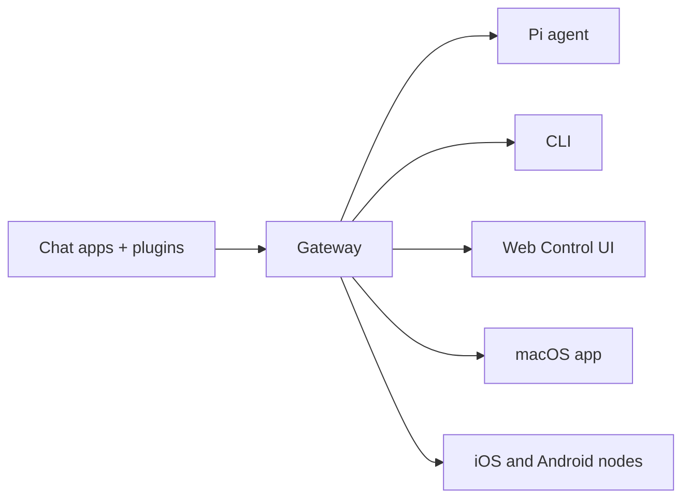

---
read_when:
    - Présentation d’OpenClaw aux nouveaux venus
summary: OpenClaw est un Gateway multicanal pour agents d’IA qui s’exécute sur n’importe quel système d’exploitation.
title: OpenClaw
x-i18n:
    generated_at: "2026-05-07T13:20:29Z"
    model: gpt-5.5
    provider: openai
    source_hash: 7bf82c8551703257e55289d2b82f6436c9900a8afae7ab9b6a655332716ff37b
    source_path: index.md
    workflow: 16
---

# OpenClaw 🦞

<p align="center">
    
    
</p>

> _"EXFOLIEZ ! EXFOLIEZ !"_ — Un homard de l’espace, probablement

<p align="center">
  <strong>Gateway pour n’importe quel OS destiné aux agents IA sur Discord, Google Chat, iMessage, Matrix, Microsoft Teams, Signal, Slack, Telegram, WhatsApp, Zalo, et plus encore.</strong><br />
  Envoyez un message, recevez une réponse d’agent depuis votre poche. Exécutez un Gateway unique avec les canaux intégrés, les plugins de canaux groupés, WebChat et les nœuds mobiles.
</p>

<Columns>
  <Card title="Premiers pas" href="/fr/start/getting-started" icon="rocket">
    Installez OpenClaw et lancez le Gateway en quelques minutes.
  </Card>
  <Card title="Exécuter l’intégration" href="/fr/start/wizard" icon="sparkles">
    Configuration guidée avec `openclaw onboard` et des flux d’appairage.
  </Card>
  <Card title="Ouvrir l’interface de contrôle" href="/fr/web/control-ui" icon="layout-dashboard">
    Lancez le tableau de bord du navigateur pour la discussion, la configuration et les sessions.
  </Card>
</Columns>

## Qu’est-ce qu’OpenClaw ?

OpenClaw est un **gateway auto-hébergé** qui connecte vos applications de discussion et surfaces de canaux favorites — canaux intégrés, ainsi que plugins de canaux groupés ou externes comme Discord, Google Chat, iMessage, Matrix, Microsoft Teams, Signal, Slack, Telegram, WhatsApp, Zalo, et plus encore — à des agents de codage IA comme Pi. Vous exécutez un seul processus Gateway sur votre propre machine (ou un serveur), et il devient le pont entre vos applications de messagerie et un assistant IA toujours disponible.

**À qui s’adresse-t-il ?** Aux développeurs et utilisateurs avancés qui veulent un assistant IA personnel auquel ils peuvent envoyer des messages depuis n’importe où — sans abandonner le contrôle de leurs données ni dépendre d’un service hébergé.

**Qu’est-ce qui le rend différent ?**

- **Auto-hébergé** : fonctionne sur votre matériel, selon vos règles
- **Multicanal** : un Gateway dessert simultanément les canaux intégrés et les plugins de canaux groupés ou externes
- **Natif pour les agents** : conçu pour les agents de codage avec utilisation d’outils, sessions, mémoire et routage multi-agents
- **Open source** : sous licence MIT, porté par la communauté

**De quoi avez-vous besoin ?** Node 24 (recommandé), ou Node 22 LTS (`22.16+`) pour la compatibilité, une clé API du fournisseur choisi et 5 minutes. Pour une qualité et une sécurité optimales, utilisez le modèle de dernière génération le plus puissant disponible.

## Fonctionnement



Le Gateway est la source unique de vérité pour les sessions, le routage et les connexions de canaux.

## Capacités clés

<Columns>
  <Card title="Gateway multicanal" icon="network" href="/fr/channels">
    Discord, iMessage, Signal, Slack, Telegram, WhatsApp, WebChat, et plus encore avec un seul processus Gateway.
  </Card>
  <Card title="Canaux de Plugin" icon="plug" href="/fr/tools/plugin">
    Les plugins groupés ajoutent Matrix, Nostr, Twitch, Zalo, et plus encore dans les versions courantes normales.
  </Card>
  <Card title="Routage multi-agents" icon="route" href="/fr/concepts/multi-agent">
    Sessions isolées par agent, espace de travail ou expéditeur.
  </Card>
  <Card title="Prise en charge des médias" icon="image" href="/fr/nodes/images">
    Envoyez et recevez des images, de l’audio et des documents.
  </Card>
  <Card title="Interface de contrôle Web" icon="monitor" href="/fr/web/control-ui">
    Tableau de bord navigateur pour la discussion, la configuration, les sessions et les nœuds.
  </Card>
  <Card title="Nœuds mobiles" icon="smartphone" href="/fr/nodes">
    Appairez des nœuds iOS et Android pour Canvas, la caméra et les flux de travail avec voix activée.
  </Card>
</Columns>

## Démarrage rapide

<Steps>
  <Step title="Installer OpenClaw">
    ```bash
    npm install -g openclaw@latest
    ```
  </Step>
  <Step title="Intégrer et installer le service">
    ```bash
    openclaw onboard --install-daemon
    ```
  </Step>
  <Step title="Discuter">
    Ouvrez l’interface de contrôle dans votre navigateur et envoyez un message :

    ```bash
    openclaw dashboard
    ```

    Ou connectez un canal ([Telegram](/fr/channels/telegram) est le plus rapide) et discutez depuis votre téléphone.

  </Step>
</Steps>

Besoin de l’installation complète et de la configuration de développement ? Consultez [Premiers pas](/fr/start/getting-started).

## Tableau de bord

Ouvrez l’interface de contrôle du navigateur après le démarrage du Gateway.

- Valeur locale par défaut : [http://127.0.0.1:18789/](http://127.0.0.1:18789/)
- Accès à distance : [Surfaces Web](/fr/web) et [Tailscale](/fr/gateway/tailscale)

<p align="center">
  
</p>

## Configuration (facultatif)

La configuration se trouve dans `~/.openclaw/openclaw.json`.

- Si vous **ne faites rien**, OpenClaw utilise le binaire Pi groupé en mode RPC avec des sessions par expéditeur.
- Si vous voulez le verrouiller, commencez par `channels.whatsapp.allowFrom` et (pour les groupes) les règles de mention.

Exemple :

```json5
{
  channels: {
    whatsapp: {
      allowFrom: ["+15555550123"],
      groups: { "*": { requireMention: true } },
    },
  },
  messages: { groupChat: { mentionPatterns: ["@openclaw"] } },
}
```

## Commencez ici

<Columns>
  <Card title="Hubs de documentation" href="/fr/start/hubs" icon="book-open">
    Toute la documentation et tous les guides, organisés par cas d’utilisation.
  </Card>
  <Card title="Configuration" href="/fr/gateway/configuration" icon="settings">
    Paramètres principaux du Gateway, jetons et configuration des fournisseurs.
  </Card>
  <Card title="Accès à distance" href="/fr/gateway/remote" icon="globe">
    Modèles d’accès SSH et tailnet.
  </Card>
  <Card title="Canaux" href="/fr/channels/telegram" icon="message-square">
    Configuration propre à chaque canal pour Feishu, Microsoft Teams, WhatsApp, Telegram, Discord, et plus encore.
  </Card>
  <Card title="Nœuds" href="/fr/nodes" icon="smartphone">
    Nœuds iOS et Android avec appairage, Canvas, caméra et actions d’appareil.
  </Card>
  <Card title="Aide" href="/fr/help" icon="life-buoy">
    Point d’entrée pour les correctifs courants et le dépannage.
  </Card>
</Columns>

## En savoir plus

<Columns>
  <Card title="Liste complète des fonctionnalités" href="/fr/concepts/features" icon="list">
    Capacités complètes de canaux, de routage et de médias.
  </Card>
  <Card title="Routage multi-agents" href="/fr/concepts/multi-agent" icon="route">
    Isolation des espaces de travail et sessions par agent.
  </Card>
  <Card title="Sécurité" href="/fr/gateway/security" icon="shield">
    Jetons, listes d’autorisation et contrôles de sécurité.
  </Card>
  <Card title="Dépannage" href="/fr/gateway/troubleshooting" icon="wrench">
    Diagnostics du Gateway et erreurs courantes.
  </Card>
  <Card title="À propos et crédits" href="/fr/reference/credits" icon="info">
    Origines du projet, contributeurs et licence.
  </Card>
</Columns>
