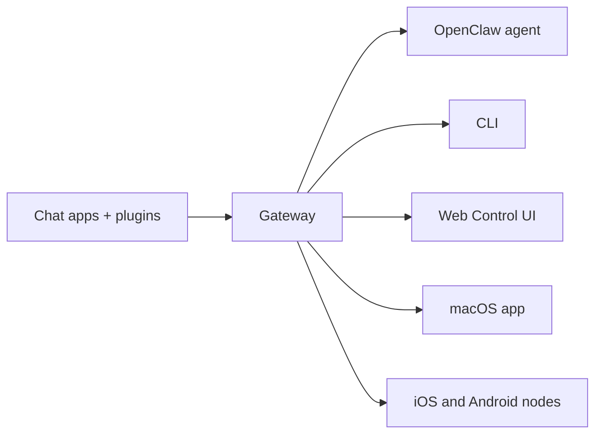

---
read_when:
    - Présentation d’OpenClaw aux nouveaux utilisateurs
summary: OpenClaw est un Gateway multicanal pour agents d’IA qui fonctionne sur n’importe quel système d’exploitation.
title: OpenClaw
x-i18n:
    generated_at: "2026-07-12T02:43:48Z"
    model: gpt-5.6
    postprocess_version: locale-links-v1
    provider: openai
    source_hash: 2b87c2a9ce06f110bda45709fb6055ed8000f73993793ea7386db2a47a782828
    source_path: index.md
    workflow: 16
---

# OpenClaw 🦞

<p align="center">
    
    
</p>

> _« EXFOLIEZ ! EXFOLIEZ ! »_ — Un homard de l’espace, probablement

<p align="center">
  <strong>Un Gateway pour tout système d’exploitation, destiné aux agents d’IA sur Discord, Google Chat, iMessage, Matrix, Microsoft Teams, Signal, Slack, Telegram, WhatsApp, Zalo et bien plus encore.</strong><br />
  Envoyez un message et recevez la réponse d’un agent depuis votre poche. Exécutez un seul Gateway pour les plugins de canaux, WebChat et les nœuds mobiles.
</p>

<Columns>
  <Card title="Get Started" href="/fr/start/getting-started" icon="rocket">
    Installez OpenClaw et démarrez le Gateway en quelques minutes.
  </Card>
  <Card title="Run Onboarding" href="/fr/start/wizard" icon="list-checks">
    Configuration guidée avec `openclaw onboard` et les procédures d’appairage.
  </Card>
  <Card title="Connect a Channel" href="/fr/channels" icon="message-circle">
    Reliez Discord, Signal, Telegram, WhatsApp et d’autres services pour discuter où que vous soyez.
  </Card>
  <Card title="Open the Control UI" href="/fr/web/control-ui" icon="layout-dashboard">
    Lancez le tableau de bord dans votre navigateur pour gérer les discussions, la configuration et les sessions.
  </Card>
</Columns>

## Parcourir la documentation

Sur les navigateurs mobiles, le menu des sections peut s’afficher sans la barre d’onglets complète de la version pour ordinateur. Utilisez
ces liens centraux pour accéder depuis le contenu de la page aux mêmes sections principales de la documentation.

<Columns>
  <Card title="Get started" href="/fr" icon="rocket">
    Présentation, démonstration, premiers pas et guides de configuration.
  </Card>
  <Card title="Install" href="/fr/install" icon="download">
    Méthodes d’installation, mises à jour, conteneurs, hébergement et configuration avancée.
  </Card>
  <Card title="Channels" href="/fr/channels" icon="messages-square">
    Canaux de messagerie, appairage, routage, groupes d’accès et assurance qualité des canaux.
  </Card>
  <Card title="Agents" href="/fr/concepts/architecture" icon="bot">
    Architecture, sessions, contexte, mémoire et routage multi-agent.
  </Card>
  <Card title="Capabilities" href="/fr/tools" icon="wand-sparkles">
    Outils, Skills, Cron, Webhooks et capacités d’automatisation.
  </Card>
  <Card title="ClawHub" href="/fr/clawhub" icon="store">
    Place de marché de plugins, publication, sélection et conseils relatifs à la confiance.
  </Card>
  <Card title="Models" href="/fr/providers" icon="brain">
    Fournisseurs, configuration des modèles, basculement et services de modèles locaux.
  </Card>
  <Card title="Platforms" href="/fr/platforms" icon="monitor-smartphone">
    macOS, Windows, iOS, Android, nœuds et interfaces web.
  </Card>
  <Card title="Gateway & Ops" href="/fr/gateway" icon="server">
    Configuration, sécurité, diagnostics et exploitation du Gateway.
  </Card>
  <Card title="Reference" href="/fr/cli" icon="terminal">
    Référence de la CLI, schémas, RPC, notes de version et modèles.
  </Card>
  <Card title="Help" href="/fr/help" icon="life-buoy">
    Résolution des problèmes, FAQ, tests, diagnostics et vérifications de l’environnement.
  </Card>
</Columns>

## Qu’est-ce qu’OpenClaw ?

OpenClaw est un **Gateway auto-hébergé** qui relie vos applications de discussion préférées — Discord, Google Chat, iMessage, Matrix, Microsoft Teams, Signal, Slack, Telegram, WhatsApp, Zalo et bien d’autres grâce aux plugins de canaux — à des agents d’IA spécialisés dans la programmation. Vous exécutez un unique processus Gateway sur votre propre machine (ou sur un serveur), qui sert alors de passerelle entre vos applications de messagerie et un assistant d’IA toujours disponible.

**À qui s’adresse-t-il ?** Aux développeurs et aux utilisateurs avancés qui souhaitent disposer d’un assistant d’IA personnel auquel ils peuvent envoyer des messages où qu’ils soient, sans renoncer au contrôle de leurs données ni dépendre d’un service hébergé.

**Qu’est-ce qui le distingue ?**

- **Auto-hébergé** : s’exécute sur votre matériel, selon vos règles
- **Multicanal** : un seul Gateway dessert simultanément tous les plugins de canaux configurés
- **Conçu pour les agents** : destiné aux agents de programmation avec utilisation d’outils, sessions, mémoire et routage multi-agent
- **Open source** : sous licence MIT et développé par la communauté

**De quoi avez-vous besoin ?** De Node 24 (recommandé), ou de Node 22 LTS (`22.19+`) pour assurer la compatibilité, d’une clé d’API fournie par le fournisseur de votre choix et de cinq minutes. Pour bénéficier d’une qualité et d’une sécurité optimales, utilisez le modèle de dernière génération le plus performant disponible.

## Fonctionnement



Le Gateway constitue la source unique de vérité pour les sessions, le routage et les connexions aux canaux.

## Fonctionnalités principales

<Columns>
  <Card title="Multi-channel gateway" icon="network" href="/fr/channels">
    Discord, iMessage, Signal, Slack, Telegram, WhatsApp, WebChat et bien d’autres avec un seul processus Gateway.
  </Card>
  <Card title="Plugin channels" icon="plug" href="/fr/tools/plugin">
    Les plugins de canaux ajoutent Matrix, Nostr, Twitch, Zalo et d’autres services ; les plugins officiels s’installent à la demande.
  </Card>
  <Card title="Multi-agent routing" icon="route" href="/fr/concepts/multi-agent">
    Sessions isolées par agent, espace de travail ou expéditeur.
  </Card>
  <Card title="Media support" icon="image" href="/fr/nodes/images">
    Envoyez et recevez des images, des fichiers audio et des documents.
  </Card>
  <Card title="Web Control UI" icon="monitor" href="/fr/web/control-ui">
    Tableau de bord dans le navigateur pour les discussions, la configuration, les sessions et les nœuds.
  </Card>
  <Card title="Mobile nodes" icon="smartphone" href="/fr/nodes">
    Appairez des nœuds iOS et Android pour utiliser Canvas, la caméra et des processus prenant en charge la voix.
  </Card>
</Columns>

## Démarrage rapide

<Steps>
  <Step title="Install OpenClaw">
    ```bash
    npm install -g openclaw@latest
    ```
  </Step>
  <Step title="Onboard and install the service">
    ```bash
    openclaw onboard --install-daemon
    ```
  </Step>
  <Step title="Chat">
    Ouvrez l’interface de contrôle dans votre navigateur et envoyez un message :

    ```bash
    openclaw dashboard
    ```

    Vous pouvez également connecter un canal ([Telegram](/fr/channels/telegram) est le plus rapide) et discuter depuis votre téléphone.

  </Step>
</Steps>

Vous avez besoin des instructions complètes d’installation et de configuration de l’environnement de développement ? Consultez le guide [Bien démarrer](/fr/start/getting-started).

## Tableau de bord

Ouvrez l’interface de contrôle dans votre navigateur après le démarrage du Gateway.

- Adresse locale par défaut : [http://127.0.0.1:18789/](http://127.0.0.1:18789/)
- Accès à distance : [Interfaces web](/fr/web) et [Tailscale](/fr/gateway/tailscale)

<p align="center">
  
</p>

## Configuration (facultative)

La configuration se trouve dans `~/.openclaw/openclaw.json`.

- Si vous **ne faites rien**, OpenClaw utilise l’environnement d’exécution d’agent OpenClaw intégré ; les messages privés partagent la session principale de l’agent, tandis que chaque discussion de groupe dispose de sa propre session.
- Si vous souhaitez restreindre l’accès, commencez par `channels.whatsapp.allowFrom` et, pour les groupes, par les règles de mention.

Exemple :

```json5
{
  channels: {
    whatsapp: {
      allowFrom: ["+15555550123"],
      groups: { "*": { requireMention: true } },
    },
  },
  messages: { groupChat: { mentionPatterns: ["@openclaw"] } },
}
```

## Commencez ici

<Columns>
  <Card title="Docs hubs" href="/fr/start/hubs" icon="book-open">
    L’ensemble de la documentation et des guides, organisé par cas d’utilisation.
  </Card>
  <Card title="Configuration" href="/fr/gateway/configuration" icon="settings">
    Paramètres principaux du Gateway, jetons et configuration des fournisseurs.
  </Card>
  <Card title="Remote access" href="/fr/gateway/remote" icon="globe">
    Modèles d’accès par SSH et tailnet.
  </Card>
  <Card title="Channels" href="/fr/channels/telegram" icon="message-square">
    Configuration propre à chaque canal pour Discord, Feishu, Microsoft Teams, Telegram, WhatsApp et bien d’autres.
  </Card>
  <Card title="Nodes" href="/fr/nodes" icon="smartphone">
    Nœuds iOS et Android avec appairage, Canvas, caméra et actions sur l’appareil.
  </Card>
  <Card title="Help" href="/fr/help" icon="life-buoy">
    Point d’entrée pour les correctifs courants et la résolution des problèmes.
  </Card>
</Columns>

## En savoir plus

<Columns>
  <Card title="Full feature list" href="/fr/concepts/features" icon="list">
    Liste complète des capacités relatives aux canaux, au routage et aux médias.
  </Card>
  <Card title="Multi-agent routing" href="/fr/concepts/multi-agent" icon="route">
    Isolation des espaces de travail et sessions propres à chaque agent.
  </Card>
  <Card title="Security" href="/fr/gateway/security" icon="shield">
    Jetons, listes d’autorisation et contrôles de sécurité.
  </Card>
  <Card title="Troubleshooting" href="/fr/gateway/troubleshooting" icon="wrench">
    Diagnostics du Gateway et erreurs courantes.
  </Card>
  <Card title="About and credits" href="/fr/reference/credits" icon="info">
    Origines du projet, contributeurs et licence.
  </Card>
</Columns>
