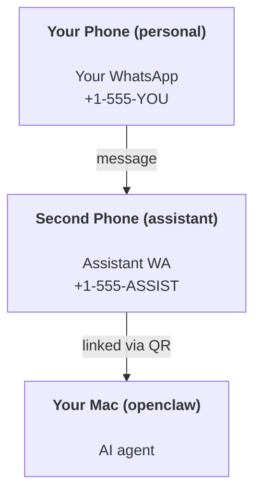

---
read_when:
    - Intégration d’une nouvelle instance d’assistant
    - Examen des implications en matière de sécurité et d’autorisations
summary: Guide complet pour utiliser OpenClaw comme assistant personnel, avec des mises en garde de sécurité
title: Configuration de l’assistant personnel
x-i18n:
    generated_at: "2026-05-02T22:22:37Z"
    model: gpt-5.5
    provider: openai
    source_hash: 9f6087d0756c98741166135df8b915eb5a0803b23e68e486d2d25ec98d4dca79
    source_path: start/openclaw.md
    workflow: 16
---

# Créer un assistant personnel avec OpenClaw

OpenClaw est un Gateway auto-hébergé qui connecte Discord, Google Chat, iMessage, Matrix, Microsoft Teams, Signal, Slack, Telegram, WhatsApp, Zalo et d’autres services à des agents IA. Ce guide couvre la configuration « assistant personnel » : un numéro WhatsApp dédié qui se comporte comme votre assistant IA toujours disponible.

## ⚠️ La sécurité d’abord

Vous placez un agent en position de :

- exécuter des commandes sur votre machine (selon votre politique d’outils)
- lire/écrire des fichiers dans votre espace de travail
- renvoyer des messages via WhatsApp/Telegram/Discord/Mattermost et d’autres canaux intégrés

Commencez prudemment :

- Définissez toujours `channels.whatsapp.allowFrom` (n’exécutez jamais une configuration ouverte au monde entier sur votre Mac personnel).
- Utilisez un numéro WhatsApp dédié pour l’assistant.
- Les Heartbeats s’exécutent désormais toutes les 30 minutes par défaut. Désactivez-les jusqu’à ce que vous fassiez confiance à la configuration en définissant `agents.defaults.heartbeat.every: "0m"`.

## Prérequis

- OpenClaw installé et configuré — consultez [Bien démarrer](/fr/start/getting-started) si vous ne l’avez pas encore fait
- Un deuxième numéro de téléphone (SIM/eSIM/prépayé) pour l’assistant

## La configuration à deux téléphones (recommandée)

Vous voulez ceci :



Si vous liez votre WhatsApp personnel à OpenClaw, chaque message qui vous est envoyé devient une « entrée d’agent ». C’est rarement ce que vous voulez.

## Démarrage rapide en 5 minutes

1. Associez WhatsApp Web (affiche un QR code ; scannez-le avec le téléphone de l’assistant) :

```bash
openclaw channels login
```

2. Démarrez le Gateway (laissez-le tourner) :

```bash
openclaw gateway --port 18789
```

3. Placez une configuration minimale dans `~/.openclaw/openclaw.json` :

```json5
{
  gateway: { mode: "local" },
  channels: { whatsapp: { allowFrom: ["+15555550123"] } },
}
```

Envoyez maintenant un message au numéro de l’assistant depuis votre téléphone autorisé.

Une fois l’onboarding terminé, OpenClaw ouvre automatiquement le tableau de bord et affiche un lien propre (non tokenisé). Si le tableau de bord demande une authentification, collez le secret partagé configuré dans les paramètres de Control UI. L’onboarding utilise un jeton par défaut (`gateway.auth.token`), mais l’authentification par mot de passe fonctionne aussi si vous avez basculé `gateway.auth.mode` sur `password`. Pour le rouvrir plus tard : `openclaw dashboard`.

## Donner un espace de travail à l’agent (AGENTS)

OpenClaw lit les instructions d’exploitation et la « mémoire » depuis son répertoire d’espace de travail.

Par défaut, OpenClaw utilise `~/.openclaw/workspace` comme espace de travail de l’agent et le crée automatiquement (avec les fichiers de départ `AGENTS.md`, `SOUL.md`, `TOOLS.md`, `IDENTITY.md`, `USER.md`, `HEARTBEAT.md`) lors de la configuration ou de la première exécution de l’agent. `BOOTSTRAP.md` n’est créé que lorsque l’espace de travail est entièrement nouveau (il ne doit pas réapparaître après sa suppression). `MEMORY.md` est facultatif (non créé automatiquement) ; lorsqu’il est présent, il est chargé pour les sessions normales. Les sessions de sous-agent n’injectent que `AGENTS.md` et `TOOLS.md`.

<Tip>
Traitez ce dossier comme la mémoire d’OpenClaw et faites-en un dépôt git (idéalement privé) afin de sauvegarder votre `AGENTS.md` et vos fichiers de mémoire. Si git est installé, les tout nouveaux espaces de travail sont initialisés automatiquement.
</Tip>

```bash
openclaw setup
```

Disposition complète de l’espace de travail + guide de sauvegarde : [Espace de travail de l’agent](/fr/concepts/agent-workspace)
Workflow de mémoire : [Mémoire](/fr/concepts/memory)

Facultatif : choisissez un autre espace de travail avec `agents.defaults.workspace` (prend en charge `~`).

```json5
{
  agents: {
    defaults: {
      workspace: "~/.openclaw/workspace",
    },
  },
}
```

Si vous fournissez déjà vos propres fichiers d’espace de travail depuis un dépôt, vous pouvez désactiver entièrement la création des fichiers de bootstrap :

```json5
{
  agents: {
    defaults: {
      skipBootstrap: true,
    },
  },
}
```

## La configuration qui en fait « un assistant »

OpenClaw utilise par défaut une bonne configuration d’assistant, mais vous voudrez généralement ajuster :

- la persona/les instructions dans [`SOUL.md`](/fr/concepts/soul)
- les valeurs par défaut de raisonnement (si souhaité)
- les Heartbeats (une fois que vous lui faites confiance)

Exemple :

```json5
{
  logging: { level: "info" },
  agent: {
    model: "anthropic/claude-opus-4-6",
    workspace: "~/.openclaw/workspace",
    thinkingDefault: "high",
    timeoutSeconds: 1800,
    // Start with 0; enable later.
    heartbeat: { every: "0m" },
  },
  channels: {
    whatsapp: {
      allowFrom: ["+15555550123"],
      groups: {
        "*": { requireMention: true },
      },
    },
  },
  routing: {
    groupChat: {
      mentionPatterns: ["@openclaw", "openclaw"],
    },
  },
  session: {
    scope: "per-sender",
    resetTriggers: ["/new", "/reset"],
    reset: {
      mode: "daily",
      atHour: 4,
      idleMinutes: 10080,
    },
  },
}
```

## Sessions et mémoire

- Fichiers de session : `~/.openclaw/agents/<agentId>/sessions/{{SessionId}}.jsonl`
- Métadonnées de session (utilisation des tokens, dernier routage, etc.) : `~/.openclaw/agents/<agentId>/sessions/sessions.json` (hérité : `~/.openclaw/sessions/sessions.json`)
- `/new` ou `/reset` démarre une nouvelle session pour cette conversation (configurable via `resetTriggers`). S’il est envoyé seul, OpenClaw accuse réception de la réinitialisation sans invoquer le modèle.
- `/compact [instructions]` compacte le contexte de session et indique le budget de contexte restant.

## Heartbeats (mode proactif)

Par défaut, OpenClaw exécute un Heartbeat toutes les 30 minutes avec l’invite :
`Read HEARTBEAT.md if it exists (workspace context). Follow it strictly. Do not infer or repeat old tasks from prior chats. If nothing needs attention, reply HEARTBEAT_OK.`
Définissez `agents.defaults.heartbeat.every: "0m"` pour le désactiver.

- Si `HEARTBEAT.md` existe mais est effectivement vide (seulement des lignes vides et des en-têtes Markdown comme `# Heading`), OpenClaw ignore l’exécution du Heartbeat afin d’économiser des appels API.
- Si le fichier est absent, le Heartbeat s’exécute quand même et le modèle décide quoi faire.
- Si l’agent répond avec `HEARTBEAT_OK` (éventuellement avec un court remplissage ; voir `agents.defaults.heartbeat.ackMaxChars`), OpenClaw supprime l’envoi sortant pour ce Heartbeat.
- Par défaut, l’envoi des Heartbeats vers des cibles de type DM `user:<id>` est autorisé. Définissez `agents.defaults.heartbeat.directPolicy: "block"` pour supprimer l’envoi vers les cibles directes tout en gardant les exécutions de Heartbeat actives.
- Les Heartbeats exécutent des tours d’agent complets — des intervalles plus courts consomment plus de tokens.

```json5
{
  agent: {
    heartbeat: { every: "30m" },
  },
}
```

## Médias entrants et sortants

Les pièces jointes entrantes (images/audio/docs) peuvent être exposées à votre commande via des modèles :

- `{{MediaPath}}` (chemin de fichier temporaire local)
- `{{MediaUrl}}` (pseudo-URL)
- `{{Transcript}}` (si la transcription audio est activée)

Pièces jointes sortantes de l’agent : incluez `MEDIA:<path-or-url>` sur sa propre ligne (sans espaces). Exemple :

```
Here’s the screenshot.
MEDIA:https://example.com/screenshot.png
```

OpenClaw les extrait et les envoie comme médias avec le texte.

Le comportement des chemins locaux suit le même modèle de confiance de lecture de fichiers que l’agent :

- Si `tools.fs.workspaceOnly` vaut `true`, les chemins locaux `MEDIA:` sortants restent limités à la racine temporaire d’OpenClaw, au cache média, aux chemins de l’espace de travail de l’agent et aux fichiers générés par le bac à sable.
- Si `tools.fs.workspaceOnly` vaut `false`, les `MEDIA:` sortants peuvent utiliser des fichiers locaux de l’hôte que l’agent est déjà autorisé à lire.
- Les chemins locaux peuvent être absolus, relatifs à l’espace de travail ou relatifs au dossier personnel avec `~/`.
- Les envois locaux depuis l’hôte n’autorisent toujours que les médias et les types de documents sûrs (images, audio, vidéo, PDF et documents Office). Les fichiers en texte brut et les fichiers ressemblant à des secrets ne sont pas traités comme des médias envoyables.

Cela signifie que les images/fichiers générés en dehors de l’espace de travail peuvent désormais être envoyés lorsque votre politique fs autorise déjà ces lectures, sans rouvrir l’exfiltration arbitraire de pièces jointes texte depuis l’hôte.

## Liste de contrôle opérationnelle

```bash
openclaw status          # local status (creds, sessions, queued events)
openclaw status --all    # full diagnosis (read-only, pasteable)
openclaw status --deep   # asks the gateway for a live health probe with channel probes when supported
openclaw health --json   # gateway health snapshot (WS; default can return a fresh cached snapshot)
```

Les journaux se trouvent sous `/tmp/openclaw/` (par défaut : `openclaw-YYYY-MM-DD.log`).

## Étapes suivantes

- WebChat : [WebChat](/fr/web/webchat)
- Opérations Gateway : [Runbook Gateway](/fr/gateway)
- Cron + réveils : [Tâches Cron](/fr/automation/cron-jobs)
- Compagnon de barre de menus macOS : [Application macOS OpenClaw](/fr/platforms/macos)
- Application nœud iOS : [Application iOS](/fr/platforms/ios)
- Application nœud Android : [Application Android](/fr/platforms/android)
- État Windows : [Windows (WSL2)](/fr/platforms/windows)
- État Linux : [Application Linux](/fr/platforms/linux)
- Sécurité : [Sécurité](/fr/gateway/security)

## Connexe

- [Bien démarrer](/fr/start/getting-started)
- [Configuration](/fr/start/setup)
- [Vue d’ensemble des canaux](/fr/channels)
