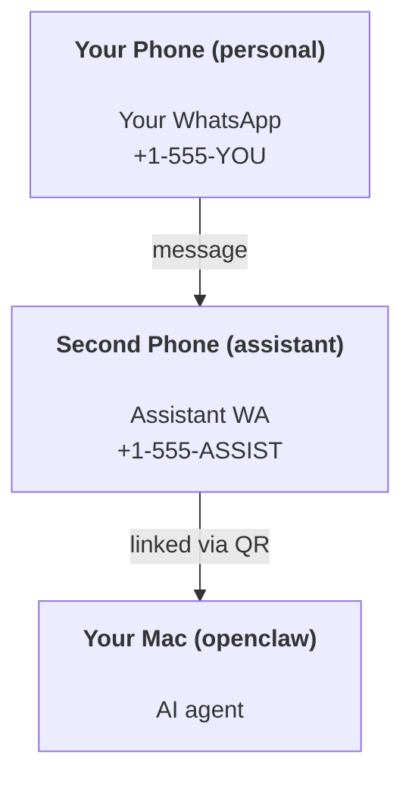

---
read_when:
    - Intégrer une nouvelle instance d’assistant
    - Examen des implications en matière de sécurité et d’autorisations
summary: Guide de bout en bout pour exécuter OpenClaw comme assistant personnel avec des précautions de sécurité
title: Configuration de l’assistant personnel
x-i18n:
    generated_at: "2026-06-27T18:14:20Z"
    model: gpt-5.5
    postprocess_version: locale-links-v1
    provider: openai
    source_hash: b0cd640872a2a60fd88d2dc3df6d038ef8574163430d8683ef9b67921b0c87f4
    source_path: start/openclaw.md
    workflow: 16
---

OpenClaw est un Gateway auto-hébergé qui connecte Discord, Google Chat, iMessage, Matrix, Microsoft Teams, Signal, Slack, Telegram, WhatsApp, Zalo et d’autres services à des agents d’IA. Ce guide couvre la configuration « assistant personnel » : un numéro WhatsApp dédié qui se comporte comme votre assistant IA toujours disponible.

## ⚠️ La sécurité d’abord

Vous placez un agent en position de :

- exécuter des commandes sur votre machine (selon votre politique d’outils)
- lire/écrire des fichiers dans votre espace de travail
- renvoyer des messages via WhatsApp/Telegram/Discord/Mattermost et d’autres canaux intégrés

Commencez prudemment :

- Définissez toujours `channels.whatsapp.allowFrom` (ne laissez jamais votre Mac personnel ouvert au monde entier).
- Utilisez un numéro WhatsApp dédié pour l’assistant.
- Les Heartbeats sont désormais déclenchés par défaut toutes les 30 minutes. Désactivez-les jusqu’à ce que vous fassiez confiance à la configuration en définissant `agents.defaults.heartbeat.every: "0m"`.

## Prérequis

- OpenClaw installé et configuré - consultez [Bien démarrer](/fr/start/getting-started) si vous ne l’avez pas encore fait
- Un deuxième numéro de téléphone (SIM/eSIM/prépayé) pour l’assistant

## La configuration à deux téléphones (recommandée)

Vous voulez ceci :



Si vous associez votre WhatsApp personnel à OpenClaw, chaque message qui vous est adressé devient une « entrée d’agent ». C’est rarement ce que vous voulez.

## Démarrage rapide en 5 minutes

1. Associez WhatsApp Web (affiche un QR ; scannez-le avec le téléphone de l’assistant) :

```bash
openclaw channels login
```

2. Démarrez le Gateway (laissez-le tourner) :

```bash
openclaw gateway --port 18789
```

3. Placez une configuration minimale dans `~/.openclaw/openclaw.json` :

```json5
{
  gateway: { mode: "local" },
  channels: { whatsapp: { allowFrom: ["+15555550123"] } },
}
```

Envoyez maintenant un message au numéro de l’assistant depuis votre téléphone autorisé.

Lorsque l’intégration se termine, OpenClaw ouvre automatiquement le tableau de bord et affiche un lien propre (sans jeton). Si le tableau de bord demande une authentification, collez le secret partagé configuré dans les paramètres de l’interface de contrôle. L’intégration utilise un jeton par défaut (`gateway.auth.token`), mais l’authentification par mot de passe fonctionne aussi si vous avez basculé `gateway.auth.mode` vers `password`. Pour rouvrir plus tard : `openclaw dashboard`.

## Donner un espace de travail à l’agent (AGENTS)

OpenClaw lit les instructions d’exploitation et la « mémoire » depuis son répertoire d’espace de travail.

Par défaut, OpenClaw utilise `~/.openclaw/workspace` comme espace de travail de l’agent et le créera (avec les fichiers de démarrage `AGENTS.md`, `SOUL.md`, `TOOLS.md`, `IDENTITY.md`, `USER.md`, `HEARTBEAT.md`) automatiquement lors de la configuration ou de la première exécution d’agent. `BOOTSTRAP.md` n’est créé que lorsque l’espace de travail est entièrement nouveau (il ne devrait pas réapparaître après sa suppression). `MEMORY.md` est facultatif (non créé automatiquement) ; lorsqu’il est présent, il est chargé pour les sessions normales. Les sessions de sous-agent n’injectent que `AGENTS.md` et `TOOLS.md`.

<Tip>
Traitez ce dossier comme la mémoire d’OpenClaw et faites-en un dépôt git (idéalement privé) afin que vos fichiers `AGENTS.md` et de mémoire soient sauvegardés. Si git est installé, les tout nouveaux espaces de travail sont initialisés automatiquement.
</Tip>

```bash
openclaw setup
```

Disposition complète de l’espace de travail + guide de sauvegarde : [Espace de travail de l’agent](/fr/concepts/agent-workspace)
Flux de travail de mémoire : [Mémoire](/fr/concepts/memory)

Facultatif : choisissez un autre espace de travail avec `agents.defaults.workspace` (prend en charge `~`).

```json5
{
  agents: {
    defaults: {
      workspace: "~/.openclaw/workspace",
    },
  },
}
```

Si vous fournissez déjà vos propres fichiers d’espace de travail depuis un dépôt, vous pouvez désactiver entièrement la création des fichiers d’amorçage :

```json5
{
  agents: {
    defaults: {
      skipBootstrap: true,
    },
  },
}
```

## La configuration qui en fait « un assistant »

OpenClaw propose par défaut une bonne configuration d’assistant, mais vous voudrez généralement ajuster :

- la personnalité/les instructions dans [`SOUL.md`](/fr/concepts/soul)
- les paramètres de réflexion par défaut (si souhaité)
- les Heartbeats (une fois que vous lui faites confiance)

Exemple :

```json5
{
  logging: { level: "info" },
  agents: {
    defaults: {
      model: { primary: "anthropic/claude-opus-4-6" },
      workspace: "~/.openclaw/workspace",
      thinkingDefault: "high",
      timeoutSeconds: 1800,
      // Start with 0; enable later.
      heartbeat: { every: "0m" },
    },
    list: [
      {
        id: "main",
        default: true,
        groupChat: {
          mentionPatterns: ["@openclaw", "openclaw"],
        },
      },
    ],
  },
  channels: {
    whatsapp: {
      allowFrom: ["+15555550123"],
      groups: {
        "*": { requireMention: true },
      },
    },
  },
  session: {
    scope: "per-sender",
    resetTriggers: ["/new", "/reset"],
    reset: {
      mode: "daily",
      atHour: 4,
      idleMinutes: 10080,
    },
  },
}
```

## Sessions et mémoire

- Fichiers de session : `~/.openclaw/agents/<agentId>/sessions/{{SessionId}}.jsonl`
- Métadonnées de session (utilisation de jetons, dernière route, etc.) : `~/.openclaw/agents/<agentId>/sessions/sessions.json` (hérité : `~/.openclaw/sessions/sessions.json`)
- `/new` ou `/reset` démarre une nouvelle session pour cette discussion (configurable via `resetTriggers`). S’il est envoyé seul, OpenClaw confirme la réinitialisation sans appeler le modèle.
- `/compact [instructions]` compacte le contexte de session et indique le budget de contexte restant.

## Heartbeats (mode proactif)

Par défaut, OpenClaw exécute un Heartbeat toutes les 30 minutes avec l’invite :
`Read HEARTBEAT.md if it exists (workspace context). Follow it strictly. Do not infer or repeat old tasks from prior chats. If nothing needs attention, reply HEARTBEAT_OK.`
Définissez `agents.defaults.heartbeat.every: "0m"` pour le désactiver.

- Si `HEARTBEAT.md` existe mais est effectivement vide (uniquement des lignes vides, des commentaires Markdown/HTML, des titres Markdown comme `# Heading`, des marqueurs de bloc ou des listes de tâches vides), OpenClaw ignore l’exécution du Heartbeat pour économiser les appels API.
- Si le fichier est absent, le Heartbeat s’exécute tout de même et le modèle décide quoi faire.
- Si l’agent répond avec `HEARTBEAT_OK` (éventuellement avec un court remplissage ; voir `agents.defaults.heartbeat.ackMaxChars`), OpenClaw supprime l’envoi sortant pour ce Heartbeat.
- Par défaut, l’envoi de Heartbeat vers les cibles de type DM `user:<id>` est autorisé. Définissez `agents.defaults.heartbeat.directPolicy: "block"` pour supprimer l’envoi vers les cibles directes tout en gardant les exécutions de Heartbeat actives.
- Les Heartbeats exécutent des tours d’agent complets - des intervalles plus courts consomment davantage de jetons.

```json5
{
  agents: {
    defaults: {
      heartbeat: { every: "30m" },
    },
  },
}
```

## Médias entrants et sortants

Les pièces jointes entrantes (images/audio/documents) peuvent être exposées à votre commande via des modèles :

- `{{MediaPath}}` (chemin de fichier temporaire local)
- `{{MediaUrl}}` (pseudo-URL)
- `{{Transcript}}` (si la transcription audio est activée)

Les pièces jointes sortantes de l’agent utilisent des champs de média structurés sur l’outil de message ou la charge utile de réponse, comme `media`, `mediaUrl`, `mediaUrls`, `path` ou `filePath`. Exemple d’arguments d’outil de message :

```json
{
  "message": "Here's the screenshot.",
  "mediaUrl": "https://example.com/screenshot.png"
}
```

OpenClaw envoie les médias structurés avec le texte. Les réponses finales héritées de l’assistant peuvent encore être normalisées pour compatibilité, mais les sorties d’outil, les sorties de navigateur, les blocs de streaming et les actions de message n’analysent pas le texte comme des commandes de pièce jointe.

Le comportement des chemins locaux suit le même modèle de confiance de lecture de fichiers que l’agent :

- Si `tools.fs.workspaceOnly` vaut `true`, les chemins de médias locaux sortants restent limités à la racine temporaire d’OpenClaw, au cache de médias, aux chemins de l’espace de travail de l’agent et aux fichiers générés par le sandbox.
- Si `tools.fs.workspaceOnly` vaut `false`, les médias locaux sortants peuvent utiliser les fichiers locaux de l’hôte que l’agent est déjà autorisé à lire.
- Les chemins locaux peuvent être absolus, relatifs à l’espace de travail ou relatifs au répertoire personnel avec `~/`.
- Les envois depuis l’hôte local n’autorisent toujours que les médias et les types de documents sûrs (images, audio, vidéo, PDF, documents Office et documents texte validés comme Markdown/MD, TXT, JSON, YAML et YML). Il s’agit d’une extension de la frontière de confiance de lecture hôte existante, pas d’un scanner de secrets : si l’agent peut lire un `secret.txt` ou un `config.json` local à l’hôte, il peut joindre ce fichier lorsque l’extension et la validation du contenu correspondent.

Cela signifie que les images/fichiers générés en dehors de l’espace de travail peuvent désormais être envoyés lorsque votre politique fs autorise déjà ces lectures, tandis que les extensions de texte arbitraires locales à l’hôte restent bloquées. Gardez les fichiers sensibles hors du système de fichiers lisible par l’agent, ou conservez `tools.fs.workspaceOnly=true` pour des envois de chemins locaux plus stricts.

## Liste de contrôle opérationnelle

```bash
openclaw status          # local status (creds, sessions, queued events)
openclaw status --all    # full diagnosis (read-only, pasteable)
openclaw status --deep   # asks the gateway for a live health probe with channel probes when supported
openclaw health --json   # gateway health snapshot (WS; default can return a fresh cached snapshot)
```

Les journaux se trouvent sous `/tmp/openclaw/` (par défaut : `openclaw-YYYY-MM-DD.log`).

## Étapes suivantes

- WebChat : [WebChat](/fr/web/webchat)
- Exploitation du Gateway : [Guide d’exploitation du Gateway](/fr/gateway)
- Cron + réveils : [Tâches Cron](/fr/automation/cron-jobs)
- Compagnon de barre de menus macOS : [Application macOS OpenClaw](/fr/platforms/macos)
- Application de nœud iOS : [Application iOS](/fr/platforms/ios)
- Application de nœud Android : [Application Android](/fr/platforms/android)
- Hub Windows : [Windows](/fr/platforms/windows)
- État de Linux : [Application Linux](/fr/platforms/linux)
- Sécurité : [Sécurité](/fr/gateway/security)

## Associés

- [Bien démarrer](/fr/start/getting-started)
- [Configuration](/fr/start/setup)
- [Vue d’ensemble des canaux](/fr/channels)
