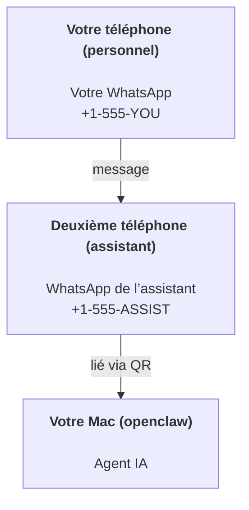

---
read_when:
    - Intégration d’une nouvelle instance d’assistant
    - Examen des implications en matière de sécurité et d’autorisations
summary: Guide de bout en bout pour exécuter OpenClaw comme assistant personnel avec des précautions de sécurité
title: Configuration d’un assistant personnel
x-i18n:
    generated_at: "2026-04-25T13:57:31Z"
    model: gpt-5.4
    provider: openai
    source_hash: 1647b78e8cf23a3a025969c52fbd8a73aed78df27698abf36bbf62045dc30e3b
    source_path: start/openclaw.md
    workflow: 15
---

# Créer un assistant personnel avec OpenClaw

OpenClaw est une Gateway auto-hébergée qui connecte Discord, Google Chat, iMessage, Matrix, Microsoft Teams, Signal, Slack, Telegram, WhatsApp, Zalo et d’autres services à des agents IA. Ce guide couvre la configuration « assistant personnel » : un numéro WhatsApp dédié qui se comporte comme votre assistant IA toujours actif.

## ⚠️ La sécurité d’abord

Vous placez un agent en position de :

- exécuter des commandes sur votre machine (selon votre politique d’outils)
- lire/écrire des fichiers dans votre espace de travail
- renvoyer des messages via WhatsApp/Telegram/Discord/Mattermost et d’autres canaux intégrés

Commencez prudemment :

- Définissez toujours `channels.whatsapp.allowFrom` (n’exécutez jamais une configuration ouverte à tous sur votre Mac personnel).
- Utilisez un numéro WhatsApp dédié pour l’assistant.
- Les Heartbeats sont désormais définis par défaut toutes les 30 minutes. Désactivez-les jusqu’à ce que vous fassiez confiance à la configuration en définissant `agents.defaults.heartbeat.every: "0m"`.

## Prérequis

- OpenClaw installé et configuré — consultez [Bien démarrer](/fr/start/getting-started) si vous ne l’avez pas encore fait
- Un deuxième numéro de téléphone (SIM/eSIM/prépayé) pour l’assistant

## La configuration à deux téléphones (recommandée)

Voici ce qu’il vous faut :



Si vous liez votre WhatsApp personnel à OpenClaw, chaque message qui vous est envoyé devient une « entrée agent ». C’est rarement ce que vous voulez.

## Démarrage rapide en 5 minutes

1. Associez WhatsApp Web (affiche un QR code ; scannez-le avec le téléphone de l’assistant) :

```bash
openclaw channels login
```

2. Démarrez la Gateway (laissez-la en cours d’exécution) :

```bash
openclaw gateway --port 18789
```

3. Placez une configuration minimale dans `~/.openclaw/openclaw.json` :

```json5
{
  gateway: { mode: "local" },
  channels: { whatsapp: { allowFrom: ["+15555550123"] } },
}
```

Envoyez maintenant un message au numéro de l’assistant depuis votre téléphone autorisé.

Lorsque l’intégration se termine, OpenClaw ouvre automatiquement le tableau de bord et affiche un lien propre (sans jeton). Si le tableau de bord demande une authentification, collez le secret partagé configuré dans les paramètres de Control UI. Par défaut, l’intégration utilise un jeton (`gateway.auth.token`), mais l’authentification par mot de passe fonctionne aussi si vous avez remplacé `gateway.auth.mode` par `password`. Pour le rouvrir plus tard : `openclaw dashboard`.

## Donner un espace de travail à l’agent (AGENTS)

OpenClaw lit les instructions de fonctionnement et la « mémoire » depuis son répertoire d’espace de travail.

Par défaut, OpenClaw utilise `~/.openclaw/workspace` comme espace de travail de l’agent et le crée automatiquement (ainsi que les fichiers initiaux `AGENTS.md`, `SOUL.md`, `TOOLS.md`, `IDENTITY.md`, `USER.md`, `HEARTBEAT.md`) lors de la configuration/première exécution de l’agent. `BOOTSTRAP.md` n’est créé que lorsque l’espace de travail est entièrement nouveau (il ne doit pas réapparaître après sa suppression). `MEMORY.md` est facultatif (il n’est pas créé automatiquement) ; lorsqu’il est présent, il est chargé pour les sessions normales. Les sessions de sous-agent n’injectent que `AGENTS.md` et `TOOLS.md`.

Conseil : traitez ce dossier comme la « mémoire » d’OpenClaw et faites-en un dépôt git (idéalement privé) afin que vos fichiers `AGENTS.md` et de mémoire soient sauvegardés. Si git est installé, les espaces de travail entièrement nouveaux sont initialisés automatiquement.

```bash
openclaw setup
```

Disposition complète de l’espace de travail + guide de sauvegarde : [Espace de travail de l’agent](/fr/concepts/agent-workspace)
Flux de travail de mémoire : [Mémoire](/fr/concepts/memory)

Facultatif : choisissez un autre espace de travail avec `agents.defaults.workspace` (prend en charge `~`).

```json5
{
  agents: {
    defaults: {
      workspace: "~/.openclaw/workspace",
    },
  },
}
```

Si vous fournissez déjà vos propres fichiers d’espace de travail à partir d’un dépôt, vous pouvez désactiver complètement la création des fichiers bootstrap :

```json5
{
  agents: {
    defaults: {
      skipBootstrap: true,
    },
  },
}
```

## La configuration qui en fait « un assistant »

OpenClaw utilise par défaut une bonne configuration d’assistant, mais vous voudrez généralement ajuster :

- la persona/les instructions dans [`SOUL.md`](/fr/concepts/soul)
- les paramètres de réflexion par défaut (si souhaité)
- les Heartbeats (une fois que vous lui faites confiance)

Exemple :

```json5
{
  logging: { level: "info" },
  agent: {
    model: "anthropic/claude-opus-4-6",
    workspace: "~/.openclaw/workspace",
    thinkingDefault: "high",
    timeoutSeconds: 1800,
    // Commencez avec 0 ; activez plus tard.
    heartbeat: { every: "0m" },
  },
  channels: {
    whatsapp: {
      allowFrom: ["+15555550123"],
      groups: {
        "*": { requireMention: true },
      },
    },
  },
  routing: {
    groupChat: {
      mentionPatterns: ["@openclaw", "openclaw"],
    },
  },
  session: {
    scope: "per-sender",
    resetTriggers: ["/new", "/reset"],
    reset: {
      mode: "daily",
      atHour: 4,
      idleMinutes: 10080,
    },
  },
}
```

## Sessions et mémoire

- Fichiers de session : `~/.openclaw/agents/<agentId>/sessions/{{SessionId}}.jsonl`
- Métadonnées de session (utilisation des jetons, dernière route, etc.) : `~/.openclaw/agents/<agentId>/sessions/sessions.json` (ancien : `~/.openclaw/sessions/sessions.json`)
- `/new` ou `/reset` démarre une nouvelle session pour cette discussion (configurable via `resetTriggers`). S’il est envoyé seul, l’agent répond par un court message de bienvenue pour confirmer la réinitialisation.
- `/compact [instructions]` compacte le contexte de la session et indique le budget de contexte restant.

## Heartbeats (mode proactif)

Par défaut, OpenClaw exécute un Heartbeat toutes les 30 minutes avec l’invite suivante :
`Read HEARTBEAT.md if it exists (workspace context). Follow it strictly. Do not infer or repeat old tasks from prior chats. If nothing needs attention, reply HEARTBEAT_OK.`
Définissez `agents.defaults.heartbeat.every: "0m"` pour le désactiver.

- Si `HEARTBEAT.md` existe mais est en pratique vide (uniquement des lignes vides et des en-têtes Markdown comme `# Heading`), OpenClaw ignore l’exécution du Heartbeat pour économiser des appels API.
- Si le fichier est absent, le Heartbeat s’exécute quand même et le modèle décide quoi faire.
- Si l’agent répond avec `HEARTBEAT_OK` (éventuellement avec un court remplissage ; voir `agents.defaults.heartbeat.ackMaxChars`), OpenClaw supprime l’envoi sortant pour ce Heartbeat.
- Par défaut, l’envoi du Heartbeat vers des cibles de type message direct `user:<id>` est autorisé. Définissez `agents.defaults.heartbeat.directPolicy: "block"` pour supprimer l’envoi direct tout en conservant les exécutions du Heartbeat actives.
- Les Heartbeats exécutent des tours complets d’agent — des intervalles plus courts consomment davantage de jetons.

```json5
{
  agent: {
    heartbeat: { every: "30m" },
  },
}
```

## Médias entrants et sortants

Les pièces jointes entrantes (images/audio/documents) peuvent être exposées à votre commande via des modèles :

- `{{MediaPath}}` (chemin local du fichier temporaire)
- `{{MediaUrl}}` (pseudo-URL)
- `{{Transcript}}` (si la transcription audio est activée)

Pièces jointes sortantes depuis l’agent : incluez `MEDIA:<path-or-url>` sur sa propre ligne (sans espaces). Exemple :

```
Voici la capture d’écran.
MEDIA:https://example.com/screenshot.png
```

OpenClaw les extrait et les envoie comme média avec le texte.

Le comportement des chemins locaux suit le même modèle de confiance de lecture de fichiers que l’agent :

- Si `tools.fs.workspaceOnly` vaut `true`, les chemins locaux sortants `MEDIA:` restent limités à la racine temporaire d’OpenClaw, au cache média, aux chemins d’espace de travail de l’agent et aux fichiers générés par la sandbox.
- Si `tools.fs.workspaceOnly` vaut `false`, `MEDIA:` sortant peut utiliser des fichiers locaux de l’hôte que l’agent est déjà autorisé à lire.
- Les envois locaux depuis l’hôte n’autorisent toujours que les médias et les types de documents sûrs (images, audio, vidéo, PDF et documents Office). Le texte brut et les fichiers de type secret ne sont pas traités comme des médias pouvant être envoyés.

Cela signifie que les images/fichiers générés en dehors de l’espace de travail peuvent désormais être envoyés lorsque votre politique fs autorise déjà ces lectures, sans rouvrir l’exfiltration arbitraire de pièces jointes texte de l’hôte.

## Liste de vérification des opérations

```bash
openclaw status          # statut local (identifiants, sessions, événements en file d’attente)
openclaw status --all    # diagnostic complet (lecture seule, prêt à coller)
openclaw status --deep   # demande à la gateway une sonde d’état en direct avec des sondes de canal lorsque c’est pris en charge
openclaw health --json   # instantané d’état de la gateway (WS ; la valeur par défaut peut renvoyer un instantané récent mis en cache)
```

Les journaux se trouvent sous `/tmp/openclaw/` (par défaut : `openclaw-YYYY-MM-DD.log`).

## Étapes suivantes

- WebChat : [WebChat](/fr/web/webchat)
- Opérations Gateway : [Runbook Gateway](/fr/gateway)
- Cron + réveils : [Tâches Cron](/fr/automation/cron-jobs)
- Compagnon macOS dans la barre de menus : [Application macOS OpenClaw](/fr/platforms/macos)
- Application Node iOS : [Application iOS](/fr/platforms/ios)
- Application Node Android : [Application Android](/fr/platforms/android)
- État de Windows : [Windows (WSL2)](/fr/platforms/windows)
- État de Linux : [Application Linux](/fr/platforms/linux)
- Sécurité : [Sécurité](/fr/gateway/security)

## Lié

- [Bien démarrer](/fr/start/getting-started)
- [Configuration](/fr/start/setup)
- [Vue d’ensemble des canaux](/fr/channels)
