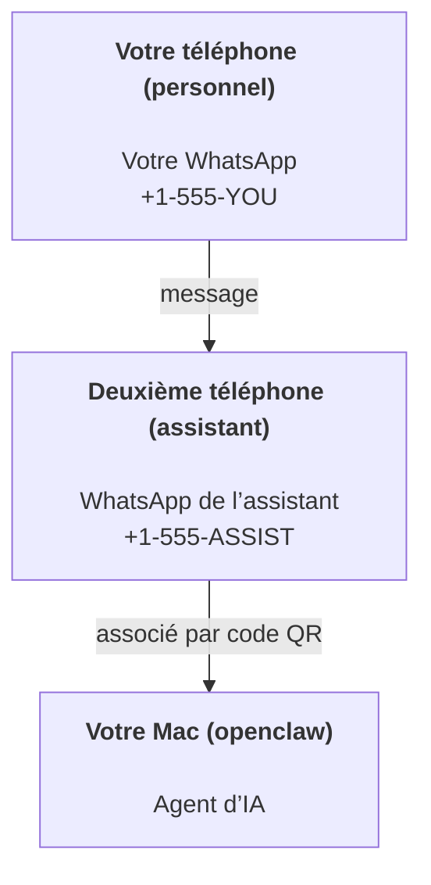

---
read_when:
    - Intégration d’une nouvelle instance d’assistant
    - Examen des implications en matière de sécurité et d’autorisations
summary: Guide de bout en bout pour utiliser OpenClaw comme assistant personnel, avec des consignes de sécurité
title: Configuration de l’assistant personnel
x-i18n:
    generated_at: "2026-07-12T15:55:24Z"
    model: gpt-5.6
    postprocess_version: locale-links-v1
    prompt_version: 15
    provider: openai
    source_hash: e8c34e31314f55647059fd600935330110add27b338a675bc0ce1529bebb207d
    source_path: start/openclaw.md
    workflow: 16
---

OpenClaw est un Gateway auto-hébergé qui connecte Discord, Google Chat, iMessage, Matrix, Microsoft Teams, Signal, Slack, Telegram, WhatsApp, Zalo et d’autres services à des agents d’IA. Ce guide couvre la configuration d’un « assistant personnel » : un numéro WhatsApp dédié qui se comporte comme votre assistant d’IA toujours disponible.

## La sécurité avant tout

Donner un canal à un agent lui permet potentiellement d’exécuter des commandes sur votre machine (selon votre politique d’outils), de lire et d’écrire des fichiers dans votre espace de travail, et d’envoyer des messages via n’importe quel canal connecté. Commencez avec prudence :

- Définissez toujours `channels.whatsapp.allowFrom` (n’exposez jamais votre Mac personnel au monde entier).
- Utilisez un numéro WhatsApp dédié à l’assistant.
- Par défaut, les Heartbeats sont envoyés toutes les 30 minutes. Désactivez-les jusqu’à ce que vous ayez confiance dans la configuration en définissant `agents.defaults.heartbeat.every: "0m"`.

## Prérequis

- OpenClaw installé et configuré — consultez [Bien démarrer](/fr/start/getting-started) si vous ne l’avez pas encore fait
- Un deuxième numéro de téléphone (SIM/eSIM/prépayé) pour l’assistant

## La configuration avec deux téléphones (recommandée)

Voici la configuration recherchée :



Si vous associez votre compte WhatsApp personnel à OpenClaw, chaque message qui vous est destiné devient une « entrée de l’agent ». C’est rarement ce que vous souhaitez.

## Démarrage rapide en 5 minutes

1. Associez WhatsApp Web (un code QR s’affiche ; scannez-le avec le téléphone de l’assistant) :

```bash
openclaw channels login
```

2. Démarrez le Gateway (laissez-le fonctionner) :

```bash
openclaw gateway --port 18789
```

3. Placez une configuration minimale dans `~/.openclaw/openclaw.json` :

```json5
{
  gateway: { mode: "local" },
  channels: { whatsapp: { allowFrom: ["+15555550123"] } },
}
```

Envoyez maintenant un message au numéro de l’assistant depuis le téléphone figurant dans votre liste d’autorisation.

Une fois la configuration initiale terminée, OpenClaw ouvre automatiquement le tableau de bord et affiche un lien propre (sans jeton). Si le tableau de bord demande une authentification, collez le secret partagé configuré dans les paramètres de Control UI. La configuration initiale utilise un jeton par défaut (`gateway.auth.token`), mais l’authentification par mot de passe fonctionne également si vous avez défini `gateway.auth.mode` sur `password`. Pour le rouvrir ultérieurement : `openclaw dashboard`.

## Fournir un espace de travail à l’agent (AGENTS)

OpenClaw lit les instructions de fonctionnement et la « mémoire » depuis son répertoire d’espace de travail.

Par défaut, OpenClaw utilise `~/.openclaw/workspace` comme espace de travail de l’agent et le crée automatiquement, avec les fichiers initiaux `AGENTS.md`, `SOUL.md`, `TOOLS.md`, `IDENTITY.md`, `USER.md` et `HEARTBEAT.md`, lors de la configuration initiale ou de la première exécution de l’agent. `BOOTSTRAP.md` est créé uniquement pour un espace de travail entièrement nouveau et ne doit pas réapparaître après sa suppression. `MEMORY.md` est facultatif et n’est jamais créé automatiquement ; lorsqu’il est présent, il est chargé pour les sessions normales. Les sessions de sous-agents injectent uniquement `AGENTS.md` et `TOOLS.md`.

<Tip>
Considérez ce dossier comme la mémoire d’OpenClaw et transformez-le en dépôt git (idéalement privé) afin de sauvegarder votre fichier `AGENTS.md` et vos fichiers de mémoire. Si git est installé, les nouveaux espaces de travail sont automatiquement initialisés avec `git init`.
</Tip>

Pour créer les dossiers de l’espace de travail et de configuration sans exécuter l’assistant complet de configuration initiale :

```bash
openclaw setup --baseline
```

(`openclaw setup` sans option est un alias de `openclaw onboard` et exécute l’assistant interactif complet.)

Disposition complète de l’espace de travail et guide de sauvegarde : [Espace de travail de l’agent](/fr/concepts/agent-workspace)
Processus de gestion de la mémoire : [Mémoire](/fr/concepts/memory)

Facultatif : choisissez un autre espace de travail avec `agents.defaults.workspace` (prend en charge `~`).

```json5
{
  agents: {
    defaults: {
      workspace: "~/.openclaw/workspace",
    },
  },
}
```

Si vous fournissez déjà vos propres fichiers d’espace de travail depuis un dépôt, vous pouvez désactiver entièrement la création des fichiers d’amorçage :

```json5
{
  agents: {
    defaults: {
      skipBootstrap: true,
    },
  },
}
```

## La configuration qui en fait « un assistant »

OpenClaw utilise par défaut une bonne configuration d’assistant, mais vous souhaiterez généralement ajuster :

- la personnalité et les instructions dans [`SOUL.md`](/fr/concepts/soul)
- les valeurs par défaut de réflexion (si nécessaire)
- les Heartbeats (une fois que vous lui faites confiance)

Exemple :

```json5
{
  logging: { level: "info" },
  agents: {
    defaults: {
      model: { primary: "anthropic/claude-opus-4-8" },
      workspace: "~/.openclaw/workspace",
      thinkingDefault: "high",
      timeoutSeconds: 1800,
      // Commencez par 0 ; activez-le plus tard.
      heartbeat: { every: "0m" },
    },
    list: [
      {
        id: "main",
        default: true,
        groupChat: {
          mentionPatterns: ["@openclaw", "openclaw"],
        },
      },
    ],
  },
  channels: {
    whatsapp: {
      allowFrom: ["+15555550123"],
      groups: {
        "*": { requireMention: true },
      },
    },
  },
  session: {
    scope: "per-sender",
    resetTriggers: ["/new", "/reset"],
    reset: {
      mode: "daily",
      atHour: 4,
      idleMinutes: 10080,
    },
  },
}
```

## Sessions et mémoire

- Lignes de session, lignes de transcription et métadonnées (utilisation des tokens, dernière route, etc.) : `~/.openclaw/agents/<agentId>/agent/openclaw-agent.sqlite`
- Artefacts de transcription hérités/archivés : `~/.openclaw/agents/<agentId>/sessions/`
- Source de migration des lignes héritées : `~/.openclaw/agents/<agentId>/sessions/sessions.json`
- `/new` ou `/reset` démarre une nouvelle session pour cette conversation (configurable via `session.resetTriggers`). Si la commande est envoyée seule, OpenClaw confirme la réinitialisation sans invoquer le modèle.
- `/compact [instructions]` compacte le contexte de la session et indique le budget de contexte restant.

## Heartbeats (mode proactif)

Par défaut, OpenClaw exécute un Heartbeat toutes les 30 minutes avec l’invite suivante :
`Read HEARTBEAT.md if it exists (workspace context). Follow it strictly. Do not infer or repeat old tasks from prior chats. If nothing needs attention, reply HEARTBEAT_OK.`
Définissez `agents.defaults.heartbeat.every: "0m"` pour le désactiver.

- Si `HEARTBEAT.md` existe mais est effectivement vide (il ne contient que des lignes vides, des commentaires Markdown/HTML, des titres Markdown comme `# Heading`, des délimiteurs de blocs ou des éléments de liste de contrôle vides), OpenClaw ignore l’exécution du Heartbeat afin d’économiser des appels d’API.
- Si le fichier est absent, le Heartbeat s’exécute quand même et le modèle décide de la marche à suivre.
- Si l’agent répond avec `HEARTBEAT_OK` (éventuellement accompagné d’un court texte supplémentaire ; voir `agents.defaults.heartbeat.ackMaxChars`), OpenClaw empêche l’envoi sortant pour ce Heartbeat.
- Par défaut, l’envoi des Heartbeats vers des cibles de type message privé `user:<id>` est autorisé. Définissez `agents.defaults.heartbeat.directPolicy: "block"` pour empêcher l’envoi direct tout en maintenant les exécutions du Heartbeat actives.
- Les Heartbeats exécutent des tours d’agent complets — des intervalles plus courts consomment davantage de jetons.

```json5
{
  agents: {
    defaults: {
      heartbeat: { every: "30m" },
    },
  },
}
```

## Médias entrants et sortants

Les pièces jointes entrantes (images/audio/documents) peuvent être transmises à votre commande via des modèles :

- `{{MediaPath}}` (chemin du fichier temporaire local)
- `{{MediaUrl}}` (pseudo-URL)
- `{{Transcript}}` (si la transcription audio est activée)

Les pièces jointes sortantes de l’agent utilisent des champs de média structurés dans l’outil de messagerie ou la charge utile de réponse, tels que `media`, `mediaUrl`, `mediaUrls`, `path` ou `filePath`. Exemple d’arguments pour l’outil de messagerie :

```json
{
  "message": "Voici la capture d’écran.",
  "mediaUrl": "https://example.com/screenshot.png"
}
```

OpenClaw envoie les médias structurés avec le texte. Les anciennes réponses finales de l’assistant peuvent encore être normalisées à des fins de compatibilité, mais la sortie des outils, la sortie du navigateur, les blocs de diffusion en continu et les actions de messagerie n’interprètent pas le texte comme des commandes de pièces jointes.

Le comportement des chemins locaux suit le même modèle de confiance pour la lecture des fichiers que l’agent :

- Si `tools.fs.workspaceOnly` vaut `true`, les chemins des médias locaux sortants restent limités à la racine temporaire d’OpenClaw, au cache des médias, aux chemins de l’espace de travail de l’agent et aux fichiers générés par le bac à sable.
- Si `tools.fs.workspaceOnly` vaut `false`, les médias locaux sortants peuvent utiliser des fichiers locaux de l’hôte que l’agent est déjà autorisé à lire.
- Les chemins locaux peuvent être absolus, relatifs à l’espace de travail ou relatifs au répertoire personnel avec `~/`.
- Les envois de fichiers locaux de l’hôte restent limités aux médias et aux types de documents sûrs (images, audio, vidéo, PDF, documents Office et documents texte validés tels que Markdown/MD, TXT, JSON, YAML et YML). Il s’agit d’une extension de la limite de confiance existante pour la lecture sur l’hôte, et non d’un analyseur de secrets : si l’agent peut lire un fichier local de l’hôte `secret.txt` ou `config.json`, il peut joindre ce fichier lorsque l’extension et la validation du contenu correspondent.

Conservez les fichiers sensibles en dehors du système de fichiers accessible à l’agent, ou conservez `tools.fs.workspaceOnly: true` pour appliquer des restrictions plus strictes aux envois par chemin local.

## Liste de contrôle des opérations

```bash
openclaw status          # état local (identifiants, sessions, événements en file d’attente)
openclaw status --all    # diagnostic complet (lecture seule, pouvant être collé)
openclaw status --deep   # vérification des canaux (WhatsApp Web + Telegram + Discord + Slack + Signal)
openclaw health --json   # instantané de l’état du Gateway via la connexion WS
```

Les journaux se trouvent sous `/tmp/openclaw/` (par défaut : `openclaw-YYYY-MM-DD.log`).

## Étapes suivantes

- WebChat : [WebChat](/fr/web/webchat)
- Opérations du Gateway : [Guide d’exploitation du Gateway](/fr/gateway)
- Cron + réveils : [Tâches Cron](/fr/automation/cron-jobs)
- Compagnon de barre des menus macOS : [Application OpenClaw pour macOS](/fr/platforms/macos)
- Application Node pour iOS : [Application iOS](/fr/platforms/ios)
- Application Node pour Android : [Application Android](/fr/platforms/android)
- Hub Windows : [Windows](/fr/platforms/windows)
- État sous Linux : [Application Linux](/fr/platforms/linux)
- Sécurité : [Sécurité](/fr/gateway/security)

## Voir aussi

- [Bien démarrer](/fr/start/getting-started)
- [Configuration](/fr/start/setup)
- [Vue d’ensemble des canaux](/fr/channels)
