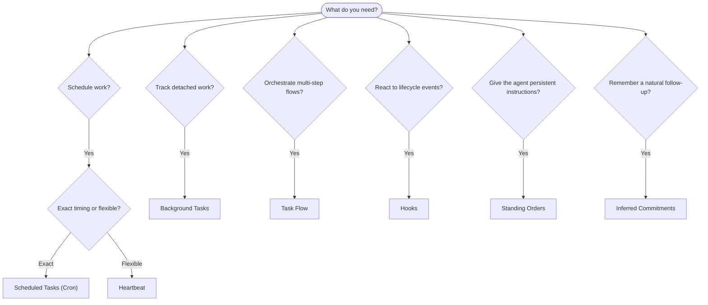

OpenClaw कार्यों को पृष्ठभूमि में tasks, शेड्यूल किए गए jobs, अनुमित
प्रतिबद्धताओं, event hooks, और स्थायी निर्देशों के माध्यम से चलाता है। यह पृष्ठ आपको
सही तंत्र चुनने और यह समझने में मदद करता है कि वे साथ मिलकर कैसे काम करते हैं।

## त्वरित निर्णय गाइड

| उपयोग मामला                                | अनुशंसित            | क्यों                                              |
| --------------------------------------- | ---------------------- | ------------------------------------------------ |
| रोज़ाना रिपोर्ट ठीक सुबह 9 बजे भेजें         | शेड्यूल किए गए Tasks (Cron) | सटीक समय, पृथक निष्पादन                 |
| मुझे 20 मिनट में याद दिलाएँ                 | शेड्यूल किए गए Tasks (Cron) | सटीक समय वाला एकबारगी काम (`--at`)            |
| साप्ताहिक गहन विश्लेषण चलाएँ                | शेड्यूल किए गए Tasks (Cron) | स्वतंत्र task, अलग model उपयोग कर सकता है         |
| हर 30 मिनट में inbox जाँचें                | Heartbeat              | अन्य जाँचों के साथ batches, context-aware         |
| आने वाले events के लिए calendar मॉनिटर करें    | Heartbeat              | आवधिक जागरूकता के लिए स्वाभाविक रूप से उपयुक्त               |
| उल्लेखित interview के बाद check in करें    | अनुमित प्रतिबद्धताएँ   | memory-जैसा follow-up, कोई सटीक reminder अनुरोध नहीं |
| user context के बाद सौम्य care check-in | अनुमित प्रतिबद्धताएँ   | उसी agent और channel तक सीमित             |
| किसी subagent या ACP run की स्थिति जाँचें | पृष्ठभूमि Tasks       | tasks ledger सभी detached work को track करता है            |
| क्या और कब चला, इसका audit करें                 | पृष्ठभूमि Tasks       | `openclaw tasks list` और `openclaw tasks audit` |
| कई चरणों वाली research फिर summarize करें      | Task Flow              | revision tracking के साथ durable orchestration     |
| session reset पर script चलाएँ           | Hooks                  | event-driven, lifecycle events पर fires          |
| हर tool call पर code execute करें         | Plugin hooks           | in-process hooks tool calls को intercept कर सकते हैं        |
| reply करने से पहले हमेशा compliance जाँचें | स्थायी आदेश        | हर session में स्वतः injected        |

### शेड्यूल किए गए Tasks (Cron) बनाम Heartbeat

| आयाम       | शेड्यूल किए गए Tasks (Cron)              | Heartbeat                             |
| --------------- | ----------------------------------- | ------------------------------------- |
| समय          | सटीक (cron expressions, one-shot)  | अनुमानित (default हर 30 मिनट)    |
| Session context | नया (पृथक) या shared          | पूरा main-session context             |
| Task records    | हमेशा बनाए जाते हैं                      | कभी नहीं बनाए जाते                         |
| Delivery        | Channel, webhook, या silent         | main session में inline                |
| सबसे उपयुक्त        | Reports, reminders, background jobs | Inbox checks, calendar, notifications |

जब आपको सटीक समय या पृथक निष्पादन चाहिए, तब शेड्यूल किए गए Tasks (Cron) का उपयोग करें। जब काम को पूरे session context से लाभ मिलता हो और अनुमानित समय पर्याप्त हो, तब Heartbeat का उपयोग करें।

## मुख्य concepts

### शेड्यूल किए गए tasks (cron)

Cron सटीक समय के लिए Gateway का built-in scheduler है। यह jobs को persist करता है, सही समय पर agent को जगाता है, और output को chat channel या webhook endpoint पर deliver कर सकता है। यह one-shot reminders, recurring expressions, और inbound webhook triggers को support करता है।

देखें [शेड्यूल किए गए Tasks](/hi/automation/cron-jobs)।

### Tasks

पृष्ठभूमि task ledger सभी detached work को track करता है: ACP runs, subagent spawns, isolated cron executions, और CLI operations। Tasks records हैं, schedulers नहीं। उन्हें inspect करने के लिए `openclaw tasks list` और `openclaw tasks audit` का उपयोग करें।

देखें [पृष्ठभूमि Tasks](/hi/automation/tasks)।

### अनुमित प्रतिबद्धताएँ

प्रतिबद्धताएँ opt-in, short-lived follow-up memories हैं। OpenClaw उन्हें
सामान्य conversations से infer करता है, उन्हें उसी agent और channel तक scope करता है, और
due check-ins को heartbeat के माध्यम से deliver करता है। user द्वारा माँगे गए सटीक reminders अभी भी
cron के अंतर्गत आते हैं।

देखें [अनुमित प्रतिबद्धताएँ](/hi/concepts/commitments)।

### Task Flow

Task Flow पृष्ठभूमि tasks के ऊपर flow orchestration substrate है। यह managed और mirrored sync modes, revision tracking, और inspection के लिए `openclaw tasks flow list|show|cancel` के साथ durable multi-step flows को manage करता है।

देखें [Task Flow](/hi/automation/taskflow)।

### स्थायी आदेश

स्थायी आदेश agent को निर्धारित programs के लिए स्थायी operating authority देते हैं। वे workspace files (आमतौर पर `AGENTS.md`) में रहते हैं और हर session में injected होते हैं। time-based enforcement के लिए cron के साथ combine करें।

देखें [स्थायी आदेश](/hi/automation/standing-orders)।

### Hooks

Internal hooks event-driven scripts हैं जो agent lifecycle events
(`/new`, `/reset`, `/stop`), session compaction, gateway startup, और message
flow से trigger होते हैं। वे directories से automatically discovered होते हैं और
`openclaw hooks` से manage किए जा सकते हैं। in-process tool-call interception के लिए,
[Plugin hooks](/hi/plugins/hooks) का उपयोग करें।

देखें [Hooks](/hi/automation/hooks)।

### Heartbeat

Heartbeat एक आवधिक main-session turn है (default हर 30 मिनट)। यह पूरे session context के साथ एक agent turn में कई checks (inbox, calendar, notifications) को batch करता है। Heartbeat turns task records नहीं बनाते और daily/idle session reset freshness को extend नहीं करते। छोटी checklist के लिए `HEARTBEAT.md` का उपयोग करें, या जब आप heartbeat के अंदर ही due-only periodic checks चाहते हों तब `tasks:` block का उपयोग करें। खाली heartbeat files `empty-heartbeat-file` के रूप में skip होती हैं; due-only task mode `no-tasks-due` के रूप में skip होता है। जब cron work active या queued हो, तब Heartbeats defer होते हैं, और `heartbeat.skipWhenBusy` उसी agent के session-keyed subagent या nested lanes के busy होने पर भी उस agent को defer कर सकता है।

देखें [Heartbeat](/hi/gateway/heartbeat)।

## वे साथ मिलकर कैसे काम करते हैं

- **Cron** सटीक schedules (daily reports, weekly reviews) और one-shot reminders संभालता है। सभी cron executions task records बनाते हैं।
- **Heartbeat** routine monitoring (inbox, calendar, notifications) को हर 30 मिनट में एक batched turn में संभालता है।
- **Hooks** specific events (session resets, compaction, message flow) पर custom scripts के साथ react करते हैं। Plugin hooks tool calls को cover करते हैं।
- **स्थायी आदेश** agent को persistent context और authority boundaries देते हैं।
- **Task Flow** individual tasks के ऊपर multi-step flows को coordinate करता है।
- **Tasks** सभी detached work को automatically track करते हैं ताकि आप उसे inspect और audit कर सकें।

## संबंधित

- [शेड्यूल किए गए Tasks](/hi/automation/cron-jobs) — सटीक scheduling और one-shot reminders
- [अनुमित प्रतिबद्धताएँ](/hi/concepts/commitments) — memory-जैसे follow-up check-ins
- [पृष्ठभूमि Tasks](/hi/automation/tasks) — सभी detached work के लिए task ledger
- [Task Flow](/hi/automation/taskflow) — durable multi-step flow orchestration
- [Hooks](/hi/automation/hooks) — event-driven lifecycle scripts
- [Plugin hooks](/hi/plugins/hooks) — in-process tool, prompt, message, और lifecycle hooks
- [स्थायी आदेश](/hi/automation/standing-orders) — persistent agent instructions
- [Heartbeat](/hi/gateway/heartbeat) — आवधिक main-session turns
- [Configuration Reference](/hi/gateway/configuration-reference) — सभी config keys
