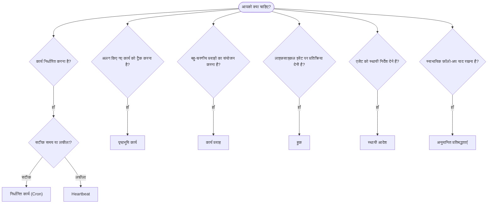

OpenClaw, कार्यों, निर्धारित जॉब, अनुमानित प्रतिबद्धताओं, इवेंट हुक और स्थायी निर्देशों के माध्यम से पृष्ठभूमि में काम चलाता है। सही तंत्र चुनने के लिए इस पृष्ठ का उपयोग करें।

## त्वरित निर्णय मार्गदर्शिका

| उपयोग का मामला                                | अनुशंसित            | कारण                                              |
| --------------------------------------- | ---------------------- | ------------------------------------------------ |
| रोज़ाना ठीक सुबह 9 बजे रिपोर्ट भेजना         | निर्धारित कार्य (Cron) | सटीक समय, पृथक निष्पादन                 |
| मुझे 20 मिनट में याद दिलाना                 | निर्धारित कार्य (Cron) | सटीक समय वाला एकबारगी कार्य (`--at`)            |
| साप्ताहिक गहन विश्लेषण चलाना                | निर्धारित कार्य (Cron) | स्वतंत्र कार्य, अलग मॉडल का उपयोग कर सकता है         |
| हर 30 मिनट में इनबॉक्स जाँचना                | Heartbeat              | अन्य जाँचों के साथ बैच में, संदर्भ-सचेत         |
| आगामी इवेंट के लिए कैलेंडर की निगरानी करना    | Heartbeat              | आवधिक जागरूकता के लिए स्वाभाविक रूप से उपयुक्त               |
| उल्लिखित साक्षात्कार के बाद संपर्क करना    | अनुमानित प्रतिबद्धताएँ   | स्मृति जैसा फ़ॉलो-अप, सटीक रिमाइंडर अनुरोध नहीं |
| उपयोगकर्ता के संदर्भ के बाद विनम्र देखभाल-संबंधी संपर्क | अनुमानित प्रतिबद्धताएँ   | उसी एजेंट और चैनल तक सीमित             |
| किसी सबएजेंट या ACP रन की स्थिति जाँचना | पृष्ठभूमि कार्य       | कार्य लेजर सभी अलग किए गए कार्य को ट्रैक करता है            |
| क्या और कब चला, इसका ऑडिट करना                 | पृष्ठभूमि कार्य       | `openclaw tasks list` और `openclaw tasks audit` |
| बहु-चरणीय शोध करके फिर सारांश बनाना      | कार्य प्रवाह              | संशोधन ट्रैकिंग वाला टिकाऊ संयोजन     |
| सत्र रीसेट पर स्क्रिप्ट चलाना           | हुक                  | इवेंट-संचालित, लाइफ़साइकल इवेंट पर सक्रिय होता है          |
| प्रत्येक टूल कॉल पर कोड निष्पादित करना         | Plugin हुक           | इन-प्रोसेस हुक टूल कॉल को इंटरसेप्ट कर सकते हैं        |
| उत्तर देने से पहले हमेशा अनुपालन जाँचना | स्थायी आदेश        | प्रत्येक सत्र में स्वचालित रूप से प्रविष्ट किए जाते हैं        |

### निर्धारित कार्य (Cron) बनाम Heartbeat

| आयाम       | निर्धारित कार्य (Cron)              | Heartbeat                             |
| --------------- | ----------------------------------- | ------------------------------------- |
| समय          | सटीक (cron एक्सप्रेशन, एकबारगी)  | अनुमानित (डिफ़ॉल्ट रूप से हर 30 मिनट)    |
| सत्र संदर्भ | नया (पृथक) या साझा          | मुख्य सत्र का पूरा संदर्भ             |
| कार्य रिकॉर्ड    | हमेशा बनाए जाते हैं                      | कभी नहीं बनाए जाते                         |
| वितरण        | चैनल, webhook या मौन         | मुख्य सत्र में इनलाइन                |
| इनके लिए सर्वोत्तम        | रिपोर्ट, रिमाइंडर, पृष्ठभूमि जॉब | इनबॉक्स जाँच, कैलेंडर, सूचनाएँ |

जब सटीक समय या पृथक निष्पादन चाहिए, तब निर्धारित कार्य (Cron) का उपयोग करें। जब कार्य को सत्र के पूरे संदर्भ से लाभ हो और अनुमानित समय स्वीकार्य हो, तब Heartbeat का उपयोग करें।

## मुख्य अवधारणाएँ

### निर्धारित कार्य (cron)

Cron सटीक समय के लिए Gateway का अंतर्निहित शेड्यूलर है। यह जॉब को स्थायी रूप से संग्रहीत करता है, सही समय पर एजेंट को सक्रिय करता है और आउटपुट को चैट चैनल या webhook एंडपॉइंट पर पहुँचा सकता है। यह एकबारगी रिमाइंडर, आवर्ती एक्सप्रेशन और इनबाउंड webhook ट्रिगर का समर्थन करता है।

[निर्धारित कार्य](/hi/automation/cron-jobs) देखें।

### कार्य

पृष्ठभूमि कार्य लेजर सभी अलग किए गए कार्य को ट्रैक करता है: ACP रन, सबएजेंट निर्माण, पृथक cron निष्पादन और CLI संचालन। कार्य रिकॉर्ड होते हैं, शेड्यूलर नहीं। उनका निरीक्षण करने के लिए `openclaw tasks list` और `openclaw tasks audit` का उपयोग करें।

[पृष्ठभूमि कार्य](/hi/automation/tasks) देखें।

### अनुमानित प्रतिबद्धताएँ

प्रतिबद्धताएँ ऑप्ट-इन, अल्पकालिक फ़ॉलो-अप स्मृतियाँ हैं। OpenClaw सामान्य वार्तालापों से उनका अनुमान लगाता है, उन्हें उसी एजेंट और चैनल तक सीमित रखता है और नियत संपर्कों को Heartbeat के माध्यम से पहुँचाता है। उपयोगकर्ता द्वारा स्पष्ट रूप से अनुरोधित रिमाइंडर अब भी cron के अंतर्गत आते हैं।

[अनुमानित प्रतिबद्धताएँ](/hi/concepts/commitments) देखें।

### कार्य प्रवाह

कार्य प्रवाह, पृष्ठभूमि कार्यों के ऊपर स्थित प्रवाह-संयोजन आधार है। यह प्रबंधित और मिरर किए गए सिंक मोड, संशोधन ट्रैकिंग और निरीक्षण के लिए `openclaw tasks flow list|show|cancel` के साथ टिकाऊ बहु-चरणीय प्रवाहों को प्रबंधित करता है।

[कार्य प्रवाह](/hi/automation/taskflow) देखें।

### स्थायी आदेश

स्थायी आदेश एजेंट को निर्धारित प्रोग्राम के लिए स्थायी संचालन अधिकार देते हैं। वे कार्यक्षेत्र फ़ाइलों (आमतौर पर `AGENTS.md`) में रहते हैं और प्रत्येक सत्र में प्रविष्ट किए जाते हैं। समय-आधारित प्रवर्तन के लिए इन्हें cron के साथ संयोजित करें।

[स्थायी आदेश](/hi/automation/standing-orders) देखें।

### हुक

आंतरिक हुक, एजेंट लाइफ़साइकल इवेंट
(`/new`, `/reset`, `/stop`), सत्र Compaction, Gateway स्टार्टअप और संदेश
प्रवाह द्वारा ट्रिगर होने वाली इवेंट-संचालित स्क्रिप्ट हैं। उन्हें हुक डायरेक्टरी से खोजा जाता है और
`openclaw hooks` से प्रबंधित किया जाता है। इन-प्रोसेस टूल-कॉल इंटरसेप्शन के लिए
[Plugin हुक](/hi/plugins/hooks) का उपयोग करें।

[हुक](/hi/automation/hooks) देखें।

### Heartbeat

Heartbeat मुख्य सत्र का एक आवधिक टर्न है (डिफ़ॉल्ट रूप से हर 30 मिनट)। यह सत्र के पूरे संदर्भ के साथ एजेंट के एक टर्न में कई जाँचों (इनबॉक्स, कैलेंडर, सूचनाएँ) को बैच करता है। Heartbeat टर्न कार्य रिकॉर्ड नहीं बनाते और दैनिक/निष्क्रिय सत्र रीसेट की ताज़गी को नहीं बढ़ाते। छोटी चेकलिस्ट के लिए `HEARTBEAT.md` या केवल नियत आवधिक जाँचों को Heartbeat के भीतर ही चलाने के लिए `tasks:` ब्लॉक का उपयोग करें। खाली Heartbeat फ़ाइलें `empty-heartbeat-file` के रूप में छोड़ी जाती हैं; केवल नियत कार्य मोड `no-tasks-due` के रूप में छोड़ा जाता है। cron कार्य सक्रिय या कतारबद्ध होने पर Heartbeat स्थगित हो जाते हैं और `heartbeat.skipWhenBusy` किसी एजेंट को तब भी स्थगित कर सकता है, जब उसी एजेंट के सत्र-कुंजी वाले सबएजेंट या नेस्टेड लेन व्यस्त हों।

[Heartbeat](/hi/gateway/heartbeat) देखें।

## ये एक साथ कैसे काम करते हैं

- **Cron** सटीक शेड्यूल (दैनिक रिपोर्ट, साप्ताहिक समीक्षाएँ) और एकबारगी रिमाइंडर संभालता है। सभी cron निष्पादन कार्य रिकॉर्ड बनाते हैं।
- **Heartbeat** हर 30 मिनट में एक बैच किए गए टर्न में नियमित निगरानी (इनबॉक्स, कैलेंडर, सूचनाएँ) संभालता है।
- **हुक** कस्टम स्क्रिप्ट के साथ विशिष्ट इवेंट (सत्र रीसेट, Compaction, संदेश प्रवाह) पर प्रतिक्रिया देते हैं। Plugin हुक टूल कॉल को कवर करते हैं।
- **स्थायी आदेश** एजेंट को स्थायी संदर्भ और अधिकार-सीमाएँ देते हैं।
- **कार्य प्रवाह** अलग-अलग कार्यों के ऊपर बहु-चरणीय प्रवाहों का समन्वय करता है।
- **कार्य** सभी अलग किए गए कार्य को स्वचालित रूप से ट्रैक करते हैं, ताकि आप उसका निरीक्षण और ऑडिट कर सकें।

## संबंधित

- [निर्धारित कार्य](/hi/automation/cron-jobs) — सटीक शेड्यूलिंग और एकबारगी रिमाइंडर
- [अनुमानित प्रतिबद्धताएँ](/hi/concepts/commitments) — स्मृति जैसे फ़ॉलो-अप संपर्क
- [पृष्ठभूमि कार्य](/hi/automation/tasks) — सभी अलग किए गए कार्य के लिए कार्य लेजर
- [कार्य प्रवाह](/hi/automation/taskflow) — टिकाऊ बहु-चरणीय प्रवाह संयोजन
- [हुक](/hi/automation/hooks) — इवेंट-संचालित लाइफ़साइकल स्क्रिप्ट
- [Plugin हुक](/hi/plugins/hooks) — इन-प्रोसेस टूल, प्रॉम्प्ट, संदेश और लाइफ़साइकल हुक
- [स्थायी आदेश](/hi/automation/standing-orders) — एजेंट के स्थायी निर्देश
- [Heartbeat](/hi/gateway/heartbeat) — मुख्य सत्र के आवधिक टर्न
- [कॉन्फ़िगरेशन संदर्भ](/hi/gateway/configuration-reference) — सभी कॉन्फ़िगरेशन कुंजियाँ
