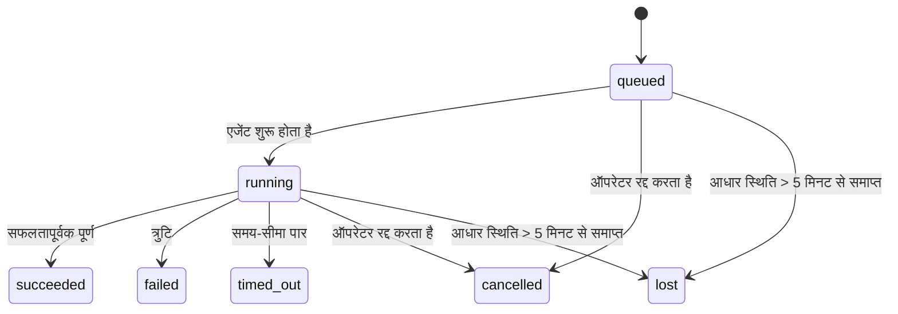

---
read_when:
    - प्रगति पर चल रहे या हाल ही में पूरे हुए बैकग्राउंड कार्य का निरीक्षण करना
    - अलग किए गए एजेंट रन की डिलीवरी विफलताओं की डीबगिंग
    - यह समझना कि बैकग्राउंड रन सत्रों, Cron और Heartbeat से कैसे संबंधित हैं
sidebarTitle: Background tasks
summary: ACP रन, सबएजेंट, Cron निष्पादन और CLI संचालन के लिए बैकग्राउंड कार्य ट्रैकिंग
title: पृष्ठभूमि कार्य
x-i18n:
    generated_at: "2026-07-19T07:58:45Z"
    model: gpt-5.6
    postprocess_version: locale-links-v1
    prompt_version: 32
    provider: openai
    source_hash: dbdc5ced133764fec0c8b9ae7b1957e24272dc9c1c86099de81f6923955d6b5a
    source_path: automation/tasks.md
    workflow: 16
---

<Note>
शेड्यूलिंग खोज रहे हैं? सही तंत्र चुनने के लिए [ऑटोमेशन](/hi/automation) देखें। यह पृष्ठ पृष्ठभूमि के कार्य की गतिविधि बही है, शेड्यूलर नहीं।
</Note>

पृष्ठभूमि कार्य उस काम को ट्रैक करते हैं जो **आपके मुख्य वार्तालाप सत्र के बाहर** चलता है: ACP रन, सबएजेंट स्पॉन, Cron जॉब निष्पादन और CLI से शुरू किए गए ऑपरेशन।

कार्य सत्रों, Cron जॉब या Heartbeat को **प्रतिस्थापित नहीं** करते—वे ऐसी **गतिविधि बही** हैं जो दर्ज करती है कि कौन-सा अलग किया गया काम हुआ, कब हुआ और वह सफल रहा या नहीं।

<Note>
हर एजेंट रन कोई कार्य नहीं बनाता। Heartbeat टर्न और सामान्य इंटरैक्टिव चैट ऐसा नहीं करते। सभी Cron निष्पादन, ACP स्पॉन, सबएजेंट स्पॉन, Gateway द्वारा प्रेषित CLI एजेंट कमांड और एजेंट द्वारा शुरू किए गए पृष्ठभूमि `exec` कमांड ऐसा करते हैं।
</Note>

## संक्षेप में

- कार्य **रिकॉर्ड** हैं, शेड्यूलर नहीं—Cron और Heartbeat तय करते हैं कि काम _कब_ चलेगा, जबकि कार्य ट्रैक करते हैं कि _क्या हुआ_।
- ACP, सबएजेंट, सभी Cron जॉब और CLI ऑपरेशन कार्य बनाते हैं। Heartbeat टर्न ऐसा नहीं करते।
- प्रत्येक कार्य `queued → running → terminal` से होकर आगे बढ़ता है (सफल, विफल, समय-सीमा समाप्त, रद्द या लापता)।
- जब तक Cron रनटाइम जॉब का स्वामी रहता है, Cron कार्य सक्रिय रहते हैं; यदि इन-मेमोरी रनटाइम स्थिति समाप्त हो गई हो, तो कार्य को लापता चिह्नित करने से पहले कार्य रखरखाव स्थायी Cron रन इतिहास की जाँच करता है।
- पूर्णता पुश-आधारित है: अलग किया गया काम पूरा होने पर सीधे सूचित कर सकता है या अनुरोधकर्ता सत्र/Heartbeat को जगा सकता है, इसलिए स्थिति पोलिंग लूप आम तौर पर गलत संरचना हैं।
- अलग-थलग Cron रन और सबएजेंट पूर्णताएँ अंतिम क्लीनअप लेखांकन से पहले अपने चाइल्ड सत्र के ट्रैक किए गए ब्राउज़र टैब/प्रोसेस को यथासंभव साफ़ करते हैं।
- जब वंशज सबएजेंट का काम अभी समाप्त हो रहा हो, तब अलग-थलग Cron डिलीवरी पुराने अंतरिम पैरेंट उत्तरों को दबा देती है और डिलीवरी से पहले आने पर अंतिम वंशज आउटपुट को प्राथमिकता देती है।
- पूर्णता सूचनाएँ सीधे किसी चैनल पर पहुँचाई जाती हैं या अगले Heartbeat के लिए कतारबद्ध की जाती हैं।
- `openclaw tasks list` सभी कार्य दिखाता है; `openclaw tasks audit` समस्याएँ सामने लाता है।
- टर्मिनल रिकॉर्ड 7 दिनों तक (`lost` रिकॉर्ड 24 घंटों तक) रखे जाते हैं, फिर स्वतः हटा दिए जाते हैं।

## त्वरित शुरुआत

<Tabs>
  <Tab title="सूची और फ़िल्टर">
    ```bash
    # सभी कार्य सूचीबद्ध करें (नवीनतम पहले)
    openclaw tasks list

    # रनटाइम या स्थिति के अनुसार फ़िल्टर करें
    openclaw tasks list --runtime acp
    openclaw tasks list --status running
    ```

  </Tab>
  <Tab title="निरीक्षण">
    ```bash
    # किसी विशिष्ट कार्य का विवरण दिखाएँ (कार्य ID, रन ID या सत्र कुंजी द्वारा)
    openclaw tasks show <lookup>
    ```
  </Tab>
  <Tab title="रद्द करें और सूचित करें">
    ```bash
    # चल रहे कार्य को रद्द करें (चाइल्ड सत्र को समाप्त करता है)
    openclaw tasks cancel <lookup>

    # किसी कार्य की सूचना नीति बदलें
    openclaw tasks notify <lookup> state_changes
    ```

  </Tab>
  <Tab title="ऑडिट और रखरखाव">
    ```bash
    # स्वास्थ्य ऑडिट चलाएँ
    openclaw tasks audit

    # रखरखाव का पूर्वावलोकन करें या लागू करें
    openclaw tasks maintenance
    openclaw tasks maintenance --apply
    ```

  </Tab>
  <Tab title="TaskFlow">
    ```bash
    # TaskFlow स्थिति का निरीक्षण करें
    openclaw tasks flow list
    openclaw tasks flow show <lookup>
    openclaw tasks flow cancel <lookup>
    ```
  </Tab>
</Tabs>

## कार्य किससे बनता है

| स्रोत                  | रनटाइम प्रकार | कार्य रिकॉर्ड कब बनाया जाता है                                         | डिफ़ॉल्ट सूचना नीति |
| ---------------------- | ------------ | ---------------------------------------------------------------------- | --------------------- |
| ACP पृष्ठभूमि रन       | `acp`        | चाइल्ड ACP सत्र स्पॉन करते समय                                         | `done_only`           |
| सबएजेंट ऑर्केस्ट्रेशन | `subagent`   | `sessions_spawn` के माध्यम से सबएजेंट स्पॉन करते समय                   | `done_only`           |
| Cron जॉब (सभी प्रकार) | `cron`       | प्रत्येक Cron निष्पादन (मुख्य सत्र और अलग-थलग)                         | `silent`              |
| CLI ऑपरेशन            | `cli`        | Gateway से होकर चलने वाले `openclaw agent` कमांड                      | `silent`              |
| एजेंट मीडिया जॉब      | `cli`        | सत्र-समर्थित `image_generate`/`music_generate`/`video_generate` रन | `silent`              |

<AccordionGroup>
  <Accordion title="Cron और मीडिया के लिए सूचना डिफ़ॉल्ट">
    Cron कार्य (मुख्य सत्र और अलग-थलग) `silent` सूचना नीति का उपयोग करते हैं—वे ट्रैकिंग के लिए रिकॉर्ड बनाते हैं, लेकिन अपनी ओर से कार्य सूचनाएँ उत्पन्न नहीं करते; Cron अपने डिलीवरी पथ का स्वामी है।

    सत्र-समर्थित `image_generate`, `music_generate` और `video_generate` रन भी `silent` सूचना नीति का उपयोग करते हैं। वे फिर भी कार्य रिकॉर्ड बनाते हैं, लेकिन पूर्णता को आंतरिक वेक के रूप में मूल एजेंट सत्र को वापस सौंप दिया जाता है, ताकि एजेंट फ़ॉलो-अप संदेश लिख सके और तैयार मीडिया स्वयं संलग्न कर सके। अनुरोधकर्ता एजेंट अपने सामान्य दृश्यमान-उत्तर अनुबंध का पालन करता है: कॉन्फ़िगर होने पर स्वचालित अंतिम उत्तर, या जब सत्र के लिए संदेश-टूल उत्तर आवश्यक हों तब `message(action="send")` और `NO_REPLY`। यदि अनुरोधकर्ता सत्र अब सक्रिय नहीं है या उसका सक्रिय वेक विफल हो जाता है, और पूर्णता एजेंट से कुछ या सभी जनरेट किए गए मीडिया छूट जाते हैं, तो OpenClaw केवल छूटे हुए मीडिया के साथ मूल चैनल लक्ष्य को आइडेम्पोटेंट प्रत्यक्ष फ़ॉलबैक भेजता है।

  </Accordion>
  <Accordion title="समवर्ती मीडिया जनरेशन की सुरक्षा सीमा">
    जब तक सत्र-समर्थित मीडिया-जनरेशन कार्य सक्रिय है, `image_generate`, `music_generate` और `video_generate` आकस्मिक पुनः प्रयासों से बचाते हैं: समान प्रॉम्प्ट/अनुरोध के लिए कॉल दोहराने पर डुप्लिकेट शुरू करने के बजाय मेल खाते सक्रिय कार्य की स्थिति लौटती है, जबकि भिन्न प्रॉम्प्ट अपना अलग कार्य शुरू कर सकता है। एजेंट की ओर से स्पष्ट प्रगति/स्थिति लुकअप चाहिए तो `action: "status"` का उपयोग करें।
  </Accordion>
  <Accordion title="किनसे कार्य नहीं बनते">
    - Heartbeat टर्न—मुख्य सत्र; [Heartbeat](/hi/gateway/heartbeat) देखें
    - सामान्य इंटरैक्टिव चैट टर्न
    - प्रत्यक्ष `/command` प्रतिक्रियाएँ

  </Accordion>
</AccordionGroup>

## कार्य जीवनचक्र



| स्थिति      | इसका अर्थ                                                                  |
| ----------- | --------------------------------------------------------------------------- |
| `queued`    | बनाया गया, एजेंट के शुरू होने की प्रतीक्षा में                              |
| `running`   | एजेंट टर्न सक्रिय रूप से निष्पादित हो रहा है                                |
| `succeeded` | सफलतापूर्वक पूर्ण                                                           |
| `failed`    | त्रुटि के साथ पूर्ण                                                         |
| `timed_out` | कॉन्फ़िगर की गई समय-सीमा पार हुई                                            |
| `cancelled` | ऑपरेटर ने `openclaw tasks cancel` के माध्यम से रोका, या रन निरस्त किया गया |
| `lost`      | 5-मिनट की ग्रेस अवधि के बाद रनटाइम ने आधिकारिक आधार स्थिति खो दी           |

संक्रमण स्वतः होते हैं—एजेंट रन जीवनचक्र घटनाएँ (आरंभ, समाप्ति, त्रुटि) कार्य की स्थिति अपडेट करती हैं; आप इसे मैन्युअल रूप से प्रबंधित नहीं करते।

सक्रिय कार्य रिकॉर्ड के लिए एजेंट रन की पूर्णता आधिकारिक होती है। सफल अलग किया गया रन `succeeded` के रूप में अंतिम होता है, सामान्य रन त्रुटियाँ `failed` के रूप में, समय-सीमाएँ `timed_out` के रूप में और रद्द/निरस्त परिणाम `cancelled` के रूप में अंतिम होते हैं। कार्य के टर्मिनल होने के बाद बाद के जीवनचक्र संकेत उसकी स्थिति को निम्नतर नहीं करते—ऑपरेटर द्वारा रद्द या पहले से `failed`/`timed_out`/`lost` कार्य वैसा ही रहता है, भले ही बाद में सफलता संकेत आ जाए।

`lost` रनटाइम-सचेत है:

- ACP कार्य: केवल Gateway में सक्रिय इन-प्रोसेस ACP टर्न ही सिद्ध करता है कि रन सक्रिय है; केवल स्थायी सत्र मेटाडेटा ऐसा नहीं करता। ऑफ़लाइन CLI ऑडिट सतर्क रहता है और ACP कार्यों को कभी पुनः प्राप्त नहीं करता।
- सबएजेंट कार्य: आधार चाइल्ड सत्र लक्ष्य एजेंट स्टोर से गायब हो गया है (या उसमें पुनरारंभ-पुनर्प्राप्ति टूम्बस्टोन है)।
- Cron कार्य: Cron रनटाइम अब जॉब को सक्रिय रूप से ट्रैक नहीं करता और स्थायी Cron रन इतिहास उस रन के लिए कोई टर्मिनल परिणाम नहीं दिखाता। ऑफ़लाइन CLI ऑडिट अपनी खाली इन-प्रोसेस Cron रनटाइम स्थिति को आधिकारिक नहीं मानता।
- CLI कार्य: रन ID/स्रोत ID वाले कार्य लाइव रन संदर्भ का उपयोग करते हैं, इसलिए Gateway-स्वामित्व वाला रन गायब होने के बाद शेष चाइल्ड-सत्र या चैट-सत्र पंक्तियाँ उन्हें सक्रिय नहीं रखतीं। रन पहचान के बिना पुराने CLI कार्य अब भी चाइल्ड सत्र पर फ़ॉलबैक करते हैं। Gateway-समर्थित `openclaw agent` रन भी अपने रन परिणाम से अंतिम होते हैं, इसलिए पूर्ण रन स्वीपर द्वारा `lost` चिह्नित किए जाने तक सक्रिय नहीं रहते।

## डिलीवरी और सूचनाएँ

जब कोई कार्य टर्मिनल स्थिति में पहुँचता है, OpenClaw आपको सूचित करता है। डिलीवरी के दो पथ हैं:

**प्रत्यक्ष डिलीवरी**—यदि कार्य का कोई चैनल लक्ष्य (`requesterOrigin`) है, तो पूर्णता संदेश सीधे उस चैनल (Discord, Slack, Telegram आदि) पर जाता है। इसके बजाय समूह और चैनल कार्य पूर्णताओं को अनुरोधकर्ता सत्र के माध्यम से रूट किया जाता है, ताकि पैरेंट एजेंट दृश्यमान उत्तर लिख सके। सबएजेंट पूर्णताओं के लिए उपलब्ध होने पर OpenClaw बाउंड थ्रेड/टॉपिक रूटिंग भी बनाए रखता है और प्रत्यक्ष डिलीवरी छोड़ने से पहले अनुरोधकर्ता सत्र के संग्रहीत रूट (`lastChannel` / `lastTo` / `lastAccountId`) से अनुपलब्ध `to` / खाते को भर सकता है।

**सत्र-कतारबद्ध डिलीवरी**—यदि प्रत्यक्ष डिलीवरी विफल हो जाए या कोई मूल सेट न हो, तो अपडेट अनुरोधकर्ता के सत्र में सिस्टम इवेंट के रूप में कतारबद्ध होता है और अगले Heartbeat पर दिखाई देता है।

<Tip>
सत्र-कतारबद्ध कार्य पूर्णताएँ तुरंत Heartbeat वेक ट्रिगर करती हैं, इसलिए परिणाम शीघ्र दिखाई देता है—अगले निर्धारित Heartbeat टिक की प्रतीक्षा नहीं करनी पड़ती।
</Tip>

इसका अर्थ है कि सामान्य वर्कफ़्लो पुश-आधारित है: अलग किया गया काम एक बार शुरू करें, फिर पूर्णता पर रनटाइम को आपको जगाने या सूचित करने दें। कार्य स्थिति को केवल तब पोल करें जब डीबगिंग, हस्तक्षेप या स्पष्ट ऑडिट की आवश्यकता हो।

### सूचना नीतियाँ

नियंत्रित करें कि प्रत्येक कार्य के बारे में आपको कितना सुनाई दे:

| नीति                  | क्या डिलीवर किया जाता है                                  |
| --------------------- | --------------------------------------------------------- |
| `done_only` (डिफ़ॉल्ट) | केवल टर्मिनल स्थिति (सफल, विफल आदि)                       |
| `state_changes`       | प्रत्येक स्थिति संक्रमण और प्रगति अपडेट                   |
| `silent`              | बिल्कुल कुछ नहीं (Cron, CLI और मीडिया कार्यों के लिए डिफ़ॉल्ट) |

कार्य के चलते समय नीति बदलें:

```bash
openclaw tasks notify <lookup> state_changes
```

## CLI संदर्भ

<AccordionGroup>
  <Accordion title="tasks list">
    ```bash
    openclaw tasks list [--runtime <acp|subagent|cron|cli>] [--status <status>] [--json]
    ```

    आउटपुट कॉलम: कार्य, प्रकार, स्थिति, डिलीवरी, रन, चाइल्ड सत्र, सारांश। केवल `openclaw tasks`, `openclaw tasks list` की तरह व्यवहार करता है।

  </Accordion>
  <Accordion title="tasks show">
    ```bash
    openclaw tasks show <lookup> [--json]
    ```

    लुकअप टोकन कार्य ID, रन ID या सत्र कुंजी स्वीकार करता है। समय, डिलीवरी स्थिति, त्रुटि और टर्मिनल सारांश सहित पूरा रिकॉर्ड दिखाता है।

  </Accordion>
  <Accordion title="tasks cancel">
    ```bash
    openclaw tasks cancel <lookup>
    ```

    ACP और सबएजेंट कार्यों के लिए, यह चाइल्ड सेशन को समाप्त कर देता है; ACP और Cron रद्दीकरण चालू Gateway (`tasks.cancel`) के माध्यम से रूट होते हैं। CLI द्वारा ट्रैक किए गए कार्यों के लिए, रद्दीकरण कार्य रजिस्ट्री में दर्ज किया जाता है (कोई अलग चाइल्ड रनटाइम हैंडल नहीं होता)। स्थिति `cancelled` में बदल जाती है और लागू होने पर डिलीवरी सूचना भेजी जाती है।

  </Accordion>
  <Accordion title="कार्य सूचित करें">
    ```bash
    openclaw tasks notify <lookup> <done_only|state_changes|silent>
    ```
  </Accordion>
  <Accordion title="कार्य ऑडिट">
    ```bash
    openclaw tasks audit [--severity <warn|error>] [--code <name>] [--limit <n>] [--json]
    ```

    एक ही रिपोर्ट में कार्यों **और** TaskFlows की परिचालन संबंधी समस्याएँ सामने लाता है। समस्याएँ मिलने पर निष्कर्ष `openclaw status` में भी दिखाई देते हैं।

    कार्य संबंधी निष्कर्ष:

    | निष्कर्ष                   | गंभीरता   | ट्रिगर                                                                                                      |
    | ------------------------- | ---------- | ------------------------------------------------------------------------------------------------------------ |
    | `stale_queued`            | चेतावनी       | 10 मिनट से अधिक समय से कतार में                                                                              |
    | `stale_running`           | त्रुटि      | 30 मिनट से अधिक समय से चल रहा                                                                             |
    | `lost`                    | चेतावनी/त्रुटि | रनटाइम-समर्थित कार्य का स्वामित्व गायब हो गया; बनाए रखे गए खोए कार्य `cleanupAfter` तक चेतावनी देते हैं, फिर त्रुटियाँ बन जाते हैं |
    | `delivery_failed`         | चेतावनी       | डिलीवरी विफल हुई और सूचना नीति `silent` नहीं है                                                            |
    | `missing_cleanup`         | चेतावनी       | बिना क्लीनअप टाइमस्टैम्प वाला टर्मिनल कार्य                                                                      |
    | `inconsistent_timestamps` | चेतावनी       | टाइमलाइन उल्लंघन (उदाहरण के लिए शुरू होने से पहले समाप्त हुआ)                                                        |

    TaskFlow संबंधी निष्कर्ष:

    | निष्कर्ष                | गंभीरता   | ट्रिगर                                                                    |
    | ---------------------- | ---------- | --------------------------------------------------------------------------- |
    | `restore_failed`       | त्रुटि      | SQLite से प्रवाह रजिस्ट्री पुनर्स्थापन विफल रहा                                    |
    | `stale_running`        | त्रुटि      | चल रहा प्रवाह 30 मिनट से अधिक समय से आगे नहीं बढ़ा                      |
    | `stale_waiting`        | चेतावनी       | प्रतीक्षारत प्रवाह 30 मिनट से अधिक समय से आगे नहीं बढ़ा                      |
    | `stale_blocked`        | चेतावनी       | अवरुद्ध प्रवाह 30 मिनट से अधिक समय से आगे नहीं बढ़ा                      |
    | `cancel_stuck`         | चेतावनी       | 5 मिनट से अधिक पहले रद्दीकरण का अनुरोध किया गया, कोई सक्रिय चाइल्ड कार्य नहीं, फिर भी गैर-टर्मिनल |
    | `missing_linked_tasks` | चेतावनी/त्रुटि | बिना लिंक किए गए कार्यों या प्रतीक्षा स्थिति वाला पुराना प्रबंधित प्रवाह                       |
    | `blocked_task_missing` | चेतावनी       | अवरुद्ध प्रवाह ऐसे कार्य आईडी की ओर इंगित करता है जो अब मौजूद नहीं है                      |

  </Accordion>
  <Accordion title="कार्य रखरखाव">
    ```bash
    openclaw tasks maintenance [--json]
    openclaw tasks maintenance --apply [--json]
    ```

    इसका उपयोग कार्यों, TaskFlow स्थिति और पुराने Cron रन सेशन रजिस्ट्री पंक्तियों के लिए सामंजस्य, क्लीनअप स्टैम्पिंग और छँटाई का पूर्वावलोकन करने या उन्हें लागू करने के लिए करें।

    सामंजस्य रनटाइम-सजग है:

    - ACP कार्यों के लिए Gateway में एक सक्रिय इन-प्रोसेस टर्न आवश्यक है; सबएजेंट कार्य अपने सहायक चाइल्ड सेशन की जाँच करते हैं।
    - जिन सबएजेंट कार्यों के चाइल्ड सेशन में पुनरारंभ-पुनर्प्राप्ति टूम्बस्टोन होता है, उन्हें पुनर्प्राप्त करने योग्य सहायक सेशन मानने के बजाय खोया हुआ चिह्नित किया जाता है।
    - Cron कार्य जाँचते हैं कि Cron रनटाइम अभी भी जॉब का स्वामी है या नहीं, फिर `lost` पर लौटने से पहले स्थायी Cron रन लॉग/जॉब स्थिति से टर्मिनल स्थिति पुनर्प्राप्त करते हैं। इन-मेमोरी Cron सक्रिय-जॉब सेट के लिए केवल Gateway प्रक्रिया प्रामाणिक है; ऑफलाइन CLI ऑडिट टिकाऊ इतिहास का उपयोग करता है, लेकिन केवल स्थानीय सेट खाली होने के कारण किसी Cron कार्य को खोया हुआ चिह्नित नहीं करता।
    - रन पहचान वाले CLI कार्य केवल चाइल्ड-सेशन या चैट-सेशन पंक्तियों की नहीं, बल्कि स्वामित्व रखने वाले सक्रिय रन संदर्भ की जाँच करते हैं।

    पूर्णता क्लीनअप भी रनटाइम-सजग है:

    - सबएजेंट पूर्णता, घोषणा क्लीनअप जारी रहने से पहले चाइल्ड सेशन के लिए ट्रैक किए गए ब्राउज़र टैब/प्रक्रियाओं को यथासंभव बंद करती है।
    - अलग-थलग Cron पूर्णता, रन पूरी तरह समाप्त होने से पहले Cron सेशन के लिए ट्रैक किए गए ब्राउज़र टैब/प्रक्रियाओं को यथासंभव बंद करती है।
    - अलग-थलग Cron डिलीवरी आवश्यकता होने पर वंशज सबएजेंट के अनुवर्ती कार्य की प्रतीक्षा करती है और पुराने पैरेंट अभिस्वीकृति टेक्स्ट की घोषणा करने के बजाय उसे दबा देती है।
    - सबएजेंट पूर्णता डिलीवरी केवल चाइल्ड के नवीनतम दृश्यमान असिस्टेंट टेक्स्ट का उपयोग करती है। Tool/toolResult आउटपुट को चाइल्ड परिणाम टेक्स्ट में पदोन्नत नहीं किया जाता। टर्मिनल विफल रन कैप्चर किए गए उत्तर टेक्स्ट को दोबारा चलाए बिना विफलता स्थिति की घोषणा करते हैं।
    - क्लीनअप विफलताएँ वास्तविक कार्य परिणाम को छिपाती नहीं हैं।

    रखरखाव लागू करते समय, OpenClaw 7 दिनों से अधिक पुरानी `cron:<jobId>:run:<runId>` सेशन रजिस्ट्री पंक्तियाँ भी हटा देता है, जबकि वर्तमान में चल रहे Cron जॉब की पंक्तियाँ सुरक्षित रखता है और गैर-Cron सेशन पंक्तियों को अछूता छोड़ता है।

  </Accordion>
  <Accordion title="कार्य प्रवाह सूची | दिखाएँ | रद्द करें">
    ```bash
    openclaw tasks flow list [--status <status>] [--json]
    openclaw tasks flow show <lookup> [--json]
    openclaw tasks flow cancel <lookup>
    ```

    प्रवाह लुकअप टोकन एक प्रवाह आईडी या स्वामी कुंजी स्वीकार करता है। जब आप किसी एक पृष्ठभूमि कार्य रिकॉर्ड के बजाय समन्वय करने वाले [कार्य प्रवाह](/hi/automation/taskflow) की परवाह करते हैं, तब इनका उपयोग करें।

  </Accordion>
</AccordionGroup>

## चैट कार्य बोर्ड (`/tasks`)

उस सेशन से लिंक किए गए पृष्ठभूमि कार्य देखने के लिए किसी भी चैट सेशन में `/tasks` का उपयोग करें। बोर्ड रनटाइम, स्थिति, समय और प्रगति या त्रुटि विवरण के साथ अधिकतम पाँच सक्रिय और हाल ही में पूर्ण हुए कार्य दिखाता है।

जब वर्तमान सेशन में कोई दृश्यमान लिंक किया गया कार्य नहीं होता, तो `/tasks` एजेंट-स्थानीय कार्य गणनाओं का उपयोग करता है, ताकि अन्य सेशन के विवरण उजागर किए बिना भी आपको अवलोकन मिल सके।

पूर्ण ऑपरेटर लेजर के लिए CLI का उपयोग करें: `openclaw tasks list`।

### Control UI

वेब Control UI के साइडबार में लाइव सक्रिय और हाल के पृष्ठभूमि कार्यों वाला **कार्य** पेज है। इसका उपयोग प्रगति का निरीक्षण करने, लिंक किए गए सेशन खोलने, लेजर रीफ़्रेश करने या कतारबद्ध और चल रहे कार्यों को रद्द करने के लिए करें।

चैट पेन में पेन के एजेंट तक सीमित एक संक्षिप्त किए जा सकने वाला **पृष्ठभूमि कार्य** रेल भी होता है: रोकने के नियंत्रण के साथ चल रहे कार्य और सबएजेंट, एक समाप्त अनुभाग और प्रत्येक कार्य के चाइल्ड सेशन में जाने वाले ट्रांसक्रिप्ट देखें लिंक। इसे पेन हेडर के गतिविधि टॉगल से खोलें (या एकल-पेन चैट में फ़्लोटिंग गतिविधि बटन से)।

किसी कार्य के सीमित इनपुट प्रॉम्प्ट और नवीनतम आउटपुट या त्रुटि सारांश का निरीक्षण करने के लिए रेल में उसे चुनें। चल रहा कार्य समाप्त कार्य से अलग रहता है और समाप्त पंक्तियाँ दिखाती हैं कि कार्य पूर्ण हुआ या विफल। iOS पर **Chat actions → Background Tasks** खोलें; Android पर Chat ओवरफ़्लो मेनू खोलें और **Background tasks** चुनें। दोनों मोबाइल दृश्य समान Running और Finished समूहीकरण का उपयोग करते हैं और चयन करने पर कार्य विवरण खोलते हैं।

## स्थिति एकीकरण (कार्य दबाव)

`openclaw status` में एक नज़र में समझ आने वाली कार्य पंक्ति शामिल है:

```
कार्य    2 सक्रिय · 1 कतारबद्ध · 1 चल रहा · 1 समस्या · ऑडिट स्वच्छ · 6 ट्रैक किए गए
```

सारांश सक्रिय कार्य (`queued` + `running`), विफलताओं (`failed` + `timed_out` + `lost`), ऑडिट निष्कर्षों और कुल ट्रैक किए गए रिकॉर्ड की गणना करता है; JSON पेलोड रनटाइम (`acp`, `subagent`, `cron`, `cli`) के अनुसार गणनाओं का विभाजन भी करता है।

`/status` और `session_status` टूल दोनों क्लीनअप-सजग कार्य स्नैपशॉट का उपयोग करते हैं: सक्रिय कार्यों को प्राथमिकता दी जाती है, समाप्त हो चुकी पंक्तियाँ छिपी रहती हैं और टर्मिनल कार्य केवल हाल की छोटी अवधि (5 मिनट) तक दिखाई देते हैं; जब कोई सक्रिय कार्य शेष नहीं रहता, तो विफलताओं पर ध्यान केंद्रित किया जाता है। इससे स्थिति कार्ड अभी महत्वपूर्ण चीज़ों पर केंद्रित रहता है।

## भंडारण और रखरखाव

### कार्य कहाँ रहते हैं

कार्य रिकॉर्ड और डिलीवरी स्थिति साझा OpenClaw SQLite स्थिति डेटाबेस में बनी रहती है:

```
~/.openclaw/state/openclaw.sqlite   (तालिकाएँ: task_runs, task_delivery_state, flow_runs)
```

संपूर्ण स्थिति रूट (डिफ़ॉल्ट `~/.openclaw`) को कहीं और ले जाने के लिए `OPENCLAW_STATE_DIR` सेट करें; साझा डेटाबेस पथ भी उसके साथ स्थानांतरित होता है।

रजिस्ट्री पहले उपयोग पर मेमोरी में लोड होती है और हर लेखन को SQLite में वापस स्थायी करती है, इसलिए रिकॉर्ड Gateway के पुनरारंभ के बाद भी बने रहते हैं। WAL की वृद्धि SQLite की डिफ़ॉल्ट ऑटोचेकपॉइंट सीमा और आवधिक `PASSIVE` चेकपॉइंट के माध्यम से सीमित रहती है; शटडाउन और स्पष्ट रखरखाव चेकपॉइंट `TRUNCATE` का उपयोग करते हैं, ताकि सामान्य समापन सक्रिय रीडर पर पृष्ठभूमि स्वीपर को प्रतीक्षा कराए बिना WAL स्थान पुनः प्राप्त कर सकें।

पुराने इंस्टॉलेशन के लीगेसी साइडकार स्टोर (`tasks/runs.sqlite`, `flows/registry.sqlite`) को `openclaw doctor` द्वारा साझा डेटाबेस में आयात किया जाता है।

### स्वचालित रखरखाव

एक स्वीपर हर **60 सेकंड** में चलता है (पहला पास Gateway शुरू होने के लगभग 5 सेकंड बाद) और चार चीज़ें संभालता है:

<Steps>
  <Step title="सामंजस्य">
    जाँचता है कि सक्रिय कार्यों के पास अभी भी प्रामाणिक रनटाइम समर्थन है या नहीं। ACP कार्यों के लिए सक्रिय इन-प्रोसेस टर्न आवश्यक है, सबएजेंट कार्य चाइल्ड-सेशन स्थिति का उपयोग करते हैं, Cron कार्य सक्रिय-जॉब स्वामित्व और टिकाऊ रन इतिहास का उपयोग करते हैं तथा रन पहचान वाले CLI कार्य स्वामित्व रखने वाले रन संदर्भ का उपयोग करते हैं। यदि समर्थन स्थिति 5 मिनट से अधिक समय से गायब है (चाइल्ड-रहित नेटिव सबएजेंट कार्यों के लिए 30 मिनट), तो कार्य को `lost` चिह्नित किया जाता है।
  </Step>
  <Step title="ACP सेशन मरम्मत">
    टर्मिनल या अनाथ पैरेंट-स्वामित्व वाले वन-शॉट ACP सेशन बंद करता है और पुराने टर्मिनल या अनाथ स्थायी ACP सेशन केवल तभी बंद करता है, जब कोई सक्रिय वार्तालाप बाइंडिंग शेष न हो।
  </Step>
  <Step title="क्लीनअप स्टैम्पिंग">
    टर्मिनल कार्यों पर `cleanupAfter` टाइमस्टैम्प सेट करता है (टर्मिनल समय + प्रतिधारण अवधि)। प्रतिधारण के दौरान खोए हुए कार्य ऑडिट में चेतावनी के रूप में दिखाई देते रहते हैं; `cleanupAfter` की अवधि समाप्त होने के बाद या क्लीनअप मेटाडेटा गायब होने पर, वे त्रुटियाँ बन जाते हैं।
  </Step>
  <Step title="छँटाई">
    अपनी `cleanupAfter` तारीख पार कर चुके रिकॉर्ड हटाता है।
  </Step>
</Steps>

<Note>
**प्रतिधारण:** टर्मिनल कार्य रिकॉर्ड **7 दिनों** तक रखे जाते हैं (`lost` रिकॉर्ड **24 घंटों** तक), फिर स्वचालित रूप से हटा दिए जाते हैं। किसी कॉन्फ़िगरेशन की आवश्यकता नहीं है।
</Note>

## कार्य अन्य प्रणालियों से कैसे संबंधित हैं

<AccordionGroup>
  <Accordion title="कार्य और कार्य प्रवाह">
    [कार्य प्रवाह](/hi/automation/taskflow) पृष्ठभूमि कार्यों के ऊपर की प्रवाह समन्वयन परत है। एक प्रवाह अपने जीवनकाल में प्रबंधित या प्रतिबिंबित सिंक मोड का उपयोग करके कई कार्यों का समन्वय कर सकता है। व्यक्तिगत कार्य रिकॉर्ड का निरीक्षण करने के लिए `openclaw tasks` और समन्वय करने वाले प्रवाह का निरीक्षण करने के लिए `openclaw tasks flow` का उपयोग करें।

  </Accordion>
  <Accordion title="कार्य और Cron">
    Cron जॉब परिभाषाएँ, रनटाइम निष्पादन स्थिति और रन इतिहास OpenClaw के साझा SQLite स्थिति डेटाबेस में रहते हैं। **प्रत्येक** Cron निष्पादन—मुख्य-सेशन और अलग-थलग दोनों—`silent` सूचना नीति के साथ एक कार्य रिकॉर्ड बनाता है, इसलिए Cron रन स्वयं अपनी कार्य सूचनाएँ उत्पन्न किए बिना ट्रैक किए जाते हैं।

    [Cron जॉब](/hi/automation/cron-jobs) देखें।

  </Accordion>
  <Accordion title="कार्य और Heartbeat">
    Heartbeat रन मुख्य-सेशन टर्न होते हैं—वे कार्य रिकॉर्ड नहीं बनाते। जब कोई कार्य पूर्ण होता है, तो यह Heartbeat वेक ट्रिगर कर सकता है, ताकि आपको परिणाम तुरंत दिखाई दे।

    [Heartbeat](/hi/gateway/heartbeat) देखें।

  </Accordion>
  <Accordion title="कार्य और सत्र">
    कोई कार्य एक `childSessionKey` (जहाँ कार्य चलता है) और एक `requesterSessionKey` (जिसने इसे शुरू किया) का संदर्भ दे सकता है। इसका `agentId` कार्य निष्पादित करने वाले एजेंट की पहचान करता है, जबकि अनुरोधकर्ता और स्वामी फ़ील्ड आरंभ और नियंत्रण का संदर्भ सुरक्षित रखते हैं। सत्र संवाद का संदर्भ हैं; कार्य उसके ऊपर गतिविधि को ट्रैक करते हैं।
  </Accordion>
  <Accordion title="कार्य और एजेंट रन">
    किसी कार्य का `runId` कार्य करने वाले एजेंट रन से जुड़ता है। एजेंट जीवनचक्र की घटनाएँ (आरंभ, समाप्ति, त्रुटि) कार्य की स्थिति को अपने-आप अपडेट करती हैं - आपको जीवनचक्र को मैन्युअल रूप से प्रबंधित करने की आवश्यकता नहीं है।
  </Accordion>
</AccordionGroup>

## संबंधित

- [स्वचालन](/hi/automation) - सभी स्वचालन तंत्रों का एक नज़र में अवलोकन
- [CLI: कार्य](/hi/cli/tasks) - CLI कमांड संदर्भ
- [Heartbeat](/hi/gateway/heartbeat) - मुख्य सत्र के आवधिक टर्न
- [निर्धारित कार्य](/hi/automation/cron-jobs) - पृष्ठभूमि कार्य का शेड्यूल निर्धारण
- [कार्य प्रवाह](/hi/automation/taskflow) - कार्यों के ऊपर प्रवाह ऑर्केस्ट्रेशन
