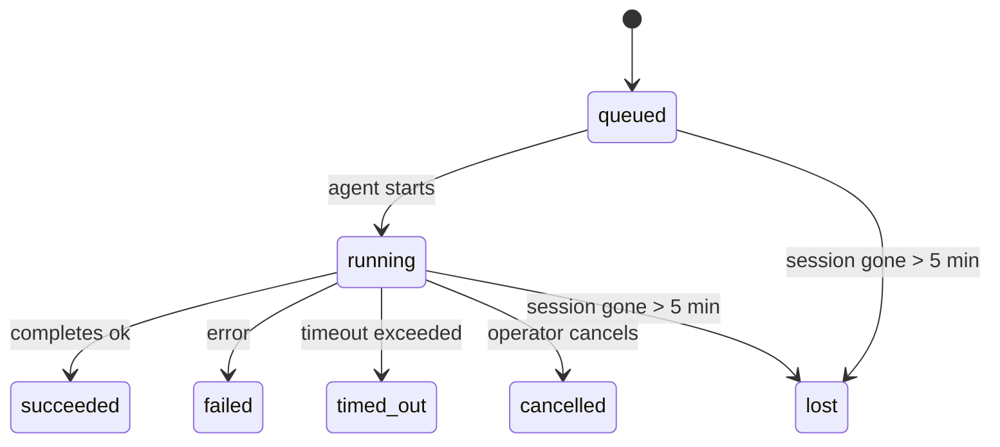

---
read_when:
    - प्रगति में चल रहे या हाल ही में पूर्ण हुए पृष्ठभूमि कार्य का निरीक्षण करना
    - अलग किए गए एजेंट रन के लिए डिलीवरी विफलताओं की डिबगिंग
    - यह समझना कि बैकग्राउंड रन, सेशन, Cron और Heartbeat से कैसे संबंधित हैं
sidebarTitle: Background tasks
summary: ACP रन, उप-एजेंटों, पृथक Cron जॉब्स, और CLI ऑपरेशनों के लिए पृष्ठभूमि कार्य ट्रैकिंग
title: पृष्ठभूमि कार्य
x-i18n:
    generated_at: "2026-06-28T22:33:08Z"
    model: gpt-5.5
    postprocess_version: locale-links-v1
    provider: openai
    source_hash: 4a630a52d0d6bfd387a37415dd63fc4bfbce23f99eaa8cb780c3d6f8913675fd
    source_path: automation/tasks.md
    workflow: 16
---

<Note>
शेड्यूलिंग खोज रहे हैं? सही तंत्र चुनने के लिए [Automation](/hi/automation) देखें। यह पेज पृष्ठभूमि के काम के लिए गतिविधि लेजर है, शेड्यूलर नहीं।
</Note>

पृष्ठभूमि कार्य उस काम को ट्रैक करते हैं जो **आपके मुख्य बातचीत सत्र के बाहर** चलता है: ACP रन, सबएजेंट स्पॉन, आइसोलेटेड Cron जॉब निष्पादन, और CLI द्वारा शुरू किए गए ऑपरेशन।

कार्य सत्रों, Cron जॉब, या Heartbeat को प्रतिस्थापित **नहीं** करते - वे **गतिविधि लेजर** हैं जो रिकॉर्ड करता है कि कौन-सा अलग किया गया काम हुआ, कब हुआ, और क्या वह सफल हुआ।

<Note>
हर एजेंट रन कार्य नहीं बनाता। Heartbeat टर्न और सामान्य इंटरैक्टिव चैट ऐसा नहीं करते। सभी Cron निष्पादन, ACP स्पॉन, सबएजेंट स्पॉन, और CLI एजेंट कमांड ऐसा करते हैं।
</Note>

## संक्षेप में

- कार्य **रिकॉर्ड** हैं, शेड्यूलर नहीं - Cron और Heartbeat तय करते हैं कि काम _कब_ चलेगा, कार्य ट्रैक करते हैं कि _क्या हुआ_।
- ACP, सबएजेंट, सभी Cron जॉब, और CLI ऑपरेशन कार्य बनाते हैं। Heartbeat टर्न ऐसा नहीं करते।
- हर कार्य `queued → running → terminal` से गुजरता है (succeeded, failed, timed_out, cancelled, या lost)।
- Cron कार्य तब तक लाइव रहते हैं जब तक Cron रनटाइम अभी भी जॉब का मालिक है; अगर
  इन-मेमोरी रनटाइम स्थिति जा चुकी है, तो कार्य रखरखाव किसी कार्य को lost चिह्नित करने से पहले टिकाऊ Cron
  रन इतिहास जांचता है।
- पूर्णता पुश-चालित होती है: अलग किया गया काम सीधे सूचित कर सकता है या समाप्त होने पर
  अनुरोधकर्ता सत्र/Heartbeat को जगा सकता है, इसलिए स्थिति पोलिंग लूप
  आमतौर पर गलत आकार होते हैं।
- आइसोलेटेड Cron रन और सबएजेंट पूर्णताएं अंतिम सफाई बहीखाते से पहले अपने चाइल्ड सत्र के लिए ट्रैक किए गए ब्राउज़र टैब/प्रोसेस को सर्वश्रेष्ठ प्रयास से साफ करती हैं।
- आइसोलेटेड Cron डिलीवरी पुराने अंतरिम पैरेंट उत्तरों को दबाती है जबकि वंशज सबएजेंट काम अभी भी ड्रेन हो रहा हो, और डिलीवरी से पहले आने पर अंतिम वंशज आउटपुट को प्राथमिकता देती है।
- पूर्णता सूचनाएं सीधे किसी चैनल को डिलीवर की जाती हैं या अगले Heartbeat के लिए कतारबद्ध की जाती हैं।
- `openclaw tasks list` सभी कार्य दिखाता है; `openclaw tasks audit` समस्याएं सामने लाता है।
- टर्मिनल रिकॉर्ड 7 दिनों तक रखे जाते हैं, फिर अपने-आप हटा दिए जाते हैं।

## त्वरित शुरुआत

<Tabs>
  <Tab title="List and filter">
    ```bash
    # List all tasks (newest first)
    openclaw tasks list

    # Filter by runtime or status
    openclaw tasks list --runtime acp
    openclaw tasks list --status running
    ```

  </Tab>
  <Tab title="Inspect">
    ```bash
    # Show details for a specific task (by ID, run ID, or session key)
    openclaw tasks show <lookup>
    ```
  </Tab>
  <Tab title="Cancel and notify">
    ```bash
    # Cancel a running task (kills the child session)
    openclaw tasks cancel <lookup>

    # Change notification policy for a task
    openclaw tasks notify <lookup> state_changes
    ```

  </Tab>
  <Tab title="Audit and maintenance">
    ```bash
    # Run a health audit
    openclaw tasks audit

    # Preview or apply maintenance
    openclaw tasks maintenance
    openclaw tasks maintenance --apply
    ```

  </Tab>
  <Tab title="Task flow">
    ```bash
    # Inspect TaskFlow state
    openclaw tasks flow list
    openclaw tasks flow show <lookup>
    openclaw tasks flow cancel <lookup>
    ```
  </Tab>
</Tabs>

## क्या कार्य बनाता है

| स्रोत                 | रनटाइम प्रकार | कार्य रिकॉर्ड कब बनाया जाता है                                          | डिफ़ॉल्ट सूचना नीति |
| ---------------------- | ------------ | ---------------------------------------------------------------------- | --------------------- |
| ACP पृष्ठभूमि रन    | `acp`        | चाइल्ड ACP सत्र स्पॉन करना                                           | `done_only`           |
| सबएजेंट ऑर्केस्ट्रेशन | `subagent`   | `sessions_spawn` के जरिए सबएजेंट स्पॉन करना                               | `done_only`           |
| Cron जॉब (सभी प्रकार)  | `cron`       | हर Cron निष्पादन (मुख्य-सत्र और आइसोलेटेड)                       | `silent`              |
| CLI ऑपरेशन         | `cli`        | `openclaw agent` कमांड जो Gateway से होकर चलते हैं                 | `silent`              |
| एजेंट मीडिया जॉब       | `cli`        | सत्र-समर्थित `image_generate`/`music_generate`/`video_generate` रन | `silent`              |

<AccordionGroup>
  <Accordion title="Notify defaults for cron and media">
    मुख्य-सत्र Cron कार्य डिफ़ॉल्ट रूप से `silent` सूचना नीति का उपयोग करते हैं - वे ट्रैकिंग के लिए रिकॉर्ड बनाते हैं लेकिन सूचनाएं उत्पन्न नहीं करते। आइसोलेटेड Cron कार्य भी डिफ़ॉल्ट रूप से `silent` होते हैं, लेकिन वे अधिक दिखाई देते हैं क्योंकि वे अपने अलग सत्र में चलते हैं।

    सत्र-समर्थित `image_generate`, `music_generate`, और `video_generate` रन भी `silent` सूचना नीति का उपयोग करते हैं। वे फिर भी कार्य रिकॉर्ड बनाते हैं, लेकिन पूर्णता मूल एजेंट सत्र को आंतरिक वेक के रूप में वापस दी जाती है ताकि एजेंट फॉलो-अप संदेश लिख सके और तैयार मीडिया खुद संलग्न कर सके। अनुरोधकर्ता एजेंट अपने सामान्य दृश्य-उत्तर अनुबंध का पालन करता है: कॉन्फ़िगर होने पर स्वचालित अंतिम उत्तर, या जब सत्र को संदेश-टूल उत्तर चाहिए तब `message(action="send")` और `NO_REPLY`। अगर अनुरोधकर्ता सत्र अब सक्रिय नहीं है या उसका सक्रिय वेक विफल हो जाता है, और पूर्णता एजेंट कुछ या पूरा जेनरेट किया गया मीडिया मिस कर देता है, तो OpenClaw मूल चैनल लक्ष्य को केवल छूटे हुए मीडिया के साथ एक idempotent प्रत्यक्ष fallback भेजता है।

  </Accordion>
  <Accordion title="Concurrent media-generation guardrail">
    जब सत्र-समर्थित मीडिया-जनरेशन कार्य अभी भी सक्रिय हो, मीडिया टूल आकस्मिक retries के लिए guardrails की तरह भी काम करते हैं। उसी prompt के लिए बार-बार `image_generate` कॉल मेल खाते सक्रिय कार्य की स्थिति लौटाते हैं, जबकि अलग image prompt अपना खुद का कार्य शुरू कर सकता है। `music_generate` और `video_generate` कॉल दूसरा समवर्ती generation शुरू करने के बजाय अभी भी उस सत्र के लिए सक्रिय कार्य स्थिति लौटाते हैं। जब आप एजेंट पक्ष से स्पष्ट प्रगति/स्थिति lookup चाहते हों, तो `action: "status"` का उपयोग करें।
  </Accordion>
  <Accordion title="What does not create tasks">
    - Heartbeat टर्न - मुख्य-सत्र; [Heartbeat](/hi/gateway/heartbeat) देखें
    - सामान्य इंटरैक्टिव चैट टर्न
    - प्रत्यक्ष `/command` प्रतिक्रियाएं

  </Accordion>
</AccordionGroup>

## कार्य जीवनचक्र



| स्थिति      | इसका क्या अर्थ है                                                              |
| ----------- | -------------------------------------------------------------------------- |
| `queued`    | बनाया गया, एजेंट शुरू होने की प्रतीक्षा में                                    |
| `running`   | एजेंट टर्न सक्रिय रूप से निष्पादित हो रहा है                                           |
| `succeeded` | सफलतापूर्वक पूरा हुआ                                                     |
| `failed`    | त्रुटि के साथ पूरा हुआ                                                    |
| `timed_out` | कॉन्फ़िगर किए गए timeout से अधिक हो गया                                            |
| `cancelled` | ऑपरेटर ने `openclaw tasks cancel` के जरिए रोक दिया                        |
| `lost`      | रनटाइम ने 5-मिनट की grace period के बाद अधिकृत backing state खो दी |

ट्रांज़िशन अपने-आप होते हैं - जब संबंधित एजेंट रन समाप्त होता है, तो कार्य की स्थिति मेल खाने के लिए अपडेट होती है।

सक्रिय कार्य रिकॉर्ड के लिए एजेंट रन पूर्णता अधिकृत है। सफल detached रन `succeeded` के रूप में अंतिम होता है, सामान्य रन त्रुटियां `failed` के रूप में अंतिम होती हैं, और timeout या abort परिणाम `timed_out` के रूप में अंतिम होते हैं। अगर ऑपरेटर ने पहले ही कार्य रद्द कर दिया है, या रनटाइम ने पहले ही `failed`, `timed_out`, या `lost` जैसी मजबूत टर्मिनल स्थिति रिकॉर्ड कर दी है, तो बाद का success signal उस terminal status को downgrade नहीं करता।

`lost` रनटाइम-सचेत है:

- ACP कार्य: backing ACP child session metadata गायब हो गया।
- सबएजेंट कार्य: backing child session target agent store से गायब हो गया।
- Cron कार्य: Cron रनटाइम अब job को active के रूप में track नहीं करता और durable
  Cron run history उस run के लिए terminal result नहीं दिखाता। Offline CLI
  audit अपनी खाली in-process Cron runtime state को authority नहीं मानता।
- CLI कार्य: run id/source id वाले कार्य live run context का उपयोग करते हैं, इसलिए
  lingering child-session या chat-session rows उन्हें
  gateway-owned run गायब होने के बाद alive नहीं रखते। run identity के बिना legacy CLI tasks अभी भी
  child session पर fallback करते हैं। Gateway-backed `openclaw agent` रन भी
  अपने run result से finalize होते हैं, इसलिए completed runs तब तक active नहीं बैठे रहते जब तक sweeper
  उन्हें `lost` चिह्नित करे।

## डिलीवरी और सूचनाएं

जब कोई कार्य terminal state तक पहुंचता है, OpenClaw आपको सूचित करता है। दो delivery paths हैं:

**प्रत्यक्ष डिलीवरी** - अगर कार्य के पास channel target (`requesterOrigin`) है, तो completion message सीधे उस channel (Telegram, Discord, Slack, आदि) पर जाता है। Group और channel task completions इसके बजाय requester session के जरिए route होते हैं ताकि parent agent visible reply लिख सके। subagent completions के लिए, OpenClaw उपलब्ध होने पर bound thread/topic routing भी preserve करता है और direct delivery छोड़ने से पहले requester session के stored route (`lastChannel` / `lastTo` / `lastAccountId`) से missing `to` / account भर सकता है।

**सत्र-queued डिलीवरी** - अगर direct delivery fail हो जाती है या कोई origin set नहीं है, तो update requester के session में system event के रूप में queued होता है और अगले Heartbeat पर सामने आता है।

<Tip>
कार्य पूर्णता immediate Heartbeat wake trigger करती है ताकि आप परिणाम जल्दी देखें - आपको अगले scheduled Heartbeat tick का इंतजार नहीं करना पड़ता।
</Tip>

इसका मतलब है कि सामान्य workflow push-based है: detached work एक बार शुरू करें, फिर runtime को completion पर आपको wake या notify करने दें। Task state poll केवल तब करें जब आपको debugging, intervention, या explicit audit चाहिए।

### सूचना नीतियां

नियंत्रित करें कि आप हर कार्य के बारे में कितना सुनते हैं:

| नीति                | क्या डिलीवर किया जाता है                                                       |
| --------------------- | ----------------------------------------------------------------------- |
| `done_only` (default) | केवल terminal state (succeeded, failed, आदि) - **यही default है** |
| `state_changes`       | हर state transition और progress update                              |
| `silent`              | कुछ भी नहीं                                                          |

कार्य चलते समय policy बदलें:

```bash
openclaw tasks notify <lookup> state_changes
```

## CLI संदर्भ

<AccordionGroup>
  <Accordion title="tasks list">
    ```bash
    openclaw tasks list [--runtime <acp|subagent|cron|cli>] [--status <status>] [--json]
    ```

    आउटपुट कॉलम: Task ID, Kind, Status, Delivery, Run ID, Child Session, Summary.

  </Accordion>
  <Accordion title="tasks show">
    ```bash
    openclaw tasks show <lookup>
    ```

    lookup token task ID, run ID, या session key स्वीकार करता है। timing, delivery state, error, और terminal summary सहित पूरा record दिखाता है।

  </Accordion>
  <Accordion title="tasks cancel">
    ```bash
    openclaw tasks cancel <lookup>
    ```

    ACP और subagent कार्यों के लिए, यह child session को kill करता है। CLI-tracked कार्यों के लिए, cancellation task registry में recorded होती है (अलग child runtime handle नहीं होता)। Status `cancelled` में transition करता है और लागू होने पर delivery notification भेजी जाती है।

  </Accordion>
  <Accordion title="tasks notify">
    ```bash
    openclaw tasks notify <lookup> <done_only|state_changes|silent>
    ```
  </Accordion>
  <Accordion title="tasks audit">
    ```bash
    openclaw tasks audit [--json]
    ```

    operational issues सामने लाता है। issues detect होने पर findings `openclaw status` में भी दिखाई देती हैं।

    | निष्कर्ष                   | गंभीरता   | ट्रिगर                                                                                                      |
    | ------------------------- | ---------- | ------------------------------------------------------------------------------------------------------------ |
    | `stale_queued`            | चेतावनी       | 10 मिनट से अधिक समय तक कतार में                                                                              |
    | `stale_running`           | त्रुटि      | 30 मिनट से अधिक समय तक चल रहा                                                                             |
    | `lost`                    | चेतावनी/त्रुटि | Runtime-समर्थित कार्य स्वामित्व गायब हो गया; बनाए रखे गए खोए हुए कार्य `cleanupAfter` तक चेतावनी देते हैं, फिर त्रुटियां बन जाते हैं |
    | `delivery_failed`         | चेतावनी       | डिलीवरी विफल हुई और सूचना नीति `silent` नहीं है                                                            |
    | `missing_cleanup`         | चेतावनी       | बिना cleanup timestamp वाला टर्मिनल कार्य                                                                      |
    | `inconsistent_timestamps` | चेतावनी       | टाइमलाइन उल्लंघन (उदाहरण के लिए, शुरू होने से पहले समाप्त हुआ)                                                        |

  </Accordion>
  <Accordion title="tasks maintenance">
    ```bash
    openclaw tasks maintenance [--json]
    openclaw tasks maintenance --apply [--json]
    ```

    कार्यों, कार्य प्रवाह स्थिति, और पुराने cron run session registry rows के लिए reconciliation, cleanup stamping, और pruning का पूर्वावलोकन करने या लागू करने के लिए इसका उपयोग करें।

    Reconciliation runtime-सचेत है:

    - ACP/subagent कार्य अपने backing child session की जांच करते हैं।
    - जिन subagent कार्यों के child session में restart-recovery tombstone है, उन्हें recoverable backing sessions माने जाने के बजाय lost चिह्नित किया जाता है।
    - Cron कार्य जांचते हैं कि cron runtime अभी भी job का स्वामी है या नहीं, फिर `lost` पर fallback करने से पहले persisted cron run logs/job state से terminal status recover करते हैं। केवल Gateway process in-memory cron active-job set के लिए authoritative है; offline CLI audit durable history का उपयोग करता है, लेकिन किसी cron task को केवल इसलिए lost चिह्नित नहीं करता क्योंकि वह local Set खाली है।
    - run identity वाले CLI कार्य केवल child-session या chat-session rows नहीं, बल्कि owning live run context जांचते हैं।

    Completion cleanup भी runtime-सचेत है:

    - Subagent completion, announce cleanup जारी रहने से पहले child session के tracked browser tabs/processes को best-effort बंद करता है।
    - Isolated cron completion, run के पूरी तरह tear down होने से पहले cron session के tracked browser tabs/processes को best-effort बंद करता है।
    - Isolated cron delivery जरूरत पड़ने पर descendant subagent follow-up का इंतजार करती है और उसे announce करने के बजाय stale parent acknowledgement text को suppress करती है।
    - Subagent completion delivery केवल child के latest visible assistant text का उपयोग करती है। Tool/toolResult output को child result text में promote नहीं किया जाता। Terminal failed runs captured reply text को replay किए बिना failure status announce करते हैं।
    - Cleanup failures वास्तविक task outcome को mask नहीं करतीं।

    maintenance लागू करते समय, OpenClaw 7 दिनों से पुराने stale `cron:<jobId>:run:<uuid>` session registry rows भी हटाता है, जबकि currently running cron jobs के rows को सुरक्षित रखता है और non-cron session rows को untouched छोड़ता है।

  </Accordion>
  <Accordion title="tasks flow list | show | cancel">
    ```bash
    openclaw tasks flow list [--status <status>] [--json]
    openclaw tasks flow show <lookup> [--json]
    openclaw tasks flow cancel <lookup>
    ```

    इनका उपयोग तब करें जब आपकी रुचि किसी एक individual background task record के बजाय orchestrating कार्य प्रवाह में हो।

  </Accordion>
</AccordionGroup>

## Chat task board (`/tasks`)

किसी भी chat session में उस session से जुड़े background tasks देखने के लिए `/tasks` का उपयोग करें। board active और हाल ही में completed tasks को runtime, status, timing, और progress या error detail के साथ दिखाता है।

जब current session में कोई visible linked tasks नहीं होते, तो `/tasks` agent-local task counts पर fallback करता है ताकि आपको other-session details leak किए बिना भी overview मिल सके।

पूर्ण operator ledger के लिए CLI का उपयोग करें: `openclaw tasks list`.

## Status integration (task pressure)

`openclaw status` में एक नजर में दिखने वाला task summary शामिल है:

```
Tasks: 3 queued · 2 running · 1 issues
```

summary रिपोर्ट करता है:

- **active** - `queued` + `running` की संख्या
- **failures** - `failed` + `timed_out` + `lost` की संख्या
- **byRuntime** - `acp`, `subagent`, `cron`, `cli` के अनुसार breakdown

`/status` और `session_status` tool दोनों cleanup-aware task snapshot का उपयोग करते हैं: active tasks को प्राथमिकता दी जाती है, stale completed rows छिपाए जाते हैं, और recent failures केवल तब surface होते हैं जब कोई active work नहीं बचता। इससे status card अभी महत्वपूर्ण चीजों पर केंद्रित रहता है।

## Storage और maintenance

### कार्य कहां रहते हैं

Task records SQLite में यहां persist होते हैं:

```
$OPENCLAW_STATE_DIR/tasks/runs.sqlite
```

registry gateway start पर memory में load होती है और restarts के बीच durability के लिए writes को SQLite में sync करती है।
Gateway SQLite's default autocheckpoint threshold और periodic `PASSIVE` checkpoints का उपयोग करके SQLite write-ahead log को bounded रखता है। Shutdown और explicit maintenance checkpoints अभी भी `TRUNCATE` का उपयोग करते हैं ताकि normal closes background sweeper को active readers पर wait कराए बिना WAL space reclaim कर सकें।

### Automatic maintenance

एक sweeper हर **60 seconds** में चलता है और चार चीजों को संभालता है:

<Steps>
  <Step title="Reconciliation">
    जांचता है कि active tasks के पास अभी भी authoritative runtime backing है या नहीं। ACP/subagent tasks child-session state का उपयोग करते हैं, cron tasks active-job ownership का उपयोग करते हैं, और run identity वाले CLI tasks owning run context का उपयोग करते हैं। अगर वह backing state 5 मिनट से अधिक समय के लिए gone है, तो task को `lost` चिह्नित किया जाता है।
  </Step>
  <Step title="ACP session repair">
    terminal या orphaned parent-owned one-shot ACP sessions को बंद करता है, और stale terminal या orphaned persistent ACP sessions को केवल तब बंद करता है जब कोई active conversation binding शेष नहीं रहती।
  </Step>
  <Step title="Cleanup stamping">
    terminal tasks पर `cleanupAfter` timestamp set करता है (endedAt + 7 days)। retention के दौरान, lost tasks अभी भी audit में warnings के रूप में दिखाई देते हैं; `cleanupAfter` expire होने के बाद या cleanup metadata missing होने पर, वे errors होते हैं।
  </Step>
  <Step title="Pruning">
    उन records को delete करता है जिनकी `cleanupAfter` date निकल चुकी है।
  </Step>
</Steps>

<Note>
**Retention:** terminal task records **7 days** तक रखे जाते हैं, फिर automatically pruned होते हैं। कोई configuration आवश्यक नहीं।
</Note>

## कार्य अन्य systems से कैसे संबंधित हैं

<AccordionGroup>
  <Accordion title="Tasks and Task Flow">
    [कार्य प्रवाह](/hi/automation/taskflow) background tasks के ऊपर flow orchestration layer है। एक single flow अपने lifetime में managed या mirrored sync modes का उपयोग करके कई tasks coordinate कर सकता है। individual task records inspect करने के लिए `openclaw tasks` और orchestrating flow inspect करने के लिए `openclaw tasks flow` का उपयोग करें।

    विवरण के लिए [कार्य प्रवाह](/hi/automation/taskflow) देखें।

  </Accordion>
  <Accordion title="Tasks and cron">
    Cron job definitions, runtime execution state, और run history OpenClaw के shared SQLite state database में रहते हैं। **हर** cron execution एक task record बनाता है - main-session और isolated दोनों। Main-session cron tasks default रूप से `silent` notify policy का उपयोग करते हैं ताकि वे notifications generate किए बिना track करें।

    [Cron Jobs](/hi/automation/cron-jobs) देखें।

  </Accordion>
  <Accordion title="Tasks and heartbeat">
    Heartbeat runs main-session turns हैं - वे task records नहीं बनाते। जब कोई task complete होता है, तो वह heartbeat wake trigger कर सकता है ताकि आपको result तुरंत दिखे।

    [Heartbeat](/hi/gateway/heartbeat) देखें।

  </Accordion>
  <Accordion title="Tasks and sessions">
    कोई task `childSessionKey` (जहां work चलता है) और `requesterSessionKey` (जिसने इसे शुरू किया) को reference कर सकता है। इसका `agentId` work execute करने वाले agent की पहचान करता है, जबकि requester और owner fields launch और control context को preserve करते हैं। Sessions conversation context हैं; tasks उसके ऊपर activity tracking हैं।
  </Accordion>
  <Accordion title="Tasks and agent runs">
    किसी task का `runId` work कर रहे agent run से link करता है। Agent lifecycle events (start, end, error) automatically task status update करते हैं - आपको lifecycle manually manage करने की जरूरत नहीं है।
  </Accordion>
</AccordionGroup>

## संबंधित

- [Automation](/hi/automation) - सभी automation mechanisms एक नजर में
- [CLI: Tasks](/hi/cli/tasks) - CLI command reference
- [Heartbeat](/hi/gateway/heartbeat) - periodic main-session turns
- [Scheduled Tasks](/hi/automation/cron-jobs) - background work scheduling
- [कार्य प्रवाह](/hi/automation/taskflow) - tasks के ऊपर flow orchestration
