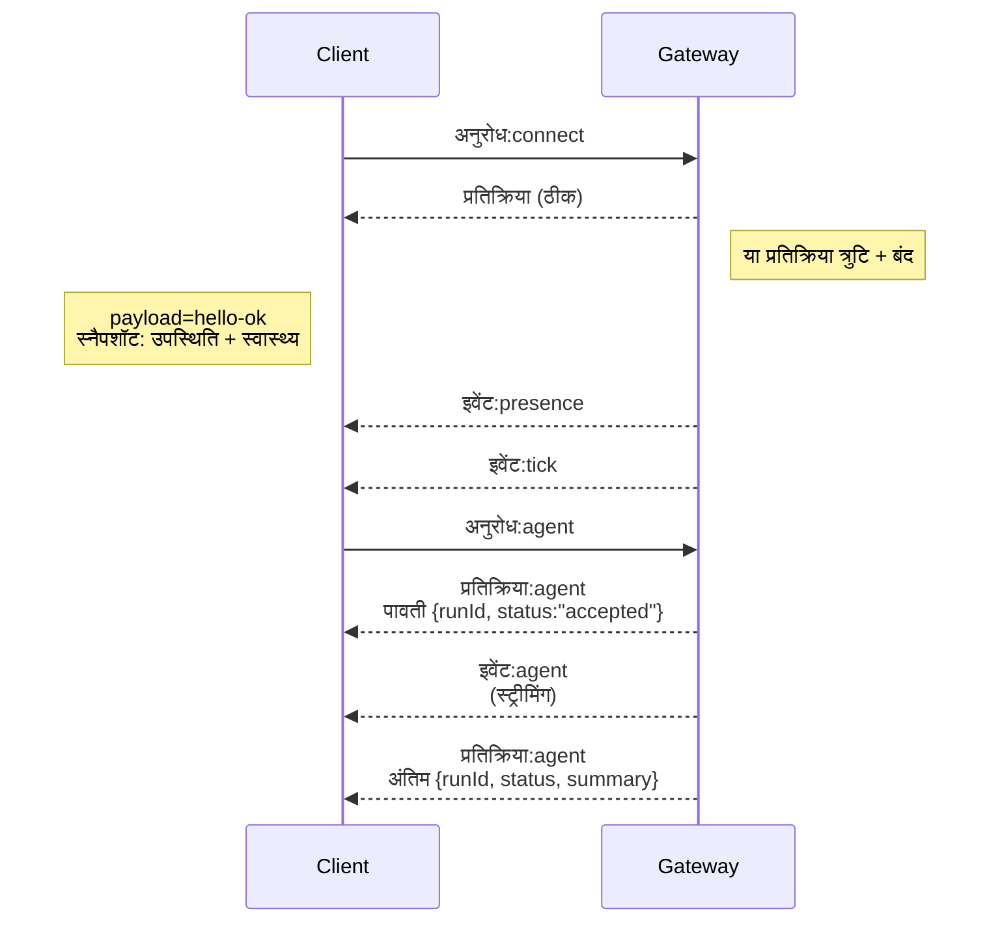

---
read_when:
    - Gateway प्रोटोकॉल, क्लाइंट या ट्रांसपोर्ट पर कार्य करना
summary: WebSocket Gateway आर्किटेक्चर, घटक और क्लाइंट प्रवाह
title: Gateway आर्किटेक्चर
x-i18n:
    generated_at: "2026-07-16T14:09:40Z"
    model: gpt-5.6
    postprocess_version: locale-links-v1
    prompt_version: 32
    provider: openai
    source_hash: f8054bd87f738b957c24f8d6965d55365de2293d44902530a9ba778afa597cc7
    source_path: concepts/architecture.md
    workflow: 16
---

## अवलोकन

- एक दीर्घकालिक **Gateway** सभी मैसेजिंग सतहों (Baileys के माध्यम से WhatsApp, grammY के माध्यम से Telegram, Slack, Discord, Signal, iMessage, WebChat) का स्वामी होता है।
- कंट्रोल-प्लेन क्लाइंट (macOS ऐप, CLI, वेब UI, ऑटोमेशन) कॉन्फ़िगर किए गए बाइंड होस्ट (डिफ़ॉल्ट
  `127.0.0.1:18789`) पर **WebSocket** के माध्यम से Gateway से कनेक्ट होते हैं।
- **Nodes** (macOS/iOS/Android/हेडलेस) भी **WebSocket** के माध्यम से कनेक्ट होते हैं, लेकिन
  स्पष्ट क्षमताओं/कमांड के साथ `role: node` घोषित करते हैं।
- प्रति होस्ट एक Gateway; केवल यही WhatsApp सत्र खोलता है।
- **कैनवास होस्ट** को Gateway HTTP सर्वर द्वारा इसके अंतर्गत सर्व किया जाता है:
  - `/__openclaw__/canvas/` (एजेंट द्वारा संपादन योग्य HTML/CSS/JS)
  - `/__openclaw__/a2ui/` (A2UI होस्ट)

  यह Gateway वाले पोर्ट का ही उपयोग करता है (डिफ़ॉल्ट `18789`)।

## घटक और प्रवाह

### Gateway (डेमन)

- प्रोवाइडर कनेक्शन बनाए रखता है।
- टाइप किया हुआ WS API (अनुरोध, प्रतिक्रियाएँ, सर्वर-पुश इवेंट) उपलब्ध कराता है।
- आने वाले फ़्रेम को JSON Schema के विरुद्ध सत्यापित करता है।
- `agent`, `chat`, `presence`, `health`, `heartbeat`, `cron` जैसे इवेंट उत्सर्जित करता है।

### क्लाइंट (Mac ऐप / CLI / वेब एडमिन)

- प्रति क्लाइंट एक WS कनेक्शन।
- अनुरोध भेजते हैं (`health`, `status`, `send`, `agent`, `system-presence`)।
- इवेंट की सदस्यता लेते हैं (`tick`, `agent`, `presence`, `shutdown`)।

### Nodes (macOS / iOS / Android / हेडलेस)

- `role: node` के साथ **उसी WS सर्वर** से कनेक्ट होते हैं।
- `connect` में डिवाइस पहचान प्रदान करते हैं; पेयरिंग **डिवाइस-आधारित** है (भूमिका `node`) और
  अनुमोदन डिवाइस पेयरिंग स्टोर में रहता है।
- `canvas.*`, `camera.*`, `screen.record`, `location.get` जैसे कमांड उपलब्ध कराते हैं।

प्रोटोकॉल विवरण: [Gateway प्रोटोकॉल](/hi/gateway/protocol)

### WebChat

- स्थिर UI, जो चैट इतिहास और संदेश भेजने के लिए Gateway WS API का उपयोग करता है।
- रिमोट सेटअप में, अन्य क्लाइंट वाले उसी SSH/Tailscale टनल के माध्यम से
  कनेक्ट होता है।

## कनेक्शन जीवनचक्र (एकल क्लाइंट)



## वायर प्रोटोकॉल (सारांश)

- ट्रांसपोर्ट: WebSocket, JSON पेलोड वाले टेक्स्ट फ़्रेम।
- पहला फ़्रेम `connect` **होना अनिवार्य है**।
- हैंडशेक के बाद:
  - अनुरोध: `{type:"req", id, method, params}` → `{type:"res", id, ok, payload|error}`
  - इवेंट: `{type:"event", event, payload, seq?, stateVersion?}`
- `hello-ok.features.methods` / `events` डिस्कवरी मेटाडेटा हैं, प्रत्येक कॉल करने योग्य सहायक रूट का
  जनरेट किया हुआ डंप नहीं।
- कॉन्फ़िगर किए गए Gateway प्रमाणीकरण मोड के आधार पर, साझा-सीक्रेट प्रमाणीकरण `connect.params.auth.token` या
  `connect.params.auth.password` का उपयोग करता है।
- Tailscale Serve (`gateway.auth.allowTailscale: true`) या नॉन-लूपबैक
  `gateway.auth.mode: "trusted-proxy"` जैसे पहचान-युक्त मोड, `connect.params.auth.*` के बजाय
  अनुरोध हेडर से प्रमाणीकरण पूरा करते हैं।
- निजी-इनग्रेस `gateway.auth.mode: "none"` साझा-सीक्रेट प्रमाणीकरण को
  पूरी तरह अक्षम करता है; सार्वजनिक/अविश्वसनीय इनग्रेस पर उस मोड को बंद रखें।
- साइड इफ़ेक्ट उत्पन्न करने वाली विधियों (`send`, `agent`) को सुरक्षित रूप से
  पुनः प्रयास करने के लिए आइडेम्पोटेंसी कुंजियाँ आवश्यक हैं; सर्वर अल्पकालिक डीडुप्लिकेशन कैश रखता है।
- Nodes को `connect` में क्षमताओं/कमांड/अनुमतियों के साथ `role: "node"` शामिल करना अनिवार्य है।

## पेयरिंग और स्थानीय विश्वास

- सभी WS क्लाइंट (ऑपरेटर + Nodes) `connect` पर **डिवाइस पहचान** शामिल करते हैं।
- नई डिवाइस ID के लिए पेयरिंग अनुमोदन आवश्यक है; Gateway बाद के कनेक्शन के लिए **डिवाइस टोकन**
  जारी करता है।
- समान-होस्ट उपयोगकर्ता अनुभव को सुचारु रखने के लिए सीधे स्थानीय लूपबैक कनेक्शन स्वतः अनुमोदित किए जा सकते हैं।
- OpenClaw में विश्वसनीय साझा-सीक्रेट सहायक प्रवाहों के लिए एक सीमित बैकएंड/कंटेनर-स्थानीय स्व-कनेक्शन पथ भी है।
- समान-होस्ट टेलनेट बाइंड सहित Tailnet और LAN कनेक्शन के लिए अब भी
  स्पष्ट पेयरिंग अनुमोदन आवश्यक है।
- सभी कनेक्शन को `connect.challenge` नॉन्स पर हस्ताक्षर करना अनिवार्य है। हस्ताक्षर पेलोड `v3`
  `platform` और `deviceFamily` को भी बाँधता है; Gateway पुनः कनेक्ट होने पर पेयर किया गया मेटाडेटा पिन करता है
  और मेटाडेटा परिवर्तनों के लिए सुधारात्मक पेयरिंग आवश्यक बनाता है।
- **गैर-स्थानीय** कनेक्शन के लिए अब भी स्पष्ट अनुमोदन आवश्यक है।
- Gateway प्रमाणीकरण (`gateway.auth.*`) स्थानीय या रिमोट, **सभी** कनेक्शन पर अब भी लागू होता है।

विवरण: [Gateway प्रोटोकॉल](/hi/gateway/protocol), [पेयरिंग](/hi/channels/pairing),
[सुरक्षा](/hi/gateway/security)।

## प्रोटोकॉल टाइपिंग और कोड जनरेशन

- TypeBox स्कीमा प्रोटोकॉल को परिभाषित करते हैं।
- उन स्कीमा से JSON Schema जनरेट किया जाता है।
- JSON Schema से Swift मॉडल जनरेट किए जाते हैं।

## रिमोट एक्सेस

- वरीयता: Tailscale या VPN।
- वैकल्पिक: SSH टनल

  ```bash
  ssh -N -L 18789:127.0.0.1:18789 user@gateway-host
  ```

- टनल पर भी वही हैंडशेक + प्रमाणीकरण टोकन लागू होते हैं।
- रिमोट सेटअप में WS के लिए TLS + वैकल्पिक पिनिंग सक्षम की जा सकती है।

## संचालन स्नैपशॉट

- आरंभ: `openclaw gateway` (फ़ोरग्राउंड, लॉग stdout पर)।
- स्वास्थ्य: WS पर `health` (`hello-ok` में भी शामिल)।
- पर्यवेक्षण: स्वतः पुनः आरंभ के लिए launchd/systemd।

## अपरिवर्तनीय नियम

- प्रति होस्ट एकल Baileys सत्र को ठीक एक Gateway नियंत्रित करता है।
- हैंडशेक अनिवार्य है; कोई भी गैर-JSON या गैर-कनेक्ट प्रथम फ़्रेम तुरंत कनेक्शन बंद करता है।
- इवेंट दोबारा नहीं चलाए जाते; अंतराल होने पर क्लाइंट को रीफ़्रेश करना अनिवार्य है।

## संबंधित

- [एजेंट लूप](/hi/concepts/agent-loop) — विस्तृत एजेंट निष्पादन चक्र
- [Gateway प्रोटोकॉल](/hi/gateway/protocol) — WebSocket प्रोटोकॉल अनुबंध
- [क्यू](/hi/concepts/queue) — कमांड क्यू और समवर्ती निष्पादन
- [सुरक्षा](/hi/gateway/security) — विश्वास मॉडल और सुदृढ़ीकरण
