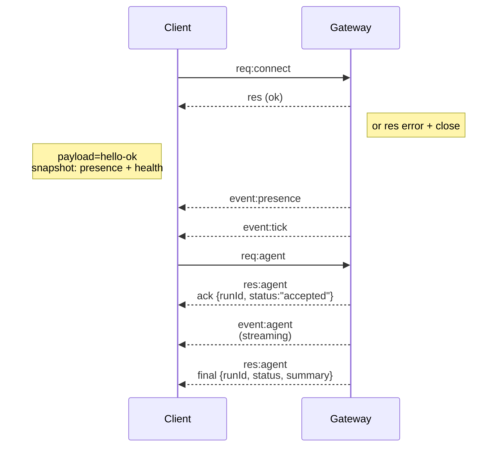

---
read_when:
    - Gateway प्रोटोकॉल, क्लाइंट या ट्रांसपोर्ट पर काम करना
summary: WebSocket Gateway आर्किटेक्चर, घटक, और क्लाइंट फ्लो
title: Gateway आर्किटेक्चर
x-i18n:
    generated_at: "2026-06-28T22:56:12Z"
    model: gpt-5.5
    postprocess_version: locale-links-v1
    provider: openai
    source_hash: 433489081bfe07691b211f5076ec45ce0ed3fd043eb86128f73121f2cab71cd3
    source_path: concepts/architecture.md
    workflow: 16
---

## अवलोकन

- एकल लंबे समय तक चलने वाला **Gateway** सभी मैसेजिंग सतहों का स्वामी होता है (WhatsApp via
  Baileys, Telegram via grammY, Slack, Discord, Signal, iMessage, WebChat).
- कंट्रोल-प्लेन क्लाइंट (macOS ऐप, CLI, वेब UI, ऑटोमेशन) कॉन्फ़िगर किए गए बाइंड होस्ट (डिफ़ॉल्ट
  `127.0.0.1:18789`) पर **WebSocket** के माध्यम से Gateway से जुड़ते हैं।
- **Node** (macOS/iOS/Android/headless) भी **WebSocket** के माध्यम से जुड़ते हैं, लेकिन
  स्पष्ट caps/commands के साथ `role: node` घोषित करते हैं।
- प्रति होस्ट एक Gateway; वही एकमात्र स्थान है जो WhatsApp सत्र खोलता है।
- **कैनवास होस्ट** Gateway HTTP सर्वर द्वारा इनके अंतर्गत सर्व किया जाता है:
  - `/__openclaw__/canvas/` (एजेंट-संपादन योग्य HTML/CSS/JS)
  - `/__openclaw__/a2ui/` (A2UI होस्ट)
    यह Gateway के समान पोर्ट का उपयोग करता है (डिफ़ॉल्ट `18789`)।

## घटक और प्रवाह

### Gateway (डेमन)

- प्रोवाइडर कनेक्शन बनाए रखता है।
- टाइप किया हुआ WS API उजागर करता है (अनुरोध, प्रतिक्रियाएँ, सर्वर-पुश इवेंट)।
- JSON Schema के विरुद्ध इनबाउंड फ़्रेम सत्यापित करता है।
- `agent`, `chat`, `presence`, `health`, `heartbeat`, `cron` जैसे इवेंट उत्सर्जित करता है।

### क्लाइंट (Mac ऐप / CLI / वेब एडमिन)

- प्रति क्लाइंट एक WS कनेक्शन।
- अनुरोध भेजते हैं (`health`, `status`, `send`, `agent`, `system-presence`)।
- इवेंट की सदस्यता लेते हैं (`tick`, `agent`, `presence`, `shutdown`)।

### Node (macOS / iOS / Android / headless)

- `role: node` के साथ **उसी WS सर्वर** से जुड़ते हैं।
- `connect` में डिवाइस पहचान प्रदान करते हैं; पेयरिंग **डिवाइस-आधारित** है (role `node`) और
  स्वीकृति डिवाइस पेयरिंग स्टोर में रहती है।
- `canvas.*`, `camera.*`, `screen.record`, `location.get` जैसे कमांड उजागर करते हैं।

प्रोटोकॉल विवरण:

- [Gateway प्रोटोकॉल](/hi/gateway/protocol)

### WebChat

- स्थिर UI जो चैट इतिहास और भेजने के लिए Gateway WS API का उपयोग करता है।
- रिमोट सेटअप में, अन्य क्लाइंट की तरह उसी SSH/Tailscale टनल के माध्यम से जुड़ता है।

## कनेक्शन जीवनचक्र (एकल क्लाइंट)



## वायर प्रोटोकॉल (सारांश)

- ट्रांसपोर्ट: WebSocket, JSON पेलोड वाले टेक्स्ट फ़्रेम।
- पहला फ़्रेम **अनिवार्य रूप से** `connect` होना चाहिए।
- हैंडशेक के बाद:
  - अनुरोध: `{type:"req", id, method, params}` → `{type:"res", id, ok, payload|error}`
  - इवेंट: `{type:"event", event, payload, seq?, stateVersion?}`
- `hello-ok.features.methods` / `events` डिस्कवरी मेटाडेटा हैं, हर callable helper route का
  जनरेट किया हुआ डंप नहीं।
- साझा-सीक्रेट ऑथ `connect.params.auth.token` या
  `connect.params.auth.password` का उपयोग करता है, कॉन्फ़िगर किए गए gateway auth मोड पर निर्भर करता है।
- Tailscale Serve जैसे पहचान-धारी मोड
  (`gateway.auth.allowTailscale: true`) या non-loopback
  `gateway.auth.mode: "trusted-proxy"` `connect.params.auth.*` के बजाय अनुरोध हेडर से ऑथ पूरा करते हैं।
- निजी-इनग्रेस `gateway.auth.mode: "none"` साझा-सीक्रेट ऑथ को
  पूरी तरह अक्षम करता है; इस मोड को सार्वजनिक/अविश्वसनीय इनग्रेस पर बंद रखें।
- साइड-इफ़ेक्ट करने वाली विधियों (`send`, `agent`) के लिए सुरक्षित रीट्राई हेतु idempotency keys आवश्यक हैं; सर्वर एक अल्पजीवी dedupe cache रखता है।
- Node को `connect` में caps/commands/permissions के साथ `role: "node"` शामिल करना होगा।

## पेयरिंग + स्थानीय भरोसा

- सभी WS क्लाइंट (ऑपरेटर + Node) `connect` पर एक **डिवाइस पहचान** शामिल करते हैं।
- नए डिवाइस ID को पेयरिंग स्वीकृति चाहिए; Gateway बाद के कनेक्ट के लिए **डिवाइस टोकन**
  जारी करता है।
- सीधे local loopback कनेक्ट same-host UX को सुचारु रखने के लिए स्वतः स्वीकृत किए जा सकते हैं।
- OpenClaw के पास विश्वसनीय साझा-सीक्रेट helper flows के लिए एक संकीर्ण backend/container-local self-connect path भी है।
- Tailnet और LAN कनेक्ट, same-host tailnet bind सहित, फिर भी स्पष्ट पेयरिंग स्वीकृति मांगते हैं।
- सभी कनेक्ट को `connect.challenge` nonce पर हस्ताक्षर करना होगा।
- हस्ताक्षर पेलोड `v3` `platform` + `deviceFamily` को भी बांधता है; gateway पुनः कनेक्ट पर paired metadata पिन करता है और metadata बदलावों के लिए repair pairing मांगता है।
- **गैर-स्थानीय** कनेक्ट को फिर भी स्पष्ट स्वीकृति चाहिए।
- Gateway auth (`gateway.auth.*`) **सभी** कनेक्शन पर लागू रहता है, स्थानीय हों या रिमोट।

विवरण: [Gateway प्रोटोकॉल](/hi/gateway/protocol), [पेयरिंग](/hi/channels/pairing),
[सुरक्षा](/hi/gateway/security).

## प्रोटोकॉल टाइपिंग और codegen

- TypeBox schema प्रोटोकॉल परिभाषित करते हैं।
- JSON Schema उन schema से जनरेट होता है।
- Swift मॉडल JSON Schema से जनरेट होते हैं।

## रिमोट एक्सेस

- पसंदीदा: Tailscale या VPN।
- विकल्प: SSH टनल

  ```bash
  ssh -N -L 18789:127.0.0.1:18789 user@host
  ```

- वही हैंडशेक + auth token टनल पर लागू होते हैं।
- रिमोट सेटअप में WS के लिए TLS + वैकल्पिक pinning सक्षम की जा सकती है।

## ऑपरेशन स्नैपशॉट

- शुरू करें: `openclaw gateway` (foreground, stdout पर लॉग)।
- स्वास्थ्य: WS पर `health` (`hello-ok` में भी शामिल)।
- सुपरविज़न: auto-restart के लिए launchd/systemd।

## अपरिवर्तनीय नियम

- प्रति होस्ट एकल Baileys सत्र को ठीक एक Gateway नियंत्रित करता है।
- हैंडशेक अनिवार्य है; कोई भी non-JSON या non-connect पहला फ़्रेम hard close है।
- इवेंट replay नहीं किए जाते; gaps पर क्लाइंट को refresh करना होगा।

## संबंधित

- [एजेंट लूप](/hi/concepts/agent-loop) — विस्तृत एजेंट निष्पादन चक्र
- [Gateway प्रोटोकॉल](/hi/gateway/protocol) — WebSocket प्रोटोकॉल अनुबंध
- [क्यू](/hi/concepts/queue) — कमांड क्यू और concurrency
- [सुरक्षा](/hi/gateway/security) — भरोसा मॉडल और hardening
