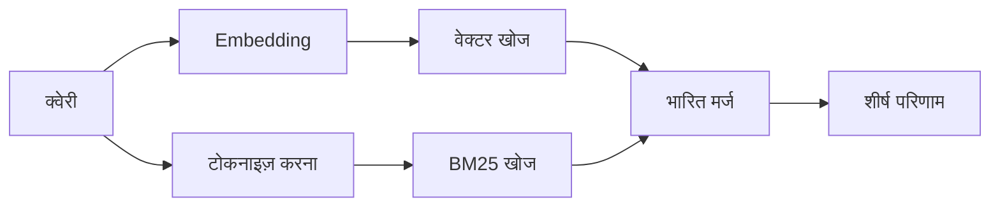

---
read_when:
    - आप समझना चाहते हैं कि memory_search कैसे काम करता है
    - आप एक एम्बेडिंग प्रदाता चुनना चाहते हैं
    - आप खोज की गुणवत्ता को बेहतर बनाना चाहते हैं
summary: मेमोरी खोज एम्बेडिंग और हाइब्रिड पुनर्प्राप्ति का उपयोग करके प्रासंगिक नोट्स कैसे ढूँढती है
title: स्मृति खोज
x-i18n:
    generated_at: "2026-07-16T14:30:15Z"
    model: gpt-5.6
    postprocess_version: locale-links-v1
    prompt_version: 32
    provider: openai
    source_hash: 2ae0830843fba28c24159d85425240051fb8caf086cd0563d3091890045dcfad
    source_path: concepts/memory-search.md
    workflow: 16
---

`memory_search` आपकी मेमोरी फ़ाइलों से प्रासंगिक नोट्स ढूँढता है, भले ही उनकी
शब्दावली मूल टेक्स्ट से अलग हो। यह मेमोरी को छोटे हिस्सों में बाँटता है और
embeddings, कीवर्ड या दोनों की मदद से उनमें खोज करता है।

## त्वरित शुरुआत

OpenClaw डिफ़ॉल्ट रूप से OpenAI embeddings का उपयोग करता है। किसी अन्य प्रदाता का उपयोग करने के लिए, उसे
स्पष्ट रूप से सेट करें:

```json5
{
  agents: {
    defaults: {
      memorySearch: {
        provider: "openai", // या "gemini", "voyage", "mistral", "bedrock", "local", "ollama", "lmstudio", "github-copilot", "openai-compatible"
      },
    },
  },
}
```

`provider` किसी कस्टम `models.providers.<id>` प्रविष्टि का भी संदर्भ दे सकता है (उदाहरण के लिए
`ollama-5080`), बशर्ते वह प्रविष्टि `api` को `"ollama"` या
मेमोरी embedding अडैप्टर वाले किसी अन्य प्रदाता आईडी पर सेट करती हो।

बिना API कुंजी वाले स्थानीय embeddings के लिए, आधिकारिक llama.cpp प्रदाता
Plugin इंस्टॉल करें और `provider: "local"` सेट करें:

```bash
openclaw plugins install @openclaw/llama-cpp-provider
```

स्रोत चेकआउट के लिए अब भी नेटिव बिल्ड की स्वीकृति आवश्यक है: `pnpm approve-builds`, फिर
`pnpm rebuild node-llama-cpp`।

कुछ OpenAI-संगत embedding एंडपॉइंट को असममित `input_type`
लेबल की आवश्यकता होती है, जैसे खोजों के लिए `"query"` और इंडेक्स किए गए
हिस्सों के लिए `"document"`/`"passage"`। इन्हें `queryInputType` और `documentInputType` से सेट करें; देखें
[मेमोरी कॉन्फ़िगरेशन संदर्भ](/hi/reference/memory-config#provider-specific-config)।

## समर्थित प्रदाता

| प्रदाता           | आईडी                 | API कुंजी आवश्यक | टिप्पणियाँ                              |
| ----------------- | ------------------- | ------------- | --------------------------------- |
| Bedrock           | `bedrock`           | नहीं            | AWS क्रेडेंशियल शृंखला का उपयोग करता है     |
| DeepInfra         | `deepinfra`         | हाँ           | डिफ़ॉल्ट मॉडल `BAAI/bge-m3`       |
| Gemini            | `gemini`            | हाँ           | इमेज/ऑडियो इंडेक्सिंग का समर्थन करता है     |
| GitHub Copilot    | `github-copilot`    | नहीं            | आपकी Copilot सदस्यता का उपयोग करता है    |
| स्थानीय             | `local`             | नहीं            | GGUF मॉडल, ~0.6 GB स्वतः डाउनलोड |
| LM Studio         | `lmstudio`          | नहीं            | स्थानीय/स्वयं-होस्ट किया गया सर्वर          |
| Mistral           | `mistral`           | हाँ           |                                   |
| Ollama            | `ollama`            | नहीं            | स्थानीय/स्वयं-होस्ट किया गया सर्वर          |
| OpenAI            | `openai`            | हाँ           | डिफ़ॉल्ट                           |
| OpenAI-संगत | `openai-compatible` | आमतौर पर       | सामान्य `/v1/embeddings` एंडपॉइंट |
| Voyage            | `voyage`            | हाँ           |                                   |

## खोज कैसे काम करती है

OpenClaw समानांतर रूप से दो पुनर्प्राप्ति पथ चलाता है और परिणामों को मर्ज करता है:



- **वेक्टर खोज** समान अर्थ का मिलान करती है ("gateway होस्ट" का मिलान "OpenClaw चलाने वाली
  मशीन" से होता है)।
- **BM25 कीवर्ड खोज** सटीक शब्दों (आईडी, त्रुटि स्ट्रिंग, कॉन्फ़िगरेशन
  कुंजियाँ) का मिलान करती है।
- **फ़ाइलनाम खोज** पथों को नोट के मुख्य भाग से अलग इंडेक्स करती है। सटीक पूर्ण
  पथ, बेसनेम और फ़ाइलनाम स्टेम को आंशिक पथ मिलानों से ऊँची रैंक मिलती है,
  जबकि स्निपेट और मुख्य भाग के कीवर्ड स्कोर अब भी नोट की सामग्री से आते हैं।

यदि केवल एक पथ उपलब्ध है, तो वह अकेला चलता है।

**केवल FTS मोड।** embeddings को जानबूझकर अक्षम करने और
केवल कीवर्ड से खोजने के लिए `provider: "none"` सेट करें। `provider` को सेट न करने या `"auto"`
पर सेट करने पर, यदि कोई embedding प्रमाणीकरण कॉन्फ़िगर नहीं है, तो भी बिना
त्रुटि दिए केवल-कीवर्ड रैंकिंग पर फ़ॉलबैक होता है, और विफल होने पर
`provider: "local"` (GGUF/llama.cpp प्रदाता) भी ऐसा ही करता है।

**स्पष्ट प्रदाता अनुपलब्ध।** यदि आप किसी अन्य प्रदाता का नाम स्पष्ट रूप से देते हैं
(उदाहरण के लिए `openai`, `ollama`, `gemini`) और वह अनुरोध के समय
अनुपलब्ध हो जाता है (खराब प्रमाणीकरण, नेटवर्क विफलता), तो `memory_search` चुपचाप
केवल FTS परिणामों पर जाने के बजाय मेमोरी को अनुपलब्ध बताता है। इससे कोई
खराब कॉन्फ़िगर किया गया प्रदाता दृश्यमान रहता है। जानबूझकर केवल FTS
पुनःस्मरण के लिए `provider: "none"` सेट करें, या सिमैंटिक रैंकिंग बहाल करने के लिए प्रदाता/प्रमाणीकरण
कॉन्फ़िगरेशन ठीक करें।

## खोज की गुणवत्ता में सुधार

दो वैकल्पिक सुविधाएँ नोट्स का बड़ा इतिहास होने पर मदद करती हैं।

### समयगत क्षय

पुराने नोट्स का रैंकिंग भार धीरे-धीरे घटता है, ताकि हाल की जानकारी पहले दिखाई दे।
डिफ़ॉल्ट 30-दिन की अर्ध-आयु के साथ, पिछले महीने के नोट का स्कोर उसके
मूल भार का 50% होता है। `MEMORY.md` और `memory/` के अंतर्गत अन्य बिना-तारीख वाली फ़ाइलें
सदाबहार होती हैं और उनका कभी क्षय नहीं होता; केवल तारीख वाली `memory/YYYY-MM-DD.md` फ़ाइलों का क्षय होता है।

<Tip>
यदि आपके एजेंट के पास महीनों के दैनिक नोट्स हैं और पुरानी जानकारी
हाल के संदर्भ से लगातार ऊँची रैंक पा रही है, तो इसे सक्षम करें।
</Tip>

### MMR (विविधता)

दोहराव वाले परिणामों को कम करता है। यदि पाँच नोट्स में एक ही राउटर कॉन्फ़िगरेशन का
उल्लेख है, तो MMR सुनिश्चित करता है कि शीर्ष परिणाम दोहराने के बजाय अलग-अलग विषयों को शामिल करें।

<Tip>
यदि `memory_search` अलग-अलग दैनिक नोट्स से लगभग समान स्निपेट लगातार
लौटाता है, तो इसे सक्षम करें।
</Tip>

### दोनों को सक्षम करें

```json5
{
  agents: {
    defaults: {
      memorySearch: {
        query: {
          hybrid: {
            mmr: { enabled: true },
            temporalDecay: { enabled: true },
          },
        },
      },
    },
  },
}
```

## मल्टीमॉडल मेमोरी

`gemini-embedding-2-preview` के साथ, आप Markdown के साथ इमेज और ऑडियो भी
इंडेक्स कर सकते हैं। यह केवल `memorySearch.extraPaths` के अंतर्गत मौजूद फ़ाइलों पर लागू होता है; डिफ़ॉल्ट
मेमोरी रूट (`MEMORY.md`, `memory/*.md`) केवल Markdown रहते हैं। खोज क्वेरी
टेक्स्ट ही रहती हैं, लेकिन वे दृश्य और ऑडियो सामग्री से मिलान करती हैं। सेटअप के लिए
[मेमोरी कॉन्फ़िगरेशन संदर्भ](/hi/reference/memory-config#multimodal-memory-gemini)
देखें।

## सत्र मेमोरी खोज

सत्र ट्रांसक्रिप्ट से सटीक पूर्ण-टेक्स्ट पुनःस्मरण के लिए, [`sessions_search`](/hi/concepts/session-search)
का उपयोग करें और फिर `sessions_history` से कोई परिणाम खोलें। सत्र-मेमोरी खोज सिमैंटिक,
प्रायोगिक पूरक बनी रहती है।

वैकल्पिक रूप से सत्र ट्रांसक्रिप्ट इंडेक्स करें, ताकि `memory_search` पिछली
बातचीत को याद कर सके। यह ऑप्ट-इन है: `experimental.sessionMemory: true` सेट करें और
`"sessions"` को `sources` में जोड़ें (डिफ़ॉल्ट `sources`, `["memory"]` है)।

सत्र हिट `tools.sessions.visibility` का पालन करते हैं: डिफ़ॉल्ट `"tree"` केवल
वर्तमान सत्र और उससे उत्पन्न सत्रों को उजागर करता है। किसी अलग सत्र से
उसी एजेंट के असंबंधित सत्र को याद करने के लिए (उदाहरण के लिए DM से Gateway द्वारा भेजा गया
सत्र), दृश्यता को `"agent"` तक विस्तृत करें।

QMD बैकएंड का उपयोग करते समय, `memory.qmd.sessions.enabled: true` भी सेट करें, ताकि
ट्रांसक्रिप्ट QMD संग्रह में निर्यात हों; केवल `experimental.sessionMemory`
और `sources` ट्रांसक्रिप्ट को QMD में निर्यात नहीं करते। देखें
[कॉन्फ़िगरेशन संदर्भ](/hi/reference/memory-config#session-memory-search-experimental)।

## समस्या निवारण

**कोई परिणाम नहीं?** इंडेक्स जाँचने के लिए `openclaw memory status` चलाएँ। यदि वह खाली है, तो
`openclaw memory index --force` चलाएँ।

**केवल कीवर्ड मिलान?** आपका embedding प्रदाता शायद कॉन्फ़िगर नहीं है। जाँचें:
`openclaw memory status --deep`।

**स्थानीय embeddings का समय समाप्त हो जाता है?** `ollama`, `lmstudio`, और `local` डिफ़ॉल्ट रूप से अधिक लंबी
इनलाइन बैच समय-सीमा का उपयोग करते हैं। यदि होस्ट केवल धीमा है, तो
`agents.defaults.memorySearch.sync.embeddingBatchTimeoutSeconds` सेट करें और
`openclaw memory index --force` फिर से चलाएँ।

**CJK टेक्स्ट नहीं मिला?** FTS इंडेक्स को
`openclaw memory index --force` से फिर से बनाएँ।

## संबंधित

- [मेमोरी अवलोकन](/hi/concepts/memory)
- [Active Memory](/hi/concepts/active-memory)
- [अंतर्निहित मेमोरी इंजन](/hi/concepts/memory-builtin)
- [मेमोरी कॉन्फ़िगरेशन संदर्भ](/hi/reference/memory-config)
