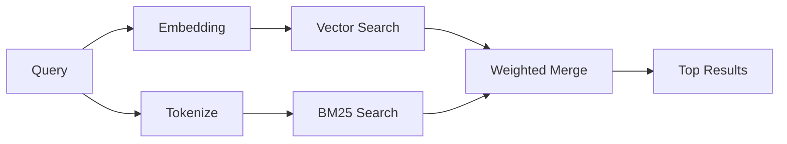

---
read_when:
    - आप समझना चाहते हैं कि memory_search कैसे काम करता है
    - आप एक embedding provider चुनना चाहते हैं
    - आप खोज गुणवत्ता को बेहतर बनाना चाहते हैं
summary: मेमोरी खोज एम्बेडिंग और हाइब्रिड पुनर्प्राप्ति का उपयोग करके प्रासंगिक नोट्स कैसे ढूंढती है
title: मेमोरी खोज
x-i18n:
    generated_at: "2026-06-28T22:59:17Z"
    model: gpt-5.5
    postprocess_version: locale-links-v1
    provider: openai
    source_hash: 32ffb9d996851566eb92b7812c5425f545ecbb5387a0a445686df35a6c8ae143
    source_path: concepts/memory-search.md
    workflow: 16
---

`memory_search` आपकी मेमोरी फ़ाइलों से प्रासंगिक नोट्स ढूंढता है, भले ही
शब्दावली मूल टेक्स्ट से अलग हो। यह मेमोरी को छोटे
चंक्स में इंडेक्स करके और उन्हें embeddings, कीवर्ड्स, या दोनों से खोजकर काम करता है.

## तुरंत शुरू करें

मेमोरी खोज डिफ़ॉल्ट रूप से OpenAI embeddings का उपयोग करती है। किसी दूसरे embedding
बैकएंड का उपयोग करने के लिए, एक प्रदाता स्पष्ट रूप से सेट करें:

```json5
{
  agents: {
    defaults: {
      memorySearch: {
        provider: "openai", // or "gemini", "local", "ollama", "openai-compatible", etc.
      },
    },
  },
}
```

मेमोरी-विशिष्ट प्रदाताओं वाले मल्टी-एंडपॉइंट सेटअप के लिए, `provider`
एक कस्टम `models.providers.<id>` एंट्री भी हो सकता है, जैसे `ollama-5080`, जब वह
प्रदाता `api: "ollama"` या कोई दूसरा मेमोरी embedding adapter owner सेट करता है.

बिना API कुंजी वाले local embeddings के लिए,
`@openclaw/llama-cpp-provider` इंस्टॉल करें और `provider: "local"` सेट करें। सोर्स चेकआउट
में अभी भी नेटिव बिल्ड स्वीकृति की आवश्यकता हो सकती है: `pnpm approve-builds` फिर
`pnpm rebuild node-llama-cpp`.

कुछ OpenAI-compatible embedding endpoints को खोजों के लिए
`input_type: "query"` और indexed chunks के लिए `input_type: "document"` या `"passage"`
जैसे asymmetric labels की आवश्यकता होती है। इन्हें `memorySearch.queryInputType` और
`memorySearch.documentInputType` से कॉन्फ़िगर करें; [मेमोरी कॉन्फ़िगरेशन संदर्भ](/hi/reference/memory-config#provider-specific-config) देखें.

## समर्थित प्रदाता

| प्रदाता           | आईडी                 | API कुंजी चाहिए | नोट्स                         |
| ----------------- | ------------------- | ------------- | ----------------------------- |
| Bedrock           | `bedrock`           | नहीं           | AWS credential chain का उपयोग करता है |
| DeepInfra         | `deepinfra`         | हाँ            | डिफ़ॉल्ट: `BAAI/bge-m3`        |
| Gemini            | `gemini`            | हाँ            | image/audio indexing का समर्थन करता है |
| GitHub Copilot    | `github-copilot`    | नहीं           | Copilot subscription का उपयोग करता है |
| Local             | `local`             | नहीं           | GGUF model, ~0.6 GB download  |
| Mistral           | `mistral`           | हाँ            |                               |
| Ollama            | `ollama`            | नहीं           | Local/self-hosted             |
| OpenAI            | `openai`            | हाँ            | डिफ़ॉल्ट                       |
| OpenAI-compatible | `openai-compatible` | आमतौर पर       | Generic `/v1/embeddings`      |
| Voyage            | `voyage`            | हाँ            |                               |

## खोज कैसे काम करती है

OpenClaw दो retrieval paths समानांतर में चलाता है और परिणामों को merge करता है:



- **वेक्टर खोज** समान अर्थ वाले नोट्स ढूंढती है ("gateway host" का मिलान
  "the machine running OpenClaw" से होता है).
- **BM25 keyword search** सटीक मिलान ढूंढती है (IDs, error strings, config
  keys).

अगर केवल एक path उपलब्ध है, तो दूसरा अकेले चलता है। जानबूझकर FTS-only mode
(`provider: "none"`) और automatic/default provider selection तब भी
lexical ranking का उपयोग कर सकते हैं जब embeddings उपलब्ध न हों.

स्पष्ट non-local embedding providers अलग हैं। अगर आप
`memorySearch.provider` को किसी ठोस remote-backed provider पर सेट करते हैं और वह provider
runtime पर उपलब्ध नहीं है, तो `memory_search` चुपचाप FTS-only results का उपयोग करने के बजाय
मेमोरी को अनुपलब्ध बताता है। इससे टूटा हुआ configured semantic
provider दिखता रहता है। जानबूझकर FTS-only recall के लिए `provider: "none"` सेट करें, या
semantic ranking बहाल करने के लिए provider/auth configuration ठीक करें.

## खोज गुणवत्ता बेहतर बनाना

जब आपके पास लंबा note history हो, तो दो वैकल्पिक सुविधाएँ मदद करती हैं:

### Temporal decay

पुराने नोट्स धीरे-धीरे ranking weight खोते हैं ताकि हाल की जानकारी पहले सतह पर आए।
30 दिनों की डिफ़ॉल्ट half-life के साथ, पिछले महीने का नोट अपने मूल weight के 50% पर
स्कोर करता है। `MEMORY.md` जैसी Evergreen files कभी decayed नहीं होतीं.

<Tip>
अगर आपके agent के पास महीनों के daily notes हैं और stale
जानकारी हाल के context से ऊपर rank होती रहती है, तो temporal decay सक्षम करें.
</Tip>

### MMR (विविधता)

दोहराव वाले results कम करता है। अगर पाँच नोट्स सभी उसी router config का उल्लेख करते हैं, तो MMR
सुनिश्चित करता है कि top results दोहराने के बजाय अलग-अलग topics cover करें.

<Tip>
अगर `memory_search` अलग-अलग daily notes से लगभग duplicate snippets
लौटाता रहता है, तो MMR सक्षम करें.
</Tip>

### दोनों सक्षम करें

```json5
{
  agents: {
    defaults: {
      memorySearch: {
        query: {
          hybrid: {
            mmr: { enabled: true },
            temporalDecay: { enabled: true },
          },
        },
      },
    },
  },
}
```

## Multimodal memory

Gemini Embedding 2 के साथ, आप Markdown के साथ images और audio files को index कर सकते हैं।
Search queries टेक्स्ट ही रहती हैं, लेकिन वे visual और audio
content से match करती हैं। setup के लिए [मेमोरी कॉन्फ़िगरेशन संदर्भ](/hi/reference/memory-config) देखें.

## Session memory search

आप वैकल्पिक रूप से session transcripts को index कर सकते हैं ताकि `memory_search`
पहले की conversations याद कर सके। यह
`memorySearch.experimental.sessionMemory` और `sources: ["sessions"]` के माध्यम से opt-in है; डिफ़ॉल्ट
source list केवल memory है। experimental flag session transcript
indexing सक्षम करता है, जबकि `sources` नियंत्रित करता है कि session chunks खोजे जाएँ या नहीं.

Session hits `tools.sessions.visibility` का पालन करते हैं: डिफ़ॉल्ट `tree` setting केवल
वर्तमान session और उससे spawned sessions को expose करती है। अलग DM session से किसी unrelated
same-agent gateway-dispatched session को याद करने के लिए, visibility को जानबूझकर
`agent` तक बढ़ाएँ.

QMD का उपयोग करते समय, `memory.qmd.sessions.enabled: true` भी सेट करें ताकि transcripts
QMD collection में export हों। विवरण के लिए
[कॉन्फ़िगरेशन संदर्भ](/hi/reference/memory-config) देखें.

## समस्या निवारण

**कोई परिणाम नहीं?** index जांचने के लिए `openclaw memory status` चलाएँ। अगर खाली है, तो
`openclaw memory index --force` चलाएँ.

**केवल keyword matches?** आपका embedding provider कॉन्फ़िगर नहीं हो सकता। जांचें
`openclaw memory status --deep`.

**Local embeddings time out?** `ollama`, `lmstudio`, और `local` डिफ़ॉल्ट रूप से लंबा
inline batch timeout उपयोग करते हैं। अगर host बस धीमा है, तो
`agents.defaults.memorySearch.sync.embeddingBatchTimeoutSeconds` सेट करें और
`openclaw memory index --force` फिर से चलाएँ.

**CJK text नहीं मिला?** FTS index को
`openclaw memory index --force` से rebuild करें.

## आगे पढ़ें

- [Active Memory](/hi/concepts/active-memory) -- interactive chat sessions के लिए sub-agent memory
- [मेमोरी](/hi/concepts/memory) -- file layout, backends, tools
- [मेमोरी कॉन्फ़िगरेशन संदर्भ](/hi/reference/memory-config) -- सभी config knobs

## संबंधित

- [मेमोरी overview](/hi/concepts/memory)
- [Active Memory](/hi/concepts/active-memory)
- [Builtin memory engine](/hi/concepts/memory-builtin)
