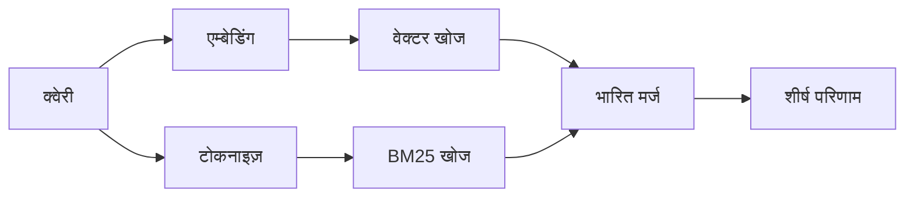

---
read_when:
    - आप समझना चाहते हैं कि memory_search कैसे काम करता है
    - आप एक एम्बेडिंग प्रदाता चुनना चाहते हैं
    - आप खोज की गुणवत्ता को बेहतर बनाना चाहते हैं
summary: मेमोरी खोज एम्बेडिंग और हाइब्रिड पुनर्प्राप्ति का उपयोग करके प्रासंगिक नोट्स कैसे ढूँढती है
title: मेमोरी खोज
x-i18n:
    generated_at: "2026-07-19T08:23:19Z"
    model: gpt-5.6
    postprocess_version: locale-links-v1
    prompt_version: 32
    provider: openai
    source_hash: e7be013665593c82890d3e0586136385f9b17e8d76f18e85abeab7304f34264d
    source_path: concepts/memory-search.md
    workflow: 16
---

`memory_search` आपकी मेमोरी फ़ाइलों से प्रासंगिक नोट्स खोजता है, भले ही उनकी
शब्दावली मूल पाठ से अलग हो। यह मेमोरी को छोटे भागों में बाँटता है और
उन्हें एम्बेडिंग, कीवर्ड या दोनों से खोजता है।

## त्वरित शुरुआत

OpenClaw डिफ़ॉल्ट रूप से OpenAI एम्बेडिंग का उपयोग करता है। किसी अन्य प्रदाता का उपयोग करने के लिए, उसे
स्पष्ट रूप से सेट करें:

```json5
{
  agents: {
    defaults: {
      memorySearch: {
        provider: "openai", // या "gemini", "voyage", "mistral", "bedrock", "local", "ollama", "lmstudio", "github-copilot", "openai-compatible"
      },
    },
  },
}
```

`provider` किसी कस्टम `models.providers.<id>` प्रविष्टि का भी संदर्भ दे सकता है (उदाहरण के लिए
`ollama-5080`), बशर्ते वह प्रविष्टि `api` को `"ollama"` या
मेमोरी एम्बेडिंग अडैप्टर वाले किसी अन्य प्रदाता आईडी पर सेट करे।

बिना API कुंजी वाले स्थानीय एम्बेडिंग के लिए, आधिकारिक llama.cpp प्रदाता
Plugin इंस्टॉल करें और `provider: "local"` सेट करें:

```bash
openclaw plugins install @openclaw/llama-cpp-provider
```

स्रोत चेकआउट को अब भी नेटिव बिल्ड की स्वीकृति चाहिए: `pnpm approve-builds`, फिर
`pnpm rebuild node-llama-cpp`।

कुछ OpenAI-संगत एम्बेडिंग एंडपॉइंट को असममित `input_type`
लेबल चाहिए, जैसे खोजों के लिए `"query"` और इंडेक्स किए गए
खंडों के लिए `"document"`/`"passage"`। इन्हें `queryInputType` और `documentInputType` से सेट करें; देखें
[मेमोरी कॉन्फ़िगरेशन संदर्भ](/hi/reference/memory-config#provider-specific-config)।

## समर्थित प्रदाता

| प्रदाता            | आईडी                | API कुंजी आवश्यक | टिप्पणियाँ                              |
| ----------------- | ------------------- | ------------- | --------------------------------- |
| Bedrock           | `bedrock`           | नहीं           | AWS क्रेडेंशियल शृंखला का उपयोग करता है |
| DeepInfra         | `deepinfra`         | हाँ            | डिफ़ॉल्ट मॉडल `BAAI/bge-m3`       |
| Gemini            | `gemini`            | हाँ            | इमेज/ऑडियो इंडेक्सिंग का समर्थन करता है |
| GitHub Copilot    | `github-copilot`    | नहीं           | आपकी Copilot सदस्यता का उपयोग करता है |
| स्थानीय           | `local`             | नहीं           | GGUF मॉडल, ~0.6 GB स्वतः डाउनलोड |
| LM Studio         | `lmstudio`          | नहीं           | स्थानीय/स्वयं होस्ट किया गया सर्वर |
| Mistral           | `mistral`           | हाँ            |                                   |
| Ollama            | `ollama`            | नहीं           | स्थानीय/स्वयं होस्ट किया गया सर्वर |
| OpenAI            | `openai`            | हाँ            | डिफ़ॉल्ट                           |
| OpenAI-संगत       | `openai-compatible` | सामान्यतः      | सामान्य `/v1/embeddings` एंडपॉइंट |
| Voyage            | `voyage`            | हाँ            |                                   |

## खोज कैसे काम करती है

OpenClaw दो पुनर्प्राप्ति पथ समानांतर रूप से चलाता है और परिणामों को मर्ज करता है:



- **वेक्टर खोज** समान अर्थ का मिलान करती है ("gateway होस्ट" का मिलान "OpenClaw चलाने वाली
  मशीन" से होता है)।
- **BM25 कीवर्ड खोज** सटीक शब्दों (आईडी, त्रुटि स्ट्रिंग, कॉन्फ़िगरेशन
  कुंजियों) का मिलान करती है।
- **फ़ाइलनाम खोज** पथों को नोट के मुख्य पाठ से अलग इंडेक्स करती है। सटीक पूर्ण
  पथ, बेसनाम और फ़ाइलनाम स्टेम आंशिक पथ मिलानों से ऊपर रैंक करते हैं,
  जबकि स्निपेट और मुख्य पाठ के कीवर्ड स्कोर अब भी नोट की सामग्री से आते हैं।

यदि केवल एक पथ उपलब्ध है, तो वह अकेले चलता है।

**केवल-FTS मोड।** एम्बेडिंग को जानबूझकर अक्षम करने और केवल कीवर्ड से
खोजने के लिए `provider: "none"` सेट करें। `provider` को सेट न करना या `"auto"`
पर सेट करना भी, यदि कोई एम्बेडिंग प्रमाणीकरण कॉन्फ़िगर नहीं है, तो बिना
त्रुटि दिए केवल-कीवर्ड रैंकिंग पर वापस जाता है; `provider: "local"` (GGUF/llama.cpp
प्रदाता) के विफल होने पर भी ऐसा ही होता है।

**स्पष्ट प्रदाता अनुपलब्ध।** यदि आप किसी अन्य प्रदाता को स्पष्ट रूप से
नाम देते हैं (उदाहरण के लिए `openai`, `ollama`, `gemini`) और वह अनुरोध के
समय अनुपलब्ध हो जाता है (खराब प्रमाणीकरण, नेटवर्क विफलता), तो `memory_search`
चुपचाप केवल-FTS परिणामों पर जाने के बजाय मेमोरी को अनुपलब्ध बताता है। इससे
खराब कॉन्फ़िगर किया गया प्रदाता दिखाई देता रहता है। जानबूझकर
केवल-FTS पुनःस्मरण के लिए `provider: "none"` सेट करें, या सिमेंटिक
रैंकिंग पुनर्स्थापित करने के लिए प्रदाता/प्रमाणीकरण कॉन्फ़िगरेशन ठीक करें।

## खोज की गुणवत्ता सुधारना

बड़े नोट इतिहास में दो वैकल्पिक सुविधाएँ मदद करती हैं।

### समयगत क्षय

पुराने नोट धीरे-धीरे रैंकिंग भार खोते हैं, ताकि हाल की जानकारी पहले सामने आए।
डिफ़ॉल्ट 30-दिवसीय अर्ध-आयु के साथ, पिछले महीने का कोई नोट अपने
मूल भार का 50% स्कोर करता है। `MEMORY.md` और `memory/` के अंतर्गत अन्य बिना-तिथि वाली फ़ाइलें
सदाबहार रहती हैं और उनका कभी क्षय नहीं होता; केवल दिनांकित `memory/YYYY-MM-DD.md` फ़ाइलों का क्षय होता है।

<Tip>
यदि आपके एजेंट के पास कई महीनों के दैनिक नोट्स हैं और पुरानी जानकारी
हाल के संदर्भ से लगातार ऊपर रैंक करती है, तो इसे सक्षम करें।
</Tip>

### MMR (विविधता)

दोहराव वाले परिणामों को कम करता है। यदि पाँच नोट्स में एक ही राउटर कॉन्फ़िगरेशन का
उल्लेख है, तो MMR सुनिश्चित करता है कि शीर्ष परिणाम दोहराने के बजाय अलग-अलग विषयों को समेटें।

<Tip>
यदि `memory_search` अलग-अलग दैनिक नोट्स से लगभग समान स्निपेट लगातार
लौटाता है, तो इसे सक्षम करें।
</Tip>

### दोनों सक्षम करें

```json5
{
  agents: {
    defaults: {
      memorySearch: {
        query: {
          hybrid: {
            mmr: { enabled: true },
            temporalDecay: { enabled: true },
          },
        },
      },
    },
  },
}
```

## मल्टीमोडल मेमोरी

`gemini-embedding-2-preview` के साथ, आप Markdown के साथ इमेज और ऑडियो को भी
इंडेक्स कर सकते हैं। यह केवल `memorySearch.extraPaths` के अंतर्गत फ़ाइलों पर लागू होता है; डिफ़ॉल्ट
मेमोरी रूट (`MEMORY.md`, `memory/*.md`) केवल-Markdown रहते हैं। खोज क्वेरी
पाठ ही रहती हैं, लेकिन वे दृश्य और ऑडियो सामग्री से मिलान करती हैं। सेटअप के लिए
[मेमोरी कॉन्फ़िगरेशन संदर्भ](/hi/reference/memory-config#multimodal-memory-gemini)
देखें।

## सत्र मेमोरी खोज

सत्र ट्रांसक्रिप्ट से सटीक पूर्ण-पाठ पुनःस्मरण के लिए, [`sessions_search`](/hi/concepts/session-search)
का उपयोग करें और फिर `sessions_history` से कोई परिणाम खोलें। सत्र-मेमोरी खोज सिमेंटिक,
प्रयोगात्मक पूरक बनी रहती है।

वैकल्पिक रूप से सत्र ट्रांसक्रिप्ट इंडेक्स करें, ताकि `memory_search` पहले की
बातचीत को याद कर सके। यह ऑप्ट-इन है: `experimental.sessionMemory: true` सेट करें और
`sources` में `"sessions"` जोड़ें (डिफ़ॉल्ट `sources`, `["memory"]` है)।

सत्र परिणाम `tools.sessions.visibility` का पालन करते हैं: डिफ़ॉल्ट `"tree"` वर्तमान
सत्र, उसके द्वारा बनाए गए सत्र और परिवेशी समूह जागरूकता के माध्यम से देखे गए
समान-एजेंट समूह सत्रों को उजागर करता है। `session.dmScope: "main"` के साथ, बहु-उपयोगकर्ता
DM सेटअप उस मुख्य सत्र को साझा करता है, इसलिए वहाँ रूट किए गए उपयोगकर्ता उसके देखे गए
समूहों की सामग्री याद कर सकते हैं। DM अलगाव के लिए प्रति-पीयर `dmScope` का उपयोग करें, या
परिवेशी देखे गए सत्रों को पढ़ने से बाहर रहने के लिए दृश्यता को `"self"` पर सेट करें। अन्य
असंबंधित समान-एजेंट सत्रों के लिए अब भी `"agent"` दृश्यता आवश्यक है।

QMD बैकएंड का उपयोग करते समय, `memory.qmd.sessions.enabled: true` भी सेट करें, ताकि
ट्रांसक्रिप्ट QMD संग्रह में निर्यात हों; केवल `experimental.sessionMemory`
और `sources` ट्रांसक्रिप्ट को QMD में निर्यात नहीं करते। देखें
[कॉन्फ़िगरेशन संदर्भ](/hi/reference/memory-config#session-memory-search-experimental)।

## समस्या निवारण

**कोई परिणाम नहीं?** इंडेक्स जाँचने के लिए `openclaw memory status` चलाएँ। यदि वह खाली है, तो
`openclaw memory index --force` चलाएँ।

**केवल कीवर्ड मिलान?** हो सकता है आपका एम्बेडिंग प्रदाता कॉन्फ़िगर न हो। जाँचें
`openclaw memory status --deep`।

**स्थानीय एम्बेडिंग का समय समाप्त हो रहा है?** `ollama`, `lmstudio` और `local` डिफ़ॉल्ट रूप से अधिक लंबी
इनलाइन बैच समय-सीमा का उपयोग करते हैं। यदि होस्ट केवल धीमा है, तो
`agents.defaults.memorySearch.sync.embeddingBatchTimeoutSeconds` सेट करें और
`openclaw memory index --force` फिर से चलाएँ।

**CJK पाठ नहीं मिला?** FTS इंडेक्स को
`openclaw memory index --force` से फिर से बनाएँ।

## संबंधित

- [मेमोरी अवलोकन](/hi/concepts/memory)
- [Active Memory](/hi/concepts/active-memory)
- [अंतर्निहित मेमोरी इंजन](/hi/concepts/memory-builtin)
- [मेमोरी कॉन्फ़िगरेशन संदर्भ](/hi/reference/memory-config)
