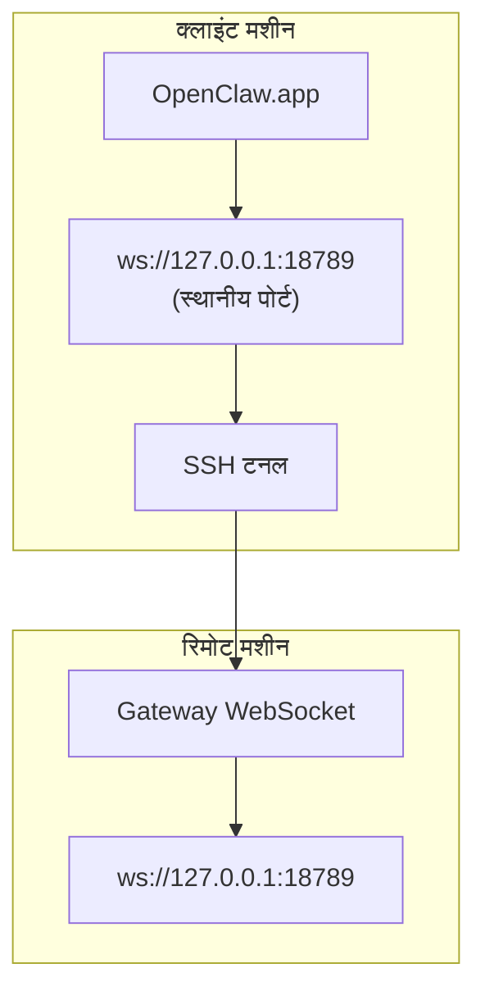

<Note>
यह सामग्री अब [रिमोट एक्सेस](/hi/gateway/remote#macos-persistent-ssh-tunnel-via-launchagent) में उपलब्ध है। वर्तमान मार्गदर्शिका के लिए उस पृष्ठ का उपयोग करें; यह पृष्ठ रीडायरेक्ट लक्ष्य के रूप में बना रहेगा।
</Note>

# रिमोट Gateway के साथ OpenClaw.app चलाना

OpenClaw.app एक SSH टनल के माध्यम से रिमोट Gateway तक पहुँचता है: एक SSH `LocalForward` स्थानीय पोर्ट को रिमोट होस्ट के Gateway WebSocket पोर्ट से मैप करता है।

## सेटअप

1. `LocalForward 18789 127.0.0.1:18789` के साथ एक SSH कॉन्फ़िग प्रविष्टि जोड़ें (पूरे कॉन्फ़िग ब्लॉक के लिए [रिमोट एक्सेस](/hi/gateway/remote#macos-persistent-ssh-tunnel-via-launchagent) देखें)।
2. `ssh-copy-id` के साथ अपनी SSH कुंजी को रिमोट होस्ट पर कॉपी करें।
3. `openclaw config set gateway.remote.token "<your-token>"` के माध्यम से `gateway.remote.token` (या `gateway.remote.password`) सेट करें।
4. टनल शुरू करें: `ssh -N remote-gateway &`।
5. OpenClaw.app बंद करके फिर से खोलें।

रीबूट के बाद भी बने रहने और अपने-आप दोबारा कनेक्ट होने वाले टनल के लिए, मैन्युअल `ssh -N` के बजाय [रिमोट एक्सेस](/hi/gateway/remote#macos-persistent-ssh-tunnel-via-launchagent) पृष्ठ पर दिए गए LaunchAgent सेटअप का उपयोग करें।

## यह कैसे काम करता है

| घटक                            | यह क्या करता है                                                  |
| ------------------------------------ | ------------------------------------------------------------- |
| `LocalForward 18789 127.0.0.1:18789` | स्थानीय पोर्ट 18789 को रिमोट पोर्ट 18789 पर फ़ॉरवर्ड करता है                |
| `ssh -N`                             | रिमोट कमांड निष्पादित किए बिना SSH (केवल पोर्ट फ़ॉरवर्डिंग)  |
| `KeepAlive`                          | टनल क्रैश होने पर उसे अपने-आप पुनः शुरू करता है (LaunchAgent) |
| `RunAtLoad`                          | LaunchAgent लोड होने पर टनल शुरू करता है (LaunchAgent)    |

OpenClaw.app क्लाइंट पर `ws://127.0.0.1:18789` से कनेक्ट होता है। टनल उस कनेक्शन को Gateway चलाने वाले रिमोट होस्ट के पोर्ट 18789 पर फ़ॉरवर्ड करता है।

## संबंधित

- [रिमोट एक्सेस](/hi/gateway/remote)
- [Tailscale](/hi/gateway/tailscale)
