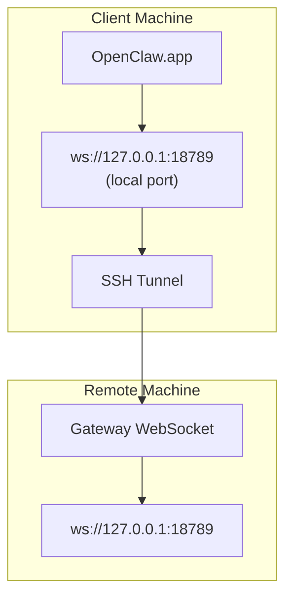

> यह सामग्री [दूरस्थ पहुँच](/hi/gateway/remote#macos-persistent-ssh-tunnel-via-launchagent) में मर्ज कर दी गई है। वर्तमान गाइड के लिए वह पेज देखें।

# Remote Gateway के साथ OpenClaw.app चलाना

OpenClaw.app दूरस्थ Gateway से कनेक्ट करने के लिए SSH टनलिंग का उपयोग करता है। यह गाइड आपको इसे सेट अप करने का तरीका दिखाती है।

## अवलोकन



## त्वरित सेटअप

### चरण 1: SSH कॉन्फ़िग जोड़ें

`~/.ssh/config` संपादित करें और जोड़ें:

```ssh
Host remote-gateway
    HostName <REMOTE_IP>          # e.g., 172.27.187.184
    User <REMOTE_USER>            # e.g., jefferson
    LocalForward 18789 127.0.0.1:18789
    IdentityFile ~/.ssh/id_rsa
```

`<REMOTE_IP>` और `<REMOTE_USER>` को अपने मानों से बदलें।

### चरण 2: SSH कुंजी कॉपी करें

अपनी सार्वजनिक कुंजी दूरस्थ मशीन पर कॉपी करें (पासवर्ड एक बार दर्ज करें):

```bash
ssh-copy-id -i ~/.ssh/id_rsa <REMOTE_USER>@<REMOTE_IP>
```

### चरण 3: Remote Gateway प्रमाणीकरण कॉन्फ़िगर करें

```bash
openclaw config set gateway.remote.token "<your-token>"
```

यदि आपका दूरस्थ Gateway पासवर्ड प्रमाणीकरण का उपयोग करता है, तो इसके बजाय `gateway.remote.password` का उपयोग करें।
`OPENCLAW_GATEWAY_TOKEN` अभी भी shell-स्तरीय ओवरराइड के रूप में मान्य है, लेकिन स्थायी
remote-client सेटअप `gateway.remote.token` / `gateway.remote.password` है।

### चरण 4: SSH टनल शुरू करें

```bash
ssh -N remote-gateway &
```

### चरण 5: OpenClaw.app पुनरारंभ करें

```bash
# Quit OpenClaw.app (⌘Q), then reopen:
open /path/to/OpenClaw.app
```

ऐप अब SSH टनल के माध्यम से दूरस्थ Gateway से कनेक्ट होगा।

---

## लॉगिन पर टनल अपने-आप शुरू करें

लॉग इन करने पर SSH टनल को स्वचालित रूप से शुरू कराने के लिए, एक Launch Agent बनाएँ।

### PLIST फ़ाइल बनाएँ

इसे `~/Library/LaunchAgents/ai.openclaw.ssh-tunnel.plist` के रूप में सहेजें:

```xml
<?xml version="1.0" encoding="UTF-8"?>
<!DOCTYPE plist PUBLIC "-//Apple//DTD PLIST 1.0//EN" "http://www.apple.com/DTDs/PropertyList-1.0.dtd">
<plist version="1.0">
<dict>
    <key>Label</key>
    <string>ai.openclaw.ssh-tunnel</string>
    <key>ProgramArguments</key>
    <array>
        <string>/usr/bin/ssh</string>
        <string>-N</string>
        <string>remote-gateway</string>
    </array>
    <key>KeepAlive</key>
    <true/>
    <key>RunAtLoad</key>
    <true/>
</dict>
</plist>
```

### Launch Agent लोड करें

```bash
launchctl bootstrap gui/$UID ~/Library/LaunchAgents/ai.openclaw.ssh-tunnel.plist
```

टनल अब:

- लॉग इन करने पर स्वचालित रूप से शुरू होगी
- क्रैश होने पर पुनरारंभ होगी
- पृष्ठभूमि में चलती रहेगी

विरासती नोट: यदि कोई बचा हुआ `com.openclaw.ssh-tunnel` LaunchAgent मौजूद हो, तो उसे हटाएँ।

---

## समस्या निवारण

**जाँचें कि टनल चल रही है या नहीं:**

```bash
ps aux | grep "ssh -N remote-gateway" | grep -v grep
lsof -i :18789
```

**टनल पुनरारंभ करें:**

```bash
launchctl kickstart -k gui/$UID/ai.openclaw.ssh-tunnel
```

**टनल रोकें:**

```bash
launchctl bootout gui/$UID/ai.openclaw.ssh-tunnel
```

---

## यह कैसे काम करता है

| घटक                                 | यह क्या करता है                                               |
| ------------------------------------ | ------------------------------------------------------------ |
| `LocalForward 18789 127.0.0.1:18789` | स्थानीय पोर्ट 18789 को दूरस्थ पोर्ट 18789 पर फ़ॉरवर्ड करता है |
| `ssh -N`                             | दूरस्थ कमांड निष्पादित किए बिना SSH (सिर्फ़ पोर्ट फ़ॉरवर्डिंग) |
| `KeepAlive`                          | क्रैश होने पर टनल को स्वचालित रूप से पुनरारंभ करता है        |
| `RunAtLoad`                          | एजेंट लोड होने पर टनल शुरू करता है                           |

OpenClaw.app आपकी क्लाइंट मशीन पर `ws://127.0.0.1:18789` से कनेक्ट करता है। SSH टनल उस कनेक्शन को दूरस्थ मशीन के पोर्ट 18789 पर फ़ॉरवर्ड करती है, जहाँ Gateway चल रहा है।

## संबंधित

- [दूरस्थ पहुँच](/hi/gateway/remote)
- [Tailscale](/hi/gateway/tailscale)
