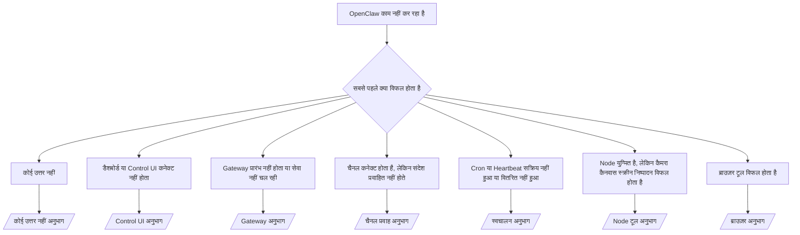

---
read_when:
    - OpenClaw काम नहीं कर रहा है और आपको इसे ठीक करने का सबसे तेज़ तरीका चाहिए
    - गहन रनबुक में जाने से पहले आपको एक प्राथमिकता-निर्धारण प्रक्रिया चाहिए
summary: OpenClaw के लिए लक्षण-आधारित समस्या-निवारण केंद्र
title: सामान्य समस्या निवारण
x-i18n:
    generated_at: "2026-07-16T15:24:52Z"
    model: gpt-5.6
    postprocess_version: locale-links-v1
    prompt_version: 32
    provider: openai
    source_hash: db50e0cdf4d11f3aa6196be445358d904a2b9c40c89243f1b124c77167f6dd85
    source_path: help/troubleshooting.md
    workflow: 16
---

ट्रायेज का प्रारंभिक बिंदु। निदान में 2 मिनट, फिर विस्तृत पृष्ठ पर जाएँ।

## पहले 60 सेकंड

इस क्रम में ये चरण चलाएँ:

```bash
openclaw status
openclaw status --all
openclaw gateway probe
openclaw gateway status
openclaw doctor
openclaw channels status --probe
openclaw logs --follow
```

सही आउटपुट, प्रत्येक के लिए एक पंक्ति:

- `openclaw status` कॉन्फ़िगर किए गए चैनल दिखाता है, कोई प्रमाणीकरण त्रुटि नहीं।
- `openclaw status --all` एक पूर्ण, साझा करने योग्य रिपोर्ट बनाता है।
- `openclaw gateway probe` में `Reachable: yes` दिखता है। `Capability: ...` वह
  प्रमाणीकरण स्तर है जिसे जाँच ने प्रमाणित किया; `Read probe: limited - missing scope:
operator.read` सीमित निदान है, कनेक्शन विफलता नहीं।
- `openclaw gateway status` में `Runtime: running`, `Connectivity probe:
ok`, और एक उचित `Capability: ...` दिखता है। रीड-स्कोप RPC प्रमाण भी आवश्यक बनाने के लिए
  `--require-rpc` जोड़ें।
- `openclaw doctor` कोई अवरोधक कॉन्फ़िगरेशन/सेवा त्रुटि नहीं बताता।
- Gateway उपलब्ध होने पर `openclaw channels status --probe` प्रत्येक खाते की लाइव ट्रांसपोर्ट स्थिति
  (`works` / `audit ok`) लौटाता है; उपलब्ध न होने पर
  केवल कॉन्फ़िगरेशन वाले सारांश पर वापस जाता है।
- `openclaw logs --follow` स्थिर गतिविधि दिखाता है, बार-बार होने वाली कोई गंभीर त्रुटि नहीं।

## सहायक सीमित लगता है या टूल अनुपलब्ध हैं

प्रभावी टूल प्रोफ़ाइल जाँचें:

```bash
openclaw status
openclaw status --all
openclaw doctor
```

सामान्य कारण:

- `tools.profile: "minimal"` केवल `session_status` की अनुमति देता है।
- `tools.profile: "messaging"` सीमित है और केवल चैट वाले एजेंटों के लिए है।
- `tools.profile: "coding"` नए स्थानीय कॉन्फ़िगरेशन के लिए डिफ़ॉल्ट है (रिपॉज़िटरी, फ़ाइल,
  शेल और रनटाइम कार्य)।
- `tools.profile: "full"` प्रोफ़ाइल प्रतिबंध हटाता है; इसे केवल विश्वसनीय
  ऑपरेटर-नियंत्रित एजेंटों तक सीमित रखें।
- प्रति-एजेंट `agents.list[].tools` एक एजेंट के लिए रूट प्रोफ़ाइल को सीमित या विस्तारित करता है।

प्रोफ़ाइल बदलें, Gateway को पुनः प्रारंभ या रीलोड करें, फिर
`openclaw status --all` से दोबारा जाँचें। संपूर्ण प्रोफ़ाइल/समूह तालिका: [टूल प्रोफ़ाइल](/hi/gateway/config-tools#tool-profiles)।

## Anthropic लंबा संदर्भ 429

`HTTP 429: rate_limit_error: Extra usage is required for long context requests`
→ [लंबे संदर्भ के लिए Anthropic 429 में अतिरिक्त उपयोग आवश्यक](/hi/gateway/troubleshooting#anthropic-429-extra-usage-required-for-long-context)।

## स्थानीय OpenAI-संगत बैकएंड सीधे काम करता है, लेकिन OpenClaw में विफल होता है

आपका स्थानीय/स्वयं-होस्ट किया गया `/v1` बैकएंड सीधे `/v1/chat/completions`
जाँचों का उत्तर देता है, लेकिन `openclaw infer model run` या सामान्य एजेंट टर्न पर विफल होता है:

1. त्रुटि में स्ट्रिंग की अपेक्षा करने वाले `messages[].content` का उल्लेख है: 
   `models.providers.<provider>.models[].compat.requiresStringContent: true` सेट करें।
2. अब भी केवल OpenClaw एजेंट टर्न पर विफल होता है:
   `models.providers.<provider>.models[].compat.supportsTools: false` सेट करें और पुनः प्रयास करें।
3. छोटी सीधी कॉल काम करती हैं, लेकिन बड़े OpenClaw प्रॉम्प्ट बैकएंड को क्रैश कर देते हैं: यह
   अपस्ट्रीम मॉडल/सर्वर सीमा है, OpenClaw की बग नहीं। आगे
   [स्थानीय OpenAI-संगत बैकएंड सीधी जाँचों में सफल, लेकिन एजेंट रन विफल](/hi/gateway/troubleshooting#local-openai-compatible-backend-passes-direct-probes-but-agent-runs-fail) में जारी रखें।

## OpenClaw एक्सटेंशन अनुपलब्ध होने के कारण Plugin इंस्टॉल विफल

`package.json missing openclaw.extensions` का अर्थ है कि Plugin पैकेज ऐसी
संरचना का उपयोग करता है जिसे OpenClaw अब स्वीकार नहीं करता।

Plugin पैकेज में सुधार करें:

1. `package.json` में `openclaw.extensions` जोड़ें, जो निर्मित रनटाइम
   फ़ाइलों (आमतौर पर `./dist/index.js`) की ओर संकेत करे।
2. दोबारा प्रकाशित करें, फिर `openclaw plugins install <package>` पुनः चलाएँ।

```json
{
  "name": "@openclaw/my-plugin",
  "version": "1.2.3",
  "openclaw": {
    "extensions": ["./dist/index.js"]
  }
}
```

संदर्भ: [Plugin आर्किटेक्चर](/hi/plugins/architecture)

## इंस्टॉल नीति Plugin इंस्टॉल या अपडेट को अवरुद्ध करती है

अपडेट पूरा हो जाता है, लेकिन Plugin पुराने या अक्षम हैं अथवा `blocked by install
policy`, `install policy failed closed`, या `Disabled "<plugin>" after plugin
update failure` दिखाते हैं: `security.installPolicy` जाँचें।

इंस्टॉल नीति Plugin इंस्टॉल और अपडेट पर लागू होती है। `@openclaw/*` Plugin
संस्करण सामान्यतः OpenClaw रिलीज़ के साथ बदलते हैं, इसलिए OpenClaw अपडेट के बाद
सिंक्रनाइज़ेशन के दौरान मेल खाता Plugin अपडेट आवश्यक हो सकता है।

जब तक आप मेल खाने वाला अपग्रेड नियम भी बनाए नहीं रखते, नीति की इन संरचनाओं से बचें:

- OpenClaw के स्वामित्व वाले Plugin को किसी एक सटीक पुराने संस्करण पर स्थिर करना (उदाहरण के लिए, केवल
  `@openclaw/*@2026.5.3`)।
- केवल स्रोत प्रकार के आधार पर अवरुद्ध करना (प्रत्येक npm, नेटवर्क, या `request.mode:
"update"` अनुरोध)।
- नीति कमांड को वैकल्पिक मानना: जब `security.installPolicy`
  सक्षम हो, तो अनुपलब्ध, धीमा, अपठनीय, या अनुमति द्वारा अवरुद्ध नीति
  एक्ज़ीक्यूटेबल सुरक्षित रूप से विफल होकर पहुँच रोक देता है।
- अनुरोध के `openclawVersion` को
  Plugin उम्मीदवार मेटाडेटा के विरुद्ध जाँचे बिना संस्करण स्वीकृत करना।

एक रिलीज़ को हमेशा के लिए पिन करने के बजाय, मौजूदा होस्ट के साथ संगत विश्वसनीय
`@openclaw/*` अपडेट की अनुमति देने वाले नियमों को प्राथमिकता दें। यदि आप डिफ़ॉल्ट रूप से npm को
अवरुद्ध करते हैं, तो उपयोग किए जाने वाले Plugin आईडी के लिए सीमित अपवाद जोड़ें और इंस्टॉल की तरह ही
`request.mode: "update"` पर भी वही विश्वास नियम लागू करें।

पुनर्प्राप्ति:

```bash
openclaw doctor --deep
openclaw plugins update --all
openclaw status --all
```

यदि नीति जानबूझकर सख्त है, तो विश्वसनीय अपग्रेड
अवधि के लिए इसे ढीला करें, `openclaw plugins update --all` फिर चलाएँ और उसके बाद सख्त नियम बहाल करें।
यदि अपडेट विफलता ने किसी Plugin को अक्षम कर दिया है, तो पुनः सक्षम करने से पहले निरीक्षण करें:

```bash
openclaw plugins inspect <plugin-id> --runtime --json
openclaw plugins enable <plugin-id>
```

संदर्भ: [ऑपरेटर इंस्टॉल नीति](/hi/tools/skills-config#operator-install-policy-securityinstallpolicy)

## Plugin मौजूद है, लेकिन संदिग्ध स्वामित्व के कारण अवरुद्ध है

`openclaw doctor`, सेटअप, या स्टार्टअप चेतावनियाँ दिखाती हैं:

```text
अवरुद्ध Plugin उम्मीदवार: संदिग्ध स्वामित्व (... uid=1000, अपेक्षित uid=0 या root)
Plugin मौजूद है, लेकिन अवरुद्ध है
```

Plugin फ़ाइलों का स्वामित्व उन्हें लोड करने वाली प्रक्रिया से अलग Unix उपयोगकर्ता के पास है।
Plugin कॉन्फ़िगरेशन न हटाएँ; फ़ाइल स्वामित्व ठीक करें या OpenClaw को उस उपयोगकर्ता के रूप में चलाएँ
जो स्टेट डायरेक्टरी का स्वामी है।

Docker इंस्टॉल `node` (uid `1000`) के रूप में चलते हैं। होस्ट बाइंड माउंट सुधारें:

```bash
sudo chown -R 1000:1000 /path/to/openclaw-config /path/to/openclaw-workspace
openclaw doctor --fix
```

यदि आप जानबूझकर OpenClaw को root के रूप में चलाते हैं, तो इसके बजाय प्रबंधित Plugin रूट
सुधारें:

```bash
sudo chown -R root:root /path/to/openclaw-config/npm
openclaw doctor --fix
```

विस्तृत दस्तावेज़: [अवरुद्ध Plugin पथ का स्वामित्व](/hi/tools/plugin#blocked-plugin-path-ownership), [Docker: अनुमतियाँ और EACCES](/hi/install/docker#shell-helpers-optional)

## निर्णय वृक्ष



<AccordionGroup>
  <Accordion title="कोई उत्तर नहीं">
    ```bash
    openclaw status
    openclaw gateway status
    openclaw channels status --probe
    openclaw pairing list --channel <channel> [--account <id>]
    openclaw logs --follow
    ```

    सही आउटपुट:

    - `Runtime: running`
    - `Connectivity probe: ok`
    - `Capability: read-only`, `write-capable`, या `admin-capable`
    - चैनल ट्रांसपोर्ट को कनेक्टेड दिखाता है और समर्थित होने पर `channels status --probe` में
      `works` या `audit ok` दिखाता है
    - प्रेषक स्वीकृत है (या DM नीति खुली/अनुमति-सूची वाली है)

    लॉग संकेत:

    - `drop guild message (mention required` → Discord उल्लेख गेटिंग ने संदेश को अवरुद्ध किया।
    - `pairing request` → प्रेषक अस्वीकृत है, DM युग्मन स्वीकृति की प्रतीक्षा है।
    - चैनल लॉग में `blocked` / `allowlist` → प्रेषक, कक्ष, या समूह फ़िल्टर किया गया।

    विस्तृत पृष्ठ: [कोई उत्तर नहीं](/hi/gateway/troubleshooting#no-replies), [चैनल समस्या निवारण](/hi/channels/troubleshooting), [युग्मन](/hi/channels/pairing)

  </Accordion>

  <Accordion title="डैशबोर्ड या Control UI कनेक्ट नहीं होता">
    ```bash
    openclaw status
    openclaw gateway status
    openclaw logs --follow
    openclaw doctor
    openclaw channels status --probe
    ```

    सही आउटपुट:

    - `openclaw gateway status` में `Dashboard: http://...` दिखता है
    - `Connectivity probe: ok`
    - `Capability: read-only`, `write-capable`, या `admin-capable`
    - लॉग में कोई प्रमाणीकरण लूप नहीं

    लॉग संकेत:

    - `device identity required` → HTTP/असुरक्षित संदर्भ डिवाइस प्रमाणीकरण पूरा नहीं कर सकता।
    - `origin not allowed` → Control UI Gateway लक्ष्य के लिए ब्राउज़र `Origin` अनुमत नहीं है।
    - `canRetryWithDeviceToken=true` के साथ `AUTH_TOKEN_MISMATCH` → युग्मित टोकन के कैश किए गए स्कोप का पुनः उपयोग करते हुए, एक विश्वसनीय डिवाइस-टोकन पुनः प्रयास स्वतः हो सकता है।
    - उस पुनः प्रयास के बाद बार-बार `unauthorized` → गलत टोकन/पासवर्ड, प्रमाणीकरण मोड असंगति, या पुराना युग्मित डिवाइस टोकन।
    - `too many failed authentication attempts (retry later)` → उस ब्राउज़र `Origin` से बार-बार होने वाली विफलताओं को अस्थायी रूप से लॉक कर दिया गया है; अन्य localhost मूल अलग बकेट का उपयोग करते हैं। Tailscale Serve के समवर्ती-पुनः प्रयास की बारीकी के लिए [डैशबोर्ड/Control UI कनेक्टिविटी](/hi/gateway/troubleshooting#dashboard-control-ui-connectivity) देखें।
    - `gateway connect failed:` → UI गलत URL/पोर्ट को लक्षित करता है या Gateway उपलब्ध नहीं है।

    विस्तृत पृष्ठ: [डैशबोर्ड/Control UI कनेक्टिविटी](/hi/gateway/troubleshooting#dashboard-control-ui-connectivity), [Control UI](/hi/web/control-ui), [प्रमाणीकरण](/hi/gateway/authentication)

  </Accordion>

  <Accordion title="Gateway प्रारंभ नहीं होता या सेवा इंस्टॉल है लेकिन चल नहीं रही">
    ```bash
    openclaw status
    openclaw gateway status
    openclaw logs --follow
    openclaw doctor
    openclaw channels status --probe
    ```

    सही आउटपुट:

    - `Service: ... (loaded)`
    - `Runtime: running`
    - `Connectivity probe: ok`
    - `Capability: read-only`, `write-capable`, या `admin-capable`

    लॉग संकेत:

    - `Gateway start blocked: set gateway.mode=local` या `existing config is missing gateway.mode` → Gateway मोड रिमोट है या कॉन्फ़िगरेशन में स्थानीय-मोड स्टैम्प अनुपलब्ध है और सुधार आवश्यक है।
    - `refusing to bind gateway ... without auth` → वैध प्रमाणीकरण पथ (टोकन/पासवर्ड, या कॉन्फ़िगर होने पर विश्वसनीय प्रॉक्सी) के बिना गैर-लूपबैक बाइंड।
    - `another gateway instance is already listening` या `EADDRINUSE` → पोर्ट पहले से उपयोग में है।

    विस्तृत पृष्ठ: [Gateway सेवा नहीं चल रही](/hi/gateway/troubleshooting#gateway-service-not-running), [पृष्ठभूमि प्रक्रिया](/hi/gateway/background-process), [कॉन्फ़िगरेशन](/hi/gateway/configuration)

  </Accordion>

  <Accordion title="चैनल कनेक्ट होता है, लेकिन संदेश प्रवाहित नहीं होते">
    ```bash
    openclaw status
    openclaw gateway status
    openclaw logs --follow
    openclaw doctor
    openclaw channels status --probe
    ```

    सही आउटपुट:

    - चैनल ट्रांसपोर्ट कनेक्टेड है।
    - युग्मन/अनुमति-सूची जाँच सफल होती हैं।
    - जहाँ आवश्यक है, उल्लेख पहचाने जाते हैं।

    लॉग संकेत:

    - `mention required` → समूह उल्लेख गेटिंग ने प्रसंस्करण अवरुद्ध किया।
    - `pairing` / `pending` → DM प्रेषक अभी स्वीकृत नहीं है।
    - `not_in_channel`, `missing_scope`, `Forbidden`, `401/403` → चैनल अनुमति टोकन संबंधी समस्या।

    विस्तृत पृष्ठ: [चैनल कनेक्टेड है, संदेश प्रवाहित नहीं हो रहे](/hi/gateway/troubleshooting#channel-connected-messages-not-flowing), [चैनल समस्या निवारण](/hi/channels/troubleshooting)

  </Accordion>

  <Accordion title="Cron या Heartbeat सक्रिय नहीं हुआ या वितरित नहीं हुआ">
    ```bash
    openclaw status
    openclaw gateway status
    openclaw cron status
    openclaw cron list
    openclaw cron runs --id <jobId> --limit 20
    openclaw logs --follow
    ```

    सही आउटपुट:

    - `cron status` शेड्यूलर को अगली सक्रियता के साथ सक्षम दिखाता है।
    - `cron runs` हाल की `ok` प्रविष्टियाँ दिखाता है।
    - Heartbeat सक्षम है और सक्रिय घंटों के भीतर है।

    लॉग संकेत:

    - `cron: scheduler disabled; jobs will not run automatically` → cron अक्षम है।
    - `heartbeat skipped` कारण `quiet-hours` → कॉन्फ़िगर किए गए सक्रिय घंटों के बाहर है।
    - `heartbeat skipped` कारण `empty-heartbeat-file` → `HEARTBEAT.md` मौजूद है, लेकिन उसमें केवल रिक्त स्थान, टिप्पणी, शीर्षलेख, फ़ेंस या खाली-चेकलिस्ट का प्रारंभिक ढाँचा है।
    - `heartbeat skipped` कारण `no-tasks-due` → कार्य मोड सक्रिय है, लेकिन अभी किसी कार्य अंतराल का समय नहीं हुआ है।
    - `heartbeat skipped` कारण `alerts-disabled` → `showOk`, `showAlerts`, और `useIndicator` सभी बंद हैं।
    - `requests-in-flight` → मुख्य लेन व्यस्त है; Heartbeat सक्रियता स्थगित कर दी गई है।
    - `unknown accountId` → Heartbeat डिलीवरी का लक्षित खाता मौजूद नहीं है।

    विस्तृत पृष्ठ: [Cron और Heartbeat डिलीवरी](/hi/gateway/troubleshooting#cron-and-heartbeat-delivery), [शेड्यूल किए गए कार्य: समस्या निवारण](/hi/automation/cron-jobs#troubleshooting), [Heartbeat](/hi/gateway/heartbeat)

  </Accordion>

  <Accordion title="Node युग्मित है, लेकिन टूल camera canvas screen exec में विफल होता है">
    ```bash
    openclaw status
    openclaw gateway status
    openclaw nodes status
    openclaw nodes describe --node <idOrNameOrIp>
    openclaw logs --follow
    ```

    सही आउटपुट:

    - Node को `node` भूमिका के लिए कनेक्ट और युग्मित के रूप में सूचीबद्ध किया गया है।
    - आप जिस कमांड को चला रहे हैं, उसके लिए क्षमता मौजूद है।
    - टूल के लिए अनुमति की स्थिति स्वीकृत है।

    लॉग संकेत:

    - `NODE_BACKGROUND_UNAVAILABLE` → Node ऐप को अग्रभूमि में लाएँ।
    - `*_PERMISSION_REQUIRED` → OS अनुमति अस्वीकृत है या मौजूद नहीं है।
    - `SYSTEM_RUN_DENIED: approval required` → exec अनुमोदन लंबित है।
    - `SYSTEM_RUN_DENIED: allowlist miss` → कमांड exec की अनुमत-सूची में नहीं है।

    विस्तृत पृष्ठ: [Node युग्मित है, टूल विफल होता है](/hi/gateway/troubleshooting#node-paired-tool-fails), [Node समस्या निवारण](/hi/nodes/troubleshooting), [Exec अनुमोदन](/hi/tools/exec-approvals)

  </Accordion>

  <Accordion title="Exec अचानक अनुमोदन माँगता है">
    ```bash
    openclaw config get tools.exec.host
    openclaw config get tools.exec.security
    openclaw config get tools.exec.ask
    openclaw gateway restart
    ```

    क्या बदला:

    - असेट न किया गया `tools.exec.host` डिफ़ॉल्ट रूप से `auto` होता है, जो सैंडबॉक्स रनटाइम सक्रिय होने पर
      `sandbox` में, अन्यथा `gateway` में परिणत होता है।
    - `host=auto` केवल रूट करता है; बिना प्रॉम्प्ट वाला व्यवहार gateway/node पर
      `security=full` और `ask=off` से आता है।
    - असेट न किया गया `tools.exec.security`, `gateway`/`node` पर डिफ़ॉल्ट रूप से `full` होता है।
    - असेट न किया गया `tools.exec.ask` डिफ़ॉल्ट रूप से `off` होता है।
    - यदि आपको अनुमोदन दिखाई दे रहे हैं, तो किसी होस्ट-स्थानीय या प्रति-सत्र नीति ने
      exec को इन डिफ़ॉल्ट से अधिक प्रतिबंधित कर दिया है।

    वर्तमान बिना-अनुमोदन वाले डिफ़ॉल्ट पुनर्स्थापित करें:

    ```bash
    openclaw config set tools.exec.host gateway
    openclaw config set tools.exec.security full
    openclaw config set tools.exec.ask off
    openclaw gateway restart
    ```

    अधिक सुरक्षित विकल्प:

    - स्थिर होस्ट रूटिंग के लिए केवल `tools.exec.host=gateway` सेट करें।
    - अनुमत-सूची में मेल न मिलने पर समीक्षा के साथ होस्ट exec के लिए `security=allowlist` और `ask=on-miss` का उपयोग करें।
    - सैंडबॉक्स मोड सक्षम करें, ताकि `host=auto` फिर से `sandbox` में परिणत हो।

    लॉग संकेत:

    - `Approval required.` → कमांड `/approve ...` की प्रतीक्षा कर रही है।
    - `SYSTEM_RUN_DENIED: approval required` → Node-होस्ट exec अनुमोदन लंबित है।
    - `exec host=sandbox requires a sandbox runtime for this session` → निहित/स्पष्ट सैंडबॉक्स चयन हुआ है, लेकिन सैंडबॉक्स मोड बंद है।

    विस्तृत पृष्ठ: [Exec](/hi/tools/exec), [Exec अनुमोदन](/hi/tools/exec-approvals), [सुरक्षा: ऑडिट क्या जाँचता है](/hi/gateway/security#what-the-audit-checks-high-level)

  </Accordion>

  <Accordion title="ब्राउज़र टूल विफल होता है">
    ```bash
    openclaw status
    openclaw gateway status
    openclaw browser status
    openclaw logs --follow
    openclaw doctor
    ```

    सही आउटपुट:

    - ब्राउज़र स्थिति `running: true` और चुना गया ब्राउज़र/प्रोफ़ाइल दिखाती है।
    - `openclaw` प्रोफ़ाइल शुरू होती है, या `user` प्रोफ़ाइल स्थानीय Chrome टैब देखती है।

    लॉग संकेत:

    - `unknown command "browser"` → `plugins.allow` सेट है और `browser` को बाहर रखता है।
    - `Failed to start Chrome CDP on port` → स्थानीय ब्राउज़र लॉन्च विफल रहा।
    - `browser.executablePath not found` → कॉन्फ़िगर किया गया बाइनरी पथ गलत है।
    - `browser.cdpUrl must be http(s) or ws(s)` → कॉन्फ़िगर किया गया CDP URL एक असमर्थित स्कीम का उपयोग करता है।
    - `browser.cdpUrl has invalid port` → कॉन्फ़िगर किए गए CDP URL में गलत या सीमा से बाहर का पोर्ट है।
    - `No Chrome tabs found for profile="user"` → Chrome MCP अटैच प्रोफ़ाइल में कोई स्थानीय Chrome टैब खुला नहीं है।
    - `Remote CDP for profile "<name>" is not reachable` → कॉन्फ़िगर किया गया रिमोट CDP एंडपॉइंट इस होस्ट से पहुँच योग्य नहीं है।
    - `Browser attachOnly is enabled ... not reachable` → केवल-अटैच प्रोफ़ाइल में कोई सक्रिय CDP लक्ष्य नहीं है।
    - केवल-अटैच या रिमोट CDP प्रोफ़ाइल पर पुराने व्यूपोर्ट/डार्क-मोड/लोकेल/ऑफ़लाइन ओवरराइड → Gateway को पुनः आरंभ किए बिना नियंत्रण सत्र बंद करने और एमुलेशन स्थिति मुक्त करने के लिए `openclaw browser stop --browser-profile <name>` चलाएँ।

    विस्तृत पृष्ठ: [ब्राउज़र टूल विफल होता है](/hi/gateway/troubleshooting#browser-tool-fails), [ब्राउज़र कमांड या टूल अनुपलब्ध है](/hi/tools/browser#missing-browser-command-or-tool), [ब्राउज़र: Linux समस्या निवारण](/hi/tools/browser-linux-troubleshooting), [ब्राउज़र: WSL2/Windows रिमोट CDP समस्या निवारण](/hi/tools/browser-wsl2-windows-remote-cdp-troubleshooting)

  </Accordion>

</AccordionGroup>

## संबंधित

- [अक्सर पूछे जाने वाले प्रश्न](/hi/help/faq) — अक्सर पूछे जाने वाले प्रश्न
- [Gateway समस्या निवारण](/hi/gateway/troubleshooting) — Gateway से संबंधित समस्याएँ
- [Doctor](/hi/gateway/doctor) — स्वचालित स्वास्थ्य जाँच और सुधार
- [चैनल समस्या निवारण](/hi/channels/troubleshooting) — चैनल कनेक्टिविटी समस्याएँ
- [शेड्यूल किए गए कार्य: समस्या निवारण](/hi/automation/cron-jobs#troubleshooting) — cron और Heartbeat संबंधी समस्याएँ
