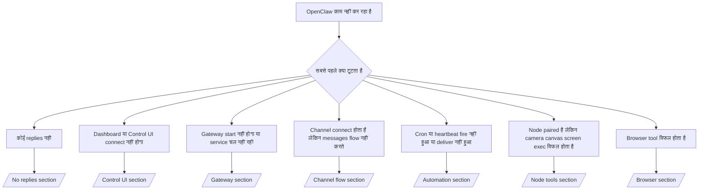

---
read_when:
    - OpenClaw काम नहीं कर रहा है और आपको सुधार का सबसे तेज़ रास्ता चाहिए
    - आप विस्तृत रनबुक्स में जाने से पहले एक ट्रायेज प्रवाह चाहते हैं
summary: OpenClaw के लिए लक्षण-प्रथम समस्या निवारण केंद्र
title: सामान्य समस्या निवारण
x-i18n:
    generated_at: "2026-06-28T23:18:24Z"
    model: gpt-5.5
    postprocess_version: locale-links-v1
    provider: openai
    source_hash: ae1236c73e3a5c9237bd81d603e8dca18c595a8bcbb71f5931bfbf2389b342cd
    source_path: help/troubleshooting.md
    workflow: 16
---

यदि आपके पास केवल 2 मिनट हैं, तो इस पेज को ट्रायेज के मुख्य प्रवेश-द्वार के रूप में उपयोग करें।

## पहले 60 सेकंड

इस सटीक क्रम को इसी क्रम में चलाएँ:

```bash
openclaw status
openclaw status --all
openclaw gateway probe
openclaw gateway status
openclaw doctor
openclaw channels status --probe
openclaw logs --follow
```

एक पंक्ति में अच्छा आउटपुट:

- `openclaw status` → कॉन्फ़िगर किए गए चैनल दिखाता है और कोई स्पष्ट auth त्रुटि नहीं होती।
- `openclaw status --all` → पूरी रिपोर्ट मौजूद और साझा करने योग्य होती है।
- `openclaw gateway probe` → अपेक्षित gateway लक्ष्य पहुँचा जा सकता है (`Reachable: yes`)। `Capability: ...` बताता है कि probe कौन-सा auth स्तर सिद्ध कर सका, और `Read probe: limited - missing scope: operator.read` घटे हुए diagnostics हैं, connect विफलता नहीं।
- `openclaw gateway status` → `Runtime: running`, `Connectivity probe: ok`, और एक विश्वसनीय `Capability: ...` पंक्ति। यदि आपको read-scope RPC प्रमाण भी चाहिए, तो `--require-rpc` उपयोग करें।
- `openclaw doctor` → कोई अवरोधक config/service त्रुटियाँ नहीं।
- `openclaw channels status --probe` → पहुँच योग्य gateway लाइव per-account
  transport स्थिति और probe/audit परिणाम जैसे `works` या `audit ok` लौटाता है; यदि
  gateway पहुँचा नहीं जा सकता, तो command config-only सारांशों पर fallback करता है।
- `openclaw logs --follow` → स्थिर गतिविधि, कोई दोहराती fatal त्रुटियाँ नहीं।

## Assistant सीमित लगता है या tools गायब हैं

यदि assistant फ़ाइलों का निरीक्षण नहीं कर सकता, commands नहीं चला सकता, browser automation का उपयोग नहीं कर सकता, या
अपेक्षित tools नहीं देख सकता, तो पहले effective tool profile जाँचें:

```bash
openclaw status
openclaw status --all
openclaw doctor
```

सामान्य कारण:

- `tools.profile: "messaging"` chat-only agents के लिए जानबूझकर सीमित है।
- `tools.profile: "coding"` repository, file, shell,
  और runtime workflows के लिए सामान्य profile है।
- `tools.profile: "full"` सबसे व्यापक tool set उजागर करता है और इसे केवल
  trusted operator-controlled agents तक सीमित रखना चाहिए।
- Per-agent `agents.list[].tools` overrides किसी एक agent के लिए root
  profile को सीमित या विस्तारित कर सकते हैं।

root या per-agent tool profile बदलें, फिर Gateway को restart या reload करें
और `openclaw status --all` फिर चलाएँ। profile model
और allow/deny overrides के लिए [Tools](/hi/tools) देखें।

## Anthropic long context 429

यदि आपको यह दिखे:
`HTTP 429: rate_limit_error: Extra usage is required for long context requests`,
तो [/gateway/troubleshooting#anthropic-429-extra-usage-required-for-long-context](/hi/gateway/troubleshooting#anthropic-429-extra-usage-required-for-long-context) पर जाएँ।

## स्थानीय OpenAI-compatible backend सीधे काम करता है लेकिन OpenClaw में विफल होता है

यदि आपका स्थानीय या self-hosted `/v1` backend छोटे direct
`/v1/chat/completions` probes का उत्तर देता है लेकिन `openclaw infer model run` या सामान्य
agent turns पर विफल होता है:

1. यदि त्रुटि में `messages[].content` के string की अपेक्षा करने का उल्लेख है, तो
   `models.providers.<provider>.models[].compat.requiresStringContent: true` सेट करें।
2. यदि backend अभी भी केवल OpenClaw agent turns पर विफल होता है, तो
   `models.providers.<provider>.models[].compat.supportsTools: false` सेट करें और फिर प्रयास करें।
3. यदि बहुत छोटे direct calls अभी भी काम करते हैं लेकिन बड़े OpenClaw prompts
   backend को crash कर देते हैं, तो शेष समस्या को upstream model/server सीमा मानें और
   deep runbook में जारी रखें:
   [/gateway/troubleshooting#local-openai-compatible-backend-passes-direct-probes-but-agent-runs-fail](/hi/gateway/troubleshooting#local-openai-compatible-backend-passes-direct-probes-but-agent-runs-fail)

## Plugin install missing openclaw extensions के साथ विफल होता है

यदि install `package.json missing openclaw.extensions` के साथ विफल होता है, तो plugin package
एक पुराने shape का उपयोग कर रहा है जिसे OpenClaw अब स्वीकार नहीं करता।

plugin package में ठीक करें:

1. `package.json` में `openclaw.extensions` जोड़ें।
2. entries को built runtime files पर point करें (आमतौर पर `./dist/index.js`)।
3. plugin को फिर publish करें और `openclaw plugins install <package>` फिर चलाएँ।

उदाहरण:

```json
{
  "name": "@openclaw/my-plugin",
  "version": "1.2.3",
  "openclaw": {
    "extensions": ["./dist/index.js"]
  }
}
```

संदर्भ: [Plugin architecture](/hi/plugins/architecture)

## Install policy plugin installs या updates को block करती है

यदि update पूरा हो जाता है लेकिन plugins पुराने, disabled हैं, या ऐसे messages दिखाते हैं
`blocked by install policy`, `install policy failed closed`, या
`Disabled "<plugin>" after plugin update failure`, तो
`security.installPolicy` जाँचें।

Install policy plugin installs और updates पर चलती है। OpenClaw-owned plugin
versions सामान्यतः OpenClaw release के साथ आगे बढ़ते हैं, इसलिए OpenClaw update को
post-update sync के दौरान matching `@openclaw/*` plugin updates की भी आवश्यकता हो सकती है।

इन व्यापक policy shapes से बचें, जब तक आप matching upgrade
rule भी maintain नहीं करते:

- OpenClaw-owned plugins को किसी एक सटीक पुराने version पर freeze करना, जैसे
  केवल `@openclaw/*@2026.5.3` allow करना।
- केवल source kind के आधार पर block करना, जैसे हर npm, network, या
  `request.mode: "update"` plugin request।
- policy command को optional मानना। जब `security.installPolicy`
  enabled होता है, तो missing, slow, unreadable, या permission-blocked policy executable
  fail closed करता है।
- policy request के `openclawVersion`
  और plugin candidate metadata पर विचार किए बिना plugin versions approve करना।

सुरक्षित policy rules trusted OpenClaw-owned plugin updates को allow करते हैं जब
candidate मौजूदा OpenClaw host के साथ compatible हो, बजाय किसी
single release को हमेशा के लिए pin करने के। यदि आप default रूप से npm को block करते हैं, तो उपयोग किए जाने वाले trusted `@openclaw/*` plugin packages या plugin ids के लिए narrow exception बनाएँ। यदि आप
install और update requests में अंतर करते हैं, तो वही trust rule
`request.mode: "update"` पर लागू करें।

Recovery:

```bash
openclaw doctor --deep
openclaw plugins update --all
openclaw status --all
```

यदि policy जानबूझकर strict है, तो trusted OpenClaw upgrade
window के लिए उसे relax करें, `openclaw plugins update --all` फिर चलाएँ, फिर stricter rule restore करें।
यदि update failure के बाद plugin disabled हुआ था, तो उसका निरीक्षण करें और update सफल होने के बाद ही
उसे re-enable करें:

```bash
openclaw plugins inspect <plugin-id> --runtime --json
openclaw plugins enable <plugin-id>
```

संदर्भ: [Operator install policy](/hi/tools/skills-config#operator-install-policy-securityinstallpolicy)

## Plugin मौजूद है लेकिन suspicious ownership से blocked है

यदि `openclaw doctor`, setup, या startup warnings यह दिखाएँ:

```text
blocked plugin candidate: suspicious ownership (... uid=1000, expected uid=0 or root)
plugin present but blocked
```

तो plugin files उस process से अलग Unix user के स्वामित्व में हैं जो
उन्हें load कर रहा है। plugin config न हटाएँ। file ownership ठीक करें या OpenClaw को
उसी user के रूप में चलाएँ जो state directory का owner है।

Docker installs सामान्यतः `node` (uid `1000`) के रूप में चलते हैं। default Docker
setup के लिए, host bind mounts ठीक करें:

```bash
sudo chown -R 1000:1000 /path/to/openclaw-config /path/to/openclaw-workspace
openclaw doctor --fix
```

यदि आप जानबूझकर OpenClaw को root के रूप में चलाते हैं, तो managed plugin root को
root ownership में ठीक करें:

```bash
sudo chown -R root:root /path/to/openclaw-config/npm
openclaw doctor --fix
```

गहरे docs:

- [Plugin path ownership](/hi/tools/plugin#blocked-plugin-path-ownership)
- [Docker permissions](/hi/install/docker#permissions-and-eacces)

## Decision tree



<AccordionGroup>
  <Accordion title="कोई replies नहीं">
    ```bash
    openclaw status
    openclaw gateway status
    openclaw channels status --probe
    openclaw pairing list --channel <channel> [--account <id>]
    openclaw logs --follow
    ```

    अच्छा आउटपुट ऐसा दिखता है:

    - `Runtime: running`
    - `Connectivity probe: ok`
    - `Capability: read-only`, `write-capable`, या `admin-capable`
    - आपका channel transport connected दिखाता है और, जहाँ supported हो, `channels status --probe` में `works` या `audit ok`
    - Sender approved दिखता है (या DM policy open/allowlist है)

    सामान्य log signatures:

    - `drop guild message (mention required` → mention gating ने Discord में message block किया।
    - `pairing request` → sender unapproved है और DM pairing approval की प्रतीक्षा कर रहा है।
    - channel logs में `blocked` / `allowlist` → sender, room, या group filtered है।

    Deep pages:

    - [/gateway/troubleshooting#no-replies](/hi/gateway/troubleshooting#no-replies)
    - [/channels/troubleshooting](/hi/channels/troubleshooting)
    - [/channels/pairing](/hi/channels/pairing)

  </Accordion>

  <Accordion title="Dashboard या Control UI connect नहीं होगा">
    ```bash
    openclaw status
    openclaw gateway status
    openclaw logs --follow
    openclaw doctor
    openclaw channels status --probe
    ```

    अच्छा आउटपुट ऐसा दिखता है:

    - `Dashboard: http://...` `openclaw gateway status` में दिखता है
    - `Connectivity probe: ok`
    - `Capability: read-only`, `write-capable`, या `admin-capable`
    - logs में कोई auth loop नहीं

    सामान्य log signatures:

    - `device identity required` → HTTP/non-secure context device auth पूरा नहीं कर सकता।
    - `origin not allowed` → browser `Origin` Control UI
      gateway target के लिए allowed नहीं है।
    - retry hints (`canRetryWithDeviceToken=true`) के साथ `AUTH_TOKEN_MISMATCH` → एक trusted device-token retry स्वतः हो सकता है।
    - वह cached-token retry paired
      device token के साथ stored cached scope set को reuse करता है। explicit `deviceToken` / explicit `scopes` callers अपना requested scope set बनाए रखते हैं।
    - async Tailscale Serve Control UI path पर, same
      `{scope, ip}` के failed attempts failure record करने से पहले serialized होते हैं, इसलिए
      दूसरा concurrent bad retry पहले से ही `retry later` दिखा सकता है।
    - localhost
      browser origin से `too many failed authentication attempts (retry later)` → उसी `Origin` से repeated failures temporary रूप से
      locked out हैं; दूसरा localhost origin अलग bucket उपयोग करता है।
    - उस retry के बाद repeated `unauthorized` → गलत token/password, auth mode mismatch, या stale paired device token।
    - `gateway connect failed:` → UI गलत URL/port को target कर रहा है या gateway unreachable है।

    Deep pages:

    - [/gateway/troubleshooting#dashboard-control-ui-connectivity](/hi/gateway/troubleshooting#dashboard-control-ui-connectivity)
    - [/web/control-ui](/hi/web/control-ui)
    - [/gateway/authentication](/hi/gateway/authentication)

  </Accordion>

  <Accordion title="Gateway start नहीं होगा या service installed है लेकिन चल नहीं रही">
    ```bash
    openclaw status
    openclaw gateway status
    openclaw logs --follow
    openclaw doctor
    openclaw channels status --probe
    ```

    अच्छा आउटपुट ऐसा दिखता है:

    - `Service: ... (loaded)`
    - `Runtime: running`
    - `Connectivity probe: ok`
    - `Capability: read-only`, `write-capable`, या `admin-capable`

    सामान्य log signatures:

    - `Gateway start blocked: set gateway.mode=local` या `existing config is missing gateway.mode` → gateway mode remote है, या config file में local-mode stamp गायब है और उसे repair किया जाना चाहिए।
    - `refusing to bind gateway ... without auth` → valid gateway auth path (token/password, या configured होने पर trusted-proxy) के बिना non-loopback bind।
    - `another gateway instance is already listening` या `EADDRINUSE` → port पहले से लिया गया है।

    Deep pages:

    - [/gateway/troubleshooting#gateway-service-not-running](/hi/gateway/troubleshooting#gateway-service-not-running)
    - [/gateway/background-process](/hi/gateway/background-process)
    - [/gateway/configuration](/hi/gateway/configuration)

  </Accordion>

  <Accordion title="Channel कनेक्ट होता है लेकिन संदेश प्रवाहित नहीं होते">
    ```bash
    openclaw status
    openclaw gateway status
    openclaw logs --follow
    openclaw doctor
    openclaw channels status --probe
    ```

    अच्छा आउटपुट ऐसा दिखता है:

    - चैनल ट्रांसपोर्ट कनेक्टेड है।
    - पेयरिंग/allowlist जांचें पास होती हैं।
    - जहां आवश्यक है, mentions पहचाने जाते हैं।

    सामान्य लॉग संकेत:

    - `mention required` → समूह mention gating ने प्रोसेसिंग ब्लॉक की।
    - `pairing` / `pending` → DM भेजने वाले को अभी स्वीकृति नहीं मिली है।
    - `not_in_channel`, `missing_scope`, `Forbidden`, `401/403` → चैनल अनुमति टोकन समस्या।

    गहरे पेज:

    - [/gateway/troubleshooting#channel-connected-messages-not-flowing](/hi/gateway/troubleshooting#channel-connected-messages-not-flowing)
    - [/channels/troubleshooting](/hi/channels/troubleshooting)

  </Accordion>

  <Accordion title="Cron या heartbeat फायर नहीं हुआ या डिलीवर नहीं हुआ">
    ```bash
    openclaw status
    openclaw gateway status
    openclaw cron status
    openclaw cron list
    openclaw cron runs --id <jobId> --limit 20
    openclaw logs --follow
    ```

    अच्छा आउटपुट ऐसा दिखता है:

    - `cron.status` सक्षम दिखाता है, अगले wake के साथ।
    - `cron runs` हाल की `ok` प्रविष्टियां दिखाता है।
    - Heartbeat सक्षम है और active hours के बाहर नहीं है।

    सामान्य लॉग संकेत:

    - `cron: scheduler disabled; jobs will not run automatically` → cron अक्षम है।
    - `heartbeat skipped` with `reason=quiet-hours` → कॉन्फिगर किए गए active hours के बाहर।
    - `heartbeat skipped` with `reason=empty-heartbeat-file` → `HEARTBEAT.md` मौजूद है लेकिन उसमें केवल खाली, टिप्पणी, हेडर, fence, या empty-checklist scaffolding है।
    - `heartbeat skipped` with `reason=no-tasks-due` → `HEARTBEAT.md` task mode सक्रिय है लेकिन किसी भी task interval का समय अभी नहीं हुआ है।
    - `heartbeat skipped` with `reason=alerts-disabled` → सभी heartbeat visibility अक्षम है (`showOk`, `showAlerts`, और `useIndicator` सभी बंद हैं)।
    - `requests-in-flight` → main lane व्यस्त; heartbeat wake स्थगित किया गया।
    - `unknown accountId` → heartbeat डिलीवरी लक्ष्य अकाउंट मौजूद नहीं है।

    गहरे पेज:

    - [/gateway/troubleshooting#cron-and-heartbeat-delivery](/hi/gateway/troubleshooting#cron-and-heartbeat-delivery)
    - [/automation/cron-jobs#troubleshooting](/hi/automation/cron-jobs#troubleshooting)
    - [/gateway/heartbeat](/hi/gateway/heartbeat)

  </Accordion>

  <Accordion title="Node पेयर है लेकिन tool camera canvas screen exec विफल होता है">
    ```bash
    openclaw status
    openclaw gateway status
    openclaw nodes status
    openclaw nodes describe --node <idOrNameOrIp>
    openclaw logs --follow
    ```

    अच्छा आउटपुट ऐसा दिखता है:

    - Node `node` भूमिका के लिए कनेक्टेड और पेयर के रूप में सूचीबद्ध है।
    - जिस कमांड को आप invoke कर रहे हैं उसके लिए capability मौजूद है।
    - tool के लिए अनुमति स्थिति granted है।

    सामान्य लॉग संकेत:

    - `NODE_BACKGROUND_UNAVAILABLE` → node ऐप को foreground में लाएं।
    - `*_PERMISSION_REQUIRED` → OS अनुमति अस्वीकृत/अनुपस्थित थी।
    - `SYSTEM_RUN_DENIED: approval required` → exec approval लंबित है।
    - `SYSTEM_RUN_DENIED: allowlist miss` → कमांड exec allowlist में नहीं है।

    गहरे पेज:

    - [/gateway/troubleshooting#node-paired-tool-fails](/hi/gateway/troubleshooting#node-paired-tool-fails)
    - [/nodes/troubleshooting](/hi/nodes/troubleshooting)
    - [/tools/exec-approvals](/hi/tools/exec-approvals)

  </Accordion>

  <Accordion title="Exec अचानक approval मांगता है">
    ```bash
    openclaw config get tools.exec.host
    openclaw config get tools.exec.security
    openclaw config get tools.exec.ask
    openclaw gateway restart
    ```

    क्या बदला:

    - अगर `tools.exec.host` unset है, तो default `auto` है।
    - sandbox runtime सक्रिय होने पर `host=auto` `sandbox` में resolve होता है, अन्यथा `gateway` में।
    - `host=auto` केवल routing है; no-prompt "YOLO" व्यवहार gateway/node पर `security=full` और `ask=off` से आता है।
    - `gateway` और `node` पर, unset `tools.exec.security` default रूप से `full` होता है।
    - unset `tools.exec.ask` default रूप से `off` होता है।
    - परिणाम: अगर आपको approvals दिख रहे हैं, तो किसी host-local या per-session policy ने exec को मौजूदा defaults से कड़ा कर दिया है।

    वर्तमान default no-approval व्यवहार restore करें:

    ```bash
    openclaw config set tools.exec.host gateway
    openclaw config set tools.exec.security full
    openclaw config set tools.exec.ask off
    openclaw gateway restart
    ```

    अधिक सुरक्षित विकल्प:

    - अगर आप केवल स्थिर host routing चाहते हैं, तो सिर्फ `tools.exec.host=gateway` सेट करें।
    - अगर आप host exec चाहते हैं लेकिन allowlist misses पर फिर भी review चाहते हैं, तो `security=allowlist` के साथ `ask=on-miss` उपयोग करें।
    - अगर आप चाहते हैं कि `host=auto` वापस `sandbox` में resolve हो, तो sandbox mode सक्षम करें।

    सामान्य लॉग संकेत:

    - `Approval required.` → कमांड `/approve ...` का इंतजार कर रहा है।
    - `SYSTEM_RUN_DENIED: approval required` → node-host exec approval लंबित है।
    - `exec host=sandbox requires a sandbox runtime for this session` → implicit/explicit sandbox selection, लेकिन sandbox mode बंद है।

    गहरे पेज:

    - [/tools/exec](/hi/tools/exec)
    - [/tools/exec-approvals](/hi/tools/exec-approvals)
    - [/gateway/security#what-the-audit-checks-high-level](/hi/gateway/security#what-the-audit-checks-high-level)

  </Accordion>

  <Accordion title="Browser tool विफल होता है">
    ```bash
    openclaw status
    openclaw gateway status
    openclaw browser status
    openclaw logs --follow
    openclaw doctor
    ```

    अच्छा आउटपुट ऐसा दिखता है:

    - Browser status `running: true` और चुना हुआ browser/profile दिखाता है।
    - `openclaw` शुरू होता है, या `user` local Chrome tabs देख सकता है।

    सामान्य लॉग संकेत:

    - `unknown command "browser"` या `unknown command 'browser'` → `plugins.allow` सेट है और उसमें `browser` शामिल नहीं है।
    - `Failed to start Chrome CDP on port` → local browser launch विफल हुआ।
    - `browser.executablePath not found` → configured binary path गलत है।
    - `browser.cdpUrl must be http(s) or ws(s)` → configured CDP URL unsupported scheme उपयोग करता है।
    - `browser.cdpUrl has invalid port` → configured CDP URL में खराब या out-of-range port है।
    - `No Chrome tabs found for profile="user"` → Chrome MCP attach profile में कोई open local Chrome tabs नहीं हैं।
    - `Remote CDP for profile "<name>" is not reachable` → configured remote CDP endpoint इस host से reachable नहीं है।
    - `Browser attachOnly is enabled ... not reachable` या `Browser attachOnly is enabled and CDP websocket ... is not reachable` → attach-only profile में कोई live CDP target नहीं है।
    - attach-only या remote CDP profiles पर stale viewport / dark-mode / locale / offline overrides → active control session बंद करने और gateway restart किए बिना emulation state release करने के लिए `openclaw browser stop --browser-profile <name>` चलाएं।

    गहरे पेज:

    - [/gateway/troubleshooting#browser-tool-fails](/hi/gateway/troubleshooting#browser-tool-fails)
    - [/tools/browser#missing-browser-command-or-tool](/hi/tools/browser#missing-browser-command-or-tool)
    - [/tools/browser-linux-troubleshooting](/hi/tools/browser-linux-troubleshooting)
    - [/tools/browser-wsl2-windows-remote-cdp-troubleshooting](/hi/tools/browser-wsl2-windows-remote-cdp-troubleshooting)

  </Accordion>

</AccordionGroup>

## संबंधित

- [FAQ](/hi/help/faq) — अक्सर पूछे जाने वाले प्रश्न
- [Gateway Troubleshooting](/hi/gateway/troubleshooting) — gateway-विशिष्ट समस्याएं
- [Doctor](/hi/gateway/doctor) — स्वचालित health checks और repairs
- [Channel Troubleshooting](/hi/channels/troubleshooting) — चैनल connectivity समस्याएं
- [Automation Troubleshooting](/hi/automation/cron-jobs#troubleshooting) — cron और heartbeat समस्याएं
