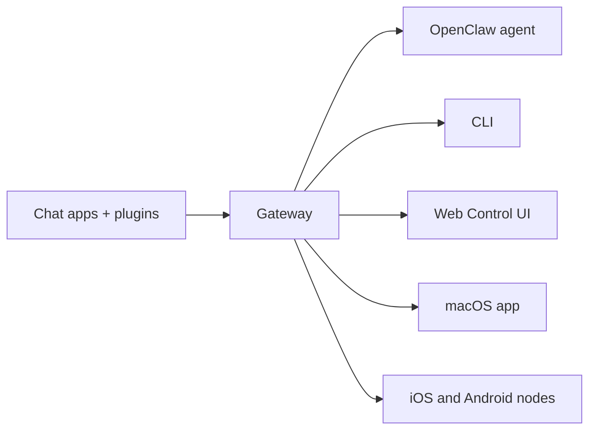

---
read_when:
    - नए उपयोगकर्ताओं को OpenClaw से परिचित कराना
summary: OpenClaw AI एजेंटों के लिए एक मल्टी-चैनल gateway है, जो किसी भी OS पर चलता है।
title: OpenClaw
x-i18n:
    generated_at: "2026-06-28T23:18:20Z"
    model: gpt-5.5
    postprocess_version: locale-links-v1
    provider: openai
    source_hash: fcaa54a0a6d7aa62193fd9f03428bbcbfdcb2c00a184bcd6f49e4e093fefc473
    source_path: index.md
    workflow: 16
---

# OpenClaw 🦞

<p align="center">
    
    
</p>

> _"छिलका उतारो! छिलका उतारो!"_ — शायद एक अंतरिक्ष लॉब्स्टर

<p align="center">
  <strong>Discord, Google Chat, iMessage, Matrix, Microsoft Teams, Signal, Slack, Telegram, WhatsApp, Zalo, और अन्य पर AI एजेंटों के लिए किसी भी OS का Gateway।</strong><br />
  संदेश भेजें, अपनी जेब से एजेंट प्रतिक्रिया पाएं। बिल्ट-इन चैनलों, बंडल किए गए चैनल Plugin, WebChat, और मोबाइल Node पर एक Gateway चलाएं।
</p>

<Columns>
  <Card title="शुरू करें" href="/hi/start/getting-started" icon="rocket">
    OpenClaw इंस्टॉल करें और कुछ ही मिनटों में Gateway शुरू करें।
  </Card>
  <Card title="Onboarding चलाएं" href="/hi/start/wizard" icon="sparkles">
    `openclaw onboard` और पेयरिंग फ़्लो के साथ निर्देशित सेटअप।
  </Card>
  <Card title="Control UI खोलें" href="/hi/web/control-ui" icon="layout-dashboard">
    चैट, कॉन्फ़िग, और सत्रों के लिए ब्राउज़र डैशबोर्ड लॉन्च करें।
  </Card>
</Columns>

## OpenClaw क्या है?

OpenClaw एक **स्व-होस्टेड gateway** है जो आपके पसंदीदा चैट ऐप्स और चैनल इंटरफेस — बिल्ट-इन चैनलों तथा Discord, Google Chat, iMessage, Matrix, Microsoft Teams, Signal, Slack, Telegram, WhatsApp, Zalo, और अन्य जैसे बंडल किए गए या बाहरी चैनल Plugin — को AI कोडिंग एजेंटों से जोड़ता है। आप अपनी मशीन (या सर्वर) पर एक ही Gateway प्रक्रिया चलाते हैं, और यह आपके मैसेजिंग ऐप्स और हमेशा उपलब्ध AI सहायक के बीच पुल बन जाता है।

**यह किसके लिए है?** उन डेवलपरों और पावर उपयोगकर्ताओं के लिए जो ऐसा निजी AI सहायक चाहते हैं जिसे वे कहीं से भी संदेश भेज सकें — अपने डेटा पर नियंत्रण छोड़े बिना या किसी होस्टेड सेवा पर निर्भर हुए बिना।

**इसे अलग क्या बनाता है?**

- **स्व-होस्टेड**: आपके हार्डवेयर पर, आपके नियमों से चलता है
- **मल्टी-चैनल**: एक Gateway बिल्ट-इन चैनलों और बंडल किए गए या बाहरी चैनल Plugin को एक साथ सेवा देता है
- **एजेंट-नेटिव**: टूल उपयोग, सत्र, मेमोरी, और मल्टी-एजेंट रूटिंग वाले कोडिंग एजेंटों के लिए बनाया गया
- **ओपन सोर्स**: MIT लाइसेंस वाला, समुदाय-चालित

**आपको क्या चाहिए?** Node 24 (अनुशंसित), या संगतता के लिए Node 22 LTS (`22.19+`), आपके चुने गए प्रोवाइडर की API कुंजी, और 5 मिनट। सर्वोत्तम गुणवत्ता और सुरक्षा के लिए, उपलब्ध सबसे मजबूत नवीनतम-पीढ़ी का मॉडल उपयोग करें।

## यह कैसे काम करता है



Gateway सत्रों, रूटिंग, और चैनल कनेक्शनों के लिए सत्य का एकमात्र स्रोत है।

## मुख्य क्षमताएं

<Columns>
  <Card title="मल्टी-चैनल gateway" icon="network" href="/hi/channels">
    एक ही Gateway प्रक्रिया के साथ Discord, iMessage, Signal, Slack, Telegram, WhatsApp, WebChat, और अन्य।
  </Card>
  <Card title="Plugin चैनल" icon="plug" href="/hi/tools/plugin">
    बंडल किए गए Plugin सामान्य मौजूदा रिलीज़ में Matrix, Nostr, Twitch, Zalo, और अन्य जोड़ते हैं।
  </Card>
  <Card title="मल्टी-एजेंट रूटिंग" icon="route" href="/hi/concepts/multi-agent">
    प्रति एजेंट, वर्कस्पेस, या प्रेषक अलग-थलग सत्र।
  </Card>
  <Card title="मीडिया समर्थन" icon="image" href="/hi/nodes/images">
    इमेज, ऑडियो, और दस्तावेज़ भेजें और प्राप्त करें।
  </Card>
  <Card title="Web Control UI" icon="monitor" href="/hi/web/control-ui">
    चैट, कॉन्फ़िग, सत्रों, और Node के लिए ब्राउज़र डैशबोर्ड।
  </Card>
  <Card title="मोबाइल Node" icon="smartphone" href="/hi/nodes">
    Canvas, कैमरा, और वॉइस-सक्षम वर्कफ़्लो के लिए iOS और Android Node पेयर करें।
  </Card>
</Columns>

## त्वरित शुरुआत

<Steps>
  <Step title="OpenClaw इंस्टॉल करें">
    ```bash
    npm install -g openclaw@latest
    ```
  </Step>
  <Step title="Onboard करें और सेवा इंस्टॉल करें">
    ```bash
    openclaw onboard --install-daemon
    ```
  </Step>
  <Step title="चैट करें">
    अपने ब्राउज़र में Control UI खोलें और संदेश भेजें:

    ```bash
    openclaw dashboard
    ```

    या कोई चैनल कनेक्ट करें ([Telegram](/hi/channels/telegram) सबसे तेज़ है) और अपने फ़ोन से चैट करें।

  </Step>
</Steps>

पूरा इंस्टॉल और dev सेटअप चाहिए? [शुरू करना](/hi/start/getting-started) देखें।

## डैशबोर्ड

Gateway शुरू होने के बाद ब्राउज़र Control UI खोलें।

- स्थानीय डिफ़ॉल्ट: [http://127.0.0.1:18789/](http://127.0.0.1:18789/)
- रिमोट एक्सेस: [वेब सतहें](/hi/web) और [Tailscale](/hi/gateway/tailscale)

<p align="center">
  
</p>

## कॉन्फ़िगरेशन (वैकल्पिक)

कॉन्फ़िग `~/.openclaw/openclaw.json` पर रहता है।

- यदि आप **कुछ नहीं करते**, OpenClaw प्रति-प्रेषक सत्रों के साथ बंडल किए गए OpenClaw एजेंट रनटाइम का उपयोग करता है।
- यदि आप इसे लॉक डाउन करना चाहते हैं, तो `channels.whatsapp.allowFrom` और (ग्रुप के लिए) मेंशन नियमों से शुरू करें।

उदाहरण:

```json5
{
  channels: {
    whatsapp: {
      allowFrom: ["+15555550123"],
      groups: { "*": { requireMention: true } },
    },
  },
  messages: { groupChat: { mentionPatterns: ["@openclaw"] } },
}
```

## यहां से शुरू करें

<Columns>
  <Card title="डॉक्स हब" href="/hi/start/hubs" icon="book-open">
    उपयोग मामले के अनुसार व्यवस्थित सभी डॉक्स और गाइड।
  </Card>
  <Card title="कॉन्फ़िगरेशन" href="/hi/gateway/configuration" icon="settings">
    मुख्य Gateway सेटिंग्स, टोकन, और प्रोवाइडर कॉन्फ़िग।
  </Card>
  <Card title="रिमोट एक्सेस" href="/hi/gateway/remote" icon="globe">
    SSH और tailnet एक्सेस पैटर्न।
  </Card>
  <Card title="चैनल" href="/hi/channels/telegram" icon="message-square">
    Feishu, Microsoft Teams, WhatsApp, Telegram, Discord, और अन्य के लिए चैनल-विशिष्ट सेटअप।
  </Card>
  <Card title="Node" href="/hi/nodes" icon="smartphone">
    पेयरिंग, Canvas, कैमरा, और डिवाइस कार्रवाइयों के साथ iOS और Android Node।
  </Card>
  <Card title="सहायता" href="/hi/help" icon="life-buoy">
    सामान्य सुधार और ट्रबलशूटिंग प्रवेश बिंदु।
  </Card>
</Columns>

## और जानें

<Columns>
  <Card title="पूरी फीचर सूची" href="/hi/concepts/features" icon="list">
    पूरी चैनल, रूटिंग, और मीडिया क्षमताएं।
  </Card>
  <Card title="मल्टी-एजेंट रूटिंग" href="/hi/concepts/multi-agent" icon="route">
    वर्कस्पेस आइसोलेशन और प्रति-एजेंट सत्र।
  </Card>
  <Card title="सुरक्षा" href="/hi/gateway/security" icon="shield">
    टोकन, allowlist, और सुरक्षा नियंत्रण।
  </Card>
  <Card title="ट्रबलशूटिंग" href="/hi/gateway/troubleshooting" icon="wrench">
    Gateway डायग्नोस्टिक्स और सामान्य त्रुटियां।
  </Card>
  <Card title="परिचय और श्रेय" href="/hi/reference/credits" icon="info">
    प्रोजेक्ट की उत्पत्ति, योगदानकर्ता, और लाइसेंस।
  </Card>
</Columns>
