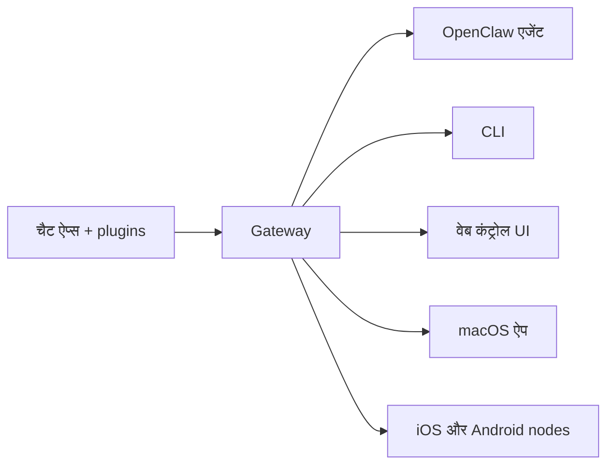

---
read_when:
    - नए उपयोगकर्ताओं को OpenClaw से परिचित कराना
summary: OpenClaw AI एजेंटों के लिए एक मल्टी-चैनल Gateway है, जो किसी भी OS पर चलता है।
title: OpenClaw
x-i18n:
    generated_at: "2026-07-19T08:54:56Z"
    model: gpt-5.6
    postprocess_version: locale-links-v1
    prompt_version: 32
    provider: openai
    source_hash: fe97e7299be4855fd9af21838e0626b5a5c8aafe46d982859e9033f0efec2443
    source_path: index.md
    workflow: 16
---

# OpenClaw 🦞

<p align="center">
    
    
</p>

> _"एक्सफ़ोलिएट! एक्सफ़ोलिएट!"_ — शायद कोई अंतरिक्षीय लॉब्स्टर

<p align="center">
  <strong>Discord, Google Chat, iMessage, Matrix, Microsoft Teams, Signal, Slack, Telegram, WhatsApp, Zalo और अन्य पर AI एजेंटों के लिए किसी भी OS का Gateway।</strong><br />
  संदेश भेजें और अपनी जेब में ही एजेंट से उत्तर पाएँ। चैनल plugins, WebChat और मोबाइल nodes के लिए एक Gateway चलाएँ।
</p>

<Columns>
  <Card title="शुरू करें" href="/hi/start/getting-started" icon="rocket">
    OpenClaw इंस्टॉल करें और कुछ ही मिनटों में Gateway शुरू करें।
  </Card>
  <Card title="ऑनबोर्डिंग चलाएँ" href="/hi/start/wizard" icon="list-checks">
    `openclaw onboard` और पेयरिंग प्रवाहों के साथ निर्देशित सेटअप।
  </Card>
  <Card title="चैनल कनेक्ट करें" href="/hi/channels" icon="message-circle">
    कहीं से भी चैट करने के लिए Discord, Signal, Telegram, WhatsApp और अन्य सेवाओं को लिंक करें।
  </Card>
  <Card title="कंट्रोल UI खोलें" href="/hi/web/control-ui" icon="layout-dashboard">
    चैट, कॉन्फ़िगरेशन और सत्रों के लिए ब्राउज़र डैशबोर्ड लॉन्च करें।
  </Card>
</Columns>

## दस्तावेज़ ब्राउज़ करें

मोबाइल ब्राउज़र पूर्ण डेस्कटॉप टैब बार के बिना अनुभाग मेन्यू दिखा सकते हैं। पेज के मुख्य भाग से उन्हीं शीर्ष-स्तरीय दस्तावेज़ क्षेत्रों तक पहुँचने के लिए
इन हब लिंक का उपयोग करें।

<Columns>
  <Card title="शुरू करें" href="/hi" icon="rocket">
    अवलोकन, प्रदर्शन, शुरुआती चरण और सेटअप गाइड।
  </Card>
  <Card title="इंस्टॉल करें" href="/hi/install" icon="download">
    इंस्टॉलेशन पथ, अपडेट, कंटेनर, होस्टिंग और उन्नत सेटअप।
  </Card>
  <Card title="चैनल" href="/hi/channels" icon="messages-square">
    मैसेजिंग चैनल, पेयरिंग, रूटिंग, एक्सेस समूह और चैनल QA।
  </Card>
  <Card title="एजेंट" href="/hi/concepts/architecture" icon="bot">
    आर्किटेक्चर, सत्र, संदर्भ, मेमोरी और मल्टी-एजेंट रूटिंग।
  </Card>
  <Card title="क्षमताएँ" href="/hi/tools" icon="wand-sparkles">
    टूल, Skills, Cron, webhooks और ऑटोमेशन क्षमताएँ।
  </Card>
  <Card title="ClawHub" href="/clawhub" icon="store">
    Plugin मार्केटप्लेस, प्रकाशन, चयन और विश्वसनीयता संबंधी मार्गदर्शन।
  </Card>
  <Card title="मॉडल" href="/hi/providers" icon="brain">
    प्रदाता, मॉडल कॉन्फ़िगरेशन, फ़ेलओवर और स्थानीय मॉडल सेवाएँ।
  </Card>
  <Card title="प्लेटफ़ॉर्म" href="/hi/platforms" icon="monitor-smartphone">
    macOS, Windows, iOS, Android, nodes और वेब इंटरफ़ेस।
  </Card>
  <Card title="Gateway और संचालन" href="/hi/gateway" icon="server">
    Gateway कॉन्फ़िगरेशन, सुरक्षा, निदान और संचालन।
  </Card>
  <Card title="संदर्भ" href="/hi/cli" icon="terminal">
    CLI संदर्भ, स्कीमा, RPC, रिलीज़ नोट्स और टेम्पलेट।
  </Card>
  <Card title="सहायता" href="/hi/help" icon="life-buoy">
    समस्या निवारण, अक्सर पूछे जाने वाले प्रश्न, परीक्षण, निदान और परिवेश जाँच।
  </Card>
</Columns>

## OpenClaw क्या है?

OpenClaw एक **स्वयं होस्ट किया गया Gateway** है, जो चैनल plugins के माध्यम से आपके पसंदीदा चैट ऐप्स — Discord, Google Chat, iMessage, Matrix, Microsoft Teams, Signal, Slack, Telegram, WhatsApp, Zalo और अन्य — को AI कोडिंग एजेंटों से जोड़ता है। आप अपनी मशीन (या सर्वर) पर एक Gateway प्रक्रिया चलाते हैं, जो आपके मैसेजिंग ऐप्स और हमेशा उपलब्ध AI सहायक के बीच सेतु बन जाती है।

**यह किसके लिए है?** उन डेवलपर और उन्नत उपयोगकर्ताओं के लिए, जो एक व्यक्तिगत AI सहायक को कहीं से भी संदेश भेजना चाहते हैं — अपने डेटा पर नियंत्रण छोड़े बिना या किसी होस्ट की गई सेवा पर निर्भर हुए बिना।

**इसे अलग क्या बनाता है?**

- **स्वयं होस्ट किया गया**: आपके हार्डवेयर पर, आपके नियमों के अनुसार चलता है
- **मल्टी-चैनल**: एक Gateway प्रत्येक कॉन्फ़िगर किए गए चैनल Plugin को एक साथ सेवा देता है
- **एजेंट-केंद्रित**: टूल उपयोग, सत्र, मेमोरी और मल्टी-एजेंट रूटिंग वाले कोडिंग एजेंटों के लिए निर्मित
- **ओपन सोर्स**: MIT लाइसेंस प्राप्त और समुदाय-संचालित

**आपको क्या चाहिए?** Node 24.15+ (अनुशंसित), संगतता के लिए Node 22 LTS (`22.22.3+`), या Node 25.9+, आपके चुने हुए प्रदाता की API कुंजी और 5 मिनट। सर्वोत्तम गुणवत्ता और सुरक्षा के लिए उपलब्ध नवीनतम पीढ़ी के सबसे सक्षम मॉडल का उपयोग करें।

## यह कैसे काम करता है



सत्रों, रूटिंग और चैनल कनेक्शन के लिए Gateway सत्य का एकमात्र स्रोत है।

## प्रमुख क्षमताएँ

<Columns>
  <Card title="मल्टी-चैनल Gateway" icon="network" href="/hi/channels">
    एक ही Gateway प्रक्रिया के साथ Discord, iMessage, Signal, Slack, Telegram, WhatsApp, WebChat और अन्य सेवाएँ।
  </Card>
  <Card title="Plugin चैनल" icon="plug" href="/hi/tools/plugin">
    चैनल plugins Matrix, Nostr, Twitch, Zalo और अन्य सेवाएँ जोड़ते हैं; आधिकारिक plugins आवश्यकता होने पर इंस्टॉल होते हैं।
  </Card>
  <Card title="मल्टी-एजेंट रूटिंग" icon="route" href="/hi/concepts/multi-agent">
    प्रत्येक एजेंट, वर्कस्पेस या प्रेषक के लिए पृथक सत्र।
  </Card>
  <Card title="मीडिया समर्थन" icon="image" href="/hi/nodes/images">
    चित्र, ऑडियो और दस्तावेज़ भेजें और प्राप्त करें।
  </Card>
  <Card title="वेब कंट्रोल UI" icon="monitor" href="/hi/web/control-ui">
    चैट, कॉन्फ़िगरेशन, सत्रों और nodes के लिए ब्राउज़र डैशबोर्ड।
  </Card>
  <Card title="मोबाइल nodes" icon="smartphone" href="/hi/nodes">
    Canvas, कैमरा और आवाज़-सक्षम कार्यप्रवाहों के लिए iOS और Android nodes पेयर करें।
  </Card>
</Columns>

## त्वरित शुरुआत

<Steps>
  <Step title="OpenClaw इंस्टॉल करें">
    ```bash
    npm install -g openclaw@latest
    ```
  </Step>
  <Step title="ऑनबोर्डिंग करें और सेवा इंस्टॉल करें">
    ```bash
    openclaw onboard --install-daemon
    ```
  </Step>
  <Step title="चैट करें">
    अपने ब्राउज़र में कंट्रोल UI खोलें और संदेश भेजें:

    ```bash
    openclaw dashboard
    ```

    या कोई चैनल कनेक्ट करें ([Telegram](/hi/channels/telegram) सबसे तेज़ है) और अपने फ़ोन से चैट करें।

  </Step>
</Steps>

पूर्ण इंस्टॉलेशन और डेवलपमेंट सेटअप चाहिए? [शुरुआत करना](/hi/start/getting-started) देखें।

## डैशबोर्ड

Gateway शुरू होने के बाद ब्राउज़र कंट्रोल UI खोलें।

- स्थानीय डिफ़ॉल्ट: [http://127.0.0.1:18789/](http://127.0.0.1:18789/)
- रिमोट एक्सेस: [वेब इंटरफ़ेस](/hi/web) और [Tailscale](/hi/gateway/tailscale)

<p align="center">
  
</p>

## कॉन्फ़िगरेशन (वैकल्पिक)

कॉन्फ़िगरेशन `~/.openclaw/openclaw.json` पर स्थित है।

- यदि आप **कुछ नहीं करते**, तो OpenClaw बंडल किए गए OpenClaw एजेंट रनटाइम का उपयोग करता है; सीधे संदेश एजेंट का मुख्य सत्र साझा करते हैं और प्रत्येक समूह चैट का अपना सत्र होता है।
- यदि आप इसे प्रतिबंधित करना चाहते हैं, तो `channels.whatsapp.allowFrom` और (समूहों के लिए) उल्लेख नियमों से शुरुआत करें।

उदाहरण:

```json5
{
  channels: {
    whatsapp: {
      allowFrom: ["+15555550123"],
      groups: { "*": { requireMention: true } },
    },
  },
  messages: { groupChat: { mentionPatterns: ["@openclaw"] } },
}
```

## यहाँ से शुरू करें

<Columns>
  <Card title="दस्तावेज़ हब" href="/hi/start/hubs" icon="book-open">
    उपयोग के अनुसार व्यवस्थित सभी दस्तावेज़ और गाइड।
  </Card>
  <Card title="कॉन्फ़िगरेशन" href="/hi/gateway/configuration" icon="settings">
    मुख्य Gateway सेटिंग्स, टोकन और प्रदाता कॉन्फ़िगरेशन।
  </Card>
  <Card title="रिमोट एक्सेस" href="/hi/gateway/remote" icon="globe">
    SSH और tailnet एक्सेस पैटर्न।
  </Card>
  <Card title="चैनल" href="/hi/channels/telegram" icon="message-square">
    Discord, Feishu, Microsoft Teams, Telegram, WhatsApp और अन्य के लिए चैनल-विशिष्ट सेटअप।
  </Card>
  <Card title="Nodes" href="/hi/nodes" icon="smartphone">
    पेयरिंग, Canvas, कैमरा और डिवाइस कार्रवाइयों वाले iOS और Android nodes।
  </Card>
  <Card title="सहायता" href="/hi/help" icon="life-buoy">
    सामान्य सुधारों और समस्या निवारण का प्रवेश बिंदु।
  </Card>
</Columns>

## और जानें

<Columns>
  <Card title="सुविधाओं की पूरी सूची" href="/hi/concepts/features" icon="list">
    संपूर्ण चैनल, रूटिंग और मीडिया क्षमताएँ।
  </Card>
  <Card title="मल्टी-एजेंट रूटिंग" href="/hi/concepts/multi-agent" icon="route">
    वर्कस्पेस पृथक्करण और प्रत्येक एजेंट के लिए अलग सत्र।
  </Card>
  <Card title="सुरक्षा" href="/hi/gateway/security" icon="shield">
    टोकन, अनुमत-सूचियाँ और सुरक्षा नियंत्रण।
  </Card>
  <Card title="समस्या निवारण" href="/hi/gateway/troubleshooting" icon="wrench">
    Gateway निदान और सामान्य त्रुटियाँ।
  </Card>
  <Card title="परिचय और श्रेय" href="/hi/reference/credits" icon="info">
    परियोजना की उत्पत्ति, योगदानकर्ता और लाइसेंस।
  </Card>
</Columns>
