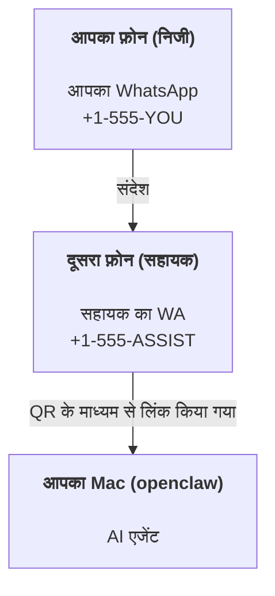

---
read_when:
    - नए सहायक इंस्टेंस का ऑनबोर्डिंग
    - सुरक्षा/अनुमति संबंधी प्रभावों की समीक्षा करना
summary: सुरक्षा संबंधी सावधानियों के साथ OpenClaw को निजी सहायक के रूप में चलाने की शुरू से अंत तक मार्गदर्शिका
title: निजी सहायक सेटअप
x-i18n:
    generated_at: "2026-07-19T09:52:48Z"
    model: gpt-5.6
    postprocess_version: locale-links-v1
    prompt_version: 32
    provider: openai
    source_hash: e8c34e31314f55647059fd600935330110add27b338a675bc0ce1529bebb207d
    source_path: start/openclaw.md
    workflow: 16
---

OpenClaw एक स्व-होस्टेड Gateway है, जो Discord, Google Chat, iMessage, Matrix, Microsoft Teams, Signal, Slack, Telegram, WhatsApp, Zalo और अन्य सेवाओं को AI एजेंटों से जोड़ता है। यह मार्गदर्शिका "व्यक्तिगत सहायक" सेटअप के बारे में है: एक समर्पित WhatsApp नंबर, जो आपके हमेशा सक्रिय AI सहायक की तरह काम करता है।

## पहले सुरक्षा

किसी एजेंट को चैनल देने से वह आपकी मशीन पर कमांड चला सकता है (आपकी टूल नीति के आधार पर), आपके कार्यस्थान में फ़ाइलें पढ़/लिख सकता है और किसी भी कनेक्टेड चैनल के माध्यम से संदेश वापस भेज सकता है। शुरुआत में सावधानी बरतें:

- हमेशा `channels.whatsapp.allowFrom` सेट करें (अपने निजी Mac पर इसे कभी भी पूरी दुनिया के लिए खुला न चलाएँ)।
- सहायक के लिए एक समर्पित WhatsApp नंबर का उपयोग करें।
- Heartbeats डिफ़ॉल्ट रूप से हर 30 मिनट में चलते हैं। जब तक आपको सेटअप पर भरोसा न हो, `agents.defaults.heartbeat.every: "0m"` सेट करके इन्हें अक्षम रखें।

## पूर्वापेक्षाएँ

- OpenClaw इंस्टॉल और ऑनबोर्ड किया हुआ हो—यदि आपने अभी तक ऐसा नहीं किया है, तो [आरंभ करना](/hi/start/getting-started) देखें
- सहायक के लिए दूसरा फ़ोन नंबर (SIM/eSIM/प्रीपेड)

## दो फ़ोन वाला सेटअप (अनुशंसित)

आपको यह चाहिए:



यदि आप अपने निजी WhatsApp को OpenClaw से लिंक करते हैं, तो आपको मिलने वाला प्रत्येक संदेश "एजेंट इनपुट" बन जाता है। आमतौर पर आप ऐसा नहीं चाहेंगे।

## 5 मिनट में त्वरित शुरुआत

1. WhatsApp Web को पेयर करें (QR दिखाई देगा; इसे सहायक वाले फ़ोन से स्कैन करें):

```bash
openclaw channels login
```

2. Gateway शुरू करें (इसे चलता रहने दें):

```bash
openclaw gateway --port 18789
```

3. `~/.openclaw/openclaw.json` में न्यूनतम कॉन्फ़िगरेशन रखें:

```json5
{
  gateway: { mode: "local" },
  channels: { whatsapp: { allowFrom: ["+15555550123"] } },
}
```

अब अनुमति-सूची में शामिल अपने फ़ोन से सहायक के नंबर पर संदेश भेजें।

ऑनबोर्डिंग पूरी होने पर OpenClaw अपने आप डैशबोर्ड खोलता है और एक साफ़ (बिना टोकन वाला) लिंक दिखाता है। यदि डैशबोर्ड प्रमाणीकरण माँगे, तो कॉन्फ़िगर किया गया साझा सीक्रेट Control UI की सेटिंग्स में पेस्ट करें। ऑनबोर्डिंग डिफ़ॉल्ट रूप से टोकन (`gateway.auth.token`) का उपयोग करती है, लेकिन यदि आपने `gateway.auth.mode` को `password` में बदला है, तो पासवर्ड प्रमाणीकरण भी काम करता है। बाद में दोबारा खोलने के लिए: `openclaw dashboard`।

## एजेंट को कार्यस्थान दें (AGENTS)

OpenClaw अपने कार्यस्थान की डायरेक्टरी से संचालन निर्देश और "मेमोरी" पढ़ता है।

डिफ़ॉल्ट रूप से OpenClaw एजेंट के कार्यस्थान के रूप में `~/.openclaw/workspace` का उपयोग करता है और ऑनबोर्डिंग या एजेंट के पहली बार चलने पर इसे (साथ ही प्रारंभिक `AGENTS.md`, `SOUL.md`, `TOOLS.md`, `IDENTITY.md`, `USER.md`, `HEARTBEAT.md`) अपने आप बनाता है। `BOOTSTRAP.md` केवल बिल्कुल नए कार्यस्थान के लिए बनाई जाती है और इसे मिटाने के बाद यह दोबारा नहीं आनी चाहिए। `MEMORY.md` वैकल्पिक है और कभी भी अपने आप नहीं बनाई जाती; मौजूद होने पर यह सामान्य सत्रों के लिए लोड होती है। उप-एजेंट सत्र केवल `AGENTS.md` और `TOOLS.md` को इंजेक्ट करते हैं।

<Tip>
इस फ़ोल्डर को OpenClaw की मेमोरी की तरह मानें और इसे एक git रिपॉज़िटरी (आदर्श रूप से निजी) बनाएँ, ताकि आपकी `AGENTS.md` और मेमोरी फ़ाइलों का बैकअप रहे। यदि git इंस्टॉल है, तो बिल्कुल नए कार्यस्थान `git init` के साथ अपने आप आरंभ किए जाते हैं।
</Tip>

पूरा ऑनबोर्डिंग विज़ार्ड चलाए बिना कार्यस्थान और कॉन्फ़िगरेशन फ़ोल्डर बनाने के लिए:

```bash
openclaw setup --baseline
```

(केवल `openclaw setup`, `openclaw onboard` का उपनाम है और पूरा इंटरैक्टिव विज़ार्ड चलाता है।)

कार्यस्थान की पूरी संरचना और बैकअप मार्गदर्शिका: [एजेंट कार्यस्थान](/hi/concepts/agent-workspace)
मेमोरी कार्यप्रवाह: [मेमोरी](/hi/concepts/memory)

वैकल्पिक: `agents.defaults.workspace` की मदद से कोई दूसरा कार्यस्थान चुनें (`~` समर्थित है)।

```json5
{
  agents: {
    defaults: {
      workspace: "~/.openclaw/workspace",
    },
  },
}
```

यदि आप पहले से किसी रिपॉज़िटरी से अपनी कार्यस्थान फ़ाइलें उपलब्ध कराते हैं, तो बूटस्ट्रैप फ़ाइलों का निर्माण पूरी तरह अक्षम कर सकते हैं:

```json5
{
  agents: {
    defaults: {
      skipBootstrap: true,
    },
  },
}
```

## वह कॉन्फ़िगरेशन जो इसे "सहायक" बनाता है

OpenClaw डिफ़ॉल्ट रूप से एक अच्छा सहायक सेटअप देता है, लेकिन आमतौर पर आप इनमें बदलाव करना चाहेंगे:

- [`SOUL.md`](/hi/concepts/soul) में व्यक्तित्व/निर्देश
- सोचने के डिफ़ॉल्ट विकल्प (यदि वांछित हो)
- heartbeats (जब आपको इस पर भरोसा हो जाए)

उदाहरण:

```json5
{
  logging: { level: "info" },
  agents: {
    defaults: {
      model: { primary: "anthropic/claude-opus-4-8" },
      workspace: "~/.openclaw/workspace",
      thinkingDefault: "high",
      timeoutSeconds: 1800,
      // 0 से शुरू करें; बाद में सक्षम करें।
      heartbeat: { every: "0m" },
    },
    list: [
      {
        id: "main",
        default: true,
        groupChat: {
          mentionPatterns: ["@openclaw", "openclaw"],
        },
      },
    ],
  },
  channels: {
    whatsapp: {
      allowFrom: ["+15555550123"],
      groups: {
        "*": { requireMention: true },
      },
    },
  },
  session: {
    scope: "per-sender",
    resetTriggers: ["/new", "/reset"],
    reset: {
      mode: "daily",
      atHour: 4,
      idleMinutes: 10080,
    },
  },
}
```

## सत्र और मेमोरी

- सत्र पंक्तियाँ, ट्रांसक्रिप्ट पंक्तियाँ और मेटाडेटा (टोकन उपयोग, अंतिम रूट आदि): `~/.openclaw/agents/<agentId>/agent/openclaw-agent.sqlite`
- लेगेसी/संग्रहित ट्रांसक्रिप्ट आर्टिफ़ैक्ट: `~/.openclaw/agents/<agentId>/sessions/`
- लेगेसी पंक्ति माइग्रेशन स्रोत: `~/.openclaw/agents/<agentId>/sessions/sessions.json`
- `/new` या `/reset` उस चैट के लिए नया सत्र शुरू करता है (`session.resetTriggers` के माध्यम से कॉन्फ़िगर किया जा सकता है)। इसे अकेले भेजने पर OpenClaw मॉडल को बुलाए बिना रीसेट की पुष्टि करता है।
- `/compact [instructions]` सत्र के संदर्भ को संकुचित करता है और शेष संदर्भ बजट की जानकारी देता है।

## Heartbeats (सक्रिय मोड)

डिफ़ॉल्ट रूप से OpenClaw निम्न प्रॉम्प्ट के साथ हर 30 मिनट में एक Heartbeat चलाता है:
`Read HEARTBEAT.md if it exists (workspace context). Follow it strictly. Do not infer or repeat old tasks from prior chats. If nothing needs attention, reply HEARTBEAT_OK.`
अक्षम करने के लिए `agents.defaults.heartbeat.every: "0m"` सेट करें।

- यदि `HEARTBEAT.md` मौजूद है, लेकिन प्रभावी रूप से खाली है (केवल खाली पंक्तियाँ, Markdown/HTML टिप्पणियाँ, `# Heading` जैसे Markdown शीर्षक, फ़ेंस मार्कर या खाली चेकलिस्ट स्टब), तो API कॉल बचाने के लिए OpenClaw Heartbeat रन छोड़ देता है।
- यदि फ़ाइल मौजूद नहीं है, तब भी Heartbeat चलता है और मॉडल तय करता है कि क्या करना है।
- यदि एजेंट `HEARTBEAT_OK` के साथ उत्तर देता है (वैकल्पिक रूप से थोड़ी अतिरिक्त सामग्री के साथ; `agents.defaults.heartbeat.ackMaxChars` देखें), तो OpenClaw उस Heartbeat की आउटबाउंड डिलीवरी रोक देता है।
- डिफ़ॉल्ट रूप से DM-शैली वाले `user:<id>` लक्ष्यों पर Heartbeat डिलीवरी की अनुमति होती है। Heartbeat रन सक्रिय रखते हुए सीधे लक्ष्य पर डिलीवरी रोकने के लिए `agents.defaults.heartbeat.directPolicy: "block"` सेट करें।
- Heartbeats एजेंट के पूरे टर्न चलाते हैं—कम अंतराल अधिक टोकन खर्च करते हैं।

```json5
{
  agents: {
    defaults: {
      heartbeat: { every: "30m" },
    },
  },
}
```

## मीडिया भेजना और प्राप्त करना

इनबाउंड अटैचमेंट (चित्र/ऑडियो/दस्तावेज़) टेम्पलेट के माध्यम से आपके कमांड को उपलब्ध कराए जा सकते हैं:

- `{{MediaPath}}` (स्थानीय अस्थायी फ़ाइल पथ)
- `{{MediaUrl}}` (छद्म-URL)
- `{{Transcript}}` (यदि ऑडियो ट्रांसक्रिप्शन सक्षम है)

एजेंट से भेजे जाने वाले आउटबाउंड अटैचमेंट संदेश टूल या उत्तर पेलोड में संरचित मीडिया फ़ील्ड का उपयोग करते हैं, जैसे `media`, `mediaUrl`, `mediaUrls`, `path` या `filePath`। संदेश टूल के आर्ग्युमेंट का उदाहरण:

```json
{
  "message": "यह रहा स्क्रीनशॉट।",
  "mediaUrl": "https://example.com/screenshot.png"
}
```

OpenClaw टेक्स्ट के साथ संरचित मीडिया भेजता है। लेगेसी अंतिम सहायक उत्तरों को संगतता के लिए अब भी सामान्यीकृत किया जा सकता है, लेकिन टूल आउटपुट, ब्राउज़र आउटपुट, स्ट्रीमिंग ब्लॉक और संदेश कार्रवाइयाँ टेक्स्ट को अटैचमेंट कमांड के रूप में पार्स नहीं करतीं।

स्थानीय पथ का व्यवहार एजेंट के समान फ़ाइल-पठन विश्वास मॉडल का पालन करता है:

- यदि `tools.fs.workspaceOnly`, `true` है, तो आउटबाउंड स्थानीय मीडिया पथ OpenClaw के अस्थायी रूट, मीडिया कैश, एजेंट कार्यस्थान के पथों और सैंडबॉक्स द्वारा बनाई गई फ़ाइलों तक सीमित रहते हैं।
- यदि `tools.fs.workspaceOnly`, `false` है, तो आउटबाउंड स्थानीय मीडिया उन होस्ट-स्थानीय फ़ाइलों का उपयोग कर सकता है जिन्हें पढ़ने की अनुमति एजेंट के पास पहले से है।
- स्थानीय पथ निरपेक्ष, कार्यस्थान-सापेक्ष या `~/` के साथ होम-सापेक्ष हो सकते हैं।
- होस्ट-स्थानीय प्रेषण में भी केवल मीडिया और सुरक्षित दस्तावेज़ प्रकारों की अनुमति होती है (चित्र, ऑडियो, वीडियो, PDF, Office दस्तावेज़ और सत्यापित टेक्स्ट दस्तावेज़, जैसे Markdown/MD, TXT, JSON, YAML और YML)। यह मौजूदा होस्ट-पठन विश्वास सीमा का विस्तार है, कोई सीक्रेट स्कैनर नहीं: यदि एजेंट किसी होस्ट-स्थानीय `secret.txt` या `config.json` को पढ़ सकता है, तो एक्सटेंशन और सामग्री सत्यापन मेल खाने पर वह उस फ़ाइल को अटैच कर सकता है।

संवेदनशील फ़ाइलों को एजेंट द्वारा पढ़ी जा सकने वाली फ़ाइल प्रणाली से बाहर रखें, या स्थानीय पथ से प्रेषण को अधिक सख्त रखने के लिए `tools.fs.workspaceOnly: true` बनाए रखें।

## संचालन चेकलिस्ट

```bash
openclaw status          # स्थानीय स्थिति (क्रेडेंशियल, सत्र, कतारबद्ध इवेंट)
openclaw status --all    # पूर्ण निदान (केवल पढ़ने योग्य, पेस्ट किया जा सकता है)
openclaw status --deep   # चैनलों की जाँच करें (WhatsApp Web + Telegram + Discord + Slack + Signal)
openclaw health --json   # WS कनेक्शन पर Gateway की स्वास्थ्य स्थिति का स्नैपशॉट
```

लॉग `/tmp/openclaw/` के अंतर्गत रहते हैं (डिफ़ॉल्ट: `openclaw-YYYY-MM-DD.log`)।

## अगले चरण

- WebChat: [WebChat](/hi/web/webchat)
- Gateway संचालन: [Gateway रनबुक](/hi/gateway)
- Cron + वेकअप: [Cron जॉब](/hi/automation/cron-jobs)
- macOS मेनू बार सहयोगी: [OpenClaw macOS ऐप](/hi/platforms/macos)
- iOS node ऐप: [iOS ऐप](/hi/platforms/ios)
- Android node ऐप: [Android ऐप](/hi/platforms/android)
- Windows Hub: [Windows](/hi/platforms/windows)
- Linux स्थिति: [Linux ऐप](/hi/platforms/linux)
- सुरक्षा: [सुरक्षा](/hi/gateway/security)

## संबंधित

- [आरंभ करना](/hi/start/getting-started)
- [सेटअप](/hi/start/setup)
- [चैनलों का अवलोकन](/hi/channels)
