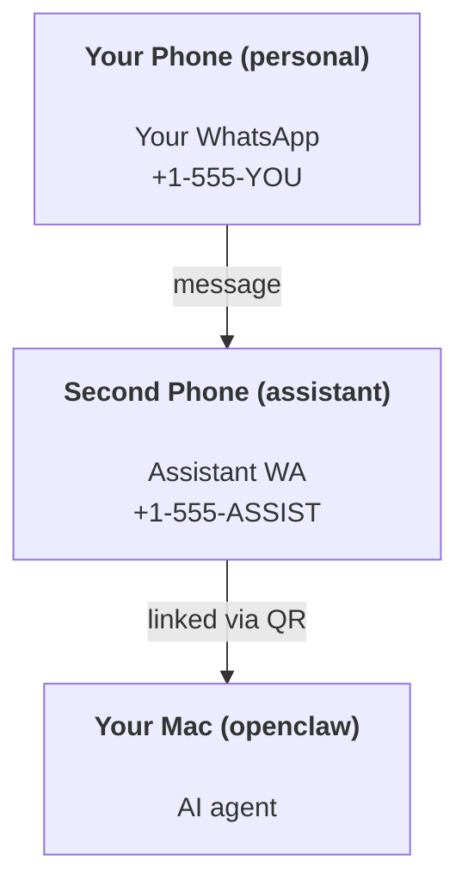

---
read_when:
    - नए सहायक इंस्टेंस को ऑनबोर्ड करना
    - सुरक्षा/अनुमति संबंधी प्रभावों की समीक्षा
summary: सुरक्षा सावधानियों के साथ OpenClaw को निजी सहायक के रूप में चलाने की एंड-टू-एंड मार्गदर्शिका
title: व्यक्तिगत सहायक सेटअप
x-i18n:
    generated_at: "2026-06-29T00:14:54Z"
    model: gpt-5.5
    postprocess_version: locale-links-v1
    provider: openai
    source_hash: b0cd640872a2a60fd88d2dc3df6d038ef8574163430d8683ef9b67921b0c87f4
    source_path: start/openclaw.md
    workflow: 16
---

OpenClaw एक self-hosted gateway है जो Discord, Google Chat, iMessage, Matrix, Microsoft Teams, Signal, Slack, Telegram, WhatsApp, Zalo, और अन्य को AI agents से जोड़ता है। यह गाइड "व्यक्तिगत सहायक" सेटअप को कवर करती है: एक समर्पित WhatsApp नंबर जो आपके हमेशा-चालू AI assistant की तरह व्यवहार करता है।

## ⚠️ पहले सुरक्षा

आप एक agent को ऐसी स्थिति में रख रहे हैं जहां वह:

- आपकी मशीन पर command चला सकता है (आपकी tool policy पर निर्भर)
- आपके workspace में files पढ़/लिख सकता है
- WhatsApp/Telegram/Discord/Mattermost और अन्य bundled channels के माध्यम से संदेश वापस भेज सकता है

सावधानी से शुरू करें:

- हमेशा `channels.whatsapp.allowFrom` सेट करें (अपने निजी Mac पर कभी भी open-to-the-world न चलाएं)।
- assistant के लिए एक समर्पित WhatsApp नंबर इस्तेमाल करें।
- Heartbeats अब default रूप से हर 30 मिनट में चलते हैं। सेटअप पर भरोसा होने तक `agents.defaults.heartbeat.every: "0m"` सेट करके disable करें।

## पूर्वापेक्षाएं

- OpenClaw installed और onboarded - अगर आपने अभी तक यह नहीं किया है तो [शुरू करना](/hi/start/getting-started) देखें
- assistant के लिए दूसरा phone number (SIM/eSIM/prepaid)

## दो-phone सेटअप (अनुशंसित)

आपको यह चाहिए:



अगर आप अपना निजी WhatsApp OpenClaw से link करते हैं, तो आपको भेजा गया हर संदेश "agent input" बन जाता है। आम तौर पर यह वह नहीं होता जो आप चाहते हैं।

## 5-मिनट quick start

1. WhatsApp Web pair करें (QR दिखाता है; assistant phone से scan करें):

```bash
openclaw channels login
```

2. Gateway शुरू करें (इसे running छोड़ दें):

```bash
openclaw gateway --port 18789
```

3. `~/.openclaw/openclaw.json` में minimal config डालें:

```json5
{
  gateway: { mode: "local" },
  channels: { whatsapp: { allowFrom: ["+15555550123"] } },
}
```

अब अपने allowlisted phone से assistant number पर message भेजें।

Onboarding खत्म होने पर, OpenClaw dashboard को auto-open करता है और एक clean (non-tokenized) link print करता है। अगर dashboard auth मांगता है, तो configured shared secret को Control UI settings में paste करें। Onboarding default रूप से token (`gateway.auth.token`) इस्तेमाल करता है, लेकिन अगर आपने `gateway.auth.mode` को `password` पर switch किया है तो password auth भी काम करता है। बाद में फिर खोलने के लिए: `openclaw dashboard`।

## agent को workspace दें (AGENTS)

OpenClaw अपने workspace directory से operating instructions और "memory" पढ़ता है।

Default रूप से, OpenClaw agent workspace के रूप में `~/.openclaw/workspace` इस्तेमाल करता है, और setup/first agent run पर इसे (साथ में starter `AGENTS.md`, `SOUL.md`, `TOOLS.md`, `IDENTITY.md`, `USER.md`, `HEARTBEAT.md`) अपने आप बनाएगा। `BOOTSTRAP.md` केवल तब बनाया जाता है जब workspace बिल्कुल नया हो (delete करने के बाद इसे वापस नहीं आना चाहिए)। `MEMORY.md` optional है (auto-created नहीं); मौजूद होने पर, यह normal sessions के लिए loaded होता है। Subagent sessions केवल `AGENTS.md` और `TOOLS.md` inject करते हैं।

<Tip>
इस folder को OpenClaw की memory की तरह मानें और इसे git repo (आदर्श रूप से private) बनाएं ताकि आपकी `AGENTS.md` और memory files backed up रहें। अगर git installed है, तो brand-new workspaces auto-initialized होते हैं।
</Tip>

```bash
openclaw setup
```

पूरा workspace layout + backup guide: [Agent workspace](/hi/concepts/agent-workspace)
Memory workflow: [Memory](/hi/concepts/memory)

Optional: `agents.defaults.workspace` के साथ अलग workspace चुनें (`~` supported है)।

```json5
{
  agents: {
    defaults: {
      workspace: "~/.openclaw/workspace",
    },
  },
}
```

अगर आप पहले से repo से अपनी workspace files ship करते हैं, तो bootstrap file creation पूरी तरह disable कर सकते हैं:

```json5
{
  agents: {
    defaults: {
      skipBootstrap: true,
    },
  },
}
```

## वह config जो इसे "assistant" बनाता है

OpenClaw default रूप से अच्छा assistant setup देता है, लेकिन आम तौर पर आप इन्हें tune करना चाहेंगे:

- [`SOUL.md`](/hi/concepts/soul) में persona/instructions
- thinking defaults (अगर चाहें)
- heartbeats (जब आपको इस पर भरोसा हो जाए)

उदाहरण:

```json5
{
  logging: { level: "info" },
  agents: {
    defaults: {
      model: { primary: "anthropic/claude-opus-4-6" },
      workspace: "~/.openclaw/workspace",
      thinkingDefault: "high",
      timeoutSeconds: 1800,
      // Start with 0; enable later.
      heartbeat: { every: "0m" },
    },
    list: [
      {
        id: "main",
        default: true,
        groupChat: {
          mentionPatterns: ["@openclaw", "openclaw"],
        },
      },
    ],
  },
  channels: {
    whatsapp: {
      allowFrom: ["+15555550123"],
      groups: {
        "*": { requireMention: true },
      },
    },
  },
  session: {
    scope: "per-sender",
    resetTriggers: ["/new", "/reset"],
    reset: {
      mode: "daily",
      atHour: 4,
      idleMinutes: 10080,
    },
  },
}
```

## Sessions और memory

- Session files: `~/.openclaw/agents/<agentId>/sessions/{{SessionId}}.jsonl`
- Session metadata (token usage, last route, आदि): `~/.openclaw/agents/<agentId>/sessions/sessions.json` (legacy: `~/.openclaw/sessions/sessions.json`)
- `/new` या `/reset` उस chat के लिए fresh session शुरू करता है (`resetTriggers` के माध्यम से configurable)। अगर अकेले भेजा जाए, तो OpenClaw model को invoke किए बिना reset acknowledge करता है।
- `/compact [instructions]` session context को compact करता है और बचा हुआ context budget report करता है।

## Heartbeats (proactive mode)

Default रूप से, OpenClaw हर 30 मिनट में इस prompt के साथ heartbeat चलाता है:
`Read HEARTBEAT.md if it exists (workspace context). Follow it strictly. Do not infer or repeat old tasks from prior chats. If nothing needs attention, reply HEARTBEAT_OK.`
Disable करने के लिए `agents.defaults.heartbeat.every: "0m"` सेट करें।

- अगर `HEARTBEAT.md` मौजूद है लेकिन प्रभावी रूप से खाली है (केवल blank lines, Markdown/HTML comments, `# Heading` जैसे Markdown headings, fence markers, या empty checklist stubs), तो OpenClaw API calls बचाने के लिए heartbeat run skip करता है।
- अगर file missing है, heartbeat फिर भी चलता है और model तय करता है कि क्या करना है।
- अगर agent `HEARTBEAT_OK` के साथ reply करता है (वैकल्पिक रूप से short padding के साथ; `agents.defaults.heartbeat.ackMaxChars` देखें), तो OpenClaw उस heartbeat के लिए outbound delivery suppress करता है।
- Default रूप से, DM-style `user:<id>` targets तक heartbeat delivery allowed है। Heartbeat runs active रखते हुए direct-target delivery suppress करने के लिए `agents.defaults.heartbeat.directPolicy: "block"` सेट करें।
- Heartbeats full agent turns चलाते हैं - shorter intervals ज्यादा tokens खर्च करते हैं।

```json5
{
  agents: {
    defaults: {
      heartbeat: { every: "30m" },
    },
  },
}
```

## Media in और out

Inbound attachments (images/audio/docs) templates के माध्यम से आपके command को surfaced किए जा सकते हैं:

- `{{MediaPath}}` (local temp file path)
- `{{MediaUrl}}` (pseudo-URL)
- `{{Transcript}}` (अगर audio transcription enabled है)

Agent से outbound attachments message tool या reply payload पर structured media fields इस्तेमाल करते हैं, जैसे `media`, `mediaUrl`, `mediaUrls`, `path`, या `filePath`। Example message-tool arguments:

```json
{
  "message": "Here's the screenshot.",
  "mediaUrl": "https://example.com/screenshot.png"
}
```

OpenClaw text के साथ structured media भेजता है। Legacy final assistant replies अब भी compatibility के लिए normalized हो सकते हैं, लेकिन tool output, browser output, streaming blocks, और message actions text को attachment commands के रूप में parse नहीं करते।

Local-path behavior agent के समान file-read trust model का पालन करता है:

- अगर `tools.fs.workspaceOnly` `true` है, तो outbound local media paths OpenClaw temp root, media cache, agent workspace paths, और sandbox-generated files तक restricted रहते हैं।
- अगर `tools.fs.workspaceOnly` `false` है, तो outbound local media host-local files इस्तेमाल कर सकता है जिन्हें agent पहले से पढ़ने की अनुमति रखता है।
- Local paths absolute, workspace-relative, या `~/` के साथ home-relative हो सकते हैं।
- Host-local sends अब भी केवल media और safe document types allow करते हैं (images, audio, video, PDF, Office documents, और validated text documents जैसे Markdown/MD, TXT, JSON, YAML, और YML)। यह existing host-read trust boundary का extension है, secret scanner नहीं: अगर agent host-local `secret.txt` या `config.json` पढ़ सकता है, तो extension और content validation match होने पर वह उस file को attach कर सकता है।

इसका मतलब है कि workspace के बाहर generated images/files अब send हो सकते हैं जब आपकी fs policy पहले से उन reads को allow करती हो, जबकि arbitrary host-local text extensions blocked रहते हैं। Sensitive files को agent-readable filesystem के बाहर रखें, या stricter local-path sends के लिए `tools.fs.workspaceOnly=true` रखें।

## Operations checklist

```bash
openclaw status          # local status (creds, sessions, queued events)
openclaw status --all    # full diagnosis (read-only, pasteable)
openclaw status --deep   # asks the gateway for a live health probe with channel probes when supported
openclaw health --json   # gateway health snapshot (WS; default can return a fresh cached snapshot)
```

Logs `/tmp/openclaw/` के अंतर्गत रहते हैं (default: `openclaw-YYYY-MM-DD.log`)।

## अगले चरण

- WebChat: [WebChat](/hi/web/webchat)
- Gateway ops: [Gateway runbook](/hi/gateway)
- Cron + wakeups: [Cron jobs](/hi/automation/cron-jobs)
- macOS menu bar companion: [OpenClaw macOS app](/hi/platforms/macos)
- iOS node app: [iOS app](/hi/platforms/ios)
- Android node app: [Android app](/hi/platforms/android)
- Windows Hub: [Windows](/hi/platforms/windows)
- Linux status: [Linux app](/hi/platforms/linux)
- Security: [Security](/hi/gateway/security)

## संबंधित

- [शुरू करना](/hi/start/getting-started)
- [Setup](/hi/start/setup)
- [Channels overview](/hi/channels)
